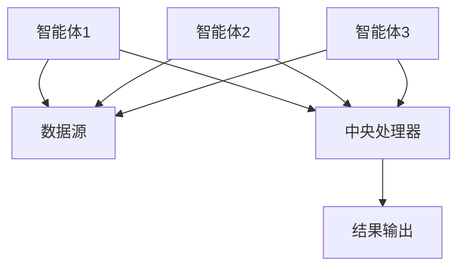
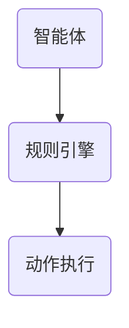
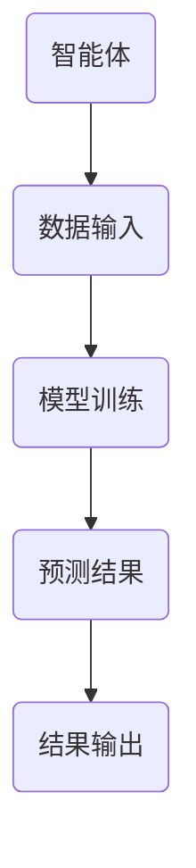
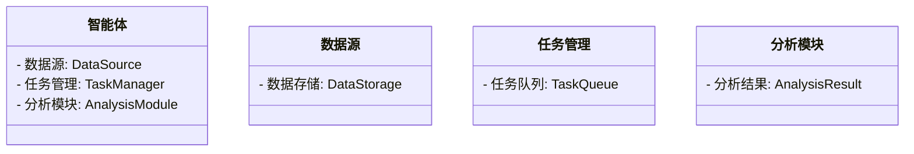
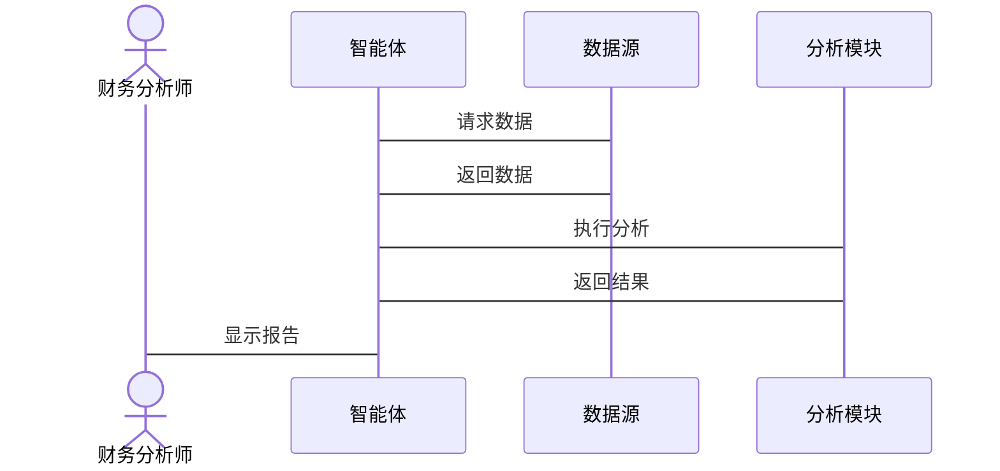

                 


# 基于多智能体的自动化年报和季报分析系统

## 关键词
多智能体、自动化、年报分析、季报分析、系统架构

## 摘要
本文详细探讨了基于多智能体的自动化年报和季报分析系统的构建与实现。文章首先介绍了传统年报和季报分析的局限性，分析了多智能体技术在提高分析效率和准确性的潜力。接着，详细阐述了多智能体系统的定义、核心概念及其与其他技术的对比。随后，从算法原理、系统架构设计、项目实战等多个方面展开讨论，通过具体的代码实现和实际案例，展示了如何利用多智能体技术实现年报和季报的自动化分析。最后，总结了项目的最佳实践、注意事项，并展望了未来的发展方向。

---

# 第一部分：背景介绍

## 第1章：问题背景与描述

### 1.1 问题背景

#### 1.1.1 年报和季报分析的现状与挑战
年报和季报是企业财务状况的重要反映，传统的年报和季报分析依赖人工操作，存在效率低、误差高、成本高等问题。随着企业规模的扩大和数据量的增加，传统方法已无法满足高效、精准的需求。

#### 1.1.2 传统年报季报分析的局限性
- **效率低下**：人工分析需要大量时间，难以及时响应。
- **准确性不足**：人为疏忽可能导致分析结果错误。
- **成本高昂**：需要大量人工投入，且难以规模化。

#### 1.1.3 多智能体技术的应用潜力
多智能体系统通过分布式协作，能够高效处理复杂任务，适用于年报和季报的自动化分析。

### 1.2 问题描述

#### 1.2.1 年报和季报分析的核心任务
- 数据采集与处理
- 财务指标计算
- 数据可视化与报告生成

#### 1.2.2 自动化分析的需求与目标
- 提高分析效率
- 降低人工成本
- 提升分析准确性

#### 1.2.3 多智能体协同的优势
- 分布式计算能力
- 高度协作
- 自适应性

### 1.3 问题解决与边界

#### 1.3.1 多智能体协同的解决方案
通过多智能体协同，实现年报和季报分析的自动化处理。

#### 1.3.2 系统的边界与适用范围
- 适用于大型企业
- 适用于数据量大、复杂度高的场景

#### 1.3.3 外延与限制条件
- 仅支持结构化数据
- 依赖于高质量的数据输入

## 第2章：核心概念与联系

### 2.1 多智能体系统的定义与特点

#### 2.1.1 多智能体系统的定义
多智能体系统是由多个智能体组成的分布式系统，每个智能体具有自主性、反应性和协作性。

#### 2.1.2 多智能体的核心特点
- **自主性**：智能体能够独立决策
- **反应性**：能够感知环境并做出反应
- **协作性**：通过通信和协调完成共同目标

#### 2.1.3 多智能体与单智能体的对比
| 特性       | 单智能体          | 多智能体          |
|------------|-------------------|-------------------|
| 独立性      | 高                | 较低              |
| 协作性      | 无                | 高                |
| 并行处理    | 串行处理          | 并行处理          |

### 2.2 实体关系与架构图

#### 2.2.1 ER实体关系图
```mermaid
erd
actor: 财务分析师
actor -[1]-> role: 智能体角色
role -[n]-> task: 分析任务
task -[1]-> result: 分析结果
```

#### 2.2.2 系统架构图


---

# 第二部分：算法原理讲解

## 第3章：多智能体协同算法

### 3.1 算法原理

#### 3.1.1 基于规则的算法


#### 3.1.2 基于机器学习的算法


### 3.2 算法实现

#### 3.2.1 基于规则的Python代码示例
```python
def rule_engine(task):
    if task == 'fetch_data':
        return 'Data fetched'
    elif task == 'analyze_data':
        return 'Data analyzed'
    else:
        return 'Unknown task'
```

#### 3.2.2 基于机器学习的Python代码示例
```python
import numpy as np
from sklearn.linear_model import LinearRegression

# 示例数据
X = np.array([[1], [2], [3], [4]])
y = np.array([2, 4, 6, 8])

# 模型训练
model = LinearRegression()
model.fit(X, y)

# 预测
print(model.predict(np.array([[5]])))
```

### 3.3 数学模型与公式

#### 3.3.1 基于规则的模型
$$ \text{规则引擎} = \sum_{i=1}^{n} \text{规则}_i \times \text{权重}_i $$

#### 3.3.2 基于机器学习的模型
$$ y = \beta_0 + \beta_1 x + \epsilon $$

---

# 第三部分：系统分析与架构设计

## 第4章：系统分析与架构设计

### 4.1 问题场景介绍

#### 4.1.1 系统应用场景
- 企业财务部门
- 金融分析机构

### 4.2 项目介绍

#### 4.2.1 系统功能设计
- 数据采集模块
- 数据处理模块
- 分析与报告生成模块

#### 4.2.2 领域模型类图


### 4.3 系统架构设计

#### 4.3.1 系统架构图


### 4.4 接口设计与交互

#### 4.4.1 系统接口设计
- 数据源接口
- 分析结果接口

#### 4.4.2 交互序列图


---

# 第四部分：项目实战

## 第5章：项目实战

### 5.1 环境安装

#### 5.1.1 安装依赖
- Python 3.8+
- Jupyter Notebook
- Numpy、Pandas、Scikit-learn

### 5.2 核心功能实现

#### 5.2.1 数据采集模块
```python
import pandas as pd

def fetch_data():
    # 示例数据
    data = {'收入': [100, 200, 300], '支出': [50, 100, 150]}
    df = pd.DataFrame(data)
    return df
```

#### 5.2.2 数据分析模块
```python
from sklearn.linear_model import LinearRegression

def analyze_data(data):
    model = LinearRegression()
    model.fit(data[['收入']], data[['支出']])
    return model.predict(data[['收入']])
```

### 5.3 代码解读与分析

#### 5.3.1 代码解读
- 数据采集模块：从数据库或API获取数据
- 数据分析模块：使用机器学习模型进行预测

### 5.4 实际案例分析

#### 5.4.1 案例分析
```python
data = fetch_data()
results = analyze_data(data)
print(results)
```

### 5.5 项目小结

#### 5.5.1 经验总结
- 数据质量至关重要
- 模型选择影响结果

---

# 第五部分：最佳实践与小结

## 第6章：最佳实践与小结

### 6.1 最佳实践

#### 6.1.1 系统设计建议
- 明确系统边界
- 选择合适的智能体协作方式

#### 6.1.2 代码实现建议
- 保持代码简洁
- 注重模块化设计

### 6.2 小结

#### 6.2.1 全文总结
多智能体技术为年报和季报分析提供了新的解决方案，通过分布式协作和高效算法，能够显著提升分析效率和准确性。

### 6.3 注意事项

#### 6.3.1 系统运行中的注意事项
- 数据安全
- 系统维护

#### 6.3.2 开发中的注意事项
- 模块化设计
- 代码可维护性

### 6.4 拓展阅读

#### 6.4.1 推荐书籍
- 《分布式系统：概念与设计》
- 《机器学习实战》

#### 6.4.2 技术博客
- 多智能体系统研究博客
- 机器学习在金融领域的应用

---

# 作者

作者：AI天才研究院 & 禅与计算机程序设计艺术

---

通过以上目录和内容的设计，读者可以系统地了解基于多智能体的自动化年报和季报分析系统的构建与实现，从理论到实践，逐步掌握相关技术和方法。

