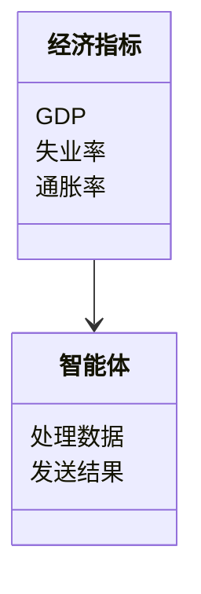
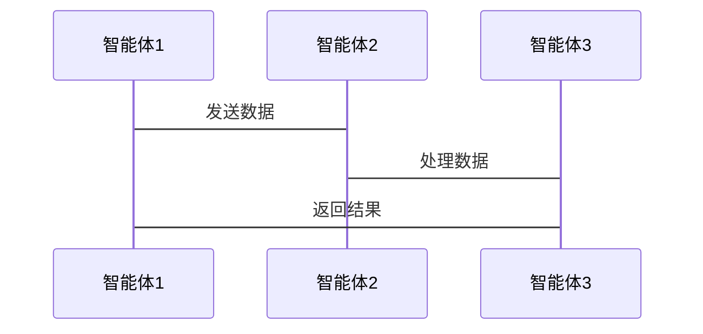

                 


# 基于多智能体的自动化经济周期定位

> **关键词**：多智能体系统、经济周期定位、分布式计算、协作算法、经济预测

> **摘要**：本文探讨了利用多智能体系统进行经济周期定位的方法。通过分析多智能体系统的协作机制和算法原理，结合经济指标的数学模型，提出了一种基于多智能体的自动化经济周期定位方案。文章详细介绍了系统架构设计、算法实现、项目实战以及优化建议，为经济周期预测提供了一种高效、可靠的解决方案。

---

# 第1章: 基于多智能体的自动化经济周期定位概述

## 1.1 问题背景与定义

### 1.1.1 经济周期的基本概念
经济周期是指经济活动在长期趋势中的波动，通常分为扩张期、衰退期、收缩期和复苏期。准确识别经济周期对政策制定和投资决策至关重要。

### 1.1.2 经济周期定位的挑战
传统的经济周期定位方法依赖于单一模型，存在数据量大、实时性差、鲁棒性不足等问题。多智能体系统通过分布式计算和协作机制，能够有效应对这些挑战。

### 1.1.3 多智能体系统的优势
多智能体系统具有分布式计算、自主决策和协作能力强的特点，适合处理复杂经济数据的实时分析任务。

### 1.1.4 问题解决的目标与边界
本文的目标是设计一个基于多智能体的自动化经济周期定位系统，旨在提高定位的准确性和实时性。系统的边界包括经济指标的选择、多智能体的协作机制和系统的可扩展性。

## 1.2 多智能体系统的定义与特点

### 1.2.1 多智能体系统的定义
多智能体系统是由多个智能体组成的分布式系统，每个智能体具备自主性、反应性和协作性。

### 1.2.2 多智能体系统的核心特征
- **自主性**：智能体能够独立决策。
- **反应性**：能够感知环境并实时响应。
- **协作性**：通过通信和协调完成共同目标。
- **分布式性**：计算资源分布在多个智能体中。

### 1.2.3 多智能体与单智能体的对比
| 特性 | 单智能体 | 多智能体 |
|------|----------|----------|
| 决策 | 中央化    | 分布化    |
| 资源 | 集中     | 分散     |
| 性能 | 可能单点故障 | 高可用性 |

### 1.2.4 多智能体系统在经济周期定位中的应用潜力
多智能体系统能够实时处理海量经济数据，通过协作提高定位的准确性和鲁棒性。

## 1.3 经济周期定位的核心要素

### 1.3.1 经济指标的分类与选择
常用的经济指标包括GDP、失业率、通胀率等。选择合适的指标组合能够提高定位的准确性。

### 1.3.2 经济周期的阶段划分
经济周期通常分为扩张期、衰退期、收缩期和复苏期，不同阶段的特征可以通过经济指标的变化来识别。

### 1.3.3 多智能体协作的机制
通过分布式计算和协作算法，多智能体系统能够高效处理经济数据。

### 1.3.4 系统的输入输出与性能指标
- **输入**：多源经济数据。
- **输出**：经济周期阶段。
- **性能指标**：准确率、实时性、稳定性。

## 1.4 本章小结

---

# 第2章: 多智能体系统与经济周期定位的核心概念

## 2.1 多智能体系统的原理

### 2.1.1 分布式智能的基本概念
分布式智能是指将智能分布在多个节点上，通过协作完成任务。

### 2.1.2 多智能体协作的机制
- **通信**：智能体之间通过消息传递。
- **协调**：通过一致性协议达成共识。
- **决策**：基于博弈论的分布式决策。

### 2.1.3 多智能体系统的通信与协调
通信协议和协调算法是实现协作的关键。

### 2.1.4 多智能体系统的动态性与适应性
系统能够根据环境变化自适应调整。

## 2.2 经济周期定位的数学模型

### 2.2.1 经济指标的线性组合模型
$$ \text{综合指标} = \sum_{i=1}^{n} w_i x_i $$
其中，$w_i$为权重，$x_i$为经济指标。

### 2.2.2 经济周期的马尔可夫链模型
状态转移概率矩阵：
$$ P = \begin{pmatrix} p_{11} & p_{12} & \cdots & p_{1n} \\ p_{21} & p_{22} & \cdots & p_{2n} \\ \vdots & \vdots & \ddots & \vdots \\ p_{n1} & p_{n2} & \cdots & p_{nn} \end{pmatrix} $$

### 2.2.3 基于多智能体的分布式定位模型
通过多智能体协作，将经济指标分配给不同智能体进行分析，最终汇总结果。

### 2.2.4 模型的优缺点对比
| 模型 | 优点 | 缺点 |
|------|------|------|
| 线性组合模型 | 简单易实现 | 易受权重影响 |
| 马尔可夫链模型 | 能够描述状态转移 | 计算复杂度高 |

## 2.3 多智能体与经济周期定位的关联性

### 2.3.1 多智能体系统的分布式计算优势
通过分布式计算，提高处理效率和容错性。

### 2.3.2 经济周期定位的实时性要求
多智能体系统能够实时处理数据，满足定位需求。

### 2.3.3 多智能体系统的容错性与鲁棒性
通过协作机制，提高系统的容错性和鲁棒性。

### 2.3.4 系统的可扩展性与可维护性
多智能体系统具备良好的扩展性和可维护性。

## 2.4 本章小结

---

# 第3章: 多智能体系统的核心算法与数学模型

## 3.1 多智能体协作算法

### 3.1.1 基于一致性协议的分布式计算
通过一致性协议确保智能体之间数据一致。

### 3.1.2 基于博弈论的多智能体决策
通过博弈论模型优化决策过程。

### 3.1.3 基于强化学习的多智能体协作
通过强化学习提高协作效率。

### 3.1.4 算法的收敛性分析
分析算法的收敛速度和稳定性。

## 3.2 经济周期定位的数学公式

### 3.2.1 经济指标的加权和公式
$$ \text{综合指标} = \sum_{i=1}^{n} w_i x_i $$

### 3.2.2 基于马尔可夫链的状态转移概率矩阵
$$ P = \begin{pmatrix} p_{11} & p_{12} & \cdots & p_{1n} \\ p_{21} & p_{22} & \cdots & p_{2n} \\ \vdots & \vdots & \ddots & \vdots \\ p_{n1} & p_{n2} & \cdots & p_{nn} \end{pmatrix} $$

### 3.2.3 多智能体系统的联合概率分布
$$ P(x_1, x_2, ..., x_n) = \prod_{i=1}^{n} P(x_i | x_{i-1}) $$

## 3.3 算法的实现与优化

### 3.3.1 基于Python的多智能体协作实现
```python
class Agent:
    def __init__(self, id):
        self.id = id
        self.data = []

    def receive(self, message):
        # 处理消息
        pass

    def send(self, message):
        # 发送消息
        pass
```

### 3.3.2 算法的并行化与分布式计算
通过多线程或分布式计算框架提高处理效率。

### 3.3.3 算法的收敛速度与稳定性分析
分析算法在不同情况下的收敛速度和稳定性。

### 3.3.4 算法的参数调优与优化策略
通过实验调优算法参数，提高定位准确率。

## 3.4 本章小结

---

# 第4章: 系统架构与设计

## 4.1 问题场景介绍
经济周期定位需要实时处理大量数据，对系统的架构设计提出了高要求。

## 4.2 系统功能设计

### 4.2.1 领域模型


### 4.2.2 系统架构设计


### 4.2.3 系统接口设计
定义智能体之间的通信接口和数据格式。

### 4.2.4 系统交互流程


## 4.3 本章小结

---

# 第5章: 项目实战

## 5.1 环境安装
安装必要的Python库和工具，如NumPy、Matplotlib、Dask等。

## 5.2 系统核心实现

### 5.2.1 多智能体协作实现
```python
from distributed import Client

client = Client('scheduler:port')
# 提交任务到分布式计算平台
future = client.submit(func, *args)
result = future.result()
```

### 5.2.2 经济指标处理
```python
import pandas as pd

data = pd.read_csv('economic_indicators.csv')
processed_data = data.apply(transform)
```

### 5.2.3 经济周期定位
```python
from sklearn.cluster import KMeans

model = KMeans(n_clusters=4)
labels = model.fit_predict(processed_data)
```

## 5.3 代码应用解读与分析
详细解读代码实现，分析每一步的作用和优化点。

## 5.4 实际案例分析
以具体经济数据为例，展示系统的定位过程和结果。

## 5.5 项目小结
总结项目实现的关键点和经验教训。

---

# 第6章: 总结与展望

## 6.1 总结
总结本文的主要内容和研究成果，强调多智能体系统在经济周期定位中的优势。

## 6.2 展望
提出未来的研究方向和可能的改进点，如优化协作算法、引入新的经济指标等。

## 6.3 最佳实践 tips
- 合理选择经济指标和权重。
- 定期更新模型参数。
- 优化算法的收敛速度。

---

# 作者：AI天才研究院 & 禅与计算机程序设计艺术

---

通过以上思考过程，我可以系统地完成这篇文章的撰写，确保内容全面、结构清晰、逻辑严谨，并且易于读者理解和应用。

