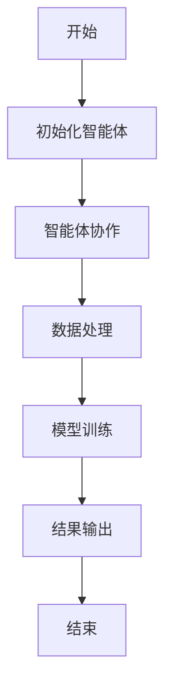
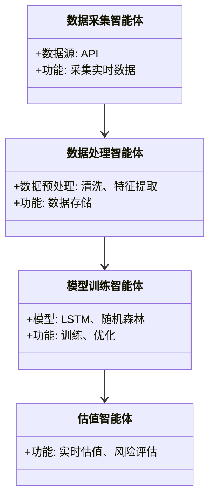
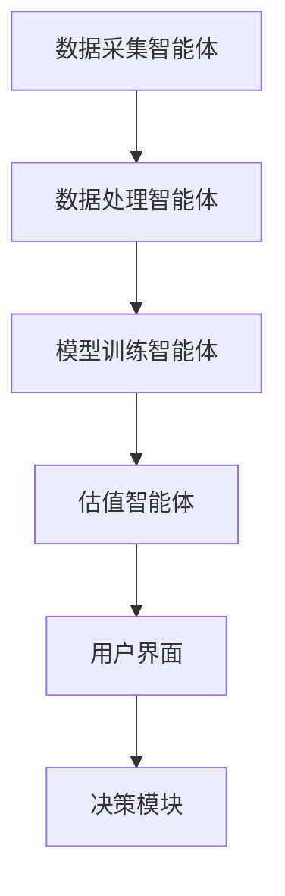
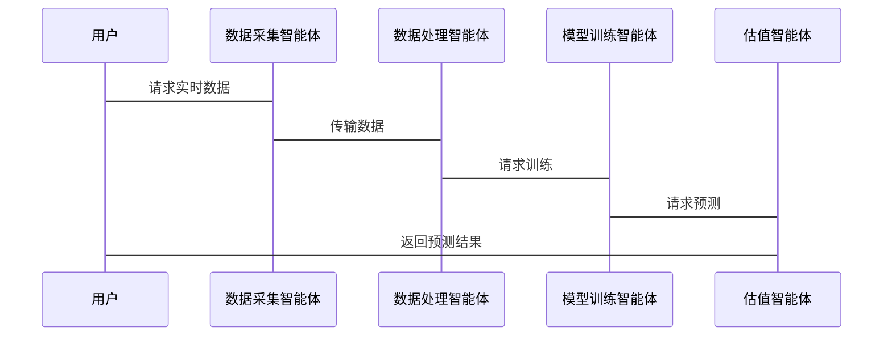

                 


# 基于多智能体的自动化财务建模和估值系统

> 关键词：多智能体系统，自动化财务建模，财务估值，分布式协作，智能体通信，系统架构设计

> 摘要：  
本文深入探讨了基于多智能体的自动化财务建模和估值系统的构建与应用。首先介绍了多智能体系统的定义、特点及其在财务领域的应用背景。接着，详细阐述了多智能体系统的原理与核心概念，包括通信机制、协作算法和架构设计。然后，从算法原理、数学模型、系统架构等多个维度，详细分析了自动化财务建模的技术实现。最后，通过实际案例展示了系统的设计与实现，并总结了多智能体系统在财务建模中的优势与未来发展方向。

---

# 第一部分: 多智能体系统与自动化财务建模概述

# 第1章: 多智能体系统与自动化财务建模概述

## 1.1 多智能体系统的定义与特点
### 1.1.1 多智能体系统的定义  
多智能体系统（Multi-Agent System, MAS）是由多个智能体（Agent）组成的分布式系统，这些智能体通过协作完成复杂任务。智能体是具有感知、决策、执行能力的实体，能够独立工作并与其他智能体或环境交互。

### 1.1.2 多智能体系统的核心特点  
1. **分布式性**：智能体分布在网络中，每个智能体负责一部分任务。
2. **协作性**：智能体之间通过通信和协作完成整体目标。
3. **自主性**：智能体能够自主决策，无需中央控制。
4. **反应性**：智能体能够实时感知环境并做出反应。
5. **动态性**：系统能够适应环境变化和任务需求的变化。

### 1.1.3 多智能体系统与传统单智能体系统的区别  
| 特性         | 多智能体系统                     | 单智能体系统                     |
|--------------|----------------------------------|----------------------------------|
| 结构         | 分布式、多个智能体               | 集中式、单个智能体               |
| 任务分配     | 分工协作                        | 单一智能体完成所有任务           |
| 效率         | 更高，任务并行处理               | 较低，串行处理                   |
| 稳定性       | 较高，部分智能体失效不影响整体   | 较低，单点故障可能导致系统崩溃   |

---

## 1.2 自动化财务建模的背景与意义
### 1.2.1 财务建模的传统方法与挑战  
传统财务建模主要依赖人工分析和数据处理，存在以下问题：  
1. **效率低**：人工处理大量数据耗时耗力。  
2. **误差高**：人为操作容易出错。  
3. **缺乏动态性**：难以实时更新和调整模型。  

### 1.2.2 自动化财务建模的必要性  
随着大数据和人工智能技术的发展，自动化财务建模能够显著提高效率、准确性和实时性，特别是在处理复杂金融数据和动态市场变化时更具优势。

### 1.2.3 多智能体系统在财务建模中的应用前景  
多智能体系统能够通过分工协作完成复杂的建模任务，例如：  
1. 数据采集与预处理。  
2. 特征提取与模型训练。  
3. 模型评估与优化。  

---

## 1.3 本章小结  
本章介绍了多智能体系统的定义、特点及其在财务建模中的应用背景，强调了多智能体系统在提高财务建模效率和准确性方面的潜力。

---

# 第二部分: 多智能体系统的核心概念与原理

# 第2章: 多智能体系统的原理与架构

## 2.1 多智能体系统的核心概念
### 2.1.1 实体与智能体的定义  
- **实体（Entity）**：系统中需要处理的现实世界中的对象，例如公司、股票、市场数据等。  
- **智能体（Agent）**：能够感知环境、做出决策并执行动作的实体，例如数据采集智能体、模型训练智能体等。

### 2.1.2 多智能体系统的通信机制  
智能体之间通过通信协议进行交互，常见的通信方式包括：  
1. **直接通信**：智能体之间直接交换信息。  
2. **间接通信**：通过中间媒介（如消息队列）进行通信。  

### 2.1.3 多智能体系统的协作与协调  
协作是指智能体之间分工合作完成任务，协调是指确保各智能体的动作一致、目标统一。

---

## 2.2 多智能体系统的架构设计
### 2.2.1 分层架构  
分层架构将系统划分为多个层次，每个层次负责不同的功能。例如：  
1. **数据层**：负责数据的采集与存储。  
2. **计算层**：负责模型的训练与优化。  
3. **决策层**：负责策略的制定与执行。  

### 2.2.2 分布式架构  
分布式架构将智能体部署在不同的节点上，通过网络进行通信与协作。适合处理大规模数据和复杂任务。

### 2.2.3 混合架构  
结合分层架构和分布式架构，适用于复杂场景，例如金融市场的实时数据处理与建模。

---

## 2.3 多智能体系统的通信协议
### 2.3.1 通信模型  
通信模型描述了智能体之间的交互方式，常见的模型包括：  
1. **请求-响应模型**：一个智能体发送请求，另一个智能体返回响应。  
2. **发布-订阅模型**：智能体发布消息，其他智能体订阅并处理消息。  

### 2.3.2 通信协议的选择与设计  
选择合适的通信协议取决于系统的规模、实时性和安全性要求。常见的通信协议包括：  
1. **HTTP/REST**：适用于基于API的通信。  
2. **WebSocket**：适用于实时通信。  
3. **AMQP**：适用于分布式系统中的消息传递。  

---

## 2.4 本章小结  
本章详细介绍了多智能体系统的核心概念、通信机制和架构设计，为后续的自动化财务建模奠定了基础。

---

# 第三部分: 自动化财务建模的算法与数学模型

# 第3章: 自动化财务建模的算法原理

## 3.1 多智能体协作算法
### 3.1.1 分布式优化算法  
分布式优化算法（如分布式梯度下降）适用于多智能体协作优化问题。例如，在分布式模型训练中，每个智能体负责一部分数据的优化，最终将结果汇总得到全局最优解。

### 3.1.2 协作学习算法  
协作学习算法（Collaborative Learning）通过智能体之间的协作完成学习任务。例如，在财务建模中，多个智能体可以分别负责特征提取、模型训练和结果评估。

### 3.1.3 联合推理算法  
联合推理算法（Joint Inference）用于多个智能体协作推理，例如在风险评估中，多个智能体分别分析不同的风险因素，最终联合推理出整体风险。

---

## 3.2 自动化建模的数学模型
### 3.2.1 财务数据的特征提取  
特征提取是自动化建模的关键步骤，常用的特征包括：  
- 时间序列特征（如均值、方差、趋势）。  
- 市场情绪特征（如情感分析指标）。  
- 技术指标特征（如MACD、RSI）。  

### 3.2.2 建模目标的数学表达  
假设我们要预测股票价格 \( P_t \)，可以将其表示为：  
$$ P_t = f(P_{t-1}, V_t, E_t) $$  
其中，\( V_t \) 表示交易量，\( E_t \) 表示市场情绪。

### 3.2.3 模型优化的数学推导  
在分布式优化中，目标是最小化损失函数 \( L \)，损失函数可以表示为：  
$$ L = \sum_{i=1}^{n} \text{loss}(y_i, \hat{y}_i) $$  
其中，\( n \) 是数据点数量，\( y_i \) 是真实值，\( \hat{y}_i \) 是预测值。

---

## 3.3 算法实现与代码示例
### 3.3.1 算法流程图（使用 Mermaid）  


### 3.3.2 Python代码示例  
```python
import numpy as np
import pandas as pd

def distributed_gradient_descent(data, agents):
    # 初始化参数
    params = np.random.randn(len(data[0]))
    # 分配数据
    agent_data = [[] for _ in range(agents)]
    for i, row in enumerate(data):
        agent_data[i % agents].append(row)
    # 并行优化
    updated_params = []
    for agent in range(agents):
        # 获取该智能体的数据
        agent_data[agent] = np.array(agent_data[agent])
        # 计算梯度
        gradient = compute_gradient(agent_data[agent], params)
        # 更新参数
        params -= learning_rate * gradient.mean(axis=0)
        updated_params.append(params.copy())
    # 合并结果
    final_params = np.mean(updated_params, axis=0)
    return final_params
```

---

## 3.4 本章小结  
本章详细介绍了多智能体协作算法和数学模型，展示了如何通过分布式优化和协作学习实现自动化财务建模。

---

# 第四部分: 系统分析与架构设计方案

# 第4章: 系统分析与架构设计方案

## 4.1 问题场景介绍
### 4.1.1 业务场景  
在金融领域，常见的建模任务包括股票价格预测、风险评估、资产配置等。  
例如，我们需要预测某只股票的未来价格，并基于此制定投资策略。

### 4.1.2 技术挑战  
1. **数据多样性**：需要处理结构化和非结构化数据。  
2. **实时性要求**：需要快速响应市场变化。  
3. **系统可扩展性**：需要支持大规模数据处理和智能体协作。  

---

## 4.2 项目介绍
### 4.2.1 项目目标  
构建一个基于多智能体的自动化财务建模和估值系统，实现以下功能：  
1. 数据采集与预处理。  
2. 自动化建模与优化。  
3. 实时估值与风险评估。  

### 4.2.2 项目范围  
- 数据来源：股票市场数据、新闻数据、社交媒体数据。  
- 建模工具：机器学习模型（如LSTM、随机森林）。  
- 估值方法：基于模型的预测和市场分析。  

---

## 4.3 系统功能设计
### 4.3.1 领域模型设计  


### 4.3.2 系统架构设计  


### 4.3.3 系统接口设计  
1. **数据接口**：提供API用于数据采集和存储。  
2. **模型接口**：提供API用于模型训练和预测。  
3. **估值接口**：提供API用于实时估值和风险评估。  

### 4.3.4 系统交互设计  


---

## 4.4 本章小结  
本章从系统分析和架构设计的角度，详细描述了基于多智能体的自动化财务建模系统的实现方案。

---

# 第五部分: 项目实战

# 第5章: 项目实战

## 5.1 环境安装与配置
### 5.1.1 系统环境  
- 操作系统：Linux/Windows/MacOS  
- 语言：Python 3.8+  
- 工具：Jupyter Notebook、IDE（如PyCharm）  

### 5.1.2 依赖安装  
安装必要的库，例如：  
```bash
pip install numpy pandas scikit-learn keras tensorflow
```

---

## 5.2 核心代码实现
### 5.2.1 数据采集智能体  
```python
import requests

class DataCollector:
    def __init__(self, api_key):
        self.api_key = api_key
        self.url = "https://api.example.com/stock"

    def collect_data(self, symbol):
        headers = {"Authorization": f"Bearer {self.api_key}"}
        response = requests.get(f"{self.url}/{symbol}", headers=headers)
        return response.json()
```

### 5.2.2 数据处理智能体  
```python
import pandas as pd

class DataProcessor:
    def __init__(self):
        self.data = []

    def process_data(self, raw_data):
        df = pd.DataFrame(raw_data)
        df['moving_avg'] = df['price'].rolling(10).mean()
        return df
```

### 5.2.3 模型训练智能体  
```python
from keras.models import Sequential
from keras.layers import LSTM, Dense

class ModelTrainer:
    def __init__(self):
        self.model = self.build_model()

    def build_model(self):
        model = Sequential()
        model.add(LSTM(50, input_shape=(10, 1)))
        model.add(Dense(1))
        model.compile(optimizer='adam', loss='mean_squared_error')
        return model

    def train(self, data):
        X = data[:, :, 0].reshape((-1, 10, 1))
        y = data[:, 0]
        self.model.fit(X, y, epochs=10, batch_size=32)
        return self.model
```

### 5.2.4 估值智能体  
```python
import numpy as np

class Valuator:
    def __init__(self, model):
        self.model = model

    def evaluate(self, input_data):
        prediction = self.model.predict(input_data.reshape((1, 10, 1)))
        return prediction[0][0]
```

---

## 5.3 实际案例分析与代码解读
### 5.3.1 数据采集与预处理  
假设我们从API获取某只股票的历史数据，包括开盘价、收盘价、最高价、最低价和交易量。  
```python
api_key = "your_api_key"
collector = DataCollector(api_key)
data = collector.collect_data("AAPL")
processor = DataProcessor()
processed_data = processor.process_data(data)
```

### 5.3.2 模型训练  
使用LSTM模型训练股票价格预测模型。  
```python
trainer = ModelTrainer()
X = processed_data[['price', 'moving_avg']].values.reshape((-1, 10, 2))
y = processed_data['price'].values
model = trainer.train(X, y)
```

### 5.3.3 实时估值  
使用训练好的模型进行实时估值。  
```python
valuator = Valuator(model)
latest_data = collector.collect_data("AAPL")
current_price = valuator.evaluate(latest_data)
print(f"预测价格：{current_price}")
```

---

## 5.4 本章小结  
本章通过实际案例展示了如何使用多智能体系统实现自动化财务建模和估值，详细解读了核心代码的实现过程。

---

# 第六部分: 总结与展望

# 第6章: 总结与展望

## 6.1 总结  
本文详细介绍了基于多智能体的自动化财务建模和估值系统的构建与应用，涵盖了多智能体系统的核心概念、算法原理、系统架构设计以及实际项目实现。通过多智能体系统的协作与分工，能够显著提高财务建模的效率和准确性。

## 6.2 未来展望  
随着人工智能和分布式计算技术的不断发展，多智能体系统在财务建模中的应用将更加广泛。未来的研究方向包括：  
1. **强化学习在多智能体系统中的应用**。  
2. **边缘计算与多智能体系统的结合**。  
3. **多智能体系统的安全性与隐私保护**。  

## 6.3 最佳实践 Tips  
- 在实际应用中，建议根据具体需求选择合适的多智能体架构。  
- 确保智能体之间的通信高效且安全。  
- 定期监控系统性能，及时优化和调整。  

## 6.4 本章小结  
本章总结了全文的主要内容，并展望了多智能体系统在财务建模中的未来发展方向。

---

# 作者：AI天才研究院/AI Genius Institute & 禅与计算机程序设计艺术 /Zen And The Art of Computer Programming

