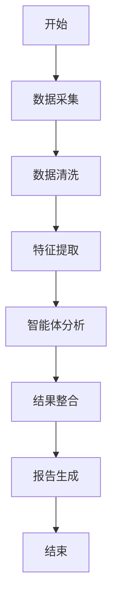
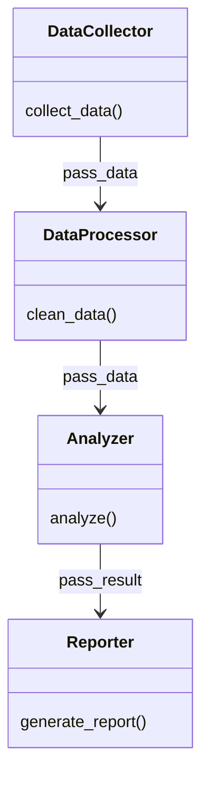
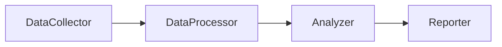
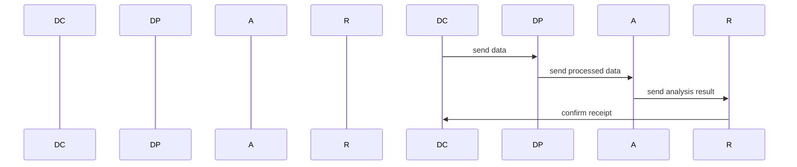

                 


# 基于多智能体的自动化财务报表比较分析系统

## 关键词：
多智能体系统，财务报表分析，自动化分析，系统架构，算法原理，比较分析

## 摘要：
本文介绍了一种基于多智能体的自动化财务报表比较分析系统，详细阐述了其背景、核心概念、算法原理、系统架构以及项目实现。通过多智能体系统的协作，实现了高效、准确的财务数据比较分析，为财务决策提供了有力支持。

---

# 第1章: 问题背景与描述

## 1.1 问题背景

### 1.1.1 财务报表比较分析的重要性
财务报表比较分析是企业财务管理中的重要环节，通过对不同时间段或不同公司的财务数据进行对比，识别趋势和异常，辅助决策者制定策略。

### 1.1.2 传统财务报表分析的局限性
传统分析依赖人工，效率低、易出错，难以应对海量数据和复杂场景。

### 1.1.3 多智能体系统的优势
多智能体系统通过分布式协作，高效处理复杂数据，提升分析准确性。

## 1.2 问题描述

### 1.2.1 财务报表比较分析的复杂性
涉及多维度数据，需精确比较和分析。

### 1.2.2 多智能体系统的适用性
适用于复杂场景，通过协作提高效率。

### 1.2.3 系统的目标与范围
目标是实现自动化、高效的财务报表分析；范围包括数据处理、分析、结果展示。

## 1.3 问题解决

### 1.3.1 多智能体系统如何解决财务报表分析问题
通过协作和分布式计算，提高分析效率和准确性。

### 1.3.2 系统的核心功能与模块
数据采集、清洗、分析、报告生成。

### 1.3.3 边界与外延
明确系统的输入、输出和交互方式。

## 1.4 核心要素与概念结构

### 1.4.1 系统的核心要素
智能体、数据、通信机制。

### 1.4.2 概念结构与组成
数据层、智能体层、通信层。

### 1.4.3 系统的边界与交互
与外部系统的接口，数据输入输出。

---

# 第2章: 多智能体系统与财务报表分析的核心概念

## 2.1 多智能体系统的定义与原理

### 2.1.1 多智能体系统的定义
由多个智能体组成的系统，协作完成任务。

### 2.1.2 系统的核心原理
分布式计算、协作、自适应。

### 2.1.3 系统的特征与优势
智能体独立性、协作性、适应性。

## 2.2 财务报表分析的多智能体模型

### 2.2.1 财务报表分析的流程
数据处理、特征提取、分析、报告。

### 2.2.2 多智能体模型的构建
任务分解、智能体协作、结果整合。

## 2.3 ER实体关系图架构

### 2.3.1 实体关系图的定义
展示系统中的实体及其关系。

### 2.3.2 系统的实体关系图
包括智能体、数据、规则等实体。

### 2.3.3 实体关系图的详细说明
展示各实体的属性和关系。

---

# 第3章: 算法原理讲解

## 3.1 多智能体系统的算法流程

### 3.1.1 算法流程图
使用Mermaid绘制流程图，展示数据处理、智能体协作、结果生成的步骤。



## 3.2 算法实现

### 3.2.1 数据预处理代码
```python
def data_cleaning(data):
    # 假设data是数据框
    # 删除空值
    data = data.dropna()
    # 处理异常值
    data = data[(data['revenue'] > 0)]
    return data
```

### 3.2.2 特征提取代码
```python
import numpy as np

def extract_features(data):
    features = []
    for i in range(len(data)):
        # 提取收入增长率
        revenue_growth = (data['revenue'][i] / data['revenue'][i-1]) - 1
        # 提取利润率
        profit_margin = data['profit'][i] / data['revenue'][i]
        features.append([revenue_growth, profit_margin])
    return np.array(features)
```

### 3.2.3 多智能体协作算法
```python
import concurrent.futures

def analyze_feature(feature):
    # 模拟分析
    return {'result': feature[0] * 2, 'status': 'normal'}

with concurrent.futures.ThreadPoolExecutor() as executor:
    futures = [executor.submit(analyze_feature, feature) for feature in features]
    results = [f.result() for f in concurrent.futures.as_completed(futures)]
```

## 3.3 数学模型与公式

### 3.3.1 特征提取公式
$$
\text{revenue\_growth} = \frac{\text{revenue}_t}{\text{revenue}_{t-1}} - 1
$$

### 3.3.2 智能体协作公式
$$
\text{result} = \sum_{i=1}^{n} \text{agent}_i(\text{feature}_i)
$$

---

# 第4章: 系统分析与架构设计

## 4.1 项目背景

### 4.1.1 项目目标
实现自动化财务报表分析系统。

### 4.1.2 项目范围
涵盖数据处理、分析、报告生成。

## 4.2 系统功能设计

### 4.2.1 功能模块
数据采集、处理、分析、报告生成。

### 4.2.2 领域模型
使用Mermaid类图展示各模块交互。



## 4.3 系统架构设计

### 4.3.1 系统架构图
展示各模块的交互和协作。



### 4.3.2 接口设计
定义各模块之间的接口。

### 4.3.3 交互序列图
展示系统运行时的交互流程。



---

# 第5章: 项目实战

## 5.1 环境安装

### 5.1.1 安装Python
```bash
python --version
pip install --upgrade pip
```

### 5.1.2 安装依赖库
```bash
pip install numpy pandas matplotlib
```

## 5.2 核心代码实现

### 5.2.1 数据采集代码
```python
import requests
import json

def collect_data(company_id):
    url = f"https://api.example.com/financial_data/{company_id}"
    response = requests.get(url)
    data = json.loads(response.text)
    return data
```

### 5.2.2 数据处理代码
```python
def process_data(data):
    # 假设data是字典
    processed_data = {
        'revenue': data['revenue'],
        'profit': data['profit']
    }
    return processed_data
```

### 5.2.3 分析代码
```python
def analyze(processed_data):
    features = extract_features(processed_data)
    results = analyze_features(features)
    return results
```

### 5.2.4 报告生成代码
```python
def generate_report(results):
    # 生成报告
    return "Analysis Complete"
```

## 5.3 案例分析与解读

### 5.3.1 数据来源
使用公开的财务数据进行分析。

### 5.3.2 数据处理过程
展示数据清洗和特征提取的具体步骤。

### 5.3.3 分析结果
通过图表展示分析结果，如收入增长率、利润率变化等。

## 5.4 项目小结

### 5.4.1 实战经验总结
总结项目中的关键点和问题解决方法。

### 5.4.2 注意事项
提示读者在实际应用中需要注意的问题。

---

# 第6章: 最佳实践与小结

## 6.1 小结

### 6.1.1 系统的优势
高效、准确的财务分析。

### 6.1.2 系统的局限性
数据依赖性、系统复杂性。

## 6.2 注意事项

### 6.2.1 数据质量的重要性
确保数据准确无误。

### 6.2.2 系统维护
定期更新和优化系统。

## 6.3 拓展阅读

### 6.3.1 多智能体系统的深入学习
推荐相关书籍和资源。

### 6.3.2 财务分析的其他方法
探讨其他技术在财务分析中的应用。

---

# 作者

作者：AI天才研究院/AI Genius Institute & 禅与计算机程序设计艺术 /Zen And The Art of Computer Programming

---

以上是基于多智能体的自动化财务报表比较分析系统的详细技术博客文章，涵盖背景、核心概念、算法原理、系统架构、项目实战和总结，结构清晰，内容详实。

