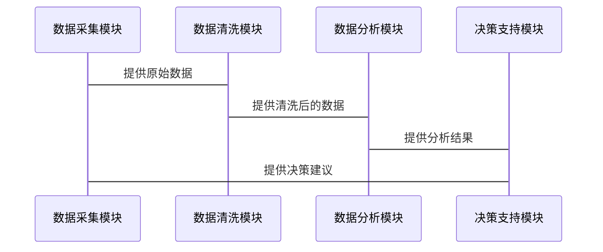

                 


# 基于多智能体的自动化财报分析系统

> 关键词：多智能体系统，自动化财报分析，分布式计算，任务分配机制，智能体协作，财报数据分析

> 摘要：本文将探讨基于多智能体的自动化财报分析系统的构建与应用。通过分析多智能体系统的核心概念、协作机制、算法原理以及系统架构设计，结合实际案例，详细阐述如何利用多智能体系统实现高效、智能的财报数据分析与决策支持。本文将从背景介绍、核心概念、算法原理、系统架构设计、项目实战等多个维度展开，为读者提供全面的技术解读。

---

## 第一部分: 基于多智能体的自动化财报分析系统概述

### 第1章: 财报分析的背景与挑战

#### 1.1 财务报表分析的重要性

- **1.1.1 财务报表分析的基本概念**
  - 财务报表是企业财务状况的反映，包括资产负债表、利润表、现金流量表等。
  - 财务报表分析是企业决策的重要依据。

- **1.1.2 财务报表分析的常见应用场景**
  - 企业内部管理：评估财务健康状况、优化资金分配。
  - 投资者决策：评估企业投资价值。
  - 银行贷款审批：评估企业还款能力。

- **1.1.3 自动化财报分析的必要性**
  - 数据量大、复杂度高，人工分析效率低下。
  - 需要实时性、准确性，人工难以满足。
  - 需要多维度、多层次的分析能力。

#### 1.2 当前财报分析的痛点与挑战

- **1.2.1 传统财报分析的局限性**
  - 数据处理能力有限。
  - 分析结果依赖人工经验，存在主观性。
  - 无法实现实时分析与动态调整。

- **1.2.2 数据量大、复杂度高的问题**
  - 数据来源多样化，格式不统一。
  - 数据清洗与预处理耗时耗力。
  - 高维度数据分析难度大。

- **1.2.3 人工分析的效率与准确性问题**
  - 人工分析容易出错。
  - 人工分析效率低，难以应对海量数据。
  - 人工分析难以实现深度挖掘。

#### 1.3 多智能体系统的优势

- **1.3.1 多智能体系统的基本概念**
  - 多智能体系统是由多个智能体组成的分布式系统，每个智能体具备一定的自主性、反应性和协作性。
  - 智能体能够通过通信和协作完成复杂任务。

- **1.3.2 多智能体在财报分析中的应用潜力**
  - 分工协作：不同智能体负责不同的分析任务，如数据清洗、特征提取、模型训练等。
  - 高效处理：通过分布式计算提高处理效率。
  - 智能决策：通过多智能体协作实现复杂决策任务。

- **1.3.3 多智能体系统的协作机制**
  - 任务分配：智能体根据自身能力和当前负载情况，动态分配任务。
  - 信息共享：智能体之间通过通信协议共享数据和分析结果。
  - 协作决策：多个智能体协同完成复杂决策任务。

#### 1.4 本章小结

- 本章介绍了财务报表分析的重要性及其在实际中的应用场景。
- 分析了传统财报分析的痛点与挑战。
- 引入了多智能体系统的概念及其在财报分析中的应用潜力。
- 为后续章节的展开奠定了基础。

---

## 第二部分: 多智能体系统的核心概念与原理

### 第2章: 多智能体系统的核心概念与原理

#### 2.1 多智能体系统的定义与特点

- **2.1.1 多智能体系统的定义**
  - 多智能体系统（Multi-Agent System, MAS）是由多个智能体组成的分布式系统，每个智能体具备一定的自主性、反应性和协作性。
  - 智能体能够感知环境、自主决策、与其他智能体协作完成复杂任务。

- **2.1.2 多智能体系统的属性特征对比**
  - **自主性（Autonomy）**：智能体能够自主决策，无需外部干预。
  - **反应性（Reactivity）**：智能体能够实时感知环境并做出反应。
  - **协作性（Collaboration）**：多个智能体能够通过通信和协作完成复杂任务。
  - **分布式性（Distributivity）**：智能体分布在不同的节点上，通过网络通信协作。

- **2.1.3 多智能体系统的协作机制**
  - **任务分配**：智能体根据自身能力和当前负载情况，动态分配任务。
  - **信息共享**：智能体之间通过通信协议共享数据和分析结果。
  - **协作决策**：多个智能体协同完成复杂决策任务。

#### 2.2 多智能体系统的协作机制

- **2.2.1 分布式计算与任务分配**
  - 分布式计算：将任务分解为多个子任务，分配给不同的智能体执行。
  - 任务分配机制：基于智能体的能力和负载情况，动态分配任务。
  - 示例：使用负载均衡算法，如轮询（Round Robin）、随机分配（Random）、贪婪算法（Greedy）等。

- **2.2.2 智能体间的通信协议**
  - 通信方式：基于消息队列、 RPC（Remote Procedure Call）、 RESTful API 等。
  - 通信内容：数据共享、任务请求、结果反馈等。
  - 通信频率：实时通信或按需通信。

- **2.2.3 多智能体协作的数学模型**
  - **任务分配模型**：基于智能体的能力和负载，建立数学模型，优化任务分配。
  - **协作决策模型**：基于多智能体的协同，建立决策模型，实现最优决策。
  - 示例：使用图论中的最小生成树算法（MST）优化任务分配。

#### 2.3 多智能体系统的协作机制实现

- **2.3.1 基于消息队列的通信机制**
  - 使用 RabbitMQ、Kafka 等消息队列实现智能体间的通信。
  - 每个智能体作为生产者或消费者，发布或消费消息。
  - 示例代码：
    ```python
    import pika
    import json

    # 生产者
    def producer():
        connection = pika.BlockingConnection(pika.ConnectionParameters('localhost'))
        channel = connection.channel()
        channel.queue_declare(queue='finance_analysis_task')
        for i in range(10):
            message = {'task_id': i, 'data': 'financial_data'}
            channel.basic_publish(exchange='', routing_key='finance_analysis_task', body=json.dumps(message))
            print(f"Sent task {i}")
        connection.close()

    # 消费者
    def consumer():
        connection = pika.BlockingConnection(pika.ConnectionParameters('localhost'))
        channel = connection.channel()
        channel.queue_declare(queue='finance_analysis_task')
        def callback(ch, method, properties, body):
            data = json.loads(body)
            print(f"Received task {data['task_id']}: {data['data']}")
            # 处理任务
            ch.basic_ack(delivery_tag=method.delivery_tag)
        channel.basic_consume(queue='finance_analysis_task', on_message_callback=callback)
        print("Waiting for tasks. To exit press CTRL+C")
        channel.start_consuming()
    ```

- **2.3.2 基于 RPC 的通信机制**
  - 使用 gRPC 或其他 RPC 框架实现智能体间的远程调用。
  - 示例代码：
    ```python
    # 服务端
    import grpc
    from concurrent import futures

    class FinanceAnalysisService_pb2_grpc(FinanceAnalysis_pb2_grpc):
        def ProcessTask(self, request, context):
            # 处理请求
            result = {'status': 'success', 'message': 'Task processed'}
            return FinanceAnalysis_pb2.ProcessTaskResponse(**result)

    def serve():
        server = grpc.server(futures.ThreadPoolExecutor(max_workers=10))
        FinanceAnalysis_pb2_grpc.add_FinanceAnalysisServiceServicer_to_server(FinanceAnalysisService_pb2_grpc(), server)
        server.add_insecure_port('[::]:50051')
        server.start()
        server.wait_for_termination()

    # 客户端
    def send_task(task_id, data):
        with grpc.insecure_channel('[::]:50051') as channel:
            stub = FinanceAnalysis_pb2_grpc.FinanceAnalysisServiceStub(channel)
            response = stub.ProcessTask(FinanceAnalysis_pb2.ProcessTaskRequest(task_id=task_id, data=data))
            print(response)

    if __name__ == '__main__':
        serve()
    ```

---

## 第三部分: 基于多智能体的自动化财报分析系统的设计与实现

### 第3章: 系统分析与架构设计

#### 3.1 项目背景与目标

- **3.1.1 项目背景**
  - 随着企业数据量的激增，传统的人工财报分析方式难以满足需求。
  - 需要一种高效、智能的自动化财报分析系统。

- **3.1.2 项目目标**
  - 实现财报数据的自动采集、清洗、分析与决策支持。
  - 提供实时、准确的分析结果，支持企业决策。

#### 3.2 系统功能设计

- **3.2.1 功能模块划分**
  - 数据采集模块：从企业系统中采集财务数据。
  - 数据清洗模块：清洗数据，处理缺失值、异常值等。
  - 数据分析模块：对数据进行多维度分析，生成分析报告。
  - 决策支持模块：基于分析结果，提供决策建议。

- **3.2.2 功能模块的协作关系**
  - 数据采集模块将数据传递给数据清洗模块。
  - 数据清洗模块将清洗后的数据传递给数据分析模块。
  - 数据分析模块将分析结果传递给决策支持模块。
  - 通过多智能体协作，实现各模块的高效协作。

- **3.2.3 系统功能设计的领域模型图**
  ```mermaid
  classDiagram
      class 财务数据采集模块 {
          + 数据采集接口
          + 数据清洗接口
      }
      class 数据清洗模块 {
          + 数据清洗算法
          + 数据预处理接口
      }
      class 数据分析模块 {
          + 数据分析算法
          + 分析结果接口
      }
      class 决策支持模块 {
          + 决策模型
          + 决策建议输出
      }
      财务数据采集模块 --> 数据清洗模块: 提供原始数据
      数据清洗模块 --> 数据分析模块: 提供清洗后的数据
      数据分析模块 --> 决策支持模块: 提供分析结果
  ```

#### 3.3 系统架构设计

- **3.3.1 分层架构设计**
  - 数据层：存储原始数据和中间结果。
  - 业务逻辑层：实现数据处理、分析逻辑。
  - 应用层：提供用户界面和API接口。

- **3.3.2 系统架构的协作机制**
  - 数据采集模块通过API接口将数据传递给数据清洗模块。
  - 数据清洗模块通过消息队列将清洗后的数据传递给数据分析模块。
  - 数据分析模块通过RPC调用决策支持模块，获取决策建议。
  - 使用微服务架构，每个模块独立部署，通过API接口进行通信。

- **3.3.3 系统架构设计的Mermaid图**
  ```mermaid
  split
      service FinanceDataCollector {
          - 数据采集
          - 提供原始数据
      }
      service DataCleaningService {
          - 数据清洗
          - 提供清洗后的数据
      }
      service DataAnalysisService {
          - 数据分析
          - 提供分析结果
      }
      service DecisionSupportService {
          - 决策支持
          - 提供决策建议
      }
      FinanceDataCollector --> DataCleaningService
      DataCleaningService --> DataAnalysisService
      DataAnalysisService --> DecisionSupportService
  ```

#### 3.4 系统接口设计

- **3.4.1 数据采集接口**
  - 输入：企业财务数据源（如数据库、文件等）。
  - 输出：原始数据。
  - 接口类型：REST API。
  - 示例代码：
    ```python
    from flask import Flask, jsonify

    app = Flask(__name__)

    @app.route('/api/finance_data', methods=['GET'])
    def get_finance_data():
        # 获取数据
        data = {'status': 'success', 'data': 'financial_data'}
        return jsonify(data)

    if __name__ == '__main__':
        app.run(debug=True)
    ```

- **3.4.2 数据分析接口**
  - 输入：清洗后的数据。
  - 输出：分析结果。
  - 接口类型：REST API。
  - 示例代码：
    ```python
    from flask import Flask, jsonify

    app = Flask(__name__)

    @app.route('/api/analysis_result', methods=['POST'])
    def post_analysis_result():
        # 处理数据
        data = request.json
        result = {'status': 'success', 'result': 'analysis_report'}
        return jsonify(result)

    if __name__ == '__main__':
        app.run(debug=True)
    ```

#### 3.5 系统交互流程图



---

## 第四部分: 项目实战

### 第4章: 项目实战

#### 4.1 环境安装与配置

- **4.1.1 安装Python环境**
  - 使用Anaconda或虚拟环境管理Python版本。
  - 安装必要的Python包：numpy、pandas、scikit-learn、grpcio、flask等。

- **4.1.2 安装多智能体框架**
  - 使用RabbitMQ或Kafka作为消息队列。
  - 使用gRPC或其他RPC框架实现智能体间的通信。

- **4.1.3 安装数据库与工具**
  - 使用MySQL或PostgreSQL存储数据。
  - 使用Jupyter Notebook进行数据可视化和分析。

#### 4.2 系统核心实现

- **4.2.1 数据采集模块实现**
  ```python
  import requests

  def fetch_financial_data(url):
      response = requests.get(url)
      if response.status_code == 200:
          data = response.json()
          return data
      else:
          return None

  if __name__ == '__main__':
      url = 'https://api.example.com/financial_data'
      data = fetch_financial_data(url)
      print(data)
  ```

- **4.2.2 数据清洗模块实现**
  ```python
  import pandas as pd

  def clean_data(data):
      df = pd.DataFrame(data)
      # 处理缺失值
      df = df.dropna()
      # 处理异常值
      df = df[(df['revenue'] > 0) & (df['profit'] > 0)]
      return df

  if __name__ == '__main__':
      data = {'revenue': [100, 200, None, 300], 'profit': [50, None, 10, 15]}
      cleaned_data = clean_data(data)
      print(cleaned_data)
  ```

- **4.2.3 数据分析模块实现**
  ```python
  import pandas as pd
  from sklearn import linear_model

  def analyze_data(data):
      df = pd.DataFrame(data)
      # 训练线性回归模型
      model = linear_model.LinearRegression()
      model.fit(df[['revenue']], df['profit'])
      return model.coef_, model.intercept_

  if __name__ == '__main__':
      data = {'revenue': [100, 200, 300, 400], 'profit': [50, 100, 150, 200]}
      coefficients, intercept = analyze_data(data)
      print(f"回归系数: {coefficients[0]}, 截距: {intercept}")
  ```

- **4.2.4 决策支持模块实现**
  ```python
  import numpy as np

  def generate_recommendation(revenue, profit):
      # 基于收入和利润的决策模型
      if revenue > 1000 and profit > 200:
          return "高增长企业，建议加大投资"
      elif revenue > 500 and profit > 100:
          return "中增长企业，建议稳健投资"
      else:
          return "低增长企业，建议谨慎投资"

  if __name__ == '__main__':
      recommendation = generate_recommendation(1000, 200)
      print(recommendation)
  ```

#### 4.3 案例分析与详细解读

- **4.3.1 数据采集与清洗案例**
  - 数据来源：企业财务数据库。
  - 数据清洗：处理缺失值、异常值，确保数据完整性。
  - 数据预处理：数据标准化、特征提取。

- **4.3.2 数据分析案例**
  - 数据分析：基于清洗后的数据，进行财务指标分析、趋势分析、财务健康状况评估。
  - 数据可视化：使用Matplotlib、Seaborn等工具进行数据可视化。

- **4.3.3 决策支持案例**
  - 基于分析结果，提供财务决策建议。
  - 结合企业内外部环境，提供综合决策支持。

#### 4.4 项目小结

- 本章通过实际案例，详细展示了基于多智能体的自动化财报分析系统的实现过程。
- 包括数据采集、清洗、分析与决策支持模块的实现。
- 通过具体代码示例，帮助读者理解系统的实现细节。

---

## 第五部分: 最佳实践与总结

### 第5章: 最佳实践与总结

#### 5.1 小结

- 本文详细探讨了基于多智能体的自动化财报分析系统的构建与应用。
- 从背景介绍、核心概念、算法原理、系统架构设计到项目实战，全面解读了系统的实现过程。
- 多智能体系统通过分工协作，提高了财报分析的效率与准确性。

#### 5.2 注意事项

- **数据安全**：在处理财务数据时，必须注意数据安全，防止数据泄露。
- **系统稳定性**：多智能体系统需要保证各智能体之间的通信稳定，避免因单点故障导致系统崩溃。
- **算法优化**：需要不断优化算法，提高系统的处理效率与分析准确性。
- **可扩展性**：系统设计需要考虑未来的扩展性，方便新增智能体或功能模块。

#### 5.3 拓展阅读

- **多智能体系统**：深入学习多智能体系统的理论与实践，阅读相关书籍和论文。
- **分布式计算**：学习分布式计算的理论与实践，掌握分布式系统的设计与优化。
- **财务数据分析**：深入学习财务数据分析的方法与技巧，掌握更多数据分析工具与技术。

---

## 作者：AI天才研究院/AI Genius Institute & 禅与计算机程序设计艺术/Zen And The Art of Computer Programming

---

以上是一个详细的目录大纲和内容概述，涵盖了从背景介绍到项目实战的各个方面。如果需要进一步展开每个部分的内容，可以按照上述结构逐步深入。

