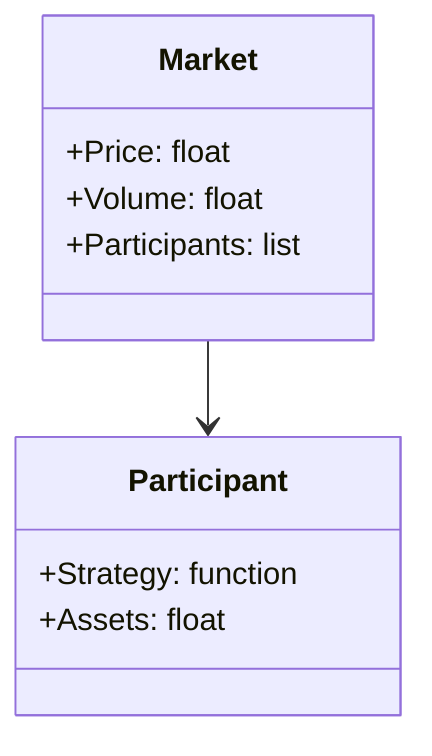
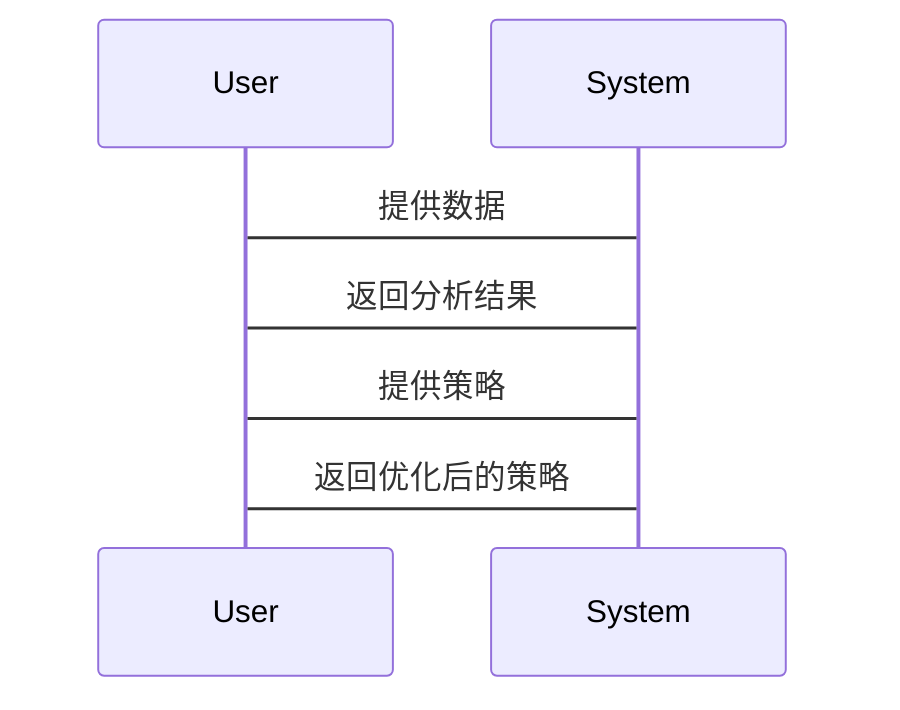

                 


# 基于多智能体的自适应市场假说在价值投资中的应用

## 关键词：
多智能体系统、自适应市场假说、价值投资、金融市场、人工智能

## 摘要：
本文探讨了多智能体系统在金融市场中的应用，特别是如何利用自适应市场假说进行价值投资。通过分析多智能体系统的结构与通信机制，结合自适应市场假说的理论基础，本文提出了一种基于多智能体的自适应市场假说的算法，并详细讲解了该算法的实现原理和应用场景。通过系统架构设计和项目实战，本文展示了如何将理论应用于实际投资策略中，为投资者提供了新的思路和工具。

---

## 第三部分: 自适应市场假说的理论基础

### 第3章: 自适应市场假说的理论与应用

#### 3.1 自适应市场假说的理论基础

##### 3.1.1 自适应市场假说的定义
自适应市场假说（Adaptive Market Hypothesis, AMH）认为，金融市场的价格波动是由投资者行为的适应性驱动的。与有效市场假说（EMH）不同，AMH强调市场的动态性和非效率性，认为市场参与者通过不断学习和适应，能够逐步发现新的套利机会，并调整自己的投资策略。

##### 3.1.2 自适应市场假说的核心思想
自适应市场假说的核心思想在于市场的参与者通过不断的学习和适应，能够逐步发现新的套利机会，从而推动市场价格向其内在价值回归。AMH认为，市场的信息效率并不是静态的，而是随着时间的推移而不断提高。

##### 3.1.3 自适应市场假说与有效市场假说的区别
| 自适应市场假说（AMH） | 有效市场假说（EMH） |
|------------------------|----------------------|
| 强调市场的动态性和非效率性 | 强调市场的信息效率和价格的公平性 |
| 认为市场参与者通过学习不断调整策略 | 认为市场价格反映所有公开信息 |
| 更适合描述实际市场的复杂性 | 更适合描述理想市场的状态 |

##### 3.1.4 自适应市场假说在价值投资中的应用
自适应市场假说为价值投资提供了一种新的视角。通过分析市场参与者的适应性行为，投资者可以更好地识别市场的短期波动和长期趋势，从而制定更加科学的投资策略。

#### 3.2 自适应市场假说的数学模型

##### 3.2.1 市场参与者的行为模型
市场参与者的行为可以通过强化学习模型来描述。假设每个市场参与者都有一个策略，该策略通过与市场的互动不断优化。

##### 3.2.2 市场的动态模型
市场的动态可以通过多智能体系统来模拟，每个智能体代表一个市场参与者，其行为受到市场环境的影响。

#### 3.3 自适应市场假说的实现步骤

##### 3.3.1 数据收集
收集历史市场数据，包括股票价格、交易量、市场指数等。

##### 3.3.2 数据分析
分析数据以识别市场趋势和异常现象。

##### 3.3.3 策略制定
根据分析结果制定投资策略。

##### 3.3.4 策略优化
通过不断的学习和适应，优化投资策略。

### 第4章: 基于多智能体的自适应市场假说的算法原理

#### 4.1 多智能体系统的结构与功能

##### 4.1.1 多智能体系统的结构组成
多智能体系统由多个智能体组成，每个智能体负责特定的任务。这些智能体通过通信机制进行交互，共同完成复杂的任务。

##### 4.1.2 多智能体系统中的通信机制
通信机制包括直接通信和间接通信。直接通信是指智能体之间直接交换信息，间接通信是指通过中间媒介进行信息交换。

##### 4.1.3 多智能体系统的协调与协作
协调与协作是多智能体系统的核心，通过协调机制，智能体可以共同完成复杂任务。

#### 4.2 多智能体系统的算法实现

##### 4.2.1 分布式计算与并行处理
分布式计算和并行处理是多智能体系统实现的关键技术。

##### 4.2.2 多智能体系统中的状态表示
状态表示是多智能体系统中的重要部分，通常包括市场数据、交易策略等。

##### 4.2.3 多智能体系统中的行为选择
行为选择是基于当前状态和市场环境的决策过程。

#### 4.3 自适应市场假说的实现算法

##### 4.3.1 算法流程
1. 收集市场数据。
2. 分析市场数据。
3. 制定投资策略。
4. 优化投资策略。

##### 4.3.2 算法实现的Python代码示例
```python
import numpy as np
import pandas as pd

# 数据收集
def collect_data():
    # 收集市场数据
    pass

# 数据分析
def analyze_data(data):
    # 分析数据
    pass

# 投资策略制定
def formulate_strategy(data):
    # 制定策略
    pass

# 投资策略优化
def optimize_strategy(strategy):
    # 优化策略
    pass

# 主函数
def main():
    data = collect_data()
    analysis = analyze_data(data)
    strategy = formulate_strategy(analysis)
    optimized_strategy = optimize_strategy(strategy)
    return optimized_strategy

if __name__ == "__main__":
    main()
```

#### 4.4 算法实现的数学模型

##### 4.4.1 市场价格模型
市场价格模型可以表示为：
$$ P(t) = \alpha + \beta t + \epsilon $$
其中，$P(t)$ 是价格，$\alpha$ 和 $\beta$ 是常数，$\epsilon$ 是随机误差。

##### 4.4.2 投资者行为模型
投资者行为模型可以表示为：
$$ A(t) = \gamma P(t) + \delta $$
其中，$A(t)$ 是投资者的行动，$\gamma$ 和 $\delta$ 是常数。

### 第5章: 基于多智能体的自适应市场假说的系统架构设计

#### 5.1 问题场景介绍
金融市场中的价格波动复杂，需要通过多智能体系统来模拟和分析。

#### 5.2 项目介绍
本项目旨在利用多智能体系统实现自适应市场假说在价值投资中的应用。

#### 5.3 系统功能设计

##### 5.3.1 领域模型
领域模型可以表示为：


##### 5.3.2 系统架构
系统架构可以表示为：
```mermaid
top
模块: 系统架构
  模块: 数据收集
  模块: 数据分析
  模块: 策略制定
  模块: 策略优化
```

##### 5.3.3 系统接口设计
系统接口设计包括数据接口、分析接口、策略接口等。

##### 5.3.4 系统交互
系统交互可以表示为：


### 第6章: 项目实战

#### 6.1 环境搭建
搭建Python环境，安装必要的库，如numpy、pandas等。

#### 6.2 系统核心实现

##### 6.2.1 数据收集
编写代码收集市场数据。

##### 6.2.2 数据分析
编写代码分析数据。

##### 6.2.3 投资策略制定
编写代码制定投资策略。

##### 6.2.4 投资策略优化
编写代码优化投资策略。

#### 6.3 代码实现

##### 6.3.1 数据收集代码
```python
import pandas as pd
import requests

def collect_data():
    # 收集数据
    pass
```

##### 6.3.2 数据分析代码
```python
def analyze_data(data):
    # 分析数据
    pass
```

##### 6.3.3 投资策略制定代码
```python
def formulate_strategy(data):
    # 制定策略
    pass
```

##### 6.3.4 投资策略优化代码
```python
def optimize_strategy(strategy):
    # 优化策略
    pass
```

#### 6.4 代码解读与分析
详细解读代码的功能和实现过程。

#### 6.5 实际案例分析
分析实际市场数据，验证算法的有效性。

#### 6.6 案例详细讲解
详细讲解案例的分析过程和结果。

### 第7章: 总结与展望

#### 7.1 总结
总结全文的主要内容和结论。

#### 7.2 最佳实践 tips
提供一些投资建议和实践技巧。

#### 7.3 小结
简要回顾全文内容。

#### 7.4 注意事项
提醒读者注意投资风险。

#### 7.5 拓展阅读
推荐相关领域的书籍和资源。

---

## 作者：AI天才研究院/AI Genius Institute & 禅与计算机程序设计艺术 /Zen And The Art of Computer Programming

