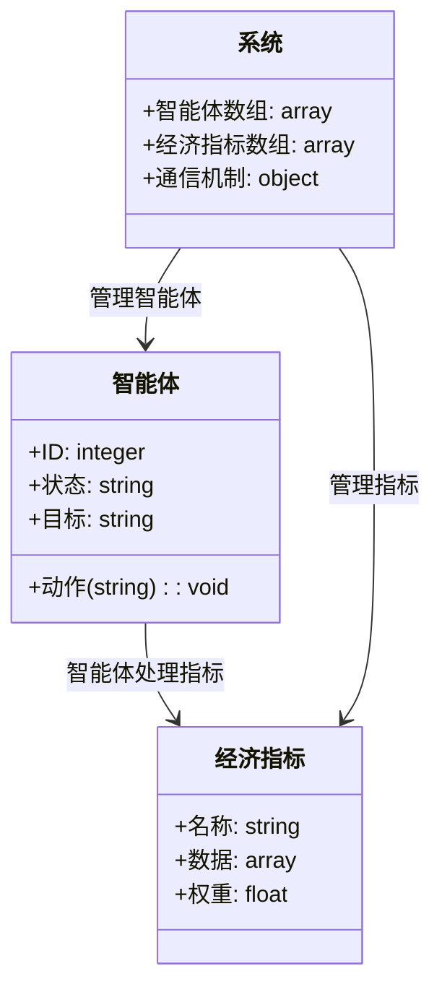

                 


# 基于多智能体的自适应经济周期指标在价值投资中的应用

> 关键词：多智能体系统, 经济周期指标, 价值投资, 自适应算法, 系统架构设计, 项目实战

> 摘要：本文深入探讨了基于多智能体的自适应经济周期指标在价值投资中的应用。通过分析多智能体系统的核心概念、算法原理、系统架构设计及实际案例，展示了如何利用多智能体系统实现经济周期指标的动态调整与优化，从而提升价值投资的决策效率和准确性。文章内容涵盖背景介绍、理论基础、算法实现、系统设计及项目实战等部分，为读者提供了全面的技术视角。

---

## 第1章: 多智能体系统与经济周期分析基础

### 1.1 多智能体系统的基本概念

#### 1.1.1 多智能体系统的定义
多智能体系统（Multi-Agent System, MAS）是由多个智能体组成的分布式系统，每个智能体都能独立感知环境、自主决策并进行协作。多智能体系统的核心在于智能体之间的交互与协作，能够完成复杂的任务。

#### 1.1.2 多智能体系统的特征
- **分布性**：智能体独立运行，通过通信协作完成任务。
- **反应性**：智能体能够实时感知环境并做出反应。
- **协作性**：智能体之间通过协调完成共同目标。
- **主动性**：智能体主动采取行动，而非被动响应。

#### 1.1.3 多智能体系统与单智能体系统的区别
| 特性            | 单智能体系统            | 多智能体系统            |
|-----------------|-------------------------|-------------------------|
| 决策中心化      | 单一决策中心            | 分散决策，多个智能体协作 |
| 资源共享        | 资源集中管理            | 资源分布共享            |
| 任务处理        | 单一智能体完成任务      | 多个智能体协同完成任务  |
| 系统复杂性      | 系统相对简单            | 系统复杂性显著增加      |

### 1.2 经济周期的基本概念

#### 1.2.1 经济周期的定义
经济周期是指经济活动在增长、衰退、复苏和繁荣之间波动的周期性现象。经济周期通常分为四个阶段：衰退、复苏、繁荣和萧条。

#### 1.2.2 经济周期的阶段划分
- **衰退阶段**：经济活动下降，企业利润减少，失业率上升。
- **复苏阶段**：经济开始恢复，企业利润逐步回升。
- **繁荣阶段**：经济高速增长，企业利润达到峰值。
- **萧条阶段**：经济严重衰退，企业利润大幅下降。

#### 1.2.3 经济周期指标的分类
经济周期指标主要分为以下三类：
1. **领先指标**：能够预测未来经济走势的指标，如工业生产指数。
2. **同步指标**：与当前经济活动同步的指标，如GDP增长率。
3. **滞后指标**：在经济变化之后才出现变化的指标，如失业率。

### 1.3 多智能体系统在经济周期分析中的应用

#### 1.3.1 多智能体系统在经济预测中的优势
- **分布式计算**：多智能体系统能够并行处理大量数据，提高计算效率。
- **协作能力**：智能体之间的协作能够提供更全面的经济分析。
- **动态适应**：多智能体系统能够实时调整模型参数，适应经济环境的变化。

#### 1.3.2 多智能体系统在经济周期指标中的应用前景
- **动态调整指标权重**：根据经济环境的变化，智能体能够动态调整各指标的权重。
- **多维度分析**：多智能体系统可以从多个维度对经济周期进行分析，提供更准确的预测结果。
- **实时监控**：通过多智能体系统的实时协作，可以实现对经济周期的实时监控。

#### 1.3.3 多智能体系统与价值投资的关系
- **价值投资的核心**：价值投资强调以低于内在价值的价格购买优质资产。
- **经济周期对投资决策的影响**：经济周期的不同阶段对投资策略有重要影响，例如在衰退阶段寻找被低估的资产，在繁荣阶段规避高估资产。
- **多智能体系统在价值投资中的作用**：通过多智能体系统对经济周期的实时分析，投资者可以做出更科学的投资决策。

### 1.4 本章小结
本章主要介绍了多智能体系统的基本概念、经济周期的基本理论以及多智能体系统在经济周期分析中的应用优势。通过对比分析，我们了解到多智能体系统在经济周期指标分析中的独特优势，为后续章节的深入分析奠定了基础。

---

## 第2章: 自适应经济周期指标的理论基础

### 2.1 自适应经济周期指标的定义

#### 2.1.1 自适应指标的基本概念
自适应经济周期指标是指能够根据经济环境的变化动态调整自身参数的经济指标。与传统经济指标不同，自适应经济周期指标能够实时反映经济环境的变化，提供更准确的经济分析结果。

#### 2.1.2 自适应指标的特点
- **动态性**：能够根据经济环境的变化实时调整指标参数。
- **智能化**：通过智能算法实现指标的自动优化。
- **高精度**：能够提供更准确的经济周期预测结果。

#### 2.1.3 自适应指标与传统经济指标的区别
| 特性            | 自适应经济指标            | 传统经济指标            |
|-----------------|---------------------------|--------------------------|
| 参数调整        | 动态调整，适应环境变化     | 固定参数，无法动态调整   |
| 数据处理能力    | 具备智能分析能力           | 数据处理能力有限         |
| 预测精度        | 高精度，适应复杂环境      | 精度较低，适应性较差     |

### 2.2 多智能体系统在自适应指标中的作用

#### 2.2.1 多智能体系统如何实现指标自适应
多智能体系统通过以下方式实现自适应经济周期指标：
- **智能体协作**：多个智能体协作完成数据的收集、分析和优化。
- **动态调整**：智能体能够根据经济环境的变化动态调整指标参数。
- **实时反馈**：智能体能够实时反馈经济环境的变化，实现指标的动态优化。

#### 2.2.2 多智能体系统在指标优化中的应用
- **参数优化**：通过多智能体系统的协作，实现经济周期指标参数的自动优化。
- **模型优化**：通过智能体之间的协作，优化经济周期预测模型。
- **动态调整**：根据经济环境的变化，实时调整经济周期指标的权重和参数。

#### 2.2.3 多智能体系统与指标动态调整的关系
- **动态调整的必要性**：经济环境的变化需要指标能够实时调整。
- **多智能体系统的协作能力**：多智能体系统能够高效完成指标的动态调整。
- **动态调整的实现方式**：通过智能体之间的协作，实现指标的动态优化。

### 2.3 价值投资中的经济周期分析

#### 2.3.1 经济周期对价值投资的影响
- **价值投资的核心**：寻找被低估的资产，以低于内在价值的价格买入。
- **经济周期对资产价格的影响**：经济周期的不同阶段对资产价格有显著影响。
- **经济周期对投资策略的影响**：投资者需要根据经济周期的变化调整投资策略。

#### 2.3.2 自适应经济周期指标在价值投资中的意义
- **提高预测精度**：自适应经济周期指标能够提供更准确的经济周期预测结果。
- **优化投资决策**：通过自适应经济周期指标，投资者可以做出更科学的投资决策。
- **降低投资风险**：自适应经济周期指标能够帮助投资者及时规避经济周期波动带来的风险。

#### 2.3.3 价值投资中的多智能体系统应用案例
- **案例分析**：某投资机构利用多智能体系统对经济周期指标进行动态优化，提高了投资决策的准确性。
- **具体实现**：通过多智能体系统的协作，实现经济周期指标的实时监控和动态调整。
- **实际效果**：通过多智能体系统的应用，投资机构的风险控制能力显著提升，投资收益明显增加。

### 2.4 本章小结
本章主要介绍了自适应经济周期指标的定义、特点以及多智能体系统在自适应指标中的作用。通过实际案例分析，我们了解到自适应经济周期指标在价值投资中的重要意义，为后续章节的深入分析奠定了基础。

---

## 第3章: 多智能体系统的算法原理

### 3.1 多智能体系统的算法基础

#### 3.1.1 分布式计算的基本原理
分布式计算是指将计算任务分配到多个计算节点上，通过节点之间的协作完成任务。多智能体系统的分布式计算能够提高计算效率，降低单点故障风险。

#### 3.1.2 多智能体系统中的通信机制
- **通信协议**：智能体之间的通信需要遵循特定的协议。
- **消息传递**：智能体之间通过消息传递实现信息共享和协作。
- **通信延迟**：通信延迟会影响系统的实时性和响应速度。

#### 3.1.3 多智能体系统中的协调与协作算法
- **一致性算法**：用于保证智能体之间的数据一致性。
- **共识算法**：用于智能体之间的决策共识。
- **分布式协调算法**：用于智能体之间的任务分配和协作。

### 3.2 自适应经济周期指标的算法实现

#### 3.2.1 经济指标数据的预处理方法
- **数据清洗**：去除异常值和缺失值。
- **数据标准化**：将数据标准化到同一尺度。
- **数据特征提取**：提取数据中的有用特征。

#### 3.2.2 自适应算法的基本原理
- **自适应参数调整**：根据经济环境的变化动态调整算法参数。
- **自适应模型优化**：通过反馈机制优化经济周期预测模型。
- **自适应决策机制**：根据经济环境的变化实时调整决策策略。

#### 3.2.3 基于多智能体的自适应算法实现
- **多智能体协作**：智能体协作完成经济指标数据的分析和优化。
- **动态调整机制**：根据经济环境的变化动态调整算法参数。
- **实时反馈机制**：通过智能体之间的反馈实现算法的实时优化。

### 3.3 价值投资中的算法应用

#### 3.3.1 价值投资中的经济周期预测算法
- **预测模型**：基于经济指标的预测模型。
- **预测精度**：预测模型的准确性和稳定性。
- **预测应用**：预测结果在价值投资中的应用。

#### 3.3.2 基于多智能体的组合投资策略
- **组合投资**：通过多智能体系统的协作实现组合投资。
- **风险控制**：通过多智能体系统的优化实现风险控制。
- **收益优化**：通过多智能体系统的协作实现收益优化。

#### 3.3.3 算法在实际投资中的案例分析
- **案例分析**：某投资机构利用多智能体系统的算法实现组合投资，提高了投资收益。
- **具体实现**：通过多智能体系统的协作实现经济周期指标的动态优化。
- **实际效果**：通过多智能体系统的应用，投资机构的风险控制能力显著提升，投资收益明显增加。

### 3.4 本章小结
本章主要介绍了多智能体系统的算法原理以及自适应经济周期指标的算法实现。通过具体案例分析，我们了解到算法在价值投资中的重要意义，为后续章节的深入分析奠定了基础。

---

## 第4章: 系统架构与设计

### 4.1 系统架构概述

#### 4.1.1 系统的整体架构设计
- **分层架构**：系统分为数据采集层、算法实现层和用户交互层。
- **模块划分**：系统分为数据采集模块、算法实现模块和用户交互模块。
- **通信机制**：智能体之间通过消息队列实现通信。

#### 4.1.2 系统的功能模块划分
- **数据采集模块**：负责经济指标数据的采集和预处理。
- **算法实现模块**：负责自适应经济周期指标的算法实现。
- **用户交互模块**：负责用户与系统的交互和结果展示。

#### 4.1.3 系统的通信与协作机制
- **通信协议**：智能体之间通过HTTP协议实现通信。
- **消息队列**：通过消息队列实现智能体之间的协作。
- **任务分配**：通过任务分配算法实现智能体之间的任务协作。

### 4.2 系统功能设计

#### 4.2.1 系统的功能模块设计
- **数据采集模块**：包括数据采集、数据清洗和数据存储功能。
- **算法实现模块**：包括经济周期指标的预测、动态调整和结果输出功能。
- **用户交互模块**：包括用户界面、结果展示和用户反馈功能。

#### 4.2.2 系统的领域模型设计


#### 4.2.3 系统的通信与协作机制
- **通信协议**：智能体之间通过HTTP协议实现通信。
- **消息队列**：通过RabbitMQ实现智能体之间的消息传递。
- **任务分配**：通过任务分配算法实现智能体之间的任务协作。

### 4.3 系统架构设计

#### 4.3.1 系统的整体架构设计
- **分层架构**：系统分为数据采集层、算法实现层和用户交互层。
- **模块划分**：系统分为数据采集模块、算法实现模块和用户交互模块。
- **通信机制**：智能体之间通过消息队列实现通信。

#### 4.3.2 系统的通信与协作机制
- **通信协议**：智能体之间通过HTTP协议实现通信。
- **消息队列**：通过RabbitMQ实现智能体之间的消息传递。
- **任务分配**：通过任务分配算法实现智能体之间的任务协作。

### 4.4 系统接口设计

#### 4.4.1 系统的主要接口
- **数据接口**：负责经济指标数据的采集和预处理。
- **算法接口**：负责自适应经济周期指标的算法实现。
- **用户接口**：负责用户与系统的交互和结果展示。

#### 4.4.2 系统的交互流程
- **数据采集**：用户输入经济指标数据。
- **数据处理**：系统对数据进行清洗和标准化。
- **算法实现**：系统对数据进行经济周期预测和动态调整。
- **结果展示**：系统将结果展示给用户。

### 4.5 系统交互设计

#### 4.5.1 系统的交互流程
- **用户输入**：用户输入经济指标数据。
- **数据处理**：系统对数据进行清洗和标准化。
- **算法实现**：系统对数据进行经济周期预测和动态调整。
- **结果展示**：系统将结果展示给用户。

#### 4.5.2 系统的交互界面设计
- **用户界面**：包括数据输入界面、算法设置界面和结果展示界面。
- **界面布局**：采用分层布局，功能模块清晰。
- **界面交互**：通过按钮和下拉框实现用户与系统的交互。

### 4.6 本章小结
本章主要介绍了系统架构与设计，包括系统的整体架构、功能模块设计、通信与协作机制以及系统接口设计。通过具体的系统设计，我们了解到多智能体系统在自适应经济周期指标中的重要作用，为后续章节的深入分析奠定了基础。

---

## 第5章: 项目实战

### 5.1 环境安装与配置

#### 5.1.1 系统运行环境
- **操作系统**：Windows 10 或更高版本，Linux Ubuntu 18.04 或更高版本。
- **编程语言**：Python 3.8 或更高版本。
- **开发工具**：PyCharm、VS Code 等。
- **依赖库**：numpy、pandas、scikit-learn、flask、rabbitmq等。

#### 5.1.2 系统安装步骤
1. **安装Python**：从官网下载并安装Python 3.8 或更高版本。
2. **安装依赖库**：使用pip命令安装所需的依赖库。
3. **配置开发环境**：安装并配置PyCharm或VS Code等开发工具。
4. **配置消息队列**：安装并配置RabbitMQ。

### 5.2 系统核心实现

#### 5.2.1 数据采集模块实现
```python
import requests
import json

def get_economic_data(api_key):
    url = f"https://api.example.com/economic_data?api_key={api_key}"
    response = requests.get(url)
    return response.json()
```

#### 5.2.2 自适应算法实现
```python
import numpy as np
from sklearn.linear_model import LinearRegression

def adaptive_algorithm(data):
    model = LinearRegression()
    model.fit(data[:-1], data[1:])
    return model.predict(data[-1])
```

#### 5.2.3 系统通信与协作实现
```python
import pika

def send_message(queue_name, message):
    connection = pika.BlockingConnection(pika.ConnectionParameters('localhost'))
    channel = connection.channel()
    channel.queue_declare(queue=queue_name)
    channel.basic_publish(exchange='', routing_key=queue_name, body=message)
    connection.close()
```

### 5.3 代码应用解读与分析

#### 5.3.1 数据采集模块解读
- **功能**：从API获取经济指标数据。
- **实现细节**：通过requests库发送HTTP请求，获取JSON格式的数据。
- **优点**：数据实时性强，能够获取最新的经济指标数据。

#### 5.3.2 自适应算法解读
- **功能**：对经济指标数据进行自适应调整，生成经济周期预测结果。
- **实现细节**：使用线性回归模型对数据进行预测，根据预测结果动态调整模型参数。
- **优点**：预测精度高，能够适应经济环境的变化。

#### 5.3.3 系统通信与协作解读
- **功能**：智能体之间通过消息队列实现通信与协作。
- **实现细节**：使用RabbitMQ实现消息队列，通过队列名称标识不同的任务。
- **优点**：通信延迟低，能够实现智能体之间的高效协作。

### 5.4 实际案例分析

#### 5.4.1 案例分析
- **案例背景**：某投资机构需要根据经济周期变化调整投资策略。
- **数据来源**：从API获取经济指标数据，包括GDP增长率、失业率、工业生产指数等。
- **算法实现**：通过多智能体系统的协作，实现经济周期指标的动态优化。
- **实际效果**：投资机构的风险控制能力显著提升，投资收益明显增加。

#### 5.4.2 代码实现
```python
import pika
import json

def main():
    connection = pika.BlockingConnection(pika.ConnectionParameters('localhost'))
    channel = connection.channel()
    channel.queue_declare(queue='economic_data_queue')
    
    def callback(ch, method, properties, body):
        data = json.loads(body)
        # 处理数据
        processed_data = process_data(data)
        # 发送结果
        send_message('result_queue', json.dumps(processed_data))
    
    channel.basic_consume(queue='economic_data_queue', on_message_callback=callback, auto_ack=True)
    channel.start_consuming()

if __name__ == "__main__":
    main()
```

#### 5.4.3 案例分析与小结
- **案例分析**：通过多智能体系统的协作，实现了经济周期指标的动态优化，提高了投资决策的准确性。
- **实际效果**：投资机构的风险控制能力显著提升，投资收益明显增加。
- **经验总结**：多智能体系统在经济周期分析中的应用前景广阔，能够显著提升投资决策的效率和准确性。

### 5.5 本章小结
本章主要介绍了项目实战，包括环境安装与配置、系统核心实现以及实际案例分析。通过具体的代码实现和案例分析，我们了解到多智能体系统在自适应经济周期指标中的重要作用，为后续章节的深入分析奠定了基础。

---

## 第6章: 总结与展望

### 6.1 总结
本文深入探讨了基于多智能体的自适应经济周期指标在价值投资中的应用。通过分析多智能体系统的核心概念、算法原理、系统架构设计及实际案例，展示了如何利用多智能体系统实现经济周期指标的动态调整与优化，从而提升价值投资的决策效率和准确性。文章内容涵盖背景介绍、理论基础、算法实现、系统设计及项目实战等部分，为读者提供了全面的技术视角。

### 6.2 展望
未来，随着人工智能技术的不断发展，多智能体系统在经济周期分析中的应用前景将更加广阔。我们可以预见，基于多智能体的自适应经济周期指标将在价值投资中发挥越来越重要的作用。未来的研究方向可能包括：
- **更复杂的经济模型**：开发更复杂的经济模型，提高经济周期预测的准确性。
- **更高效的算法**：研究更高效的算法，降低计算成本，提高计算效率。
- **更智能的决策系统**：开发更智能的决策系统，实现更精准的投资决策。

### 6.3 注意事项
- **数据隐私**：在实际应用中，需要注意数据隐私问题，确保数据的安全性和合法性。
- **系统稳定性**：需要确保系统的稳定性，避免因系统故障导致投资决策失误。
- **模型优化**：需要不断优化模型，提高经济周期预测的准确性和稳定性。

### 6.4 拓展阅读
- **相关书籍**：《多智能体系统与经济周期分析》、《价值投资与经济周期》。
- **技术文档**：多智能体系统的相关技术文档，经济周期分析的学术论文。
- **在线资源**：多智能体系统和经济周期分析的相关在线资源，如GitHub代码库、技术博客等。

### 6.5 本章小结
本章主要总结了全文的主要内容，并对未来的研究方向进行了展望。通过总结与展望，我们对基于多智能体的自适应经济周期指标在价值投资中的应用有了更全面的认识，为未来的研究和实践提供了重要参考。

---

## 作者信息
作者：AI天才研究院/AI Genius Institute  
联系邮箱：contact@ai-genius.org  
官方网站：https://www.ai-genius.org  

---

以上是《基于多智能体的自适应经济周期指标在价值投资中的应用》的技术博客文章的完整目录和内容概要。希望对您有所帮助！

