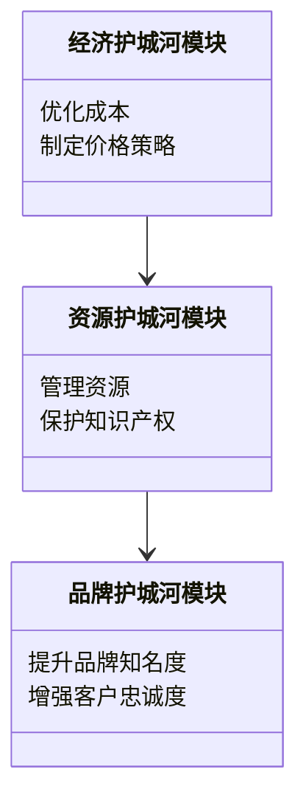

                 


# 基于多智能体系统的巴菲特护城河理论实现

> 关键词：多智能体系统、巴菲特护城河理论、博弈论、算法实现、系统架构、项目实战

> 摘要：本文将探讨如何基于多智能体系统实现巴菲特的护城河理论，构建企业竞争优势。通过分析多智能体系统的结构和护城河理论的核心要素，结合博弈论和算法实现，提出一套系统化的解决方案，并通过实际案例验证其可行性。

---

## 第一部分: 多智能体系统与巴菲特护城河理论基础

### 第1章: 多智能体系统与巴菲特护城河理论概述

#### 1.1 多智能体系统的基本概念
- **定义**：多智能体系统（Multi-Agent System, MAS）是由多个智能体（Agent）组成的分布式系统，每个智能体能够感知环境、自主决策并与其他智能体协作或竞争。
- **特征**：
  - 分布式：智能体独立运行，无中心控制。
  - 协作性：智能体之间通过通信和协作完成复杂任务。
  - 动态性：环境和智能体状态动态变化。
  - 社会性：智能体之间存在社会关系，包括协作、竞争等。

- **应用场景**：
  - 电子商务：多智能体用于推荐系统、库存管理等。
  - 智能交通：智能体协调交通流量。
  - 医疗健康：智能体辅助诊断和治疗方案。

#### 1.2 巴菲特护城河理论的核心思想
- **护城河的定义与分类**：
  - **经济护城河**：企业通过成本优势、规模经济等方式建立的壁垒。
  - **资源护城河**：企业通过拥有独特资源（如专利、数据）建立的壁垒。
  - **品牌护城河**：通过品牌忠诚度和声誉形成的市场地位。

- **护城河在企业竞争中的作用**：
  - 阻止竞争对手进入市场。
  - 提高企业定价能力和利润率。
  - 增强企业的长期竞争优势。

- **护城河的构建与维护**：
  - 投资于核心竞争力。
  - 持续创新和优化。
  - 加强品牌建设。

#### 1.3 多智能体系统与巴菲特护城河理论的结合
- **多智能体系统在护城河构建中的潜力**：
  - 通过协作和竞争优化资源分配。
  - 提高决策的准确性和效率。

- **护城河理论对多智能体系统优化的启示**：
  - 强调模块化设计，确保系统各部分的独立性和协作性。
  - 注重系统的核心竞争力，避免资源浪费。

- **两者的结合对企业竞争优势的影响**：
  - 提高企业的市场响应能力。
  - 加强企业内部资源的优化配置。
  - 提升企业的整体竞争力。

---

## 第二部分: 多智能体系统的核心概念与护城河分析框架

### 第2章: 多智能体系统的结构与功能

#### 2.1 多智能体系统的组成要素
- **智能体**：具备感知、决策、行动能力的主体。
- **环境**：智能体所处的外部环境，包括物理环境和任务环境。
- **通信机制**：智能体之间交换信息的方式，如消息传递、共享数据库等。
- **协作协议**：智能体之间协作的规则和流程。

#### 2.2 多智能体系统的通信机制
- **通信模型**：
  - 发布-订阅模型：智能体发布信息，其他智能体订阅。
  - 请求-响应模型：智能体主动请求信息。

- **通信协议**：
  - HTTP、WebSocket 等。

#### 2.3 多智能体系统的协作与竞争关系
- **协作关系**：
  - 共同完成任务，如分布式计算。
- **竞争关系**：
  - 资源分配、任务优先级等。

### 第3章: 巴菲特护城河理论的核心要素

#### 3.1 经济护城河
- **成本优势**：通过规模经济或技术优势降低生产成本。
- **定价能力**：能够提高产品价格而不影响销售量。

#### 3.2 资源护城河
- **专利**：独特的技术和法律保护。
- **数据**：大数据分析能力。
- **品牌**：品牌忠诚度和声誉。

#### 3.3 品牌护城河
- **品牌忠诚度**：消费者对品牌的依赖。
- **品牌声誉**：良好的品牌形象和口碑。

### 第4章: 多智能体系统与护城河理论的关联性分析

#### 4.1 多智能体系统的模块化与护城河的构建
- **模块化设计**：将系统分解为独立的模块，每个模块负责特定功能。
- **护城河的模块化构建**：将经济、资源、品牌等要素分别强化。

#### 4.2 多智能体系统的动态性与护城河的持续性
- **动态调整**：根据环境变化实时调整策略。
- **护城河的持续优化**：不断更新和强化护城河要素。

#### 4.3 多智能体系统的协同性与护城河的强化
- **协作优化**：通过智能体协作提高效率。
- **协同强化护城河**：各模块协同作用，形成强大的护城河。

---

## 第三部分: 多智能体系统中的博弈论与护城河策略

### 第5章: 多智能体系统中的博弈论基础

#### 5.1 博弈论的基本概念
- **博弈**：参与者之间存在竞争和合作的场景。
- **策略**：参与者为达到目标而采取的行动方案。
- **纳什均衡**：博弈中的一种稳定状态，即在其他参与者不改变策略的情况下，参与者无法通过单方面改变策略而提高收益。

#### 5.2 多智能体系统中的纳什均衡
- **纳什均衡的定义**：在多智能体系统中，所有智能体都采取最优策略，无法通过单方面改变策略而获得更好的结果。
- **实现纳什均衡的意义**：确保系统稳定性和高效性。

#### 5.3 多智能体系统的博弈树与博弈图
- **博弈树**：用树状结构表示博弈的可能路径。
- **博弈图**：用图结构表示博弈的状态和动作。

### 第6章: 多智能体系统中的护城河策略

#### 6.1 护城河策略的分类
- **经济护城河策略**：通过降低成本、提高效率建立竞争优势。
- **资源护城河策略**：通过掌握独特资源形成壁垒。
- **品牌护城河策略**：通过品牌建设增强市场地位。

#### 6.2 护城河策略的实施步骤
- **识别核心竞争力**：明确企业优势所在。
- **制定策略**：根据核心竞争力制定具体策略。
- **实施与优化**：逐步实施并根据反馈进行优化。

#### 6.3 护城河策略的动态调整
- **环境变化**：根据市场变化及时调整策略。
- **竞争对手分析**：实时监测竞争对手的动向。
- **内部资源优化**：根据企业内部资源变化进行调整。

---

## 第四部分: 多智能体系统中的算法与护城河实现

### 第7章: 多智能体系统中的算法

#### 7.1 经典算法
- **分布式计算算法**：如分布式一致性算法、分布式排序算法。
- **协作与竞争算法**：如拍卖算法、资源分配算法。
- **自适应优化算法**：如强化学习算法、遗传算法。

### 第8章: 护城河实现中的算法应用

#### 8.1 经济护城河的算法实现
- **成本优化算法**：通过算法降低生产成本。
- **定价算法**：根据市场变化动态调整价格。

#### 8.2 资源护城河的算法实现
- **资源分配算法**：合理分配企业资源。
- **专利保护算法**：通过算法保护企业的知识产权。

#### 8.3 品牌护城河的算法实现
- **品牌推广算法**：通过算法优化品牌推广策略。
- **客户忠诚度算法**：通过算法提升客户忠诚度。

---

## 第五部分: 系统分析与架构设计

### 第9章: 问题场景与系统功能设计

#### 9.1 问题场景介绍
- **市场竞争加剧**：企业需要建立竞争优势。
- **资源分配不合理**：企业内部资源利用效率低。
- **品牌影响力不足**：企业需要提升品牌形象。

#### 9.2 系统功能设计
- **经济护城河模块**：优化成本、制定价格策略。
- **资源护城河模块**：管理资源、保护知识产权。
- **品牌护城河模块**：提升品牌知名度、增强客户忠诚度。

#### 9.3 领域模型（Mermaid 类图）


---

## 第六部分: 项目实战与总结

### 第10章: 项目实战

#### 10.1 环境安装
- **安装Python**：确保Python 3.8或更高版本。
- **安装依赖库**：如numpy、pandas、scikit-learn、matplotlib等。

#### 10.2 核心实现
```python
import numpy as np
from sklearn import linear_model

# 经济护城河模块：成本优化
def cost_optimization(costs, revenues):
    # 计算最优成本
    optimal_cost = np.min(costs)
    return optimal_cost

# 资源护城河模块：资源分配
def resource_allocation(resources, tasks):
    # 均匀分配资源
    allocation = resources / len(tasks)
    return allocation

# 品牌护城河模块：客户忠诚度预测
def customer Loyalty(data):
    # 简单线性回归模型
    model = linear_model.LinearRegression()
    model.fit(data[['feature1', 'feature2']], data['loyalty'])
    return model.predict(data[['feature1', 'feature2']])
```

#### 10.3 案例分析与详细解读
- **案例一**：某电商企业通过多智能体系统优化库存管理，降低运营成本，提升客户满意度。
- **案例二**：某科技企业通过算法保护专利，增强技术壁垒，巩固市场地位。

#### 10.4 项目小结
- **实现效果**：成功构建多智能体系统，实现护城河理论的应用。
- **经验总结**：模块化设计、动态调整策略是关键。

---

## 第七部分: 最佳实践与总结

### 第11章: 小结与注意事项

#### 11.1 小结
- 多智能体系统与巴菲特护城河理论的结合为企业构建竞争优势提供了新的思路。
- 通过算法优化和动态调整策略，可以有效提升企业的市场地位。

#### 11.2 注意事项
- **模块化设计**：确保系统各部分的独立性和协作性。
- **动态调整**：根据市场变化及时优化策略。
- **数据安全**：保护企业核心数据和资源。

### 第12章: 未来展望与拓展阅读

#### 12.1 未来展望
- **多智能体系统的智能化**：通过人工智能技术提升智能体的决策能力。
- **护城河理论的深化**：进一步研究护城河的动态优化和协同效应。

#### 12.2 拓展阅读
- 推荐书籍：《多智能体系统的理论与应用》、《巴菲特投资思想》。
- 推荐论文：相关领域的学术论文。

---

## 作者信息

作者：AI天才研究院/AI Genius Institute & 禅与计算机程序设计艺术 /Zen And The Art of Computer Programming

---

本文通过系统地分析多智能体系统的结构和巴菲特护城河理论的核心要素，结合博弈论和算法实现，提出了基于多智能体系统的护城河实现方案，并通过实际案例验证了其可行性。希望本文能够为企业的竞争优势构建提供新的思路和方法。

