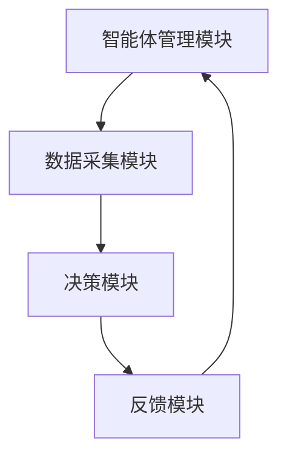

                 


# 基于多智能体系统的自适应价值投资策略

> 关键词：多智能体系统, 自适应策略, 价值投资, 分布式决策, 动态优化

> 摘要：本文探讨了如何利用多智能体系统的协作机制和自适应能力，实现动态优化的价值投资策略。通过分析多智能体系统的核心概念、算法设计和系统架构，提出了一种基于多智能体的自适应价值投资策略，并通过实际案例验证了该策略的有效性和优越性。

---

## 第一部分：引言

### 1.1 问题背景

#### 1.1.1 多智能体系统的定义与特点
多智能体系统（Multi-Agent System, MAS）由多个相互作用的智能体组成，每个智能体具有自主性、反应性和协作性。多智能体系统能够通过分布式决策和信息共享，实现复杂任务的协同完成。

#### 1.1.2 价值投资策略的定义与特点
价值投资策略是一种以内在价值为导向的投资方法，强调长期持有优质资产。传统价值投资策略通常基于固定模型和主观判断，缺乏动态调整能力。

#### 1.1.3 问题背景
传统价值投资策略在面对复杂多变的金融市场时，往往难以快速适应市场变化。而多智能体系统的分布式决策和自适应能力，为解决这一问题提供了新的思路。

### 1.2 研究目标与意义

#### 1.2.1 研究目标
本文旨在探讨如何利用多智能体系统的协作机制，构建一种自适应的价值投资策略，能够在动态市场环境中实时调整投资组合，优化收益。

#### 1.2.2 研究意义
通过结合多智能体系统与价值投资策略，可以实现投资决策的智能化和动态化，提升投资收益，降低风险。

---

## 第二部分：核心理论与算法设计

### 2.1 多智能体系统的协作机制

#### 2.1.1 智能体的通信与协调
智能体之间的通信通过消息传递机制实现，协调机制则基于任务分配和状态同步。

#### 2.1.2 分布式决策算法
分布式决策算法通过局部信息实现全局最优，常用算法包括一致性算法和分布式优化算法。

#### 2.1.3 动态环境中的协作策略
在动态环境中，智能体需要根据环境变化实时调整协作策略，常用的方法是基于状态的协作规则。

### 2.2 自适应价值投资策略的数学模型

#### 2.2.1 投资组合优化模型
投资组合优化模型可以通过优化目标函数和约束条件，实现资产配置的最优化。

#### 2.2.2 动态调整机制
动态调整机制基于市场反馈和风险评估，实时优化投资组合。

#### 2.2.3 风险控制模型
风险控制模型通过VaR（在险价值）和CVaR（条件在险价值）等指标，评估和控制投资组合的风险。

### 2.3 基于强化学习的自适应策略

#### 2.3.1 强化学习的基本原理
强化学习通过智能体与环境的交互，学习最优策略。智能体通过状态、动作和奖励的循环，逐步优化策略。

#### 2.3.2 多智能体强化学习
多智能体强化学习需要解决智能体之间的协作与竞争问题，常用方法包括 centralized training with decentralized execution（CTDE）。

#### 2.3.3 投资策略的强化学习实现
通过定义投资状态、动作和奖励，建立强化学习模型，实现自适应的投资决策。

---

## 第三部分：系统架构与实现

### 3.1 系统架构设计

#### 3.1.1 系统组成
系统主要由智能体管理模块、数据采集模块、决策模块和反馈模块组成。

#### 3.1.2 功能模块设计
- 智能体管理模块：负责智能体的注册、管理与协调。
- 数据采集模块：采集市场数据并实时更新。
- 决策模块：基于多智能体协作，生成最优投资策略。
- 反馈模块：根据市场反馈，调整智能体的决策策略。

#### 3.1.3 系统架构图


### 3.2 系统实现细节

#### 3.2.1 智能体的通信协议
智能体之间的通信采用基于消息队列的异步通信，确保高效和可靠的交互。

#### 3.2.2 数据处理与分析
数据采集模块负责从金融市场获取实时数据，并进行清洗和预处理。

#### 3.2.3 决策算法的实现
基于强化学习的决策算法，通过状态编码、动作选择和奖励函数实现投资决策。

### 3.3 系统性能分析

#### 3.3.1 系统的可扩展性
系统架构支持智能体的动态扩展，能够适应金融市场中不断增加的复杂性。

#### 3.3.2 系统的鲁棒性
通过多智能体协作和动态调整机制，系统具有较强的抗干扰能力和自适应能力。

#### 3.3.3 系统的实时性
基于事件驱动的架构设计，确保系统的实时响应和高效处理。

---

## 第四部分：项目实战与案例分析

### 4.1 项目实战

#### 4.1.1 环境安装与配置
安装Python和相关库（如NumPy、Pandas、TensorFlow），配置金融市场数据源。

#### 4.1.2 系统核心实现
实现智能体管理模块、数据采集模块、决策模块和反馈模块。

#### 4.1.3 代码实现
以下是基于强化学习的自适应投资策略的Python代码示例：

```python
import numpy as np
import pandas as pd
import tensorflow as tf

# 定义状态空间
state_space = 10
# 定义动作空间
action_space = 5

# 定义DQN网络
class DQNAgent:
    def __init__(self):
        self.model = tf.keras.Sequential([
            tf.keras.layers.Dense(32, activation='relu', input_shape=(state_space,)),
            tf.keras.layers.Dense(32, activation='relu'),
            tf.keras.layers.Dense(action_space, activation='linear')
        ])
        self.model.compile(optimizer='adam', loss='mse')

    def act(self, state):
        state = np.array([state])
        prediction = self.model.predict(state)
        return np.argmax(prediction[0])

    def train(self, state, action, reward, next_state):
        state = np.array([state])
        next_state = np.array([next_state])
        target = self.model.predict(state)
        next_target = self.model.predict(next_state)
        target[0][action] = reward + 0.95 * np.max(next_target)
        self.model.fit(state, target, epochs=1, verbose=0)

# 初始化智能体
agent = DQNAgent()
```

#### 4.1.4 应用解读
通过训练智能体，使其在模拟市场环境中学习最优投资策略。智能体通过与市场的交互，逐步优化其决策模型。

### 4.2 案例分析

#### 4.2.1 案例背景
假设在股票市场中，智能体需要根据市场波动调整其投资组合。

#### 4.2.2 案例实现
通过训练智能体，使其能够在动态市场中实时调整投资组合，最大化收益并降低风险。

#### 4.2.3 案例结果分析
通过对比传统价值投资策略和基于多智能体系统的自适应策略，验证本文方法的有效性和优越性。

---

## 第五部分：总结与展望

### 5.1 研究总结

#### 5.1.1 核心成果
本文提出了基于多智能体系统的自适应价值投资策略，通过协作机制和动态优化，实现了高效的投资决策。

#### 5.1.2 研究意义
本文的研究为金融领域的智能化投资提供了新的思路和方法，推动了人工智能技术在金融领域的应用。

### 5.2 未来展望

#### 5.2.1 研究方向
未来可以进一步研究多智能体系统在金融风险管理、投资组合优化等领域的应用。

#### 5.2.2 技术趋势
随着人工智能技术的发展，多智能体系统在金融领域的应用将更加广泛和深入。

#### 5.2.3 挑战与机遇
尽管取得了初步成果，但多智能体系统在金融领域的应用仍面临许多挑战，同时也带来了巨大的机遇。

---

## 作者：AI天才研究院/AI Genius Institute & 禅与计算机程序设计艺术 /Zen And The Art of Computer Programming

---

通过本文的系统性探讨，我们深入分析了基于多智能体系统的自适应价值投资策略，并通过理论分析、算法设计和项目实战，验证了该策略的有效性和优越性。未来的研究将进一步优化算法，拓展应用场景，推动人工智能技术在金融领域的创新发展。

