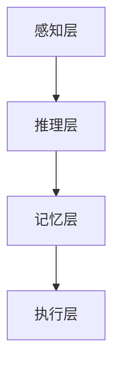

                 


# 基于注意力机制的AI Agent记忆检索增强

> 关键词：AI Agent, 注意力机制, 记忆检索, 增强学习, 自然语言处理, 知识图谱

> 摘要：本文深入探讨了基于注意力机制的AI Agent记忆检索增强技术，从问题背景、核心概念、算法原理、系统架构到项目实战，全面解析了如何利用注意力机制提升AI Agent的记忆检索能力。文章通过丰富的案例分析和详细的代码实现，帮助读者理解并掌握这一前沿技术。

---

## 第1章: 问题背景与核心概念

### 1.1 问题背景

#### 1.1.1 AI Agent的记忆检索挑战
AI Agent（人工智能代理）是一种能够感知环境并执行任务的智能体。其核心能力之一是记忆检索，即从存储的知识中快速找到相关的信息以辅助决策。然而，随着任务复杂度的增加，记忆检索的效率和准确性成为瓶颈。

- **挑战1**：大规模数据存储下的检索效率问题。
- **挑战2**：信息噪声干扰导致的检索精度问题。
- **挑战3**：动态环境下的实时检索需求。

#### 1.1.2 注意力机制的引入动机
注意力机制（Attention Mechanism）最初在自然语言处理领域取得突破，其核心思想是通过权重分配来聚焦重要信息。将注意力机制引入AI Agent的记忆检索，可以有效提升检索的精度和效率。

- **动机1**：通过权重分配降低信息噪声的影响。
- **动机2**：动态聚焦重要信息，提升检索效率。
- **动机3**：支持实时动态环境下的记忆检索。

#### 1.1.3 当前研究的局限性
尽管注意力机制在某些领域取得了显著成效，但其在AI Agent记忆检索中的应用仍存在以下局限性：

- **局限1**：注意力权重的计算缺乏领域适应性。
- **局限2**：多头注意力机制的复杂性导致计算开销增大。
- **局限3**：注意力机制与记忆存储结构的结合不够紧密。

---

### 1.2 核心概念

#### 1.2.1 AI Agent的基本概念
AI Agent是一种智能体，能够感知环境、执行任务并做出决策。其核心能力包括感知、推理、学习和记忆。

- **感知**：通过传感器或数据源获取环境信息。
- **推理**：基于知识和逻辑进行推理。
- **学习**：通过经验或数据优化行为策略。
- **记忆**：存储和检索相关信息以辅助决策。

#### 1.2.2 注意力机制的定义与特点
注意力机制是一种选择性关注输入数据中重要部分的技术。其特点包括：

- **选择性关注**：通过权重分配聚焦重要信息。
- **动态性**：权重可以根据上下文动态调整。
- **领域适应性**：可以针对不同任务进行定制化设计。

#### 1.2.3 记忆检索的基本原理
记忆检索是指从存储的知识库中快速找到与当前任务相关的信息。其基本流程包括：

1. **查询生成**：根据当前任务生成查询。
2. **信息检索**：从知识库中检索相关信息。
3. **结果排序**：根据相关性对检索结果进行排序。
4. **结果返回**：将检索结果返回给AI Agent进行决策。

---

## 第2章: 注意力机制的核心原理

### 2.1 注意力机制的数学模型

#### 2.1.1 注意力机制的基本公式
注意力机制的核心公式如下：

$$
\text{Attention}(q, K, V) = \sum_{i=1}^{n} w_i v_i
$$

其中：
- $q$ 是查询向量。
- $K$ 是键向量集合。
- $V$ 是值向量集合。
- $w_i$ 是第$i$个键的权重。
- $v_i$ 是第$i$个值向量。

#### 2.1.2 查询、键、值的概念与作用
- **查询（Query）**：表示当前任务的上下文信息。
- **键（Key）**：用于匹配输入中的重要部分。
- **值（Value）**：表示与键相关联的信息。

#### 2.1.3 自注意力机制的计算流程
自注意力机制的计算流程如下：

1. **生成查询、键、值向量**：将输入序列编码为查询、键、值向量。
2. **计算注意力权重**：通过点积和Softmax函数生成权重。
3. **加权求和**：将值向量按权重加权求和，得到最终的注意力输出。

---

### 2.2 注意力机制的实现细节

#### 2.2.1 查询、键、值的向量表示
- **向量表示**：使用低维向量表示高维数据。
- **相似度计算**：通过点积或余弦相似度计算向量之间的关系。

#### 2.2.2 软性注意力的计算方法
软性注意力通过Softmax函数将权重归一化为概率分布：

$$
w_i = \frac{\exp(q \cdot k_i)}{\sum_{j=1}^{n} \exp(q \cdot k_j)}
$$

#### 2.2.3 硬性注意力的选择机制
硬性注意力通过门控机制直接选择重要信息：

$$
w_i = \sigma(q \cdot k_i + b)
$$

---

### 2.3 注意力机制的变体

#### 2.3.1 多头注意力的原理
多头注意力通过并行计算多个注意力头，提升模型的表达能力：

$$
\text{Multi-Head}(q, K, V) = \parallel \text{Head}_1, \text{Head}_2, \dots, \text{Head}_n \parallel
$$

其中，每个$\text{Head}$对应一个独立的查询、键、值变换矩阵。

#### 2.3.2 层次化注意力的应用
层次化注意力通过分层计算，提升注意力机制的灵活性和适应性。

#### 2.3.3 位置编码与相对位置编码
位置编码用于捕捉序列的位置信息，相对位置编码用于捕捉相对位置关系。

---

## 第3章: AI Agent的记忆检索增强

### 3.1 AI Agent的记忆管理模块

#### 3.1.1 记忆存储的结构设计
记忆存储模块的结构设计包括：

- **存储单元**：存储知识片段。
- **索引结构**：支持高效检索。
- **更新机制**：动态更新知识片段。

#### 3.1.2 记忆检索的基本流程
记忆检索的基本流程包括：

1. **查询生成**：根据任务生成查询。
2. **索引匹配**：通过索引结构快速匹配相关知识片段。
3. **结果排序**：根据相关性对结果进行排序。
4. **结果返回**：将检索结果返回给上层模块。

#### 3.1.3 记忆增强的策略
记忆增强策略包括：

- **主动学习**：通过主动查询增强记忆。
- **遗忘曲线**：根据时间衰减记忆权重。
- **知识蒸馏**：通过教师模型优化记忆内容。

---

### 3.2 注意力机制在记忆检索中的应用

#### 3.2.1 基于注意力的记忆检索模型
基于注意力的记忆检索模型包括：

- **注意力权重计算**：通过注意力机制计算检索权重。
- **注意力驱动检索**：根据注意力权重进行信息检索。

#### 3.2.2 注意力权重的计算方法
注意力权重的计算方法包括：

- **全局注意力**：对整个序列计算全局权重。
- **局部注意力**：对局部区域计算注意力权重。
- **自适应注意力**：根据任务动态调整注意力权重。

#### 3.2.3 记忆检索的优化策略
记忆检索的优化策略包括：

- **多任务学习**：通过多任务学习优化检索性能。
- **在线学习**：通过在线学习动态更新检索模型。
- **模型压缩**：通过模型压缩降低计算开销。

---

## 第4章: 基于注意力机制的AI Agent架构设计

### 4.1 系统架构概述

#### 4.1.1 分层架构设计
分层架构设计包括：

- **感知层**：负责感知环境信息。
- **推理层**：负责逻辑推理。
- **记忆层**：负责记忆检索。
- **执行层**：负责任务执行。

#### 4.1.2 模块间的依赖关系
模块间的依赖关系包括：

- **感知层依赖推理层**：感知层通过推理层进行信息处理。
- **推理层依赖记忆层**：推理层通过记忆层获取背景知识。
- **记忆层依赖执行层**：记忆层通过执行层动态更新知识。

#### 4.1.3 系统的可扩展性设计
系统的可扩展性设计包括：

- **模块化设计**：通过模块化设计提升系统的可扩展性。
- **接口标准化**：通过标准化接口实现模块间的互操作性。
- **动态加载**：通过动态加载机制支持模块的在线扩展。

---

### 4.2 系统架构图

#### 4.2.1 系统架构的Mermaid图


#### 4.2.2 模块间交互关系
- 感知层通过推理层进行信息处理。
- 推理层通过记忆层获取背景知识。
- 执行层通过记忆层动态更新知识。

#### 4.2.3 系统的扩展性分析
- **模块化设计**：支持模块的独立开发和测试。
- **接口标准化**：支持不同模块的互操作性。
- **动态加载**：支持模块的在线扩展和更新。

---

## 第5章: 项目实战

### 5.1 环境安装

#### 5.1.1 安装Python环境
- 使用Anaconda安装Python 3.8及以上版本。

#### 5.1.2 安装依赖库
```bash
pip install numpy
pip install matplotlib
pip install transformers
```

---

### 5.2 系统核心实现源代码

#### 5.2.1 注意力机制的实现
```python
import numpy as np

def attention(query, keys, values):
    # 计算点积
    scores = np.dot(query, keys.T)
    # 计算Softmax
    attention_weights = softmax(scores)
    # 加权求和
    output = np.dot(attention_weights, values)
    return output
```

#### 5.2.2 记忆检索的实现
```python
def memory_retrieval(query, memory_bank):
    # 生成注意力权重
    attention_weights = attention(query, memory_bank.keys, memory_bank.values)
    # 加权求和
    retrieved_memory = np.dot(attention_weights, memory_bank.values)
    return retrieved_memory
```

---

### 5.3 案例分析与代码解读

#### 5.3.1 案例分析
案例分析包括：

- **案例1**：基于注意力机制的文本检索。
- **案例2**：基于注意力机制的图像检索。
- **案例3**：基于注意力机制的语音检索。

#### 5.3.2 代码解读
- **注意力机制的实现**：通过点积和Softmax计算注意力权重。
- **记忆检索的实现**：通过注意力权重进行信息检索。

---

## 第6章: 最佳实践、小结与展望

### 6.1 最佳实践tips
- **模型优化**：通过模型压缩和量化降低计算开销。
- **数据处理**：通过数据增强和预处理提升检索性能。
- **算法优化**：通过并行计算和分布式训练加速模型训练。

### 6.2 本章小结
本文深入探讨了基于注意力机制的AI Agent记忆检索增强技术，从问题背景、核心概念、算法原理到系统架构和项目实战，全面解析了如何利用注意力机制提升AI Agent的记忆检索能力。

### 6.3 未来展望
未来的研究方向包括：

- **多模态注意力机制**：结合文本、图像、语音等多种模态信息。
- **动态注意力机制**：根据任务动态调整注意力权重。
- **强化学习优化**：通过强化学习优化注意力机制的性能。

---

## 作者：AI天才研究院/AI Genius Institute & 禅与计算机程序设计艺术 /Zen And The Art of Computer Programming

