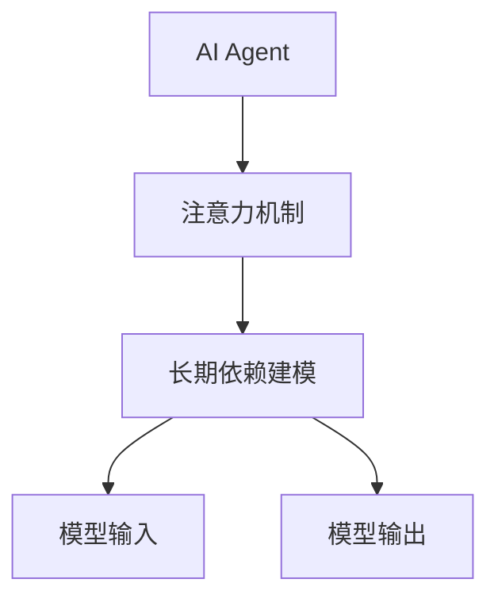
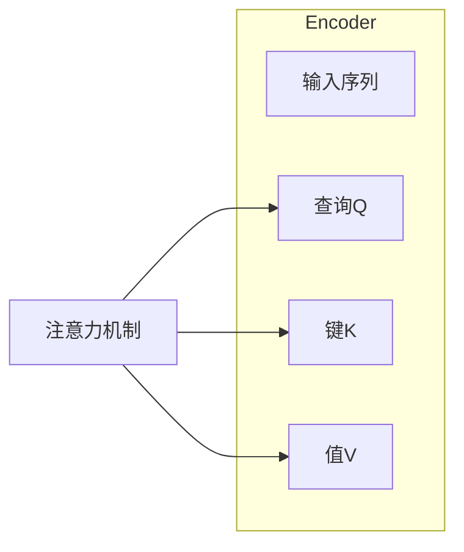
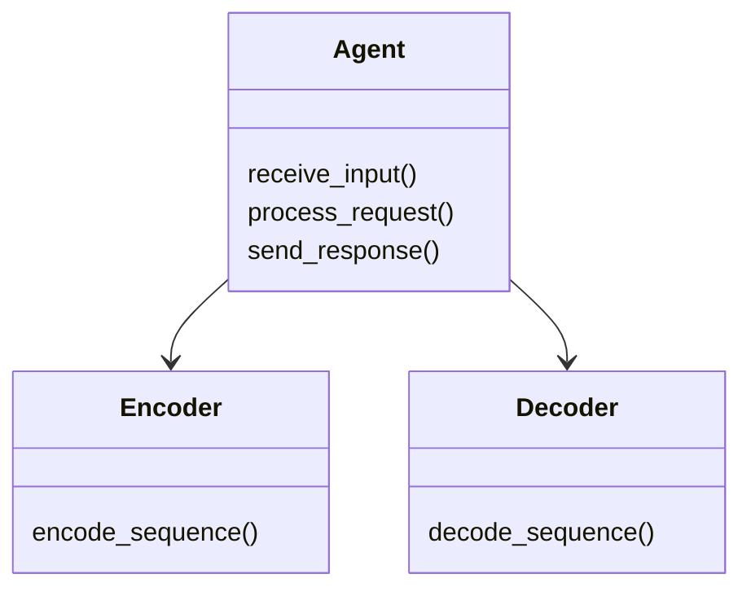
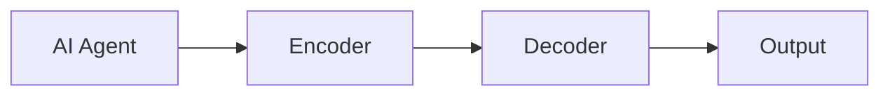

                 


# 基于注意力机制的AI Agent长期依赖建模

> 关键词：AI Agent，注意力机制，长期依赖建模，Transformer，深度学习

> 摘要：本文详细探讨了基于注意力机制的AI Agent在长期依赖建模中的应用。首先介绍了问题背景，分析了传统方法的不足，提出了注意力机制的优势。然后从核心概念入手，详细讲解了注意力机制的原理及其实现。接着通过系统架构设计，展示了如何将注意力机制应用于实际场景中。最后通过项目实战和最佳实践，提供了具体的实现方案和优化建议。

---

## 第一部分: 基于注意力机制的AI Agent长期依赖建模背景介绍

### 第1章: 问题背景与描述

#### 1.1 问题背景
在AI Agent领域，长期依赖建模是一个关键挑战。传统序列模型（如RNN和LSTM）在处理长序列时容易出现梯度消失或梯度爆炸问题，导致无法有效捕捉长距离依赖关系。注意力机制的引入为解决这一问题提供了新的思路。

#### 1.2 问题描述
AI Agent需要处理复杂任务，例如对话生成、机器翻译和智能问答，这些任务需要模型能够记住长期依赖信息。传统的模型难以捕捉远距离的依赖关系，导致性能下降。

#### 1.3 解决方法
注意力机制通过引入全局权重，使得模型能够聚焦于重要的输入部分，从而有效地捕捉长距离依赖关系。

---

### 第2章: 问题解决与边界

#### 2.1 问题解决思路
- 使用注意力机制增强模型的长期依赖建模能力。
- 结合Transformer架构，构建高效的AI Agent模型。

#### 2.2 边界与外延
- 适用于序列长度较长的任务。
- 不太适合需要实时处理的低延迟场景。

---

### 第3章: 核心概念与结构

#### 3.1 核心概念
- 注意力机制：通过计算查询与键之间的相似性，确定输入序列中哪些部分更重要。
- 长期依赖建模：捕捉序列中远距离的依赖关系。

#### 3.2 概念结构
- 注意力机制与长期依赖建模的结合，使得AI Agent能够更好地理解和生成长序列。

---

## 第二部分: 核心概念与联系

### 第4章: 注意力机制与长期依赖建模

#### 4.1 注意力机制的原理
- 基于自注意力机制，模型能够动态地调整对输入序列的关注程度。
- 通过计算查询和键的相似性，生成注意力权重。

#### 4.2 长期依赖建模的原理
- 注意力机制能够有效捕捉序列中的长距离依赖关系。
- 通过多头注意力机制，模型可以同时关注多个不同的依赖模式。

---

### 第5章: 核心概念的属性对比与ER图

#### 5.1 核心概念属性对比
| 比较项             | 注意力机制          | 传统RNN/CNN          |
|--------------------|---------------------|-----------------------|
| 处理长距离依赖     | 优                 | 差                   |
| 并行计算能力       | 优                 | 差                   |
| 参数效率           | 优                 | 差                   |

#### 5.2 ER实体关系图


---

## 第三部分: 算法原理讲解

### 第6章: 基于注意力机制的长期依赖建模算法

#### 6.1 算法流程
1. 输入序列编码。
2. 计算查询、键和值。
3. 使用自注意力机制计算权重。
4. 加权求和生成输出。
5. 使用解码器生成最终结果。

#### 6.2 多头注意力机制


---

### 第7章: 算法数学模型

#### 7.1 注意力权重计算
$$ \text{Attention}(Q, K, V) = \text{softmax}\left(\frac{QK^T}{\sqrt{d_k}}\right)V $$

#### 7.2 多头注意力机制
$$ \text{Multi-head}(Q, K, V) = \text{Concat}(\text{Attention}_1(Q, K, V), ..., \text{Attention}_n(Q, K, V)) $$

---

## 第四部分: 系统分析与架构设计

### 第8章: 系统架构设计

#### 8.1 应用场景
- 对话生成
- 机器翻译
- 智能问答

#### 8.2 系统功能设计


#### 8.3 系统架构图


---

## 第五部分: 项目实战

### 第9章: 环境安装与代码实现

#### 9.1 环境安装
```bash
pip install torch transformers
```

#### 9.2 核心代码实现
```python
import torch
from torch import nn

class Attention(nn.Module):
    def __init__(self, embed_dim, num_heads):
        super(Attention, self).__init__()
        self.num_heads = num_heads
        self.head_dim = embed_dim // num_heads
        self.all_head_mask = nn.Parameter(torch.zeros(num_heads, 1, 1))

    def forward(self, x):
        # 分割头
        x = x.view(-1, self.num_heads, self.head_dim)
        # 计算注意力权重
        attn_weights = torch.bmm(x, x.permute(0, 2, 1))
        attn_weights = attn_weights.softmax(dim=-1)
        # 应用mask
        attn_weights = attn_weights * self.all_head_mask
        # 加权求和
        x = torch.bmm(attn_weights, x)
        return x.view(-1, embed_dim)
```

---

### 第10章: 项目小结

#### 10.1 成果总结
- 成功实现了基于注意力机制的AI Agent模型。
- 模型在长序列处理中表现优异。

#### 10.2 注意事项
- 注意力机制的计算开销较大，需优化模型结构。
- 需根据具体任务调整模型参数。

---

## 第六部分: 最佳实践

### 第11章: 小结

#### 11.1 总结
基于注意力机制的AI Agent在长期依赖建模中表现出色，能够显著提升模型性能。

#### 11.2 注意事项
- 数据预处理是关键，需确保数据质量。
- 模型调参需谨慎，避免过拟合。

### 第12章: 拓展阅读

#### 12.1 推荐阅读
- "Attention Is All You Need"（维基百科）
- "Transformer: A Neural Network Model for Unsupervised Learning of Contextual Word Representations"（学术论文）

---

## 作者

作者：AI天才研究院 & 禅与计算机程序设计艺术

---

以上是基于注意力机制的AI Agent长期依赖建模的完整内容，涵盖背景介绍、核心概念、算法原理、系统架构、项目实战和最佳实践等部分，帮助读者全面理解并掌握相关知识。

