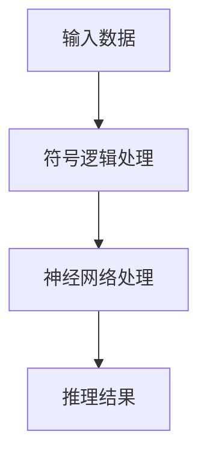
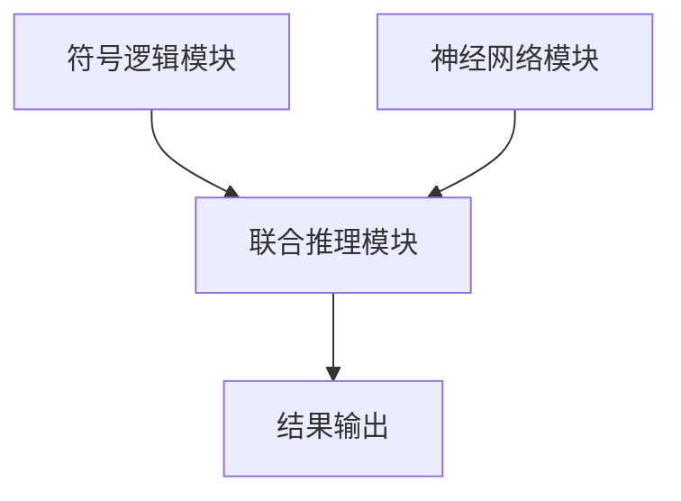

                 


# 基于神经符号AI的AI Agent常识推理增强

> 关键词：神经符号AI, AI Agent, 常识推理, 符号逻辑, 神经网络, 实体关系图, 推理算法

> 摘要：本文将深入探讨神经符号AI在AI Agent常识推理中的应用，通过理论分析和实际案例，揭示神经符号AI如何结合符号逻辑和神经网络的优势，提升AI Agent的推理能力。文章从神经符号AI的背景、核心概念、算法原理、系统架构到项目实战，全面解析其在常识推理中的增强作用。

---

# 第一部分: 神经符号AI与AI Agent概述

## 第1章: 神经符号AI的背景与应用

### 1.1 神经符号AI的定义与背景

#### 1.1.1 传统符号AI的局限性
传统符号AI依赖于预定义的规则和逻辑，虽然在特定领域表现出色，但面对复杂、动态的现实世界时，其灵活性和扩展性受到限制。符号AI难以处理模糊性和不确定性，且难以从数据中自动生成规则。

#### 1.1.2 神经网络AI的崛起
神经网络AI通过大量数据训练，能够自动学习特征和模式，展现出强大的模式识别和处理能力。然而，神经网络AI通常缺乏可解释性，且在需要逻辑推理的任务上表现不佳。

#### 1.1.3 神经符号AI的融合优势
神经符号AI结合了符号逻辑和神经网络的优势，通过符号逻辑提供可解释性和推理能力，同时利用神经网络的强大学习能力，能够处理复杂的数据和场景。这种结合为AI Agent的常识推理提供了新的可能性。

### 1.2 AI Agent的基本概念与分类

#### 1.2.1 AI Agent的定义
AI Agent是一种智能体，能够感知环境、自主决策并执行任务。它可以基于符号逻辑、神经网络或两者的结合来实现推理和决策。

#### 1.2.2 基于符号逻辑的AI Agent
这类AI Agent依赖于预定义的规则和逻辑，适用于规则明确的领域，如专家系统。但其局限性在于难以应对复杂和动态变化的环境。

#### 1.2.3 基于神经网络的AI Agent
这类AI Agent通过神经网络学习数据中的模式和特征，适用于需要处理大量数据和复杂场景的任务，如图像识别和自然语言处理。但其缺乏可解释性和逻辑推理能力。

#### 1.2.4 神经符号AI Agent的独特性
神经符号AI Agent结合了符号逻辑和神经网络的优势，能够进行可解释的推理和复杂场景的处理，适用于需要常识推理的领域，如智能助手和自动驾驶。

### 1.3 神经符号AI在常识推理中的作用

#### 1.3.1 常识推理的定义与挑战
常识推理是指AI Agent能够理解和运用人类的常识进行推理和决策。其挑战在于如何将隐含的知识显式化，并能够动态更新和适应新场景。

#### 1.3.2 神经符号AI在常识推理中的优势
神经符号AI能够将符号逻辑的可解释性和神经网络的学习能力结合起来，通过符号逻辑表示常识，并利用神经网络进行推理和更新。

#### 1.3.3 神经符号AI Agent的实际应用场景
神经符号AI Agent可以在智能助手、自动驾驶、机器人等领域应用，帮助AI Agent更好地理解和处理复杂场景。

### 1.4 本章小结
本章介绍了神经符号AI的背景和优势，以及AI Agent的基本概念和分类，重点阐述了神经符号AI在常识推理中的作用和应用场景。

---

# 第二部分: 神经符号AI的核心概念与原理

## 第2章: 神经符号AI的核心概念

### 2.1 符号逻辑与神经网络的结合

#### 2.1.1 符号逻辑的基本原理
符号逻辑通过符号和规则表示知识，能够进行逻辑推理和验证。其优点是可解释性和规则明确性，但难以处理复杂和动态变化的场景。

#### 2.1.2 神经网络的基本原理
神经网络通过层次化的神经元和权重，学习数据中的模式和特征。其优点是能够处理大量数据和复杂场景，但缺乏可解释性和逻辑推理能力。

#### 2.1.3 神经符号AI的融合方式
神经符号AI通过符号逻辑和神经网络的结合，利用符号逻辑进行知识表示和推理，同时利用神经网络进行数据学习和特征提取。

### 2.2 神经符号AI的属性特征对比

#### 2.2.1 符号逻辑与神经网络的对比表格
| 特性                | 符号逻辑         | 神经网络         |
|---------------------|------------------|------------------|
| 可解释性            | 高               | 低               |
| 逻辑推理能力        | 强               | 弱               |
| 处理复杂场景能力    | 低               | 高               |
| 数据依赖性          | 无               | 有               |

#### 2.2.2 神经符号AI的独特属性
神经符号AI结合了符号逻辑的可解释性和神经网络的学习能力，能够进行逻辑推理和复杂场景处理。

#### 2.2.3 神经符号AI的优缺点分析
- 优点：可解释性高，逻辑推理能力强，能够处理复杂场景。
- 缺点：需要结合符号逻辑和神经网络，实现复杂。

### 2.3 神经符号AI的ER实体关系图

```mermaid
er
actor: AI Agent
goal: 推理目标
knowledge: 常识知识
input: 输入数据
output: 输出结果
rule: 推理规则
```

### 2.4 本章小结
本章详细讲解了神经符号AI的核心概念，包括符号逻辑与神经网络的结合方式，神经符号AI的独特属性，以及通过ER实体关系图展示了其架构。

---

## 3. 神经符号AI的算法原理

### 3.1 神经符号AI的基本算法

#### 3.1.1 神经符号AI的基本流程


#### 3.1.2 神经符号AI的核心算法步骤
1. 将输入数据转换为符号逻辑表示。
2. 使用符号逻辑进行推理和验证。
3. 利用神经网络对推理结果进行优化和调整。
4. 输出最终的推理结果。

#### 3.1.3 神经符号AI的数学模型
符号逻辑表示：
$$
\text{符号逻辑表示} = \{x_1, x_2, ..., x_n\}
$$

神经网络表示：
$$
f(x) = \sigma(Wx + b)
$$
其中，$\sigma$ 是sigmoid函数，$W$ 是权重矩阵，$b$ 是偏置向量。

### 3.2 神经符号AI的推理过程

#### 3.2.1 符号逻辑推理的数学模型
$$
\text{推理结果} = \text{符号逻辑推理}(\text{输入数据})
$$

#### 3.2.2 神经网络推理的数学模型
$$
\text{推理结果} = \text{神经网络推理}(\text{输入数据})
$$

#### 3.2.3 神经符号AI的联合推理过程
$$
\text{最终结果} = \text{符号逻辑推理}(\text{输入数据}) \land \text{神经网络推理}(\text{输入数据})
$$

### 3.3 神经符号AI的算法实现

#### 3.3.1 算法实现的代码框架
```python
def neural-symbolic_inference(input_data):
    # 符号逻辑处理
    symbolic_rules = apply_rules(input_data)
    # 神经网络处理
    neural_output = neural_network(symbolic_rules)
    # 联合推理
    final_result = combine(symbolic_rules, neural_output)
    return final_result
```

#### 3.3.2 算法实现的详细步骤
1. 对输入数据进行符号逻辑处理，生成符号表示。
2. 将符号表示输入神经网络，进行特征提取和模式识别。
3. 综合符号逻辑和神经网络的推理结果，输出最终结果。

#### 3.3.3 算法实现的数学公式
符号逻辑推理：
$$
\text{符号逻辑推理} = \sum_{i=1}^{n} w_i x_i
$$

神经网络推理：
$$
f(x) = \sigma(Wx + b)
$$

联合推理：
$$
\text{最终结果} = \text{符号逻辑推理} \land \text{神经网络推理}
$$

### 3.4 神经符号AI的推理案例

#### 3.4.1 案例背景介绍
假设有一个AI Agent需要根据常识推理判断一个人是否可以开车，需要考虑年龄、是否有驾照、是否饮酒等条件。

#### 3.4.2 案例推理过程
1. 符号逻辑推理：判断年龄是否大于18岁，是否有驾照。
2. 神经网络推理：判断是否饮酒，是否处于醉酒状态。
3. 联合推理：综合符号逻辑和神经网络的推理结果，得出最终结论。

#### 3.4.3 案例结果分析
如果符号逻辑推理判断年龄大于18岁且有驾照，神经网络推理判断未饮酒，则最终结论是可以开车。

### 3.5 本章小结
本章详细讲解了神经符号AI的算法原理，包括基本算法、推理过程和具体的实现案例。

---

## 4. 神经符号AI的系统架构与设计

### 4.1 神经符号AI系统的总体架构

#### 4.1.1 系统架构的定义
神经符号AI系统由符号逻辑模块、神经网络模块和联合推理模块组成。

#### 4.1.2 神经符号AI系统的组成部分
- 符号逻辑模块：负责符号逻辑的表示和推理。
- 神经网络模块：负责数据的学习和特征提取。
- 联合推理模块：负责综合符号逻辑和神经网络的推理结果。

#### 4.1.3 系统架构的优缺点分析
- 优点：能够结合符号逻辑和神经网络的优势，提升推理能力。
- 缺点：实现复杂，需要结合多种技术。

### 4.2 神经符号AI系统的功能设计

#### 4.2.1 系统功能模块划分
- 符号逻辑模块：符号表示、规则推理。
- 神经网络模块：特征提取、模式识别。
- 联合推理模块：综合推理、结果输出。

#### 4.2.2 功能模块之间的关系


### 4.3 神经符号AI系统的架构设计

#### 4.3.1 系统架构的定义
神经符号AI系统架构包括符号逻辑模块、神经网络模块和联合推理模块。

#### 4.3.2 系统架构的优缺点分析
- 优点：能够结合符号逻辑和神经网络的优势，提升推理能力。
- 缺点：实现复杂，需要结合多种技术。

### 4.4 本章小结
本章详细讲解了神经符号AI系统的总体架构和功能设计，展示了各模块之间的关系和作用。

---

## 5. 神经符号AI的项目实战

### 5.1 项目环境安装

#### 5.1.1 安装Python和必要的库
```bash
pip install numpy
pip install tensorflow
pip install matplotlib
```

### 5.2 项目核心实现

#### 5.2.1 符号逻辑模块的实现
```python
def apply_rules(input_data):
    # 符号逻辑处理
    return symbolic_rules
```

#### 5.2.2 神经网络模块的实现
```python
def neural_network(symbolic_rules):
    # 神经网络处理
    return neural_output
```

#### 5.2.3 联合推理模块的实现
```python
def combine(symbolic_rules, neural_output):
    # 联合推理
    return final_result
```

### 5.3 项目案例分析

#### 5.3.1 案例背景介绍
假设有一个AI Agent需要根据常识推理判断一个人是否可以开车，需要考虑年龄、是否有驾照、是否饮酒等条件。

#### 5.3.2 案例推理过程
1. 符号逻辑推理：判断年龄是否大于18岁，是否有驾照。
2. 神经网络推理：判断是否饮酒，是否处于醉酒状态。
3. 联合推理：综合符号逻辑和神经网络的推理结果，得出最终结论。

#### 5.3.3 案例结果分析
如果符号逻辑推理判断年龄大于18岁且有驾照，神经网络推理判断未饮酒，则最终结论是可以开车。

### 5.4 项目小结
本章通过一个具体的案例，展示了神经符号AI在常识推理中的实际应用，详细讲解了项目的实现过程和结果分析。

---

## 6. 总结与最佳实践

### 6.1 本章总结
神经符号AI结合了符号逻辑和神经网络的优势，能够进行可解释的推理和复杂场景的处理。本文从背景、核心概念、算法原理、系统架构到项目实战，全面解析了神经符号AI在常识推理中的增强作用。

### 6.2 最佳实践 tips
1. 在实际应用中，神经符号AI需要结合具体的场景和需求进行设计。
2. 神经符号AI的实现需要结合符号逻辑和神经网络的知识，建议团队成员具备相关背景。
3. 神经符号AI的推理结果需要进行验证和优化，以提升准确性和可靠性。

### 6.3 注意事项
1. 神经符号AI的实现复杂，需要结合多种技术。
2. 在实际应用中，需要注意符号逻辑和神经网络的结合方式，避免出现冲突或不一致。

### 6.4 拓展阅读
建议读者进一步阅读神经符号AI相关的论文和文献，深入了解其理论和应用。

---

# 作者：AI天才研究院/AI Genius Institute & 禅与计算机程序设计艺术 /Zen And The Art of Computer Programming

