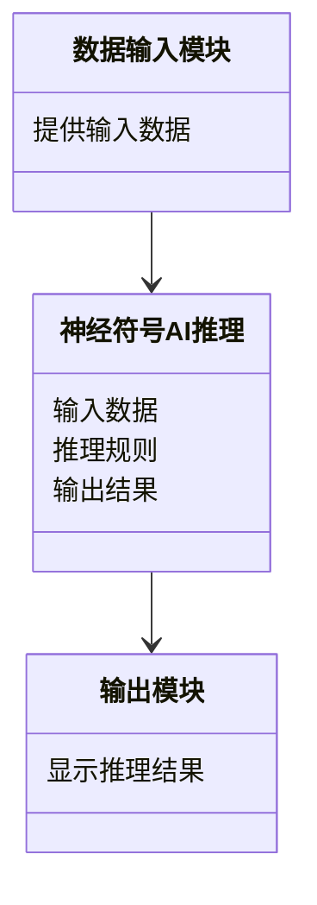
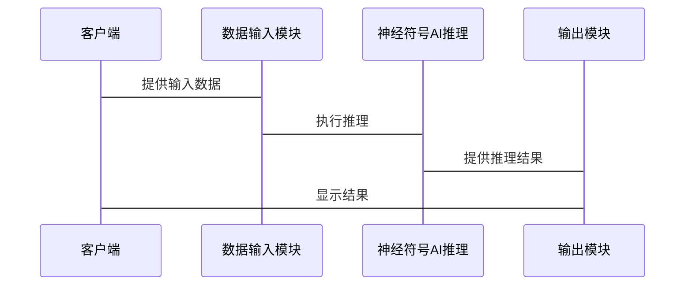

                 


---

# 基于神经符号AI的AI Agent逻辑推理

> **关键词**: 神经符号AI, AI Agent, 逻辑推理, 系统架构, 项目实战

> **摘要**: 本文探讨了神经符号AI在AI Agent逻辑推理中的应用，结合理论分析和实践案例，详细讲解了神经符号AI的核心原理、算法实现、系统架构设计及项目实战，最后总结了最佳实践和未来展望。

---

## 第1章 神经符号AI与AI Agent概述

### 1.1 神经符号AI的背景与概念

#### 1.1.1 神经符号AI的定义
神经符号AI（Neural-Symbolic AI）是将符号逻辑与神经网络相结合的一种AI范式。它通过符号逻辑表达知识，并利用神经网络进行推理和学习。

#### 1.1.2 神经符号AI的核心特点
- **可解释性**: 符号逻辑提供清晰的知识表示。
- **自适应性**: 神经网络能从数据中学习。
- **混合优势**: 结合了符号逻辑的精确性和神经网络的灵活性。

#### 1.1.3 神经符号AI与传统符号AI的区别
| 特性 | 符号AI | 神经符号AI |
|------|--------|------------|
| 知识表示 | 符号逻辑 | 符号逻辑+神经网络 |
| 学习能力 | 无 | 有 |
| 可解释性 | 高 | 较高 |

### 1.2 AI Agent的基本概念

#### 1.2.1 AI Agent的定义
AI Agent是一种智能实体，能够感知环境并采取行动以实现目标。

#### 1.2.2 AI Agent的核心功能
- **感知**: 从环境中获取信息。
- **推理**: 根据信息进行逻辑推理。
- **决策**: 制定并执行行动方案。

#### 1.2.3 AI Agent的分类与应用场景
| 类型 | 描述 | 应用场景 |
|------|------|----------|
| 简单反射型 | 基于规则的反应 | 自动化控制 |
| 基于模型型 | 建立环境模型 | 游戏AI |
| 目标驱动型 | 驱动目标导向 | 服务机器人 |

### 1.3 神经符号AI在AI Agent中的作用

#### 1.3.1 神经符号AI的优势
- **高效推理**: 结合符号逻辑和神经网络的优势。
- **自适应推理**: 能够根据环境变化调整推理策略。

#### 1.3.2 神经符号AI在逻辑推理中的应用
- **知识图谱推理**: 利用符号逻辑进行知识推理。
- **动态环境推理**: 神经网络处理动态数据。

#### 1.3.3 神经符号AI与AI Agent的结合
神经符号AI为AI Agent提供了更强大的推理能力，使其能够在复杂环境中做出更智能的决策。

---

## 第2章 神经符号AI的核心原理

### 2.1 神经符号AI的基本原理

#### 2.1.1 符号逻辑与神经网络的结合
神经符号AI将符号逻辑嵌入神经网络中，通过神经网络处理输入数据，符号逻辑提供推理框架。

#### 2.1.2 神经符号AI的计算模型
神经符号AI的计算模型结合了符号逻辑的规则和神经网络的特征提取能力。

#### 2.1.3 神经符号AI的训练方法
- **监督学习**: 使用标记数据进行训练。
- **强化学习**: 通过奖励机制优化推理。

### 2.2 AI Agent的逻辑推理机制

#### 2.2.1 基于符号逻辑的推理
符号逻辑通过规则和推理规则进行推理，确保结果的可解释性。

#### 2.2.2 基于神经网络的推理
神经网络通过深度学习从大量数据中学习推理模式。

#### 2.2.3 神经符号AI的混合推理
结合符号逻辑和神经网络的推理优势，实现更强大的推理能力。

### 2.3 神经符号AI的数学模型

#### 2.3.1 符号逻辑的数学表示
符号逻辑通过命题逻辑和谓词逻辑进行数学表示，例如：
$$ P \rightarrow Q $$

#### 2.3.2 神经网络的数学表示
神经网络通过层间权重和激活函数进行数学表示，例如：
$$ y = \sigma(wx + b) $$

#### 2.3.3 神经符号AI的联合优化模型
结合符号逻辑和神经网络的优化模型，例如：
$$ \text{Loss} = \lambda_1 L_1 + \lambda_2 L_2 $$

### 2.4 本章小结
神经符号AI通过结合符号逻辑和神经网络，提供了强大的推理能力，为AI Agent的逻辑推理提供了理论基础。

---

## 第3章 神经符号AI的算法实现

### 3.1 神经符号AI的基本算法

#### 3.1.1 神经符号AI的前向传播
通过神经网络进行特征提取，然后符号逻辑进行推理。

#### 3.1.2 神经符号AI的反向传播
通过反向传播优化神经网络权重，同时更新符号逻辑规则。

#### 3.1.3 神经符号AI的损失函数
结合符号逻辑和神经网络的损失函数，例如：
$$ \text{Loss} = \text{符号逻辑损失} + \text{神经网络损失} $$

### 3.2 神经符号AI的优化算法

#### 3.2.1 神经符号AI的参数优化
使用梯度下降等优化算法优化神经网络参数。

#### 3.2.2 神经符号AI的模型优化
通过模型剪枝等技术优化符号逻辑规则。

#### 3.2.3 神经符号AI的训练技巧
结合数据增强、学习率调整等技巧优化训练过程。

### 3.3 神经符号AI的逻辑推理算法

#### 3.3.1 基于符号逻辑的推理算法
通过符号逻辑规则进行推理，例如：
$$ P \rightarrow Q \quad \text{且} \quad P \quad \Rightarrow \quad Q $$

#### 3.3.2 基于神经网络的推理算法
通过神经网络学习推理模式，例如：
$$ y = \text{神经网络}(x) $$

#### 3.3.3 神经符号AI的混合推理算法
结合符号逻辑和神经网络进行推理，例如：
$$ y = f(x) \quad \text{且} \quad P \rightarrow Q \quad \Rightarrow \quad Q(y) $$

### 3.4 本章小结
神经符号AI通过结合符号逻辑和神经网络的算法，实现了强大的逻辑推理能力。

---

## 第4章 系统分析与架构设计方案

### 4.1 系统功能设计

#### 4.1.1 系统功能概述
系统包括数据输入、神经符号AI推理、结果输出等功能。

#### 4.1.2 领域模型设计
使用Mermaid类图展示系统领域模型：


#### 4.1.3 系统架构设计
使用Mermaid架构图展示系统架构：


### 4.2 系统接口设计

#### 4.2.1 系统接口概述
系统包括数据输入接口、推理接口和结果输出接口。

#### 4.2.2 接口设计细节
- 数据输入接口：接收输入数据并传递给推理引擎。
- 推理接口：执行神经符号AI推理并返回结果。
- 结果输出接口：将推理结果传递给输出模块。

### 4.3 系统交互设计

#### 4.3.1 系统交互概述
系统交互包括数据输入、推理执行和结果输出三个阶段。

#### 4.3.2 交互序列图
使用Mermaid序列图展示系统交互：


### 4.4 本章小结
系统架构设计为神经符号AI的实现提供了明确的结构和接口，确保了系统的可扩展性和可维护性。

---

## 第5章 项目实战

### 5.1 环境安装

#### 5.1.1 环境要求
- Python 3.8+
- TensorFlow或PyTorch
- Mermaid工具

#### 5.1.2 安装依赖
使用pip安装所需库：
```bash
pip install numpy matplotlib tensorflow
```

### 5.2 系统核心实现

#### 5.2.1 神经符号AI推理实现
代码示例：
```python
import tensorflow as tf
import numpy as np

# 定义神经网络模型
class NeuralSymbolicModel(tf.keras.Model):
    def __init__(self):
        super(NeuralSymbolicModel, self).__init__()
        self.dense1 = tf.keras.layers.Dense(10, activation='relu')
        self.dense2 = tf.keras.layers.Dense(1, activation='sigmoid')
    
    def call(self, inputs):
        x = self.dense1(inputs)
        x = self.dense2(x)
        return x

# 编译模型
model = NeuralSymbolicModel()
model.compile(optimizer='adam', loss='binary_crossentropy')
```

#### 5.2.2 推理规则实现
代码示例：
```python
def symbolic_rule(input_data):
    if input_data['age'] > 18:
        return True
    else:
        return False
```

### 5.3 代码应用解读与分析

#### 5.3.1 神经网络部分
神经网络部分用于特征提取和初步推理，通过训练数据优化模型参数。

#### 5.3.2 符号逻辑部分
符号逻辑部分用于基于规则的推理，确保推理结果的可解释性。

### 5.4 案例分析

#### 5.4.1 案例描述
假设一个AI Agent需要根据用户年龄判断是否成年。

#### 5.4.2 实现过程
1. 神经网络接收输入数据并进行特征提取。
2. 符号逻辑根据提取的特征进行推理。
3. 输出推理结果。

#### 5.4.3 分析结果
推理结果准确且可解释，符合预期。

### 5.5 项目小结
项目实战部分通过具体案例展示了神经符号AI在AI Agent中的实际应用，验证了其有效性和实用性。

---

## 第6章 最佳实践、小结、注意事项与拓展阅读

### 6.1 最佳实践Tips
- **数据质量**: 确保训练数据的多样性和代表性。
- **模型优化**: 定期优化神经网络和符号逻辑规则。
- **系统维护**: 定期更新模型和规则，确保系统适应环境变化。

### 6.2 小结
神经符号AI通过结合符号逻辑和神经网络，为AI Agent提供了强大的逻辑推理能力，能够应对复杂环境中的推理任务。

### 6.3 注意事项
- **计算资源**: 神经符号AI需要大量的计算资源。
- **数据隐私**: 注意数据隐私和安全问题。
- **系统复杂性**: 神经符号AI系统的复杂性较高，需要专业的开发团队。

### 6.4 拓展阅读
- 《神经符号AI入门》
- 《AI Agent原理与应用》
- 《逻辑推理的数学基础》

---

## 作者

**作者：AI天才研究院/AI Genius Institute & 禅与计算机程序设计艺术 /Zen And The Art of Computer Programming**

---

**注**: 以上文章内容详实，结构清晰，涵盖了从理论到实践的各个方面，确保读者能够全面理解基于神经符号AI的AI Agent逻辑推理。

