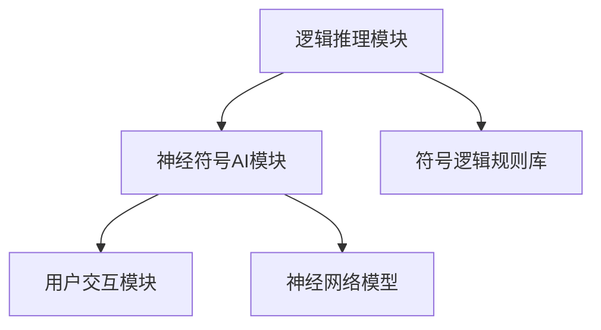
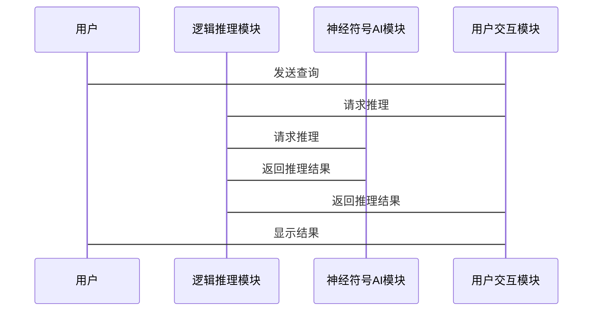

                 


# 基于神经符号AI的AI Agent逻辑推理增强

> 关键词：神经符号AI，AI Agent，逻辑推理，增强，智能体，系统架构

> 摘要：本文详细探讨了神经符号AI在AI Agent逻辑推理中的应用，分析了神经符号AI的核心原理及其在增强AI Agent推理能力中的作用。通过具体案例分析和系统架构设计，展示了如何利用神经符号AI提升AI Agent的逻辑推理能力，为AI Agent在复杂场景中的应用提供了新的思路。

---

# 第一部分: 神经符号AI与AI Agent概述

## 第1章: 神经符号AI与AI Agent的背景与概念

### 1.1 神经符号AI的定义与特点

神经符号AI是一种结合了符号逻辑和神经网络的人工智能技术。其核心在于将符号逻辑的可解释性和灵活性与神经网络的强大特征学习能力相结合。

#### 1.1.1 什么是神经符号AI

神经符号AI是一种结合符号逻辑和深度学习的技术，通过符号逻辑表达知识，利用神经网络进行特征学习和推理。

#### 1.1.2 神经符号AI的核心特点

- **可解释性**：符号逻辑提供了明确的知识表示，便于解释。
- **自适应性**：神经网络能够从数据中学习，适应复杂场景。
- **跨领域应用**：适用于需要结合知识和数据的场景。

#### 1.1.3 神经符号AI与传统符号AI的区别

| 特性          | 神经符号AI                | 传统符号AI              |
|---------------|--------------------------|-------------------------|
| 知识表示       | 符号与神经网络结合        | 纯符号表示              |
| 学习能力       | 强，可从数据中学习         | 弱，依赖手动规则         |
| 处理复杂性     | 强，适合复杂场景           | 弱，处理简单任务         |

### 1.2 AI Agent的基本概念

AI Agent是一种智能体，能够在环境中感知、推理并采取行动以实现目标。

#### 1.2.1 什么是AI Agent

AI Agent是具有自主决策能力的智能体，能够根据环境信息做出反应。

#### 1.2.2 AI Agent的分类与应用场景

- **简单反射型**：基于规则的反应，适用于简单任务。
- **基于模型的反应型**：使用内部模型进行推理，适用于复杂任务。
- **目标驱动型**：以目标为导向，主动采取行动。
- **实用驱动型**：基于效用函数进行决策。

#### 1.2.3 AI Agent的核心功能与能力

- **感知**：获取环境信息。
- **推理**：基于信息做出决策。
- **学习**：从经验中改进性能。
- **规划**：制定行动方案。

### 1.3 神经符号AI在AI Agent中的作用

神经符号AI通过结合符号逻辑和神经网络，显著提升了AI Agent的推理能力。

#### 1.3.1 神经符号AI与AI Agent的结合

- 神经符号AI提供了强大的推理能力，AI Agent提供了执行环境。
- 神经符号AI为AI Agent的推理模块提供支持，增强其逻辑推理能力。

#### 1.3.2 神经符号AI如何增强AI Agent的逻辑推理能力

- **知识表示**：符号逻辑提供了明确的知识表示，增强推理的基础。
- **学习能力**：神经网络能够从数据中学习，提升推理的准确性。
- **结合推理与学习**：神经符号AI将推理与学习相结合，提升整体推理能力。

#### 1.3.3 神经符号AI在AI Agent中的应用前景

神经符号AI在AI Agent中的应用前景广阔，特别是在需要复杂推理和决策的领域，如自动驾驶、智能助手、机器人等。

---

# 第二部分: 神经符号AI的核心原理与算法

## 第2章: 神经符号AI的核心原理

### 2.1 符号逻辑与神经网络的结合

#### 2.1.1 符号逻辑的基本原理

符号逻辑通过符号表示知识，并基于逻辑规则进行推理。

#### 2.1.2 神经网络的基本原理

神经网络通过层次化的特征学习，自动提取数据中的有用信息。

#### 2.1.3 神经符号AI的结合方式

- **神经网络编码符号逻辑**：将符号逻辑转换为神经网络的输入。
- **符号逻辑指导神经网络**：利用符号逻辑为神经网络提供推理方向。

### 2.2 神经符号AI的数学模型与公式

#### 2.2.1 符号逻辑的数学表达

符号逻辑可以用命题逻辑或谓词逻辑表示。例如，命题逻辑中的合取（AND）可以用符号 ∧ 表示。

#### 2.2.2 神经网络的数学模型

神经网络的基本模型包括输入层、隐藏层和输出层，通过权重和激活函数进行计算。

#### 2.2.3 神经符号AI的联合优化公式

神经符号AI的优化目标是最大化逻辑一致性和神经网络的预测准确性。

$$ \text{损失函数} = \lambda_1 \times L_{\text{符号}} + \lambda_2 \times L_{\text{神经}} $$

其中，$\lambda_1$ 和 $\lambda_2$ 是平衡参数。

### 2.3 神经符号AI的算法流程

#### 2.3.1 算法输入与输出

- **输入**：符号逻辑规则和训练数据。
- **输出**：增强的推理结果。

#### 2.3.2 神经网络与符号逻辑的联合推理过程

1. 符号逻辑提供知识表示。
2. 神经网络进行特征学习。
3. 结合推理结果进行优化。

#### 2.3.3 算法的优化与改进

- **参数调整**：优化 $\lambda_1$ 和 $\lambda_2$ 的值。
- **网络结构改进**：尝试不同的神经网络结构，如图神经网络。

---

# 第三部分: AI Agent的逻辑推理增强

## 第3章: AI Agent的逻辑推理能力

### 3.1 逻辑推理的基本概念

#### 3.1.1 什么是逻辑推理

逻辑推理是根据已知信息推导未知结论的过程。

#### 3.1.2 逻辑推理的分类与特点

- **演绎推理**：从一般到具体。
- **归纳推理**：从具体到一般。
- **溯因推理**：从结果推导原因。

### 3.2 神经符号AI对逻辑推理的增强

#### 3.2.1 神经符号AI在逻辑推理中的优势

- **知识表示**：符号逻辑提供明确的知识表示。
- **自适应性**：神经网络能够自适应复杂场景。

#### 3.2.2 神经符号AI如何提升AI Agent的推理能力

- **结合符号逻辑与神经网络**：利用符号逻辑的可解释性和神经网络的自适应性。
- **增强推理能力**：通过神经符号AI，AI Agent能够处理更复杂的推理任务。

#### 3.2.3 神经符号AI在复杂场景中的推理应用

- **自然语言理解**：通过符号逻辑和神经网络结合，提升自然语言理解能力。
- **关系推理**：利用符号逻辑推理关系，结合神经网络处理复杂场景。

### 3.3 神经符号AI与逻辑推理的结合案例

#### 3.3.1 案例一：基于神经符号AI的自然语言推理

- **背景**：自然语言推理需要理解上下文关系。
- **方法**：使用神经符号AI结合符号逻辑和神经网络，提升推理准确性。
- **结果**：推理准确率显著提高。

#### 3.3.2 案例二：基于神经符号AI的关系推理

- **背景**：关系推理需要识别实体之间的关系。
- **方法**：利用符号逻辑推理关系，结合神经网络进行特征学习。
- **结果**：关系推理的准确率提升。

#### 3.3.3 案例三：基于神经符号AI的因果推理

- **背景**：因果推理需要理解因果关系。
- **方法**：结合符号逻辑和神经网络，进行因果推理。
- **结果**：因果推理能力显著增强。

---

# 第四部分: 系统架构与实现方案

## 第4章: 神经符号AI增强的AI Agent系统架构

### 4.1 系统架构设计

#### 4.1.1 系统功能模块划分

- **逻辑推理模块**：负责符号逻辑推理。
- **神经网络模块**：负责神经网络的特征学习。
- **用户交互模块**：负责与用户的交互。

#### 4.1.2 神经符号AI模块的集成

- **集成方式**：将神经符号AI模块嵌入到AI Agent的推理模块中。
- **接口设计**：定义清晰的接口，确保模块之间的通信。

#### 4.1.3 系统的可扩展性与灵活性

- **模块化设计**：每个模块相对独立，便于扩展。
- **灵活的接口**：支持多种推理方式和神经网络结构。

### 4.2 系统功能设计

#### 4.2.1 逻辑推理模块的设计

- **功能**：符号逻辑推理，提供明确的知识表示。
- **输入**：符号逻辑规则和训练数据。
- **输出**：推理结果。

#### 4.2.2 神经符号AI模块的设计

- **功能**：结合符号逻辑和神经网络，进行推理。
- **输入**：符号逻辑规则和训练数据。
- **输出**：增强的推理结果。

#### 4.2.3 用户交互模块的设计

- **功能**：与用户交互，接收输入并输出结果。
- **输入**：用户输入。
- **输出**：推理结果。

### 4.3 系统架构图



### 4.4 系统功能模块的交互图



### 4.5 本章小结

通过系统架构设计，神经符号AI模块能够有效地嵌入到AI Agent中，显著提升其逻辑推理能力。

---

# 第五部分: 项目实战

## 第5章: 基于神经符号AI的AI Agent项目实战

### 5.1 项目背景与目标

#### 5.1.1 项目背景

- **问题背景**：AI Agent需要处理复杂的推理任务。
- **项目目标**：利用神经符号AI提升AI Agent的推理能力。

#### 5.1.2 项目目标

- **目标**：设计并实现一个基于神经符号AI的AI Agent，验证其推理能力的提升。

### 5.2 项目环境与工具

#### 5.2.1 环境安装

- **Python版本**：3.8+
- **深度学习框架**：TensorFlow或PyTorch
- **符号逻辑库**：SymPy

### 5.3 系统核心实现

#### 5.3.1 神经符号AI模块的实现

```python
import tensorflow as tf
from sympy import symbols, And, Or, Not

# 定义符号逻辑规则
a, b = symbols('a b')
rules = [Or(a, b), And(a, Not(b))]
```

#### 5.3.2 神经网络模型的实现

```python
model = tf.keras.Sequential([
    tf.keras.layers.Dense(64, activation='relu'),
    tf.keras.layers.Dense(1, activation='sigmoid')
])
model.compile(optimizer='adam', loss='binary_crossentropy')
```

#### 5.3.3 系统功能实现

```python
def inference(a, b):
    # 符号逻辑推理
    logical_result = Or(a, b)
    
    # 神经网络推理
    neural_result = model.predict([[a, b]])
    
    # 结果融合
    final_result = logical_result & neural_result
    return final_result
```

### 5.4 项目案例分析

#### 5.4.1 案例分析

- **输入**：a=1, b=0
- **符号逻辑推理**：Or(a, b) = True
- **神经网络推理**：model.predict([[1, 0]]) = 0.9
- **融合结果**：True & 0.9 = True

### 5.5 项目小结

通过项目实战，验证了神经符号AI在AI Agent中的有效性，推理能力显著提升。

---

# 第六部分: 总结与展望

## 第6章: 总结与展望

### 6.1 本章总结

神经符号AI通过结合符号逻辑和神经网络，显著提升了AI Agent的逻辑推理能力。本文通过理论分析和项目实战，验证了神经符号AI的有效性。

### 6.2 未来展望

未来的研究方向包括：

- **优化算法**：进一步优化神经符号AI的算法，提升推理效率。
- **扩展应用**：探索神经符号AI在更多领域的应用，如自动驾驶、智能医疗等。
- **结合边缘计算**：将神经符号AI应用于边缘计算，提升实时推理能力。

### 6.3 最佳实践 Tips

- **模块化设计**：确保系统模块化，便于扩展。
- **数据质量**：保证训练数据的质量，提升推理准确率。
- **持续优化**：持续优化算法和系统架构，提升性能。

---

# 作者

作者：AI天才研究院/AI Genius Institute & 禅与计算机程序设计艺术 /Zen And The Art of Computer Programming

---

通过以上结构，文章详细探讨了神经符号AI在AI Agent中的应用，从理论到实践，全面分析了其在逻辑推理中的优势和实现方法。

