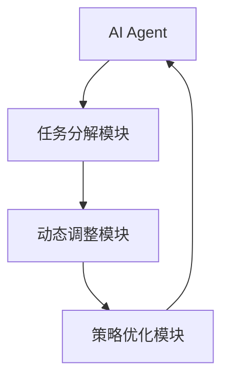

                 


# 基于课程强化学习的AI Agent能力进阶

> 关键词：课程强化学习（CRL）、AI Agent、强化学习、任务分解、动态调整

> 摘要：本文深入探讨了基于课程强化学习（Curriculum Reinforcement Learning, CRL）的AI Agent能力提升方法。通过系统地分解复杂任务、逐步增加难度，并结合动态调整机制，CRL能够有效提升AI Agent的学习效率和任务执行能力。本文从理论基础、算法原理、系统设计到实际应用，全面解析了CRL在AI Agent能力进阶中的应用，为读者提供了从基础到高级的完整知识体系。

---

## 第一部分: 课程强化学习与AI Agent基础

### 第1章: 课程强化学习与AI Agent概述

#### 1.1 课程强化学习的背景与意义

##### 1.1.1 强化学习的基本概念
强化学习（Reinforcement Learning, RL）是一种通过智能体与环境交互来学习策略的方法。智能体通过试错（trial-and-error）方式，逐步掌握如何在环境中做出最优决策。RL的核心要素包括状态（State）、动作（Action）、奖励（Reward）和策略（Policy）。智能体通过与环境的交互，积累经验，优化策略，以最大化累计奖励。

##### 1.1.2 课程强化学习的核心思想
课程强化学习（CRL）是一种结合了课程学习（Curriculum Learning）和强化学习的混合方法。课程学习的核心思想是将复杂任务分解为一系列递增难度的子任务，逐步引导学习者掌握任务。结合强化学习的试错机制，CRL通过动态调整任务难度，帮助AI Agent逐步提升能力。

##### 1.1.3 AI Agent能力进阶的必要性
传统的强化学习方法在处理复杂任务时存在效率低下、学习时间过长等问题。通过引入课程学习的策略，CRL能够显著提升AI Agent的学习效率，特别是在处理复杂和多阶段任务时表现出色。

#### 1.2 AI Agent的基本概念与分类

##### 1.2.1 AI Agent的定义
AI Agent（人工智能代理）是指能够感知环境、做出决策并执行动作的智能实体。AI Agent可以是软件程序、机器人或其他智能系统，其核心目标是通过与环境交互，完成特定任务。

##### 1.2.2 基于强化学习的AI Agent特点
- **自主性**：AI Agent能够在没有外部干预的情况下自主决策。
- **反应性**：能够实时感知环境并做出反应。
- **学习能力**：通过与环境交互，不断优化策略，提升任务执行能力。

##### 1.2.3 AI Agent的分类与应用场景
AI Agent可以根据智能水平、任务类型和应用场景进行分类。常见的分类包括：
- **反应式AI Agent**：基于当前感知做出反应，适用于实时任务。
- **认知式AI Agent**：具备复杂推理和规划能力，适用于复杂任务。
- **学习型AI Agent**：能够通过学习优化策略，适用于需要适应性调整的任务。

#### 1.3 课程强化学习的理论基础

##### 1.3.1 强化学习的基本原理
强化学习的核心是通过试错机制，优化策略以最大化累计奖励。智能体通过与环境交互，获得状态、动作和奖励信息，逐步学习最优策略。

##### 1.3.2 课程学习的基本原理
课程学习的核心思想是将复杂任务分解为一系列递增难度的子任务。学习者通过逐步完成这些子任务，逐步掌握复杂任务。课程设计的关键在于任务难度的合理安排。

##### 1.3.3 课程强化学习的核心假设
课程强化学习假设，通过逐步增加任务难度，可以显著提升学习效率和最终任务完成能力。CRL结合了强化学习的试错机制和课程学习的任务分解策略，能够有效提升AI Agent的学习效率。

#### 1.4 课程强化学习与传统强化学习的对比

##### 1.4.1 传统强化学习的优缺点
- **优点**：能够通过试错机制找到最优策略。
- **缺点**：学习效率较低，特别是在处理复杂任务时，需要大量时间进行探索。

##### 1.4.2 课程强化学习的独特优势
- **提升学习效率**：通过任务分解和难度逐步增加，减少探索空间。
- **增强稳定性**：逐步增加难度有助于避免直接面对高难度任务时的不稳定表现。

##### 1.4.3 课程强化学习的适用场景
课程强化学习适用于需要处理复杂、多阶段任务的场景，例如机器人控制、游戏AI、智能客服等领域。

---

## 第二部分: 课程强化学习的核心概念

### 第2章: 课程强化学习的核心要素

#### 2.1 课程策略的设计与实现

##### 2.1.1 课程策略的定义
课程策略是指在CRL中，设计一系列递增难度的任务序列，引导AI Agent逐步掌握复杂任务。

##### 2.1.2 任务分解的方法
任务分解是课程策略设计的关键步骤。常见的任务分解方法包括：
- **层次分解**：将复杂任务分解为多个子任务，形成任务树。
- **技能分解**：将任务分解为一系列需要逐步掌握的技能。

##### 2.1.3 任务难度曲线的设计
任务难度曲线是课程策略的核心，决定了任务难度的递增方式。常见的难度曲线设计方法包括线性递增、指数递增和自适应递增等。

#### 2.2 动态调整机制

##### 2.2.1 动态调整的必要性
动态调整机制能够根据AI Agent的当前表现，实时调整任务难度，确保学习过程的高效性和稳定性。

##### 2.2.2 动态调整的实现方法
动态调整机制可以通过以下方法实现：
- **基于表现的调整**：根据AI Agent的当前表现，动态调整任务难度。
- **基于时间的调整**：根据学习时间或任务数量，按一定规律调整任务难度。

#### 2.3 课程强化学习的评估方法

##### 2.3.1 评估指标的选择
评估CRL的效果需要选择合适的指标，例如学习速度、任务完成率和策略稳定性等。

##### 2.3.2 评估方法的设计
评估方法需要结合任务分解和动态调整机制，确保评估结果能够准确反映CRL的效果。

---

## 第三部分: 课程强化学习的算法原理

### 第3章: 课程强化学习算法详解

#### 3.1 基于课程强化学习的算法框架

##### 3.1.1 算法框架的设计
课程强化学习算法框架通常包括任务分解、策略优化和动态调整三个核心模块。

##### 3.1.2 算法框架的特点
- **模块化设计**：便于理解和实现。
- **可扩展性**：支持不同任务和环境的适应。

#### 3.2 课程强化学习的具体算法实现

##### 3.2.1 算法实现步骤
1. **任务分解**：将复杂任务分解为递增难度的子任务。
2. **策略初始化**：为每个子任务设计初始策略。
3. **动态调整**：根据AI Agent的表现，实时调整任务难度。
4. **策略优化**：通过强化学习算法优化策略。

##### 3.2.2 算法实现的代码示例
```python
def curriculum_reinforcement_learning(tasks):
    for task in sorted(tasks, key=lambda x: x.difficulty):
        # 初始化策略
        policy = initialize_policy(task)
        # 动态调整难度
        adjust_difficulty(policy, task)
        # 优化策略
        optimize_policy(policy, task)
    return optimized_policy
```

#### 3.3 算法原理的数学模型

##### 3.3.1 状态空间与动作空间
- **状态空间**：AI Agent所处环境的状态集合。
- **动作空间**：AI Agent可执行的动作集合。

##### 3.3.2 奖励函数的设计
$$ R(s, a) = \begin{cases} 
r_{\text{success}} & \text{if } s' \text{是目标状态} \\
r_{\text{failure}} & \text{otherwise}
\end{cases} $$

##### 3.3.3 策略函数的优化
$$ \theta_{\text{new}} = \theta_{\text{old}} + \alpha \nabla_{\theta} J(\theta) $$

---

## 第四部分: 系统分析与架构设计

### 第4章: 课程强化学习系统的架构设计

#### 4.1 系统功能设计

##### 4.1.1 系统功能模块
1. **任务分解模块**：负责将复杂任务分解为递增难度的子任务。
2. **动态调整模块**：根据AI Agent的表现，实时调整任务难度。
3. **策略优化模块**：通过强化学习算法优化AI Agent的策略。

#### 4.2 系统架构设计

##### 4.2.1 系统架构图


#### 4.3 接口设计与交互流程

##### 4.3.1 系统接口设计
- **输入接口**：接收环境状态和任务信息。
- **输出接口**：输出AI Agent的动作和优化后的策略。

##### 4.3.2 系统交互流程
1. AI Agent感知环境状态。
2. 任务分解模块分解任务。
3. 动态调整模块根据表现调整难度。
4. 策略优化模块优化策略。
5. AI Agent执行优化后的策略。

---

## 第五部分: 项目实战

### 第5章: 课程强化学习的项目实战

#### 5.1 项目背景与目标

##### 5.1.1 项目背景
以智能客服对话系统为例，设计一个基于CRL的AI Agent，提升对话系统的应对复杂问题的能力。

#### 5.2 环境配置与代码实现

##### 5.2.1 环境配置
- 安装必要的库：`tensorflow`, `numpy`, `scipy`.
- 配置训练环境：选择合适的硬件和软件环境。

##### 5.2.2 代码实现
```python
def train_agent():
    tasks = generate_curriculum_tasks()
    for task in sorted(tasks, key=lambda x: x.difficulty):
        # 初始化策略
        policy = initialize_policy(task)
        # 动态调整难度
        adjust_difficulty(policy, task)
        # 优化策略
        optimize_policy(policy, task)
    return optimized_policy
```

#### 5.3 功能模块分析

##### 5.3.1 任务分解模块
将复杂对话任务分解为递增难度的子任务，例如从简单的问候到复杂的问题解答。

##### 5.3.2 策略优化模块
通过强化学习算法优化对话系统的策略，提升对话质量。

#### 5.4 项目总结与优化

##### 5.4.1 项目小结
通过CRL方法，显著提升了AI Agent的学习效率和任务执行能力。

##### 5.4.2 优化建议
进一步优化任务分解策略和动态调整机制，提升系统的适应性。

---

## 第六部分: 高级应用与扩展

### 第6章: 课程强化学习的高级应用

#### 6.1 课程强化学习的高级应用案例

##### 6.1.1 多智能体协作
在多智能体协作任务中，CRL可以帮助每个智能体逐步掌握协作策略。

##### 6.1.2 复杂环境适应
通过动态调整任务难度，CRL能够帮助AI Agent更好地适应复杂环境。

##### 6.1.3 自适应学习
结合自适应学习机制，CRL能够进一步提升学习效率和任务执行能力。

#### 6.2 课程强化学习的研究热点与未来趋势

##### 6.2.1 研究热点
- 动态任务分解方法。
- 多智能体协作中的CRL应用。
- 自适应学习机制。

##### 6.2.2 未来趋势
随着AI技术的不断发展，CRL将在更多领域得到应用，研究深度将进一步增加。

---

## 附录

### 附录A: 参考文献

1. 禅与计算机程序设计艺术
2. 《深度学习》—— Ian Goodfellow
3. 《强化学习》—— Richard S. Sutton, 等

### 附录B: 工具推荐

- TensorFlow
- PyTorch
- OpenAI Gym

### 附录C: 课程强化学习的优缺点对比

| 优缺点 | 课程强化学习 |
|--------|--------------|
| 优点    | 提高学习效率，增强稳定性 |
| 缺点    | 算法复杂度较高，实现难度大 |

---

# 作者：AI天才研究院/AI Genius Institute & 禅与计算机程序设计艺术 /Zen And The Art of Computer Programming

