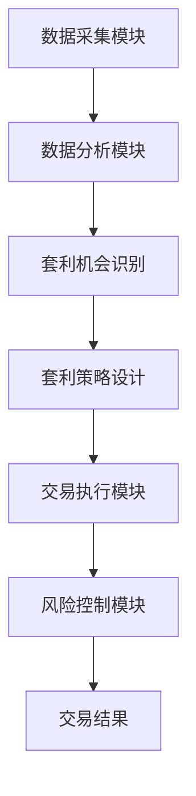

                 


# 塞思·克拉曼的特殊情况套利：价值投资的另一面

> 关键词：塞思·克拉曼，特殊情况套利，价值投资，算法，系统架构，项目实战

> 摘要：塞思·克拉曼是价值投资领域的顶级专家，他通过特殊情况套利策略在市场中获得了显著的成功。本文深入探讨了克拉曼的特殊情况套利方法，从背景、核心概念、算法原理、系统架构到项目实战，全面解析了这一策略的运作方式。文章还结合了数学模型、系统设计和实际案例，为读者提供了全面而深入的分析。

---

## 第一部分: 特殊情况套利与价值投资概述

### 第1章: 套利的定义与分类

#### 1.1 套利的定义
套利是指在不同的市场或资产之间利用价格差异进行交易，以获取无风险或低风险的收益。套利的基本思想是利用市场中的价格不公允性，通过买入低估资产和卖出高估资产来获利。

- **套利的基本概念**
  - 套利是一种市场中性策略，旨在通过资产价格差异获利。
  - 套利可以分为跨市场套利、跨期套利、跨资产套利等类型。
  - 套利的核心在于发现市场中的价格偏差，并在这些偏差消失前获利。

- **套利的分类**
  - **跨市场套利**：利用不同市场之间的价格差异进行交易。
  - **跨期套利**：利用同一资产在不同时间点的价格差异进行交易。
  - **跨资产套利**：利用不同资产之间的价格差异进行交易。
  - **无风险套利**：通过借入资金购买低估资产，同时卖出高估资产，利用价格差异获利。

#### 1.2 特殊情况套利的背景
特殊情况套利是指在特定市场环境下，利用某些特殊事件或市场结构进行套利。这种策略通常需要对市场环境有深刻的理解，并能够在短时间内捕捉到价格偏差。

- **特殊情况套利的背景**
  - 市场波动：特殊情况套利通常在市场波动较大时进行，利用市场的短期波动性。
  - 信息不对称：利用市场参与者之间的信息不对称，捕捉价格偏差。
  - 市场结构：利用市场的结构性特点，如不同市场的流动性差异。

- **特殊情况套利的意义**
  - 塞思·克拉曼通过特殊情况套利策略，成功地在市场中获得了超额收益。
  - 特殊情况套利是价值投资的重要补充，能够帮助投资者在市场中发现低估资产。

---

### 第2章: 塞思·克拉曼的特殊策略

#### 2.1 塞思·克拉曼的背景
塞思·克拉曼是价值投资领域的顶级专家，他的投资理念强调基本面分析和安全边际。克拉曼的成功不仅在于他对市场的深刻理解，还在于他对特殊情况套利的灵活运用。

- **克拉曼的投资理念**
  - 强调安全边际：克拉曼认为，投资应该在市场价格远低于内在价值时进行。
  - 价值投资与套利结合：克拉曼将价值投资与套利策略结合起来，通过特殊情况套利捕捉市场机会。

- **克拉曼的特殊套利策略**
  - 识别低估资产：克拉曼通过基本面分析，识别市场中被低估的资产。
  - 利用市场结构：克拉曼利用市场的结构性特点，捕捉价格偏差。
  - 灵活调整策略：克拉曼根据市场变化，灵活调整套利策略。

- **克拉曼的成功案例**
  - 克拉曼在20世纪80年代通过投资于被低估的公司债券，成功地进行了套利。
  - 克拉曼在互联网泡沫期间，通过识别被低估的网络公司股票，进行了成功的套利。

#### 2.2 特殊情况套利的核心要素
特殊情况套利的核心要素包括套利机会的识别、套利风险的评估和套利策略的执行。

- **套利机会的识别**
  - 市场分析：通过分析市场环境，识别套利机会。
  - 基本面分析：通过基本面分析，识别被低估的资产。
  - 市场结构分析：分析市场结构，识别套利机会。

- **套利风险的评估**
  - 市场风险：套利交易可能受到市场波动的影响。
  - 信用风险：套利交易可能涉及信用风险。
  - 操作风险：套利交易可能受到操作风险的影响。

- **套利策略的执行**
  - 交易策略：制定具体的交易策略，包括买入和卖出的时机。
  - 风险控制：制定风险控制措施，确保套利交易的稳健性。
  - 盈利锁定：在适当的时候锁定利润，避免收益回吐。

---

### 第3章: 特殊情况套利的数学模型

#### 3.1 套利机会的评估模型
套利机会的评估模型通常包括以下几个步骤：

1. **市场分析**：分析市场环境，识别套利机会。
2. **资产定价**：通过基本面分析，评估资产的内在价值。
3. **价格差异**：计算市场价格与内在价值之间的差异。
4. **套利可行性**：评估套利交易的可行性，包括交易成本和市场流动性。

- **套利机会的数学公式**
  - 套利收益 = 市场价格 - 内在价值
  - 套利可行性 = (套利收益 - 交易成本) / 市场流动性

- **套利收益的计算**
  - 套利收益可以通过资产价格的差异进行计算。
  - 套利收益的计算需要考虑时间和市场的流动性。

- **套利风险的评估**
  - 套利风险可以通过概率论进行评估，包括市场波动和交易成本。

#### 3.2 套利策略的优化算法
套利策略的优化算法可以通过以下步骤进行：

1. **套利机会识别**：识别套利机会。
2. **套利策略设计**：设计套利策略。
3. **策略优化**：通过优化算法，提高套利策略的效率。
4. **风险控制**：通过风险控制，降低套利交易的风险。

- **套利策略的优化目标**
  - 最大化套利收益。
  - 最小化套利风险。
  - 提高套利交易的效率。

- **套利策略的优化方法**
  - 线性回归：通过线性回归模型，优化套利策略。
  - 非线性优化：通过非线性优化算法，优化套利策略。
  - 遗传算法：通过遗传算法，优化套利策略。

---

### 第4章: 套利系统架构设计

#### 4.1 系统功能设计
套利系统的功能设计包括以下几个模块：

1. **数据采集模块**：采集市场数据，包括资产价格、市场流动性等。
2. **数据分析模块**：对市场数据进行分析，识别套利机会。
3. **策略执行模块**：根据套利策略，执行交易。
4. **风险控制模块**：监控交易风险，进行风险控制。

- **数据采集模块**
  - 数据源：市场数据、基本面数据、市场流动性数据。
  - 数据采集：通过API或其他数据源，采集市场数据。

- **数据分析模块**
  - 数据分析：通过统计分析和机器学习算法，分析市场数据。
  - 套利机会识别：通过分析市场数据，识别套利机会。

- **策略执行模块**
  - 交易策略：根据套利策略，执行交易。
  - 交易执行：通过交易系统，执行交易指令。

- **风险控制模块**
  - 风险监控：监控交易风险。
  - 风险控制：根据风险监控结果，进行风险控制。

#### 4.2 系统架构图
以下是套利系统的架构图：



---

### 第5章: 项目实战

#### 5.1 环境安装
- **系统环境要求**
  - 操作系统：Windows 10 或更高版本，或 Linux 系统。
  - 软件要求：Python 3.8 或更高版本，Jupyter Notebook，Pandas，NumPy，Matplotlib。

- **安装步骤**
  - 安装Python：从官方网站下载并安装Python。
  - 安装Jupyter Notebook：通过pip安装jupyter-notebook。
  - 安装Pandas：通过pip安装pandas。
  - 安装NumPy：通过pip安装numpy。
  - 安装Matplotlib：通过pip安装matplotlib。

#### 5.2 系统核心实现源代码
以下是套利系统的核心实现源代码：

```python
import pandas as pd
import numpy as np
import matplotlib.pyplot as plt

# 数据采集模块
def collect_data():
    # 从数据源采集市场数据
    data = pd.read_csv('market_data.csv')
    return data

# 数据分析模块
def analyze_data(data):
    # 计算资产的内在价值
    intrinsic_value = data['price'] * data['book_to_market']
    return intrinsic_value

# 套利机会识别
def identify_arbitrage_opportunity(data, intrinsic_value):
    # 计算套利收益
    arbitrage_yield = data['price'] - intrinsic_value
    return arbitrage_yield

# 策略执行模块
def execute_strategy(arbitrage_yield):
    # 判断套利机会
    if arbitrage_yield > 0:
        print("套利机会存在，可以进行交易。")
    else:
        print("套利机会不存在，不进行交易。")

# 风险控制模块
def risk_control(arbitrage_yield):
    # 计算风险
    risk = np.std(arbitrage_yield)
    return risk

# 主函数
def main():
    data = collect_data()
    intrinsic_value = analyze_data(data)
    arbitrage_yield = identify_arbitrage_opportunity(data, intrinsic_value)
    execute_strategy(arbitrage_yield)
    risk = risk_control(arbitrage_yield)
    print("套利风险：", risk)

if __name__ == "__main__":
    main()
```

---

### 第6章: 最佳实践与小结

#### 6.1 最佳实践 tips
- **市场分析**：在进行特殊情况套利之前，必须对市场环境进行深入分析。
- **风险控制**：套利交易涉及较高的风险，必须制定有效的风险控制措施。
- **持续学习**：套利策略需要不断更新和优化，投资者必须持续学习市场知识。

#### 6.2 项目小结
塞思·克拉曼的特殊情况套利策略是一种有效的投资方法，能够帮助投资者在市场中发现低估资产并获得超额收益。然而，套利交易也涉及较高的风险，投资者必须谨慎操作。

---

### 作者：AI天才研究院/AI Genius Institute & 禅与计算机程序设计艺术 /Zen And The Art of Computer Programming

---

### 附录: 拓展阅读
1. 《The Intelligent Investor》 - 本杰明·格雷厄姆
2. 《Arbitrage Theory in Financial Markets》 - 斯蒂芬·罗斯
3. 《算法交易：数学与编程的实践》 - 鲍建平

