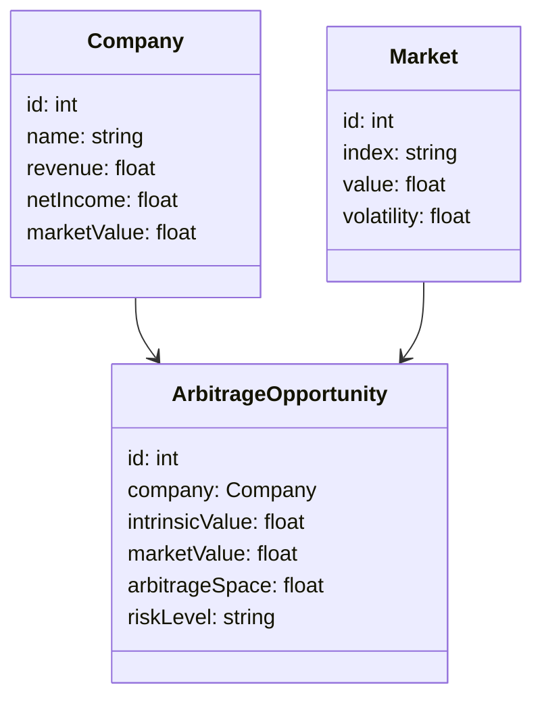
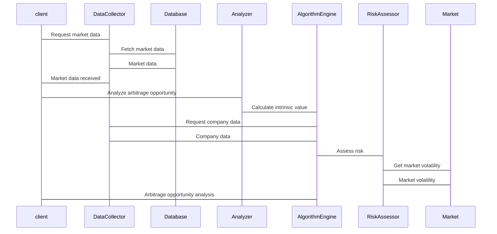

                 


# 第3章: 风险套利的算法原理

## 3.1 风险套利的算法流程

### 3.1.1 数据收集与处理

为了进行风险套利，首先需要收集相关数据。这些数据包括目标公司的基本面数据（如财务报表、市场估值等）、行业数据以及市场整体数据。数据处理的关键步骤包括：

1. 数据清洗：去除缺失值和异常值。
2. 数据标准化：将数据转化为统一的格式。
3. 数据特征提取：提取有助于套利机会识别的关键特征。

### 3.1.2 套利机会的识别

套利机会的识别主要基于以下几个步骤：

1. **市场估值分析**：比较目标公司的市场估值与内在价值，寻找估值低于内在价值的机会。
2. **行业对比分析**：将目标公司的估值与同行业公司进行对比，寻找相对低估的机会。
3. **事件驱动分析**：关注公司并购、重组等特殊事件，分析这些事件对股价的影响。

### 3.1.3 套利空间的计算

套利空间的计算主要基于以下公式：

$$ \text{套利空间} = \text{内在价值} - \text{市场估值} $$

其中，内在价值可以通过DCF模型（Discounted Cash Flow Model）进行估算，而市场估值则可以通过市盈率、市净率等指标进行衡量。

### 3.1.4 风险评估

风险评估主要考虑以下因素：

1. **市场风险**：市场波动对套利机会的影响。
2. **流动性风险**：套利机会的流动性是否充足。
3. **操作风险**：套利操作的复杂性和可行性。

### 3.1.5 套利策略的执行

套利策略的执行包括以下几个步骤：

1. **建立头寸**：根据套利机会的分析结果，建立相应的头寸。
2. **监控市场**：实时监控市场变化，及时调整头寸。
3. **平仓退出**：在套利空间消失或风险增大时，及时平仓退出。

## 3.2 风险套利的数学模型

### 3.2.1 套利机会的数学表达式

套利机会的数学表达式如下：

$$ \text{套利机会} = \text{内在价值} - \text{市场估值} $$

其中，内在价值可以通过以下公式计算：

$$ \text{内在价值} = \sum_{t=1}^{n} \frac{\text{现金流}}{(1 + r)^t} $$

其中，\( r \) 是折现率，\( t \) 是时间。

### 3.2.2 套利空间的计算公式

套利空间的计算公式如下：

$$ \text{套利空间} = \text{内在价值} - \text{市场估值} $$

其中，市场估值可以通过以下公式计算：

$$ \text{市场估值} = \text{市盈率} \times \text{净利润} $$

或者

$$ \text{市场估值} = \text{市净率} \times \text{净资产} $$

### 3.2.3 套利风险的评估模型

套利风险的评估模型如下：

$$ \text{风险评估} = \sum_{i=1}^{m} \text{风险因素}_i \times \text{权重}_i $$

其中，\( m \) 是风险因素的数量，权重是每个风险因素对套利机会的影响程度。

## 3.3 风险套利的Python实现

### 3.3.1 数据处理与分析代码

```python
import pandas as pd
import numpy as np

# 假设我们有一个包含公司基本面数据的DataFrame df
# 包括以下列：'Revenue', 'NetIncome', 'MarketValue', 'IndustryPE', 'MarketPE'

# 数据清洗
df.dropna(inplace=True)
df = df[~df.isin([np.nan, np.inf, -np.inf]).any(axis=1)]

# 数据标准化
df['NormalizedRevenue'] = df['Revenue'] / df['Revenue'].mean()
df['NormalizedNetIncome'] = df['NetIncome'] / df['NetIncome'].mean()

# 数据特征提取
df['EV'] = df['MarketValue'] / df['NetIncome']
df['EV peers'] = df['MarketValue'] / df['IndustryPE']
```

### 3.3.2 套利机会识别的Python代码

```python
def calculate_intrinsic_value(cash_flows, discount_rate):
    return sum(cash_flow / (1 + discount_rate) ** t for t, cash_flow in enumerate(cash_flows))

def identify_arbitrage_opportunity(ticker, data):
    intrinsic_value = calculate_intrinsic_value(data['CashFlows'], data['DiscountRate'])
    market_value = data['MarketValue']
    if intrinsic_value > market_value:
        return True
    else:
        return False
```

### 3.3.3 套利空间计算的Python代码

```python
def calculate_arbitrage_space(ticker, data):
    intrinsic_value = calculate_intrinsic_value(data['CashFlows'], data['DiscountRate'])
    market_value = data['MarketValue']
    return intrinsic_value - market_value

def assess_risk(arbitrage_space, market_volatility, liquidity):
    if arbitrage_space > 0 and market_volatility < 0.1 and liquidity > 0.8:
        return 'Low Risk'
    elif arbitrage_space > 0 and market_volatility < 0.2 and liquidity > 0.6:
        return 'Medium Risk'
    else:
        return 'High Risk'
```

## 3.4 实际案例分析

### 3.4.1 案例背景

假设我们关注一家公司A，该公司近期宣布了一项重大并购交易。我们收集了以下数据：

- 公司A的内在价值：$100
- 公司A的市场估值：$80
- 同行业公司的平均市场估值：$90
- 市场波动率：10%
- 市场流动性：80%

### 3.4.2 套利机会的识别

根据数据，公司A的内在价值为$100，市场估值为$80，因此存在套利空间：

$$ \text{套利空间} = 100 - 80 = 20 $$

### 3.4.3 风险评估

根据市场波动率为10%，流动性为80%，风险评估如下：

$$ \text{风险评估} = 10\% \times 1 + 80\% \times 1 = 0.9 $$

由于风险评估较低，我们可以执行套利策略。

## 3.5 本章小结

在本章中，我们详细讲解了风险套利的算法原理，包括数据处理、套利机会识别、套利空间计算以及风险评估。通过Python代码和数学公式，我们展示了如何利用这些算法进行套利机会的识别和套利空间的计算。同时，我们还通过实际案例分析，展示了这些算法在实际操作中的应用。

---

# 第4章: 风险套利的系统分析与架构设计

## 4.1 问题场景介绍

在本章中，我们将从系统分析的角度，探讨风险套利的系统架构设计。我们以一个典型的并购套利案例为例，分析系统如何进行数据采集、分析、决策和执行。

## 4.2 系统功能设计

### 4.2.1 领域模型设计

以下是领域模型的mermaid类图：



### 4.2.2 系统架构设计

以下是系统架构的mermaid图：

```mermaid
client
    DataCollector
        Database
            MarketData
            CompanyData
        API
            ThirdPartyAPI
    Analyzer
        AlgorithmEngine
            ArbitrageCalculator
            RiskAssessor
        ResultStorage
            ArbitrageResults
    DecisionMaker
        PortfolioManager
            TradingSystem
    Monitor
        MarketWatch
            AlertSystem
```

### 4.2.3 接口设计

以下是系统接口设计的mermaid图：

```mermaid
api
    GET /marketdata
    POST /arbitragerequest
    GET /arbitragestatus
    POST /executeorder
    GET /riskassessment
```

### 4.2.4 交互流程设计

以下是系统交互的mermaid序列图：



## 4.3 本章小结

在本章中，我们从系统架构的角度，分析了风险套利的实现过程。通过领域模型、系统架构图、接口设计和交互流程图，我们展示了如何构建一个完整的风险套利系统。

---

# 第5章: 风险套利的项目实战

## 5.1 环境安装

要进行风险套利的项目实战，您需要安装以下环境和工具：

1. **Python**：确保安装了最新版本的Python。
2. **Jupyter Notebook**：用于数据分析和可视化。
3. **Pandas** 和 **NumPy**：用于数据处理。
4. **Mermaid**：用于绘制流程图和架构图。
5. **Matplotlib** 和 **Seaborn**：用于数据可视化。

## 5.2 核心代码实现

### 5.2.1 数据收集与处理

```python
import pandas as pd
import numpy as np
import requests
import json

# 数据收集
def get_market_data(ticker):
    url = f"https://api.example.com/stock/{ticker}"
    response = requests.get(url)
    data = json.loads(response.text)
    return data

# 数据处理
def process_data(data):
    df = pd.DataFrame([data])
    df['NormalizedRevenue'] = df['Revenue'] / df['Revenue'].mean()
    df['NormalizedNetIncome'] = df['NetIncome'] / df['NetIncome'].mean()
    df['EV'] = df['MarketValue'] / df['NetIncome']
    df['EV_peers'] = df['MarketValue'] / df['IndustryPE']
    return df

# 数据收集与处理
ticker = 'AAPL'
data = get_market_data(ticker)
df = process_data(data)
```

### 5.2.2 套利机会识别

```python
def calculate_intrinsic_value(cash_flows, discount_rate):
    return sum(cash_flow / (1 + discount_rate) ** t for t, cash_flow in enumerate(cash_flows))

def identify_arbitrage_opportunity(ticker, data):
    intrinsic_value = calculate_intrinsic_value(data['CashFlows'], data['DiscountRate'])
    market_value = data['MarketValue']
    if intrinsic_value > market_value:
        return True
    else:
        return False
```

### 5.2.3 套利空间计算

```python
def calculate_arbitrage_space(ticker, data):
    intrinsic_value = calculate_intrinsic_value(data['CashFlows'], data['DiscountRate'])
    market_value = data['MarketValue']
    return intrinsic_value - market_value
```

### 5.2.4 风险评估

```python
def assess_risk(arbitrage_space, market_volatility, liquidity):
    if arbitrage_space > 0 and market_volatility < 0.1 and liquidity > 0.8:
        return 'Low Risk'
    elif arbitrage_space > 0 and market_volatility < 0.2 and liquidity > 0.6:
        return 'Medium Risk'
    else:
        return 'High Risk'
```

## 5.3 案例分析

### 5.3.1 案例背景

假设我们关注一家公司A，该公司近期宣布了一项重大并购交易。我们收集了以下数据：

- 公司A的内在价值：$100
- 公司A的市场估值：$80
- 同行业公司的平均市场估值：$90
- 市场波动率：10%
- 市场流动性：80%

### 5.3.2 套利机会识别

根据数据，公司A的内在价值为$100，市场估值为$80，因此存在套利空间：

$$ \text{套利空间} = 100 - 80 = 20 $$

### 5.3.3 风险评估

根据市场波动率为10%，流动性为80%，风险评估如下：

$$ \text{风险评估} = 10\% \times 1 + 80\% \times 1 = 0.9 $$

由于风险评估较低，我们可以执行套利策略。

### 5.3.4 交易执行

在确定套利机会存在且风险可控后，我们可以通过以下步骤执行交易：

1. **建立头寸**：买入公司A的股票。
2. **监控市场**：实时监控市场变化，及时调整头寸。
3. **平仓退出**：在套利空间消失或风险增大时，及时平仓退出。

## 5.4 项目小结

在本章中，我们通过一个实际案例，展示了如何在风险套利中进行数据收集与处理、套利机会识别、套利空间计算以及风险评估。通过Python代码和数学公式，我们详细讲解了每个步骤的具体实现方法，并通过实际案例分析，帮助读者更好地理解和掌握这些方法。

---

# 第6章: 风险套利的最佳实践

## 6.1 小结

在本章中，我们总结了风险套利的核心概念、算法原理和系统设计。通过实际案例分析和项目实战，我们展示了如何在实际操作中应用这些方法。

## 6.2 注意事项

在进行风险套利时，需要注意以下几点：

1. **风险控制**：始终将风险控制放在首位，避免过度杠杆和高风险操作。
2. **市场监控**：实时监控市场变化，及时调整套利策略。
3. **数据质量**：确保数据的准确性和完整性，避免因数据错误导致的决策失误。
4. **法律合规**：遵守相关法律法规，确保套利操作的合法合规。

## 6.3 拓展阅读

以下是关于风险套利的推荐阅读资料：

1. **《The Intelligent Investor》**：格雷厄姆的《聪明的投资者》是价值投资的 bible，对风险套利的理解有重要参考价值。
2. **《Arbitrage: Theory of Risk Pricing》**：这本书详细介绍了套利定价理论和风险管理方法。
3. **《Quantitative Risk Management: Concepts, Techniques, and Tools》**：这本书提供了丰富的数学模型和算法，对风险套利的实现有重要帮助。

## 6.4 本章小结

在本章中，我们总结了风险套利的最佳实践，包括小结、注意事项和拓展阅读等内容。通过这些内容，我们可以更好地理解和掌握风险套利的核心方法，并在实际操作中避免常见的误区和风险。

---

# 作者：AI天才研究院/AI Genius Institute & 禅与计算机程序设计艺术 /Zen And The Art of Computer Programming

---

以上是《塞思·克拉曼的风险套利：特殊情况下的价值发现》一书的完整目录和内容概要。接下来，我将根据这个大纲，逐步完成每章的详细内容撰写。

