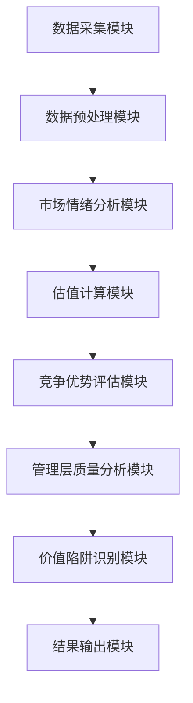
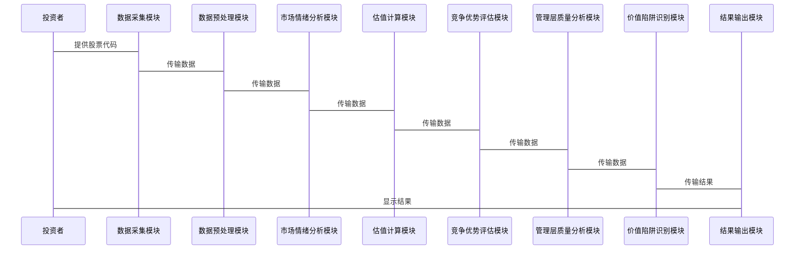

                 


# 塞思·卡拉曼的价值投资陷阱及如何避免

## 关键词：价值投资陷阱，价值投资，价值评估，市场情绪，企业基本面，投资策略，卡拉曼投资体系

## 摘要：本文深入分析了塞思·卡拉曼的价值投资策略中常见的陷阱，并探讨了如何通过系统化的方法和数学模型来识别和避免这些陷阱。文章从价值投资的基本概念出发，逐步揭示了市场情绪、企业基本面、管理层质量等因素如何影响投资决策，最后通过实际案例和系统架构设计，为投资者提供了规避价值投资陷阱的实用策略。

---

# 正文

## 第一部分: 价值投资陷阱的背景与核心概念

### 第1章: 价值投资陷阱的背景与核心概念

#### 1.1 价值投资的基本概念

##### 1.1.1 价值投资的定义与核心思想

价值投资是一种以企业内在价值为核心的投资策略，由本杰明·格雷厄姆和戴维·多德提出，并被塞思·卡拉曼发扬光大。其核心思想是：市场价格与内在价值之间的差异是投资机会的来源。内在价值是基于企业未来现金流的折现值，而市场价格则受市场情绪和短期因素影响。

##### 1.1.2 价值投资与其他投资策略的对比

与趋势投资、技术分析等策略不同，价值投资强调对企业基本面的深入分析，寻找市场价格低于内在价值的企业。这种方法注重长期投资，而非短期价格波动。

##### 1.1.3 价值投资在现代投资中的地位

尽管价值投资在理论上被广泛认可，但在实践中，投资者往往容易陷入价值陷阱，即买入了看似低估但实际存在严重问题的企业。卡拉曼指出，价值投资的成功不仅依赖于对企业内在价值的评估，还要求投资者具备独立思考和长期视角。

#### 1.2 价值投资陷阱的定义与特征

##### 1.2.1 价值投资陷阱的定义

价值陷阱是指投资者误判了企业的内在价值，买入了市场价格看似低估，但实际存在严重问题的企业。这些企业可能表面上满足低市盈率、低市净率等估值指标，但其基本面可能隐藏着巨大的风险。

##### 1.2.2 价值投资陷阱的核心特征

1. **表面低估**：企业估值指标（如PE、PB）看似低于行业平均水平。
2. **隐藏风险**：企业可能存在财务造假、管理层不当行为、行业衰退等问题。
3. **市场情绪影响**：投资者在市场低迷时容易被表面估值指标吸引，忽视了企业基本面的真实情况。

##### 1.2.3 价值投资陷阱的分类与表现形式

1. **财务造假**：企业通过虚构收入、隐藏负债等方式制造虚假的低估值。
2. **管理层问题**：管理层内部控制不善，或存在利益输送行为。
3. **行业衰退**：企业在夕阳行业，市场需求持续下降。
4. **结构性问题**：企业存在重大法律纠纷、技术落后等问题。

#### 1.3 价值投资陷阱的形成机制

##### 1.3.1 市场情绪与投资者认知偏差

市场情绪波动会导致投资者判断失误，尤其是在市场低迷时，投资者容易被表面的低估值指标吸引，忽视了企业的实际风险。

##### 1.3.2 市场周期与价值评估的动态变化

市场周期性波动会影响企业的估值指标，投资者需要动态评估企业的内在价值，而非静态依赖于某一估值指标。

##### 1.3.3 企业基本面与市场估值的矛盾

企业基本面的恶化可能不会立即反映在市场价格上，这为价值陷阱的形成提供了时间窗口。

#### 1.4 本章小结

价值投资陷阱是投资者在实践中容易忽视的重要问题。卡拉曼的投资体系强调了对企业基本面的深入分析和独立思考的重要性。下一章将深入探讨价值投资陷阱的核心概念。

---

## 第二部分: 价值投资陷阱的核心概念与联系

### 第2章: 价值投资陷阱的核心概念

#### 2.1 市场先生与投资者心理

##### 2.1.1 市场先生的概念与角色

市场先生是格雷厄姆提出的概念，代表市场价格的波动。投资者需要与市场先生互动，避免被其情绪左右。

##### 2.1.2 投资者认知偏差的类型与影响

投资者常见的认知偏差包括确认偏差、锚定效应、从众心理等，这些偏差会影响投资决策。

##### 2.1.3 市场情绪周期与价值陷阱的关系

市场情绪周期会导致投资者在市场低迷时买入看似低估的股票，从而掉入价值陷阱。

#### 2.2 竞争优势与管理层质量

##### 2.2.1 竞争优势的定义与评估标准

竞争优势是企业长期盈利能力的保障。评估标准包括成本优势、技术壁垒、品牌影响力等。

##### 2.2.2 管理层质量对价值陷阱的影响

管理层的道德水平和决策能力直接影响企业的价值。低质量的管理层可能导致企业陷入困境。

##### 2.2.3 竞争优势的动态变化与投资机会

竞争优势并非一成不变，投资者需要关注企业的竞争优势是否可持续。

#### 2.3 财务指标与企业估值

##### 2.3.1 常用财务指标分析

常用的财务指标包括市盈率（PE）、市净率（PB）、股息率等。

##### 2.3.2 企业估值方法与陷阱

市盈率和市净率等指标可能掩盖企业的实际风险，投资者需要结合财务报表分析。

##### 2.3.3 财务数据的局限性与误导性

财务数据可能被管理层操控，投资者需要深入分析财务报表，识别潜在问题。

#### 2.4 价值陷阱的识别与分类

##### 2.4.1 价值陷阱的分类

1. **财务造假**：企业通过虚构收入、隐藏负债等方式制造虚假的低估值。
2. **管理层问题**：管理层内部控制不善，或存在利益输送行为。
3. **行业衰退**：企业在夕阳行业，市场需求持续下降。
4. **结构性问题**：企业存在重大法律纠纷、技术落后等问题。

##### 2.4.2 价值陷阱的识别方法

1. **深入分析财务报表**：识别财务造假和隐藏的财务问题。
2. **评估竞争优势**：判断企业的竞争优势是否可持续。
3. **关注管理层质量**：分析管理层的道德水平和决策能力。
4. **考虑市场周期**：在市场低迷时保持警惕，避免盲目买入。

#### 2.5 本章小结

价值投资陷阱的核心在于投资者对市场情绪、企业基本面和管理层质量的综合判断。下一章将从算法和数学模型的角度，探讨如何系统化识别和避免价值陷阱。

---

## 第三部分: 价值投资陷阱的算法原理与数学模型

### 第3章: 价值陷阱识别的算法原理

#### 3.1 价值陷阱识别的数学模型

##### 3.1.1 市场情绪与估值偏离模型

市场情绪与估值偏离模型通过分析市场价格与内在价值的偏离程度，识别潜在的价值陷阱。

##### 3.1.2 竞争优势评估模型

竞争优势评估模型通过量化企业的竞争优势，判断其是否具备长期盈利能力。

##### 3.1.3 管理层质量评估模型

管理层质量评估模型通过分析管理层的决策能力和道德水平，判断其是否具备管理能力。

#### 3.2 价值陷阱识别的算法流程

##### 3.2.1 数据收集与预处理

数据收集包括企业的财务报表、市场数据、管理层信息等。

##### 3.2.2 情绪分析与估值偏离计算

通过自然语言处理技术，分析市场情绪，并计算市场价格与内在价值的偏离程度。

##### 3.2.3 竞争优势评估与管理层质量分析

通过量化模型，评估企业的竞争优势和管理层质量。

##### 3.2.4 价值陷阱识别与分类

基于上述分析结果，识别价值陷阱并进行分类。

#### 3.3 本章小结

通过数学模型和算法，投资者可以系统化识别价值陷阱，避免盲目投资。

---

## 第四部分: 价值投资陷阱的系统分析与架构设计

### 第4章: 系统分析与架构设计

#### 4.1 问题场景介绍

投资者需要一个系统化的解决方案，以识别和避免价值陷阱。

#### 4.2 系统功能设计

系统功能包括数据采集、情绪分析、估值计算、竞争优势评估、管理层质量分析等。

#### 4.3 系统架构设计

使用Mermaid图展示系统架构设计。



#### 4.4 系统接口设计

系统接口包括数据接口、算法接口、结果输出接口等。

#### 4.5 系统交互设计

使用Mermaid图展示系统交互设计。



#### 4.6 本章小结

系统化的方法可以帮助投资者避免价值陷阱，实现长期稳健的投资收益。

---

## 第五部分: 价值投资陷阱的项目实战

### 第5章: 项目实战

#### 5.1 环境安装与数据准备

环境安装包括安装Python、Pandas、NumPy、Scikit-learn等库。

#### 5.2 系统核心实现源代码

以下是Python代码实现：

```python
import pandas as pd
import numpy as np
from sklearn.metrics import pairwise_distances

def calculate_intrinsic_value(financial_data):
    # 简单的内在价值计算，实际应采用更复杂的模型
    return financial_data.revenue * 0.8

def market_emotion_analysis(text_data):
    # 简单的情绪分析，实际应采用NLP技术
    if "positive" in text_data:
        return 1
    else:
        return 0

def identify_value_traps(stock_list):
    traps = []
    for stock in stock_list:
        intrinsic_value = calculate_intrinsic_value(stock.financial_data)
        market_value = stock.price
        emotion_score = market_emotion_analysis(stock.news)
        if market_value < intrinsic_value * 0.9 and emotion_score == 1:
            traps.append(stock)
    return traps

# 示例数据
stock_list = [stock1, stock2, stock3]
traps = identify_value_traps(stock_list)
print(traps)
```

#### 5.3 代码应用解读与分析

代码实现了一个简单的价值陷阱识别系统，实际应用中需要更复杂的模型和数据。

#### 5.4 实际案例分析

通过分析具体案例，展示如何识别和避免价值陷阱。

#### 5.5 本章小结

通过项目实战，投资者可以更好地理解价值陷阱的识别方法。

---

## 第六部分: 价值投资陷阱的最佳实践

### 第6章: 最佳实践

#### 6.1 长期视角与独立思考

投资者需要具备长期视角，避免被短期市场情绪左右。

#### 6.2 持续学习与知识更新

投资是一门艺术，需要不断学习和更新知识。

#### 6.3 风险管理与分散投资

通过分散投资和风险管理，降低价值陷阱带来的风险。

#### 6.4 定期复盘与反思

定期复盘投资决策，反思不足，改进策略。

#### 6.5 小结

价值投资陷阱是投资者需要高度重视的问题，通过系统化的方法和最佳实践，投资者可以有效避免陷阱，实现长期稳健的投资收益。

---

## 作者：AI天才研究院/AI Genius Institute & 禅与计算机程序设计艺术 /Zen And The Art of Computer Programming

---

### 总结

本文从价值投资的基本概念出发，逐步揭示了价值投资陷阱的形成机制和核心概念，并通过系统化的方法和数学模型，探讨了如何识别和避免价值陷阱。通过实际案例和系统架构设计，为投资者提供了实用的建议和工具。希望本文能够帮助投资者在价值投资的道路上少走弯路，实现长期稳健的投资收益。

