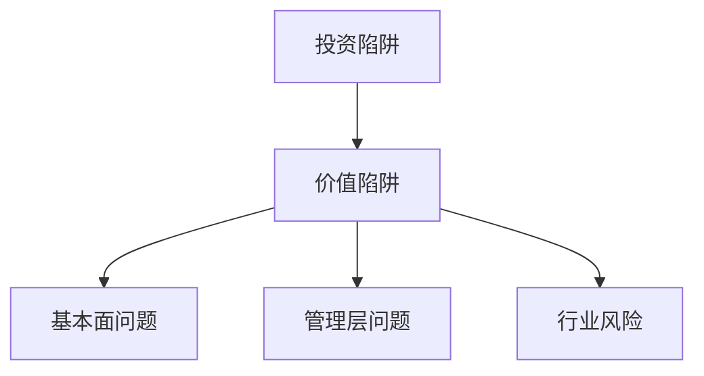
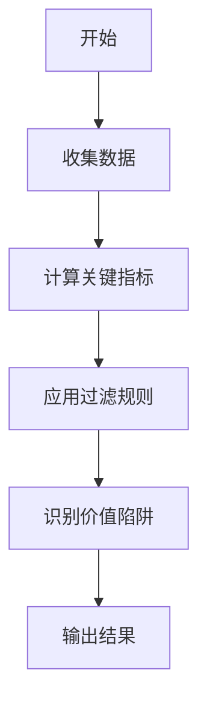
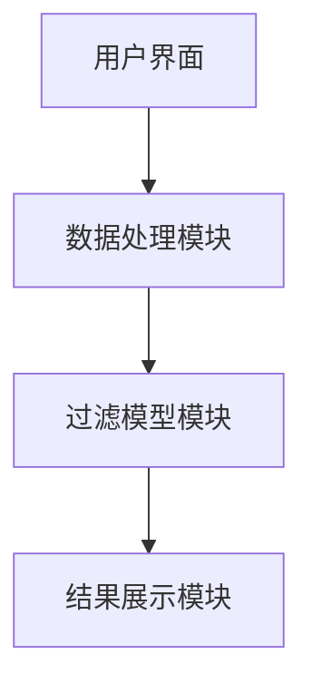

                 


# 塞思·卡拉曼的价值陷阱避免策略

## 关键词：
塞思·卡拉曼，价值陷阱，投资策略，风险管理，价值评估，价值投资

## 摘要：
塞思·卡拉曼的价值陷阱理论是价值投资领域的重要概念，旨在帮助投资者识别那些看似便宜实则存在严重问题的投资标的。本文将深入探讨价值陷阱的形成原因、识别方法，以及卡拉曼提出的过滤模型和数学算法，帮助投资者有效避免价值陷阱，提升投资决策的准确性。

---

# 正文

## 第一部分：价值陷阱的背景与概念

### 第1章：价值陷阱的基本原理

#### 1.1 价值陷阱的定义与特征

**价值陷阱**是指那些在表面上看似具有吸引力，但实际情况中存在严重问题的投资标的。投资者可能会因为关注市盈率、市净率等简单指标而忽视了隐藏的风险。

**Mermaid图：价值陷阱与其他投资陷阱的对比**



价值陷阱的核心特征包括：
- 表面低估值：市盈率、市净率等指标远低于行业平均水平。
- 基本面恶化：收入下降、利润持续亏损、债务激增。
- 管理层问题：管理层诚信不足或决策失误。

#### 1.2 价值陷阱的形成原因

价值陷阱的形成通常与市场情绪、财务报表虚假性以及行业周期性有关。以下是详细分析：

1. **市场情绪影响**：市场恐慌或过度乐观可能导致投资者忽视基本面，误判投资价值。
2. **财务报表虚假性**：公司可能通过财务造假掩盖基本面问题，误导投资者。
3. **行业周期性与结构性问题**：行业衰退或结构性变化可能导致公司无法持续盈利。

#### 1.3 价值陷阱与价值投资的区别

价值投资强调购买价格低于内在价值，而价值陷阱则是价格低于账面价值，但实际价值在持续下降。以下是对比表格：

| 特性 | 价值投资 | 价值陷阱 |
|------|----------|----------|
| 投资目标 | 寻找被市场低估的企业 | 寻找看似低估但实际有问题的企业 |
| 价格与价值关系 | 价格 < 内在价值 | 价格 < 账面价值，但内在价值持续下降 |
| 投资风险 | 较低 | 高，隐藏严重问题 |

---

## 第二部分：价值陷阱的识别方法

### 第2章：基本面分析与价值陷阱识别

#### 2.1 财务指标分析

**市盈率（P/E）**：股价除以每股收益，低于行业平均水平可能暗示低估，但需考虑企业盈利能力是否可持续。

**市净率（P/B）**：股价除以每股净资产，低于1可能暗示低估，但需检查资产质量。

**债务率**：总负债与股东权益的比率，过高可能暗示财务风险。

**盈利能力**：ROE（净资产收益率）和ROA（资产回报率）持续下降可能暗示企业盈利能力恶化。

#### 2.2 行业分析与竞争地位评估

**行业周期分析**：处于衰退期的行业可能隐藏价值陷阱。

**竞争格局分析**：竞争优势不足的企业可能难以持续盈利。

**企业市场地位**：市场份额低且竞争优势不明显的企业可能存在价值陷阱。

#### 2.3 管理层分析

**管理层诚信**：频繁更换或有不良记录的管理层可能存在问题。

**管理层决策**：过去决策失误可能预示未来问题。

**利益一致性**：管理层与股东的利益不一致可能影响企业价值。

---

## 第三部分：卡拉曼过滤模型

### 第3章：卡拉曼过滤模型的原理与应用

#### 3.1 过滤模型的基本原理

卡拉曼过滤模型通过多个财务指标和非财务指标对潜在投资标的进行过滤，识别出那些表面上看似低估，但实际存在严重问题的企业。

**Mermaid图：过滤模型流程**



#### 3.2 过滤模型的实现步骤

1. **数据收集与预处理**：收集企业的财务报表和行业数据，剔除异常值。
2. **指标筛选与权重分配**：选择关键指标（如ROE、债务率、毛利率等），并根据行业特点分配权重。
3. **过滤结果判断**：根据设定的阈值，筛选出存在价值陷阱的企业。

#### 3.3 案例分析

以某制造企业为例，假设其ROE连续三年下降，债务率超过行业平均，且管理层近期频繁变动。通过过滤模型，这些指标会触发警报，识别出该企业为价值陷阱。

---

## 第四部分：数学模型与算法原理

### 第4章：卡拉曼过滤模型的数学解析

#### 4.1 模型的数学表达

过滤模型的核心公式如下：

$$
\text{综合评分} = \sum (\text{指标权重} \times \text{指标表现})
$$

其中，指标表现通过标准化处理得到，公式为：

$$
\text{指标表现} = \frac{\text{指标值} - \text{行业均值}}{\text{行业标准差}}
$$

#### 4.2 算法实现的详细步骤

1. **数据预处理**：标准化处理每个指标。
2. **指标筛选**：根据权重计算综合评分。
3. **结果判断**：综合评分低于设定阈值的企业被视为价值陷阱。

#### 4.3 代码实现

以下是Python代码实现：

```python
import pandas as pd

# 假设df是包含企业数据的DataFrame，columns包括ROE, DebtRatio, GrossMargin,等指标
def carman_filter(df):
    # 计算行业均值和标准差
    industry_mean = df.mean()
    industry_std = df.std()
    
    # 标准化处理
    normalized_df = (df - industry_mean) / industry_std
    
    # 定义权重（假设）
    weights = {'ROE': 0.4, 'DebtRatio': 0.3, 'GrossMargin': 0.3}
    
    # 计算综合评分
    normalized_df['Score'] = 0
    for col in normalized_df.columns:
        if col in weights:
            normalized_df['Score'] += weights[col] * normalized_df[col]
    
    # 设置阈值（例如，综合评分低于-1的企业为价值陷阱）
    normalized_df['IsValueTrap'] = normalized_df['Score'] < -1
    
    return normalized_df

# 示例数据
data = {
    'ROE': [0.1, 0.2, 0.15],
    'DebtRatio': [0.5, 0.6, 0.4],
    'GrossMargin': [0.3, 0.2, 0.25]
}
df = pd.DataFrame(data)
result = carman_filter(df)
print(result)
```

---

## 第五部分：系统分析与架构设计

### 第5章：系统功能设计

#### 5.1 系统架构设计



---

## 第六部分：项目实战

### 第6章：项目实现

#### 6.1 环境安装

安装Python和相关库：

```bash
pip install pandas numpy matplotlib
```

#### 6.2 核心代码实现

实现过滤模型：

```python
import pandas as pd
import numpy as np

def carman_filter(df):
    industry_mean = df.mean()
    industry_std = df.std()
    normalized_df = (df - industry_mean) / industry_std
    weights = {'ROE': 0.4, 'DebtRatio': 0.3, 'GrossMargin': 0.3}
    normalized_df['Score'] = 0
    for col in normalized_df.columns:
        if col in weights:
            normalized_df['Score'] += weights[col] * normalized_df[col]
    normalized_df['IsValueTrap'] = normalized_df['Score'] < -1
    return normalized_df

# 示例数据
data = {
    'ROE': [0.1, 0.2, 0.15],
    'DebtRatio': [0.5, 0.6, 0.4],
    'GrossMargin': [0.3, 0.2, 0.25]
}
df = pd.DataFrame(data)
result = carman_filter(df)
print(result)
```

---

## 第七部分：最佳实践与总结

### 7.1 最佳实践

- 定期更新模型参数，适应市场变化。
- 结合多指标分析，避免单一指标误导。
- 保持对市场的敏感性，及时调整投资策略。

### 7.2 小结

通过本文的详细讲解，读者可以掌握价值陷阱的识别方法和卡拉曼过滤模型的应用技巧，从而在投资决策中避免价值陷阱，提升投资收益。

### 7.3 注意事项

- 模型结果仅供参考，需结合市场实际情况。
- 数据质量对模型结果影响重大，需确保数据来源可靠。
- 持续学习市场变化，优化模型参数。

### 7.4 拓展阅读

- 塞思·卡拉曼的其他投资理论。
- 其他价值投资策略的研究。

---

## 作者

**作者：AI天才研究院/AI Genius Institute & 禅与计算机程序设计艺术 /Zen And The Art of Computer Programming**

