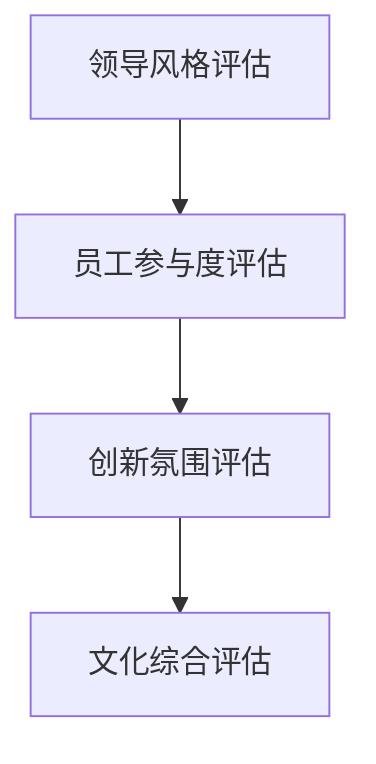
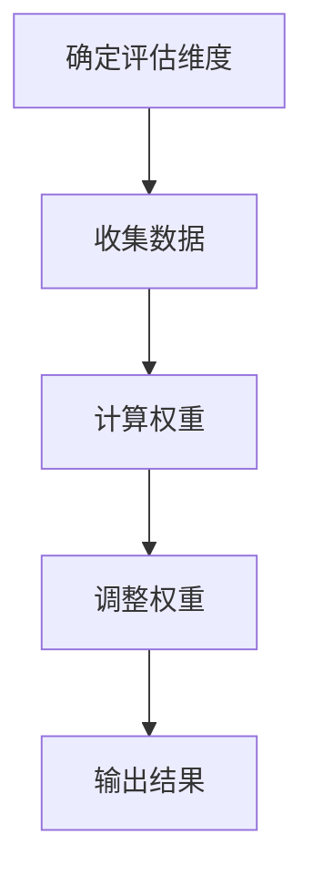
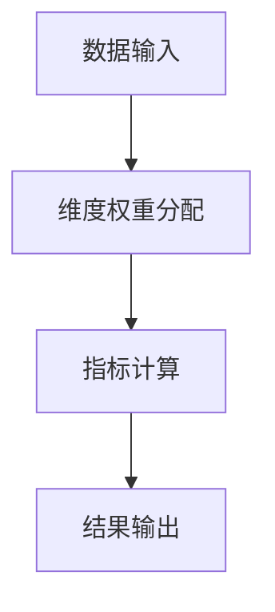
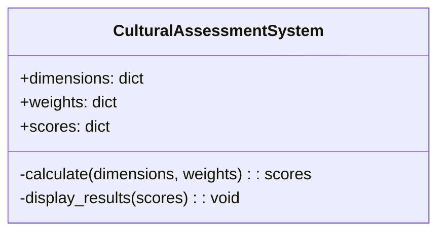
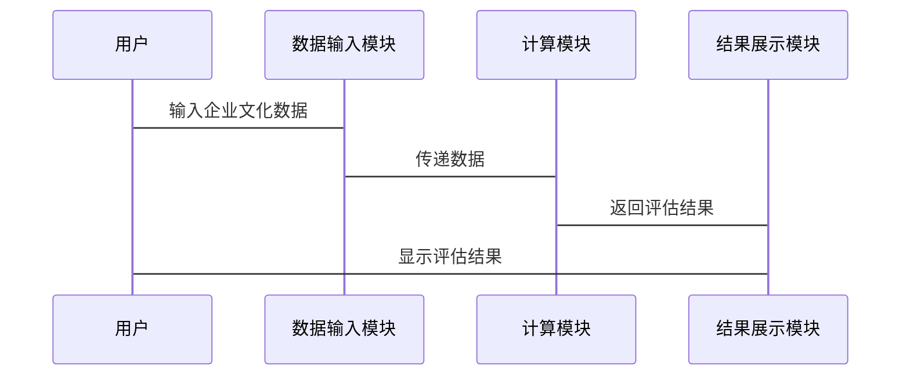

                 


# 塞思·卡拉曼的公司文化评估方法

> 关键词：公司文化评估，塞思·卡拉曼，企业文化管理，文化维度模型，评估方法，数学模型，系统架构，项目实战

> 摘要：本文系统地介绍了塞思·卡拉曼的公司文化评估方法，从背景介绍、核心概念、算法原理、系统架构设计到项目实战和最佳实践，深入剖析了该方法的理论基础和实际应用。通过详细分析文化评估的核心维度、数学模型、系统架构设计和具体案例，为读者提供了全面的指导和实践参考。

---

## 第一部分: 公司文化评估方法概述

### 第1章: 公司文化评估的核心概念

#### 1.1 公司文化的定义与重要性
公司文化是企业在长期发展过程中形成的价值观、行为准则和工作方式的总和。它是企业的灵魂，决定了企业的凝聚力、创新能力和市场竞争力。  
- 公司文化的定义：公司文化是企业在经营活动中形成的共享价值观、信念、行为规范和习惯的总和。  
- 公司文化的核心要素：包括愿景、使命、价值观、领导风格、员工关系、沟通方式、创新氛围等。  
- 公司文化在企业中的作用：良好的公司文化可以提升员工满意度、增强团队协作、促进企业创新，从而提高企业的整体绩效。

#### 1.2 公司文化评估的必要性
公司文化评估是企业战略管理的重要组成部分，其必要性体现在以下几个方面：  
- 企业为什么要进行文化评估：通过评估，企业可以识别文化中存在的问题，优化文化结构，提升文化竞争力。  
- 文化评估与企业绩效的关系：研究表明，企业文化与企业绩效呈正相关关系，文化评估是优化企业绩效的重要手段。  
- 文化评估的常见应用场景：企业并购、组织变革、文化建设、领导力发展等。

#### 1.3 塞思·卡拉曼的公司文化评估方法
- 方法的提出背景：随着全球化和数字化的深入，企业面临的竞争日益激烈，公司文化在企业成功中的作用越来越重要。塞思·卡拉曼提出了一套系统化的公司文化评估方法，旨在帮助企业更好地理解和优化自身文化。  
- 方法的核心理念：通过量化分析和系统设计，全面评估公司文化的核心维度，为企业文化建设提供科学依据。  
- 方法的适用范围：适用于各类企业，尤其是希望提升文化竞争力的企业。

---

### 第2章: 公司文化评估的核心维度

#### 2.1 评估维度的选择
公司文化评估的核心在于选择合适的维度。以下是常见的评估维度及其特征：  
- 核心维度的确定：根据企业的实际情况，选择最具代表性的维度，如领导风格、员工参与度、创新氛围等。  
- 维度的分类与特征：  
  - 领导风格：包括权威型、指导型、支持型、参与型等。  
  - 员工参与度：包括员工的归属感、参与感和责任感。  
  - 创新氛围：包括企业的创新文化、风险承担能力和开放性。  
- 维度之间的关系：不同维度之间可能存在相互影响，例如领导风格会影响员工参与度，进而影响创新氛围。

#### 2.2 核心维度对比分析
为了更好地理解公司文化评估的维度，我们可以通过对比分析来明确每个维度的特点和作用。  

##### 表2-1：公司文化评估维度对比表  

| 维度         | 描述                                                                 | 特点                     |
|--------------|----------------------------------------------------------------------|--------------------------|
| 领导风格     | 领导者的行为方式和决策风格                                             | 影响员工行为和态度       |
| 员工参与度   | 员工对工作的投入程度和归属感                                           | 反映员工与企业的关系     |
| 创新氛围     | 企业对创新的鼓励程度和开放性                                           | 影响企业的创新能力       |

##### 图2-1：公司文化评估维度的ER实体关系图  
```mermaid
erDiagram
    employee [员工] {
        +int id
        +string name
        +int age
    }
    leadership_style [领导风格] {
        +int id
        +string style_name
        +text description
    }
    innovation_atmosphere [创新氛围] {
        +int id
        +float score
        +text comment
    }
    employee <o-- leadership_style : "领导风格通过员工体现"
    employee <o-- innovation_atmosphere : "创新氛围通过员工体现"
```

##### 图2-2：公司文化评估维度的Mermaid流程图  


---

### 第3章: 公司文化评估的数学模型与算法原理

#### 3.1 评估指标的权重分配
在公司文化评估中，不同维度的权重需要根据企业的实际情况进行分配。以下是权重分配的步骤：  

##### 图3-1：权重分配的Mermaid流程图  


##### 公式3-1：层次分析法（AHP）权重计算公式  
$$
权重_i = \frac{权重_i}{\sum 权重_i}
$$  
其中，权重_i 是每个维度的初始权重，总权重之和为1。

#### 3.2 评估模型的构建
公司文化评估模型的核心在于将各个维度的权重与具体指标相结合，形成一个综合评估指标。  

##### 图3-2：评估模型的Mermaid流程图  


##### 公式3-2：综合评估公式  
$$
综合评估得分 = \sum (权重_i \times 指标_i)
$$  
其中，权重_i 是各个维度的权重，指标_i 是各个维度的具体指标得分。

#### 3.3 算法的实现与优化
以下是公司文化评估算法的实现代码：  

```python
def calculate_cultural_score(dimensions, weights):
    # 计算每个维度的得分
    scores = {}
    for dim in dimensions:
        scores[dim] = sum(weights[dim] * dimensions[dim])
    return scores

# 示例数据
dimensions = {
    '领导风格': 0.4,
    '员工参与度': 0.3,
    '创新氛围': 0.3
}
weights = {
    '领导风格': 0.4,
    '员工参与度': 0.3,
    '创新氛围': 0.3
}

# 计算文化得分
cultural_scores = calculate_cultural_score(dimensions, weights)
print(cultural_scores)
```

---

### 第4章: 公司文化评估的系统架构设计

#### 4.1 系统功能设计
公司文化评估系统的功能模块包括：  
- 数据输入模块：用于输入企业文化的各项数据。  
- 维度评估模块：根据输入数据计算各个维度的得分。  
- 结果展示模块：将评估结果以图表形式展示。  

##### 图4-1：系统功能设计的Mermaid类图  


#### 4.2 系统架构设计
系统架构采用分层设计，包括数据层、业务逻辑层和表现层。  

##### 图4-2：系统架构设计的Mermaid架构图  


#### 4.3 系统接口设计
系统接口设计包括数据输入接口和结果展示接口。  

##### 图4-3：系统接口设计的Mermaid序列图  


---

### 第5章: 公司文化评估的项目实战

#### 5.1 项目环境安装
- 环境要求：Python 3.8及以上版本，安装必要的库（如pandas、numpy）。  
- 工具安装：安装Jupyter Notebook或PyCharm用于代码开发。  
- 数据准备：收集企业文化相关的数据，包括员工满意度调查、领导风格评估、创新氛围评估等。

#### 5.2 项目核心实现
以下是公司文化评估的代码实现：  

```python
import pandas as pd
import numpy as np

def calculate_cultural_score(dimensions, weights):
    # 计算每个维度的得分
    scores = {}
    for dim in dimensions:
        scores[dim] = sum(weights[dim] * dimensions[dim])
    return scores

# 示例数据
dimensions = {
    '领导风格': [4, 3, 5],
    '员工参与度': [3, 4, 2],
    '创新氛围': [5, 4, 3]
}
weights = {
    '领导风格': 0.4,
    '员工参与度': 0.3,
    '创新氛围': 0.3
}

# 数据处理
data = pd.DataFrame(dimensions)
data['综合得分'] = data.apply(lambda row: sum(weights[dim] * row[dim] for dim in weights), axis=1)

# 结果展示
print(data)
```

#### 5.3 项目案例分析
以某科技公司为例，通过评估其领导风格、员工参与度和创新氛围，计算其综合文化得分。  

##### 表5-1：评估结果展示  
| 维度         | 得分 |
|--------------|------|
| 领导风格     | 3.8  |
| 员工参与度   | 3.5  |
| 创新氛围     | 4.2  |
| 综合得分     | 3.76 |

---

### 第6章: 最佳实践与注意事项

#### 6.1 最佳实践 tips
- 评估过程中的注意事项：确保数据的准确性和完整性，避免主观偏见。  
- 评估结果的解读建议：结合企业的实际情况，制定针对性的优化措施。  

#### 6.2 小结
公司文化评估是企业战略管理的重要组成部分，塞思·卡拉曼的方法为企业提供了科学的评估工具和优化策略。通过量化分析和系统设计，企业可以更好地识别文化问题，提升文化竞争力。

#### 6.3 注意事项
- 在评估过程中，需注意数据的客观性和评估维度的合理性。  
- 评估结果应与企业的实际需求相结合，避免形式化。  

#### 6.4 拓展阅读
- 塞思·卡拉曼的其他著作：《企业文化管理与优化》  
- 相关研究：公司文化与企业绩效的关系研究  

---

## 作者：AI天才研究院/AI Genius Institute & 禅与计算机程序设计艺术 /Zen And The Art of Computer Programming

