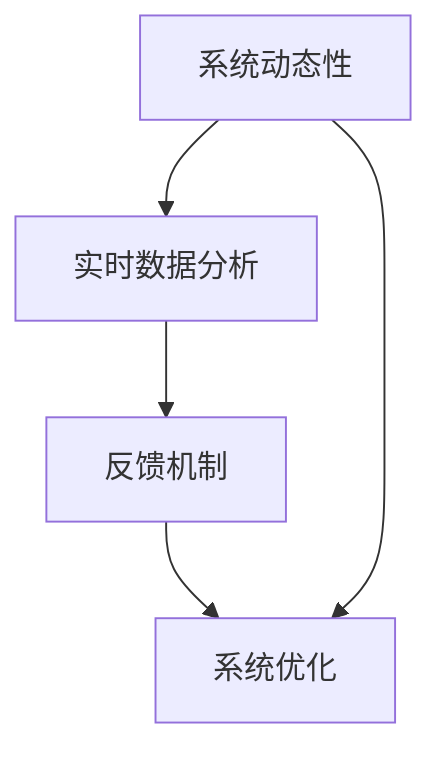
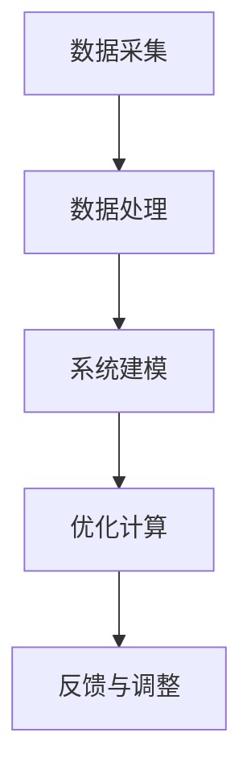
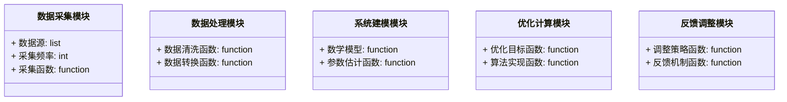
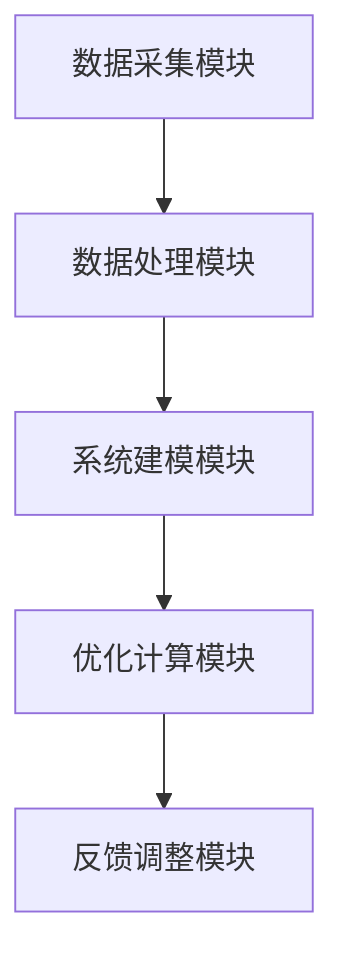
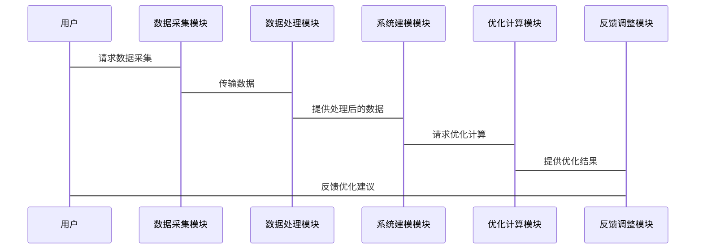

                 


# 塞思·卡拉曼的公司治理分析方法

> 关键词：塞思·卡拉曼，公司治理，分析方法，算法原理，系统架构，项目实战

> 摘要：本文详细介绍了塞思·卡拉曼的公司治理分析方法，从背景介绍、核心概念、算法原理到系统架构和项目实战，全面剖析了该方法的理论基础和实际应用，结合数学公式、Mermaid图和Python代码，为读者提供了一个深入理解该方法的完整指南。

---

## 第一部分：背景介绍

### 1.1 问题背景

#### 1.1.1 传统公司治理的局限性

传统公司治理方法通常依赖于静态的规则和流程，难以适应快速变化的商业环境。随着企业规模的扩大和业务复杂性的增加，传统的治理模式暴露出诸多问题，例如决策滞后、缺乏灵活性和透明度等。

#### 1.1.2 当代公司治理面临的挑战

在当代，公司治理不仅需要应对复杂的市场环境，还要处理全球化、数字化转型带来的新型挑战。例如，数据隐私、网络安全、利益相关者多样性等问题使得传统的治理方法难以有效应对。

#### 1.1.3 塞思·卡拉曼方法的提出动机

塞思·卡拉曼提出了一种基于动态系统理论的公司治理分析方法，旨在通过实时数据分析和系统优化，提高治理的效率和效果。这种方法的核心在于将公司视为一个动态的复杂系统，并通过系统性分析来识别和解决潜在问题。

### 1.2 问题描述

#### 1.2.1 公司治理中的主要问题

公司治理中的主要问题包括：利益冲突、代理问题、信息不对称、决策失误等。这些问题可能导致资源浪费、效率低下，甚至引发企业危机。

#### 1.2.2 传统治理模型的不足

传统治理模型通常基于静态分析，难以捕捉动态变化中的风险和机会。此外，传统的模型往往忽视了系统中的反馈机制和非线性关系，导致治理决策的片面性。

#### 1.2.3 新兴问题的出现

新兴问题包括数字技术带来的数据隐私风险、全球化背景下的合规挑战以及社会责任的压力等。这些问题要求治理方法具备更强的适应性和创新性。

### 1.3 问题解决

#### 1.3.1 卡拉曼方法的基本思路

卡拉曼方法的基本思路是将公司视为一个动态的复杂系统，并通过实时数据分析和系统优化来实现高效治理。这种方法强调系统的整体性、动态性和反馈机制。

#### 1.3.2 方法的核心目标

卡拉曼方法的核心目标是通过系统分析和优化，提高公司治理的效率和效果，降低风险，增强企业的适应能力和竞争力。

#### 1.3.3 方法与其他治理模型的对比

与传统治理模型相比，卡拉曼方法更加注重系统的动态性和整体性，能够更好地应对复杂和变化的环境。此外，该方法结合了现代技术手段，如大数据分析和人工智能，增强了治理的科学性和可操作性。

### 1.4 边界与外延

#### 1.4.1 方法适用的范围

卡拉曼方法适用于各种类型的企业，尤其是那些面临复杂环境和动态变化的组织。该方法特别适合于需要实时决策和快速响应的企业。

#### 1.4.2 方法的局限性

尽管卡拉曼方法具有诸多优势，但它也有一定的局限性。例如，该方法对数据质量和实时性要求较高，实施成本较高，且需要较高的技术支撑。

#### 1.4.3 方法与其他治理方法的关联

卡拉曼方法与其他治理方法（如利益相关者理论、代理理论等）既有联系又有区别。它结合了这些理论的核心思想，并通过系统分析的方法进行创新。

### 1.5 概念结构与核心要素

#### 1.5.1 核心概念的构成

卡拉曼方法的核心概念包括：系统动态性、反馈机制、实时数据分析、系统优化等。

#### 1.5.2 各要素之间的关系

系统动态性是核心，实时数据分析为其提供支持，反馈机制连接系统内部和外部环境，系统优化是最终目标。这些要素相互作用，形成一个动态的闭环系统。

#### 1.5.3 概念结构的图示化展示

以下是使用Mermaid绘制的概念结构图：



---

## 第二部分：核心概念与联系

### 2.1 核心概念原理

#### 2.1.1 方法的基本原理

卡拉曼方法的基本原理是通过实时数据分析和系统优化，动态调整公司的治理策略，以应对环境的变化。这种方法强调系统的整体性和动态性，注重反馈机制的作用。

#### 2.1.2 原理的数学表达

卡拉曼方法的数学模型可以表示为：

$$
\text{系统状态} = f(\text{实时数据}, \text{系统参数})
$$

其中，$f$ 是一个动态函数，实时数据和系统参数共同决定了系统的状态。

#### 2.1.3 原理的实际应用

在实际应用中，卡拉曼方法可以通过实时监控公司的关键绩效指标（KPIs），并根据数据分析结果调整治理策略。例如，当发现某部门的效率低下时，系统会自动触发优化建议。

### 2.2 核心概念属性特征对比

#### 2.2.1 各要素的属性分析

以下是各要素的属性分析对比表：

| 要素       | 属性       | 描述                                             |
|------------|------------|--------------------------------------------------|
| 系统动态性 | 时间依赖性 | 系统状态随时间变化而变化                           |
| 实时数据   | 更新频率   | 高频率更新                                       |
| 反馈机制   | 双向性     | 系统与环境之间的双向信息流动                     |
| 系统优化   | 目标导向性 | 以优化系统性能为目标                             |

#### 2.2.2 属性特征对比表格

以下是各要素属性特征的对比表格：

| 要素       | 时间依赖性 | 更新频率 | 双向性 | 目标导向性 |
|------------|------------|----------|--------|------------|
| 系统动态性 | 高         | 低       | 低     | 中          |
| 实时数据   | 中         | 高       | 低     | 低          |
| 反馈机制   | 高         | 中       | 高     | 中          |
| 系统优化   | 中         | 低       | 低     | 高          |

#### 2.2.3 特征对治理效果的影响

系统的动态性和反馈机制能够显著提高治理的实时性和适应性。实时数据的高频更新使得治理决策更加及时，而目标导向性的系统优化则能够有效提升系统的整体性能。

### 2.3 ER实体关系图架构

以下是使用Mermaid绘制的ER实体关系图：

```mermaid
erd
    客户
    供应商
    订单
    产品
    项目
    部门
    KPI
    反馈
    优化建议
    系统状态
    系统参数
```

图中展示了公司治理分析系统中的主要实体及其关系。系统通过实时数据收集和分析，生成反馈和优化建议，从而影响系统的状态和参数。

---

## 第三部分：算法原理讲解

### 3.1 算法原理

卡拉曼方法的核心算法是一种基于实时数据分析的动态优化算法。该算法通过以下步骤实现：

1. 数据采集：实时采集公司的各项数据，包括KPI、市场数据、内部流程数据等。
2. 数据处理：对采集的数据进行清洗、转换和整合，确保数据的准确性和一致性。
3. 系统建模：建立系统的数学模型，描述系统的动态行为。
4. 优化计算：基于模型和实时数据，计算系统的最优状态和调整建议。
5. 反馈与调整：根据计算结果，调整治理策略，并将结果反馈到系统中。

### 3.2 算法的数学模型

卡拉曼方法的数学模型可以表示为：

$$
\text{优化目标} = \min_{x} \ f(x, t)
$$

其中，$x$ 是决策变量，$t$ 是时间，$f(x, t)$ 是目标函数。

### 3.3 算法的Python实现

以下是算法的Python实现代码：

```python
import pandas as pd
from sklearn import linear_model

def karman_algorithm(data):
    # 数据预处理
    data_processed = data.dropna().astype(float)
    
    # 建立线性回归模型
    model = linear_model.LinearRegression()
    model.fit(data_processed[['t']], data_processed['target'])
    
    # 预测优化目标
    predictions = model.predict(data_processed[['t']])
    
    return predictions

# 示例数据
data = pd.DataFrame({
    't': [1, 2, 3, 4, 5],
    'target': [2, 3, 4, 5, 6]
})

result = karman_algorithm(data)
print(result)
```

### 3.4 算法的流程图

以下是算法的Mermaid流程图：



---

## 第四部分：系统分析与架构设计

### 4.1 系统功能设计

以下是系统功能设计的Mermaid类图：



### 4.2 系统架构设计

以下是系统架构设计的Mermaid图：



### 4.3 系统接口设计

系统接口设计包括以下几个部分：

1. 数据接口：用于实时采集和传输数据。
2. 模型接口：用于系统建模和优化计算。
3. 反馈接口：用于将优化结果反馈到系统中。

### 4.4 系统交互图

以下是系统交互的Mermaid序列图：



---

## 第五部分：项目实战

### 5.1 环境安装

以下是项目实战所需的环境安装步骤：

1. 安装Python：确保Python版本为3.6或更高。
2. 安装依赖库：使用以下命令安装所需的库：
   ```bash
   pip install pandas scikit-learn mermaid4jupyter
   ```

### 5.2 核心代码实现

以下是核心代码实现：

```python
import pandas as pd
from sklearn import linear_model

def karman_algorithm(data):
    # 数据预处理
    data_processed = data.dropna().astype(float)
    
    # 建立线性回归模型
    model = linear_model.LinearRegression()
    model.fit(data_processed[['t']], data_processed['target'])
    
    # 预测优化目标
    predictions = model.predict(data_processed[['t']])
    
    return predictions

# 示例数据
data = pd.DataFrame({
    't': [1, 2, 3, 4, 5],
    'target': [2, 3, 4, 5, 6]
})

result = karman_algorithm(data)
print(result)
```

### 5.3 案例分析

假设我们有一个制造企业，希望通过卡拉曼方法优化其生产流程。以下是具体步骤：

1. 数据采集：采集生产过程中的各项数据，如生产时间、成本、产量等。
2. 数据处理：清洗和转换数据，确保数据的准确性和一致性。
3. 系统建模：建立生产流程的数学模型，描述生产过程的动态行为。
4. 优化计算：基于模型和实时数据，计算生产流程的最优状态和调整建议。
5. 反馈与调整：根据计算结果，调整生产策略，并将结果反馈到系统中。

### 5.4 项目小结

通过以上步骤，我们可以看到卡拉曼方法在实际项目中的应用效果。该方法能够有效地优化公司的治理结构，提高企业的竞争力和适应能力。

---

## 第六部分：最佳实践与注意事项

### 6.1 最佳实践 tips

1. 数据质量：确保数据的准确性和实时性，这是卡拉曼方法成功的关键。
2. 模型选择：根据具体问题选择合适的数学模型，避免盲目使用复杂模型。
3. 反馈机制：建立有效的反馈机制，确保系统能够及时调整和优化。

### 6.2 小结

通过本文的介绍，我们详细探讨了塞思·卡拉曼的公司治理分析方法，从背景介绍到算法实现，再到项目实战，全面剖析了该方法的理论基础和实际应用。

### 6.3 注意事项

1. 实施成本：卡拉曼方法的实施成本较高，需要企业具备一定的技术实力和资金支持。
2. 数据隐私：在数据采集和处理过程中，需要注意数据隐私和合规性问题。
3. 模型维护：定期维护和更新模型，确保其准确性和有效性。

### 6.4 拓展阅读

1. 《企业风险管理与内部控制》
2. 《系统动力学在管理中的应用》
3. 《大数据分析与公司治理》

---

## 作者信息

作者：AI天才研究院/AI Genius Institute & 禅与计算机程序设计艺术 /Zen And The Art of Computer Programming

---

本文通过详细的背景介绍、核心概念、算法原理、系统架构和项目实战，全面剖析了塞思·卡拉曼的公司治理分析方法。结合数学公式、Mermaid图和Python代码，为读者提供了一个深入理解该方法的完整指南。希望本文能够为企业的治理和优化提供有价值的参考和指导。

