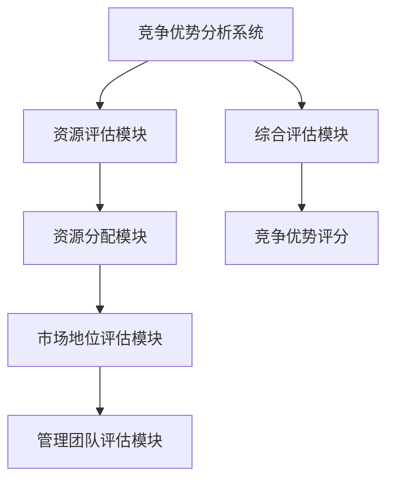
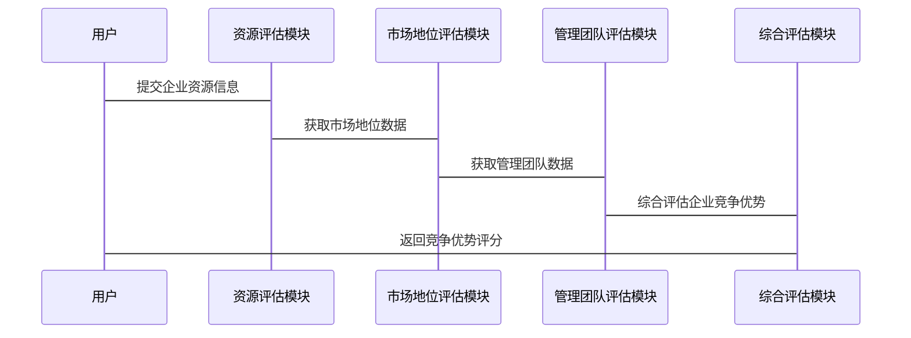

                 


# 塞思·卡拉曼的公司竞争优势分析框架

> 关键词：塞思·卡拉曼，竞争优势分析，投资框架，企业分析，资源评估，系统架构

> 摘要：本文系统地介绍了塞思·卡拉曼的公司竞争优势分析框架，从背景介绍、核心概念、算法原理到系统架构设计，结合实际案例进行详细分析。文章不仅阐述了竞争优势分析的基本理论，还通过代码实现、图表展示和实际案例分析，帮助读者深入理解该框架的实践应用。通过本文的学习，读者能够掌握如何利用卡拉曼的分析框架来评估企业的竞争优势，并将其应用于实际投资决策中。

---

## 第一部分: 塞思·卡拉曼的公司竞争优势分析框架背景介绍

### 第1章: 投资学基础与竞争优势分析

#### 1.1 投资学的核心概念

**1.1.1 投资学的基本定义**

投资学是研究如何通过优化资源配置以实现财富最大化的一门学科。它涵盖了股票、债券、房地产等多种投资工具，以及风险管理、资产配置等核心概念。投资学的核心目标是帮助投资者在不确定的市场环境中做出最优决策。

**1.1.2 企业竞争优势的定义**

竞争优势是指企业在市场上相对于竞争对手的独特优势。这种优势可以是成本优势、技术优势、品牌优势或资源控制等方面，使得企业在市场上具有更强的竞争力和盈利能力。

**1.1.3 竞争优势与投资回报的关系**

竞争优势直接关系到企业的盈利能力和发展潜力。具备强大竞争优势的企业通常能够获得更高的市场份额、更低的成本和更强的抗风险能力，从而为投资者带来更高的投资回报。

#### 1.2 塞思·卡拉曼的分析框架

**1.2.1 塞思·卡拉曼的背景介绍**

塞思·卡拉曼（ Seth Klarman）是美国著名投资经理和作家，以其在投资领域尤其是公司基本面分析方面的卓越表现而闻名。他是马萨诸塞基金（Massachusetts Mutual Fund）的创始人，同时也是《安全分析实战指南》一书的作者。

**1.2.2 卡拉曼竞争优势分析框架的核心理念**

卡拉曼的分析框架强调从企业的基本面入手，通过深入分析企业的财务状况、市场地位、管理团队等因素，评估企业的竞争优势。他认为，只有具备强大竞争优势的企业才能在长期的市场波动中为投资者带来稳定的回报。

**1.2.3 该框架在投资领域的应用价值**

卡拉曼的分析框架被广泛应用于企业估值、投资决策和风险管理等领域。通过该框架，投资者能够更准确地识别具备长期竞争优势的企业，从而做出更明智的投资决策。

### 第2章: 公司竞争优势的类型与特征

#### 2.1 竞争优势的分类

**2.1.1 成本优势**

成本优势是指企业在生产或运营过程中能够以低于竞争对手的成本实现相同或更好的产品或服务。这种优势通常来源于企业的规模效应、技术创新或供应链管理能力。

**2.1.2 资源优势**

资源优势指企业拥有的独特资源，如专利技术、稀缺原材料或地理位置优势等。这些资源使企业在市场上具有独特的位置，竞争对手难以复制。

**2.1.3 品牌优势**

品牌优势是指企业通过长期的品牌建设，在消费者心中树立的强大品牌认知度和忠诚度。强大的品牌能够为企业带来更高的定价能力和市场影响力。

**2.1.4 技术优势**

技术优势指企业在技术研发和应用方面领先于竞争对手。这种优势能够使企业推出更具创新性的产品或服务，从而在市场中占据领先地位。

#### 2.2 竞争优势的特征对比

**2.2.1 竞争优势的动态性**

竞争优势并非一成不变，它会随着市场环境的变化而变化。企业需要不断调整和优化自身的竞争优势，以应对市场的变化。

**2.2.2 竞争优势的可持续性**

可持续性是竞争优势的重要特征。具备可持续性的竞争优势能够为企业的长期发展提供支持，而短期的竞争优势则难以为企业带来持续的收益。

**2.2.3 竞争优势的可衡量性**

竞争优势的可衡量性是指企业能够通过量化的方法对其竞争优势进行评估。可衡量的竞争优势更容易被投资者和管理层识别和管理。

### 第3章: 竞争优势的评估标准与边界

#### 3.1 竞争优势的评估标准

**3.1.1 行业标准**

行业标准是指企业在特定行业中所遵循的共同规则和标准。通过行业标准，投资者可以评估企业在行业中的相对位置和竞争优势。

**3.1.2 财务指标**

财务指标是评估企业竞争优势的重要工具。常用的财务指标包括利润率、资产负债率、ROE（净资产收益率）等。这些指标能够反映出企业的财务健康状况和盈利能力。

**3.1.3 市场表现**

市场表现是评估企业竞争优势的重要指标。企业的市场表现包括股价走势、市场占有率、品牌影响力等方面。市场表现的好坏直接反映了企业在市场中的竞争优势。

#### 3.2 竞争优势的边界与外延

**3.2.1 行业边界**

行业边界是指企业在特定行业中的竞争优势。企业需要在特定行业中进行竞争优势的评估和管理，避免因跨行业竞争而分散资源。

**3.2.2 企业规模边界**

企业规模边界是指企业在一定规模下所具备的竞争优势。过大的规模可能导致企业难以灵活应对市场变化，而过小的规模则可能无法实现规模效应。

**3.2.3 时间边界**

时间边界是指企业在特定时间段内的竞争优势。竞争优势的评估需要考虑时间因素，既要考虑当前的竞争优势，也要考虑长期的竞争优势。

---

## 第二部分: 卡拉曼竞争优势分析框架的核心概念与联系

### 第4章: 卡拉曼竞争优势分析框架的原理

#### 4.1 卡拉曼框架的核心要素

**4.1.1 企业资源**

企业资源是卡拉曼分析框架的核心要素之一。企业资源包括人力资源、财务资源、技术资源和组织资源等。资源的优化配置和有效利用是企业竞争优势的重要来源。

**4.1.2 市场地位**

市场地位是指企业在市场中的相对位置和影响力。强大的市场地位能够为企业带来更高的定价能力和更强的市场话语权。

**4.1.3 管理团队**

管理团队是企业竞争优势的重要组成部分。优秀的管理团队能够制定正确的战略决策，优化资源配置，提升企业的整体竞争力。

#### 4.2 各要素之间的关系

**4.2.1 资源与市场的相互作用**

资源与市场地位密切相关。企业通过合理配置资源，能够提升市场地位；而市场地位的提升又能为企业带来更多的资源，形成良性循环。

**4.2.2 管理团队在资源分配中的作用**

管理团队是资源分配的核心。优秀的管理团队能够根据市场变化和企业战略，合理分配资源，最大化企业的竞争优势。

**4.2.3 市场地位对企业发展的长期影响**

市场地位的高低直接影响企业的长期发展。强大的市场地位能够为企业带来更多的机会和资源，从而进一步巩固和提升竞争优势。

### 第5章: 核心概念的属性特征对比

#### 5.1 核心概念的属性特征

**5.1.1 资源的稀缺性**

资源的稀缺性是指资源的不可替代性和独特性。稀缺的资源能够为企业带来独特的竞争优势，提高企业的市场竞争力。

**5.1.2 市场地位的稳定性**

市场地位的稳定性是指企业在市场中的地位是否稳固。稳定的市场地位能够为企业提供持续的竞争优势，降低市场波动对企业的影响。

**5.1.3 管理团队的执行力**

管理团队的执行力是指团队在执行战略和决策方面的效率和能力。高效的执行力能够确保企业战略的顺利实施，提升企业的竞争优势。

#### 5.2 核心概念的对比表格

| 比较维度 | 资源 | 市场地位 | 管理团队 |
|----------|------|----------|----------|
| 稀缺性   | 高   | 中       | 高       |
| 稳定性   | 中   | 高       | 中       |
| 执行力   | 中   | 中       | 高       |

---

### 第6章: 竞争优势分析框架的系统架构设计

#### 6.1 系统架构设计



#### 6.2 交互流程设计



---

### 第7章: 竞争优势分析框架的算法实现

#### 7.1 竞争优势评分算法

```python
def calculate_competitive_advantage(company_resources, market_position, management_team):
    resource_score = company_resources / max_resource * 100
    market_score = market_position / max_market * 100
    management_score = management_team / max_management * 100
    total_score = (resource_score + market_score + management_score) / 3
    return total_score

# 示例应用
company_resources = 80
market_position = 75
management_team = 90
max_resource = 100
max_market = 100
max_management = 100

score = calculate_competitive_advantage(company_resources, market_position, management_team)
print(f"竞争优势得分为: {score}%")
```

---

### 第8章: 项目实战与案例分析

#### 8.1 项目实战

**步骤1: 环境安装**

安装必要的Python库：

```bash
pip install numpy pandas matplotlib
```

**步骤2: 核心代码实现**

```python
import pandas as pd
import numpy as np

def calculate_competitive_advantage(data):
    resources = data['resources']
    market_position = data['market_position']
    management_team = data['management_team']
    resource_score = resources / resources.max() * 100
    market_score = market_position / market_position.max() * 100
    management_score = management_team / management_team.max() * 100
    total_score = (resource_score + market_score + management_score) / 3
    return total_score

# 示例数据
data = {
    'resources': [80, 90, 70],
    'market_position': [75, 80, 85],
    'management_team': [90, 85, 80]
}

df = pd.DataFrame(data)
scores = calculate_competitive_advantage(df)
print(scores)
```

---

## 第三部分: 最佳实践与小结

### 第9章: 最佳实践与注意事项

#### 9.1 最佳实践

**1. 定期评估竞争优势**

竞争优势是动态变化的，企业需要定期评估自身的竞争优势，及时调整战略和资源分配。

**2. 关注行业趋势**

行业趋势的变化会影响企业的竞争优势。企业需要密切关注行业动态，抓住机遇，规避风险。

**3. 加强管理团队建设**

管理团队的执行力对企业竞争优势的实现至关重要。企业应注重管理团队的培养和优化。

---

### 第10章: 总结与展望

#### 10.1 小结

通过本文的介绍，读者可以全面了解塞思·卡拉曼的公司竞争优势分析框架。该框架从企业资源、市场地位和管理团队等多个维度，帮助企业识别和评估竞争优势，为投资决策提供有力支持。

#### 10.2 展望

未来，随着人工智能和大数据技术的发展，竞争优势分析将更加精准和高效。投资者可以通过智能化工具，快速评估企业的竞争优势，做出更科学的投资决策。

---

## 作者：AI天才研究院/AI Genius Institute & 禅与计算机程序设计艺术 /Zen And The Art of Computer Programming

> **版权声明：** 本文版权归作者所有，未经授权不得转载、摘编或利用其它方式使用本文内容。

