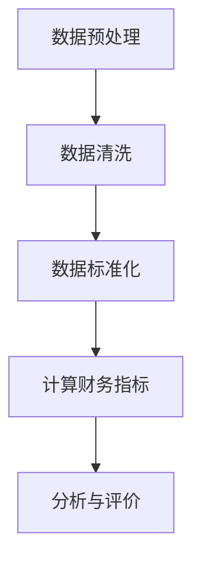
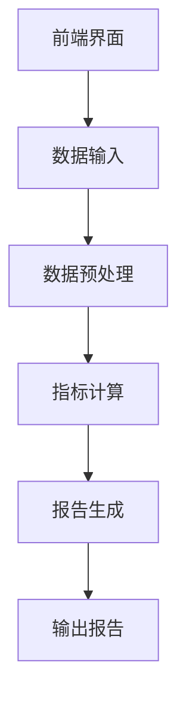
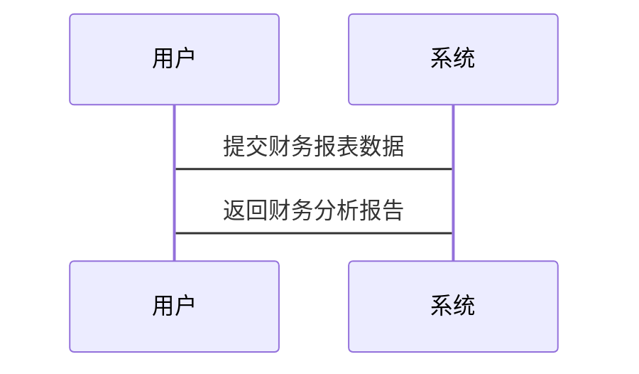

                 


# 塞思·卡拉曼的公司财务报表深度解析

## 关键词：财务报表分析，塞思·卡拉曼，财务指标，数据分析，Python编程

## 摘要：  
本文深入解析塞思·卡拉曼的公司财务报表分析方法，从财务报表的基本概念到复杂的数学模型，结合实际案例，系统性地讲解如何通过财务报表分析企业经营状况。文章内容涵盖数据预处理、财务指标计算、数学模型建立、系统架构设计以及项目实战，旨在帮助读者掌握财务报表分析的核心技巧和实际应用。

---

## 第1章: 公司财务报表概述

### 1.1 财务报表的基本概念

#### 1.1.1 财务报表的定义与作用  
财务报表是企业财务状况、经营成果和现金流量的正式记录，是企业对外信息披露的重要文件。财务报表的主要作用包括：  
1. 为投资者提供投资决策依据。  
2. 为债权人评估企业信用状况提供参考。  
3. 为管理层制定经营策略提供数据支持。  

#### 1.1.2 财务报表的主要类型  
1. **资产负债表（Balance Sheet）**：反映企业在某一特定日期的资产、负债和所有者权益的状况。  
2. **利润表（Income Statement）**：反映企业在一定会计期间的收入、费用和利润情况。  
3. **现金流量表（Cash Flow Statement）**：反映企业在一定会计期间的现金流入和流出情况。  

#### 1.1.3 财务报表的使用者与目的  
1. **外部使用者**：投资者、债权人、监管机构等，主要用于评估企业的财务健康状况和投资价值。  
2. **内部使用者**：企业管理层，主要用于内部决策和业绩评价。  

---

### 1.2 财务报表的核心要素

#### 1.2.1 资产、负债、所有者权益的定义与关系  
- **资产**：企业拥有的资源，预期能够带来经济利益的流入。  
- **负债**：企业承担的义务，预期会导致经济利益的流出。  
- **所有者权益**：资产减去负债后的剩余部分，表示所有者对企业净资产的要求权。  

关系：  
$$ 资产 = 负债 + 所有者权益 $$  

#### 1.2.2 收入、费用与利润的关系  
- **收入**：企业在日常经营活动中产生的经济利益流入。  
- **费用**：企业为取得收入而发生的经济利益流出。  
- **利润**：收入减去费用后的净额。  

关系：  
$$ 利润 = 收入 - 费用 $$  

#### 1.2.3 财务报表的编制基础与假设  
1. 历史成本原则：资产按取得时的实际成本计量。  
2. 会计分期原则：将企业持续的经营过程划分为会计期间。  
3. 货币计量原则：以货币为单位反映企业财务状况。  

---

### 1.3 财务报表分析的基本方法

#### 1.3.1 比较分析法  
将企业的财务数据与行业平均值、竞争对手或自身历史数据进行对比，识别差异并分析其原因。  

#### 1.3.2 趋势分析法  
通过分析企业在不同会计期间的财务数据，识别其发展趋势和变化规律。  

#### 1.3.3 假设分析法  
假设企业在未来某段时间内保持当前的经营状况，预测其未来的财务表现。  

---

## 第2章: 财务报表的核心概念与联系

### 2.1 财务报表的核心概念

#### 2.1.1 资产负债表的核心要素  
- **流动资产**：可以在一年内转换为现金的资产，如现金、应收账款、存货等。  
- **非流动资产**：无法在一年内转换为现金的资产，如固定资产、无形资产等。  

#### 2.1.2 利润表的核心要素  
- **营业收入**：企业主营业务收入。  
- **营业成本**：主营业务相关的成本。  
- **净利润**：利润表的核心指标，反映企业最终的经营成果。  

#### 2.1.3 现金流量表的核心要素  
- **经营活动现金流**：企业日常经营活动中产生的现金流。  
- **投资活动现金流**：企业投资活动产生的现金流。  
- **筹资活动现金流**：企业筹资活动产生的现金流。  

---

### 2.2 财务报表之间的关系

#### 2.2.1 资产负债表与利润表的联系  
利润表的净利润是资产负债表中所有者权益变动的重要来源。  

关系：  
$$ 净利润 = 期末所有者权益 - 期初所有者权益 - 其他权益变动 $$  

#### 2.2.2 利润表与现金流量表的联系  
利润表中的净利润与现金流量表中的经营活动现金流密切相关。  

关系：  
$$ 经营活动现金流 = 净利润 + 非现金费用 - 存货变化 - 应收账款变化 $$  

#### 2.2.3 资产负债表与现金流量表的联系  
现金流量表中的现金及现金等价物净增加额应与资产负债表中的货币资金变动一致。  

关系：  
$$ 现金及现金等价物净增加额 = 期末货币资金 - 期初货币资金 $$  

---

### 2.3 财务报表分析的框架

#### 2.3.1 财务报表分析的步骤  
1. 收集数据：获取企业的财务报表和相关资料。  
2. 数据清洗：处理缺失值、异常值等问题。  
3. 计算财务指标：如ROE、ROA等。  
4. 分析与评价：结合行业标准和企业实际情况进行分析。  

#### 2.3.2 财务指标的分类与作用  
1. **盈利能力指标**：如净利润率、ROE。  
2. **营运能力指标**：如存货周转率、应收账款周转率。  
3. **偿债能力指标**：如资产负债率、流动比率。  

#### 2.3.3 财务报表分析的局限性  
1. 财务报表数据可能存在主观判断和估计。  
2. 财务报表反映的是过去的情况，无法完全预测未来。  
3. 不同行业和企业规模的财务指标标准不同。  

---

## 第3章: 财务报表分析的算法原理

### 3.1 数据预处理与清洗

#### 3.1.1 数据清洗的基本方法  
1. 删除重复数据。  
2. 处理缺失值：如删除、插值等。  
3. 标准化数据：统一单位和格式。  

#### 3.1.2 数据标准化与归一化  
标准化：  
$$ z = \frac{x - \mu}{\sigma} $$  
归一化：  
$$ x_{\text{归一化}} = \frac{x - \min(x)}{\max(x) - \min(x)} $$  

#### 3.1.3 数据缺失值的处理  
1. 删除含有缺失值的记录。  
2. 使用均值、中位数或插值方法填充缺失值。  

---

### 3.2 财务指标计算与分析

#### 3.2.1 常见财务指标的计算公式

##### 1. 净利润（Net Profit）  
$$ \text{净利润} = \text{营业收入} - \text{营业成本} - \text{税费} - \text{其他费用} $$  

##### 2. 净资产收益率（ROE）  
$$ \text{ROE} = \frac{\text{净利润}}{\text{平均股东权益}} $$  

##### 3. 资产负债率（Debt-to-Asset Ratio）  
$$ \text{资产负债率} = \frac{\text{总负债}}{\text{总资产}} $$  

---

#### 3.2.2 财务指标的分类与作用  
1. **盈利能力指标**：如ROE、净利润率，用于评估企业的盈利能力。  
2. **营运能力指标**：如存货周转率、应收账款周转率，用于评估企业的营运效率。  
3. **偿债能力指标**：如资产负债率、流动比率，用于评估企业的偿债能力。  

---

### 3.3 财务报表分析的流程图



---

### 3.4 本章小结  
本章详细介绍了财务报表分析中的数据预处理、财务指标计算以及分析流程。通过这些步骤，我们可以有效地从财务报表中提取有价值的信息，为企业决策提供支持。

---

## 第4章: 财务报表分析的数学模型与公式

### 4.1 常见财务指标的数学公式

#### 1. 净利润（Net Profit）  
$$ \text{净利润} = \text{营业收入} - \text{营业成本} - \text{税费} - \text{其他费用} $$  

#### 2. 净资产收益率（ROE）  
$$ \text{ROE} = \frac{\text{净利润}}{\text{平均股东权益}} $$  

#### 3. 资产负债率（Debt-to-Asset Ratio）  
$$ \text{资产负债率} = \frac{\text{总负债}}{\text{总资产}} $$  

---

### 4.2 财务指标的综合评价方法

#### 1. 加权平均法  
$$ \text{综合得分} = \sum (\text{权重}_i \times \text{指标得分}_i) $$  

#### 2. 层次分析法  
通过构建层次分析模型，确定各指标的权重，并进行综合评价。  

---

### 4.3 本章小结  
本章通过数学公式和模型，详细讲解了常见财务指标的计算方法和综合评价方法，为后续的财务分析提供了理论基础。

---

## 第5章: 系统分析与架构设计方案

### 5.1 系统功能设计

#### 5.1.1 领域模型设计  


#### 5.1.2 系统架构设计  


---

### 5.2 系统接口设计  
1. 数据输入接口：接收财务报表数据。  
2. 数据处理接口：执行数据清洗和标准化。  
3. 指标计算接口：计算各项财务指标。  
4. 报告生成接口：生成财务分析报告。  

---

### 5.3 系统交互设计  


---

### 5.4 本章小结  
本章通过系统架构设计，展示了如何构建一个完整的财务报表分析系统，并详细描述了系统的功能模块和接口设计。

---

## 第6章: 项目实战

### 6.1 环境安装与配置

#### 6.1.1 Python环境安装  
安装Python和必要的库：  
```bash
pip install numpy pandas matplotlib
```

#### 6.1.2 数据获取  
从企业公开的财务报表中获取数据，保存为Excel或CSV格式。  

---

### 6.2 系统核心实现源代码

#### 6.2.1 数据预处理代码  
```python
import pandas as pd

# 读取数据
df = pd.read_csv('financial_data.csv')

# 删除重复数据
df = df.drop_duplicates()

# 处理缺失值
df = df.dropna()

# 标准化数据
df['revenue'] = df['revenue'].str.strip().astype(float)
```

#### 6.2.2 指标计算代码  
```python
import numpy as np

# 计算净利润
df['net_profit'] = df['revenue'] - df['cost_of_goods_sold']

# 计算ROE
df['roe'] = df['net_profit'] / df['average_equity']
```

---

### 6.3 实际案例分析与解读  
以某公司为例，通过代码实现数据处理和指标计算，并生成财务分析报告。  

---

### 6.4 本章小结  
本章通过实际案例，展示了如何利用Python进行财务报表分析，并生成有价值的财务报告。

---

## 第7章: 最佳实践与总结

### 7.1 小结  
本文从财务报表的基本概念到复杂的数据分析方法，系统性地讲解了塞思·卡拉曼的财务报表分析方法，并通过实际案例展示了如何将理论应用于实践。

### 7.2 注意事项  
1. 数据分析需要结合企业实际业务背景。  
2. 财务指标的计算和分析需要遵循会计准则和行业标准。  
3. 数据分析结果需要结合市场环境和企业战略进行解读。  

### 7.3 拓展阅读  
1. 《财务报表分析实务》  
2. 《数据驱动的财务分析》  
3. Python在财务分析中的应用  

---

## 作者：AI天才研究院/AI Genius Institute & 禅与计算机程序设计艺术 /Zen And The Art of Computer Programming

