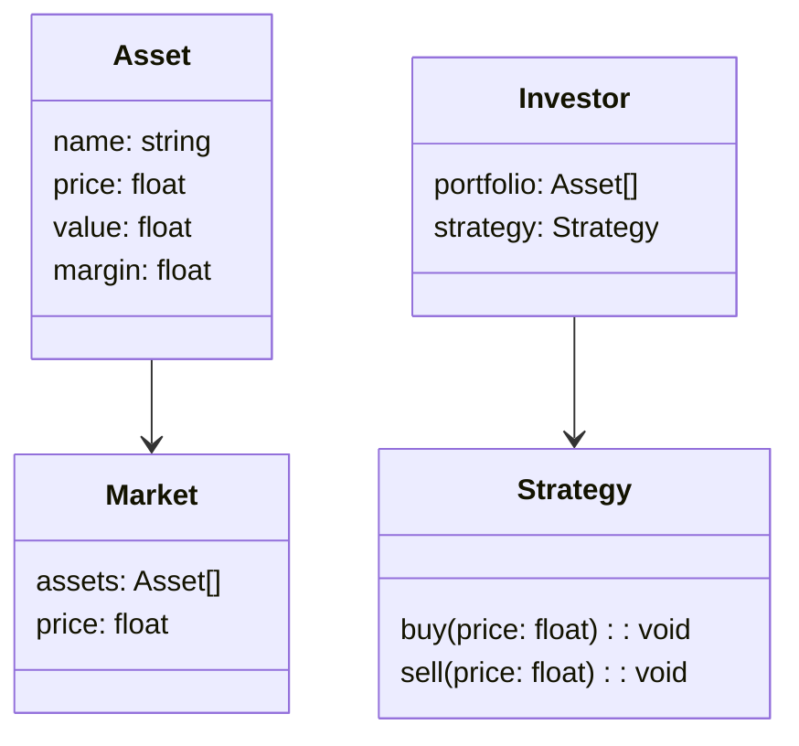
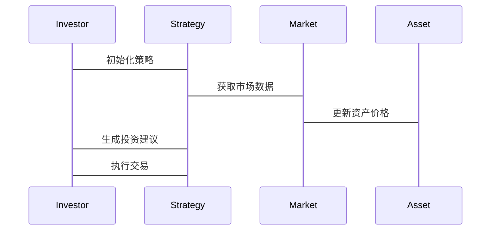

                 


# 塞思·卡拉曼的特殊情况投资

> **关键词**：特殊情况投资、安全边际、逆向思维、套利机会、投资策略、风险控制、价值投资

> **摘要**：本文深入探讨了塞思·卡拉曼的特殊情况投资方法，从定义、核心概念到算法原理、系统架构，再到项目实战和最佳实践，全面解析了特殊情况投资的理论与实践。通过详细分析，揭示了如何在特殊市场环境下，利用安全边际、逆向思维和套利机会等核心概念，制定有效的投资策略，从而在复杂多变的市场中实现稳健收益。

---

## 第1章：特殊情况投资的背景与核心概念

### 1.1 特殊情况投资的定义与背景

#### 1.1.1 投资的定义与分类
- **投资的定义**：投资是指将资金投入到特定资产或项目中，以期获得未来收益的行为。
- **投资的分类**：包括股票、债券、房地产、货币市场工具等。
- **特殊情况投资的特殊性**：在特殊市场环境下（如经济危机、行业衰退等）进行的投资，通常涉及低估资产或被市场忽视的机会。

#### 1.1.2 特殊情况投资的市场环境
- **市场周期**：经济周期波动对投资策略的影响。
- **特殊市场环境**：如疫情、战争、经济衰退等。
- **市场参与者的心理**：恐慌、贪婪等情绪对市场的影响。

#### 1.1.3 特殊情况投资的重要性
- **发现低估机会**：在市场恐慌时，许多优质资产被低估。
- **实现超额收益**：通过逆向投资，在市场底部买入，实现长期收益。
- **分散风险**：特殊情况投资可以作为传统投资的补充，降低整体投资组合的风险。

---

### 1.2 投资的基本原理

#### 1.2.1 投资的基本概念
- **资产定价**：资产的内在价值与市场价格的关系。
- **收益与风险**：收益与风险通常是正相关的。
- **时间价值**：资金的时间价值对投资决策的影响。

#### 1.2.2 投资的分类与特点
- **长期投资**：注重资产的内在价值，长期持有的策略。
- **短期投资**：利用市场波动进行短期获利。
- **特殊情况投资**：在特殊市场环境下进行的逆向投资。

#### 1.2.3 投资的基本原则
- **分散投资**：避免过度集中于单一资产或行业。
- **长期持有**：耐心等待市场回归理性。
- **价值投资**：关注资产的内在价值，而非市场价格。

---

### 1.3 特殊情况投资的核心概念

#### 1.3.1 安全边际
- **定义**：安全边际是指资产的市场价格低于其内在价值的部分，是投资中的“安全垫”。
- **作用**：减少投资的波动性，降低风险。
- **计算公式**：$$ \text{安全边际} = \text{内在价值} - \text{市场价格} $$

#### 1.3.2 逆向思维
- **定义**：逆向思维是指在市场恐慌时买入，在市场狂热时卖出。
- **优势**：能够在市场底部发现低估资产，实现超额收益。
- **挑战**：需要克服市场的短期波动，坚持长期投资理念。

#### 1.3.3 套利机会
- **定义**：套利是指利用市场价差进行无风险或低风险投资，获取收益。
- **类型**：包括跨市场套利、跨期套利、 arbitrage 等。
- **风险**：套利机会的存在时间有限，需快速反应。

---

## 第2章：特殊情况投资的核心原理

### 2.1 投资决策的逻辑框架

#### 2.1.1 投资决策的基本逻辑
- **第一步**：识别市场机会。
- **第二步**：评估资产的内在价值。
- **第三步**：判断市场价格与内在价值的偏离程度。
- **第四步**：制定投资策略。

#### 2.1.2 特殊情况投资的决策流程
1. **识别特殊市场环境**。
2. **寻找被低估的资产**。
3. **评估安全边际**。
4. **制定投资计划**。

#### 2.1.3 投资决策中的关键因素
- **内在价值**：资产的真正价值。
- **市场价格**：市场的定价偏差。
- **安全边际**：投资的安全性。

---

### 2.2 投资组合管理

#### 2.2.1 投资组合的定义与作用
- **定义**：投资组合是指投资者持有的多种资产的组合。
- **作用**：分散风险，提高收益的稳定性。

#### 2.2.2 投资组合的优化方法
- **现代投资组合理论**：通过优化资产配置，降低风险。
- **特殊情况投资的组合优化**：在特殊市场环境下，增加低估资产的权重。

#### 2.2.3 投资组合的风险管理
- **风险分散**：通过多样化投资降低风险。
- **风险对冲**：利用衍生工具对冲市场风险。
- **定期调整**：根据市场变化，及时调整投资组合。

---

### 2.3 投资心理与行为

#### 2.3.1 投资者心理的定义
- **贪婪与恐惧**：投资者常见的两种心理。
- **过度自信**：对市场预测过于自信。

#### 2.3.2 心理偏差对投资决策的影响
- **羊群效应**：跟随市场潮流，忽视独立思考。
- **确认偏差**：倾向于寻找支持自己观点的信息。

#### 2.3.3 如何克服心理偏差
- **制定明确的投资计划**：避免情绪化决策。
- **坚持长期投资**：忽略短期市场波动。
- **持续学习**：提高自身的投资知识和能力。

---

## 第3章：特殊情况投资的数学模型与公式

### 3.1 安全边际的数学模型

#### 3.1.1 安全边际的计算公式
$$ \text{安全边际} = \text{内在价值} - \text{市场价格} $$

#### 3.1.2 安全边际的适用场景
- 市场恐慌时，安全边际较大。
- 资产价格被低估时，安全边际为正。

#### 3.1.3 安全边际的案例分析
假设某资产的内在价值为100元，市场价格为80元，其安全边际为20元。

---

### 3.2 套利机会的数学模型

#### 3.2.1 套利机会的识别公式
$$ \text{套利机会} = \text{市场价格差} \times \text{交易量} $$

#### 3.2.2 套利机会的收益计算
- **无风险套利**：收益等于价格差。
- **有风险套利**：收益减去风险成本。

#### 3.2.3 套利机会的风险评估
- **市场风险**：价格波动对套利收益的影响。
- **交易成本**：交易费用对套利收益的影响。

---

### 3.3 投资组合优化的数学模型

#### 3.3.1 投资组合优化的基本公式
$$ \text{最优组合} = \argmin_{w} \left( w^T \Sigma w \right) \text{ subject to } w^T \mu = \text{target return} $$

#### 3.3.2 投资组合优化的步骤
1. **确定目标收益**。
2. **计算资产的协方差矩阵**。
3. **求解优化问题**。

#### 3.3.3 投资组合优化的案例分析
假设资产A和B的协方差矩阵为：
$$ \Sigma = \begin{bmatrix} 0.04 & 0.02 \\ 0.02 & 0.06 \end{bmatrix} $$
目标收益为10%，求最优投资组合。

---

## 第4章：特殊情况投资的系统分析与架构设计

### 4.1 系统功能设计

#### 4.1.1 领域模型类图


#### 4.1.2 系统架构图
```mermaid
top
    Market
    Investor
    Strategy
    Asset
```

#### 4.1.3 系统接口设计
- **市场接口**：提供资产价格和市场数据。
- **投资者接口**：管理投资组合和交易策略。
- **策略接口**：执行买入和卖出操作。

---

### 4.2 系统交互设计

#### 4.2.1 系统交互序列图


---

## 第5章：特殊情况投资的项目实战

### 5.1 环境安装

#### 5.1.1 系统环境
- 操作系统：Linux/Windows/MacOS
- 开发工具：Python 3.8+
- 库：pandas、numpy、scipy

#### 5.1.2 安装步骤
```bash
pip install pandas numpy scipy
```

---

### 5.2 核心代码实现

#### 5.2.1 计算安全边际
```python
import pandas as pd

def calculate_margin(asset_value, asset_price):
    return asset_value - asset_price
```

#### 5.2.2 识别套利机会
```python
def identify_arbitrage机会(price1, price2):
    return abs(price1 - price2)
```

---

### 5.3 案例分析

#### 5.3.1 案例分析
假设某资产的内在价值为100元，市场价格为80元，其安全边际为20元。投资者可以在市场价格为80元时买入，待价格回归至100元时卖出，实现20%的收益。

---

### 5.4 项目小结

- **项目目标**：实现特殊情况投资的系统化管理。
- **项目成果**：开发了一个基于安全边际和套利机会的交易系统。
- **项目意义**：帮助投资者在特殊市场环境下实现稳健收益。

---

## 第6章：特殊情况投资的最佳实践

### 6.1 小结

- **核心要点**：安全边际、逆向思维和套利机会是特殊情况投资的核心。
- **成功关键**：坚持长期投资，避免短期波动的干扰。

### 6.2 注意事项

- **风险控制**：设置止损点，避免过度杠杆。
- **市场监控**：及时捕捉市场变化，调整投资策略。
- **持续学习**：保持对市场和投资策略的深入研究。

### 6.3 拓展阅读

- **推荐书籍**：
  - 《投资最重要的事》——彼得·林奇
  - 《价值投资实战策略》——塞思·卡拉曼
- **推荐网站**：
  - [www.investors.com](https://www.investors.com)
  - [www.valueinvestor.com](https://www.valueinvestor.com)

---

## 作者

作者：AI天才研究院/AI Genius Institute & 禅与计算机程序设计艺术 /Zen And The Art of Computer Programming

