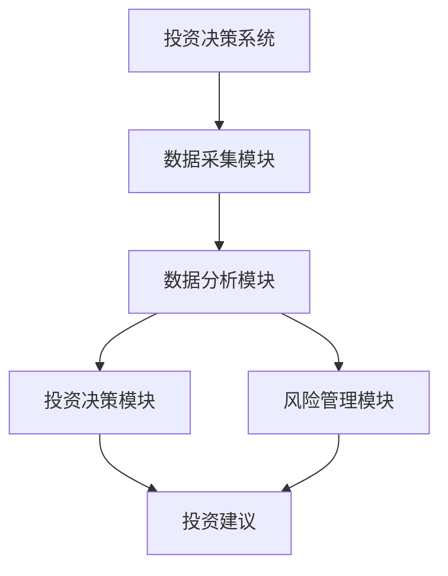
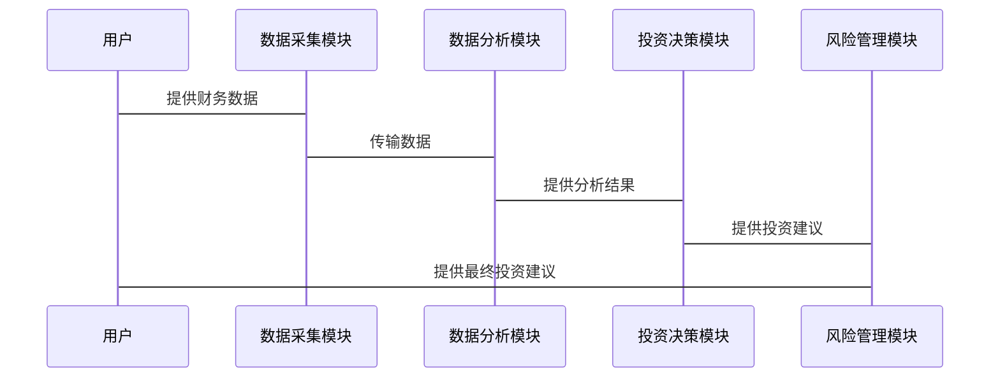

                 


# 塞思·卡拉曼的特殊情况投资案例研究

> 关键词：塞思·卡拉曼，特殊情况投资，价值投资，安全边际，内在价值，投资策略，投资模型

> 摘要：本文通过对塞思·卡拉曼的特殊情况投资案例研究，详细分析了其投资理念、方法论和具体操作策略。文章从塞思·卡拉曼的生平及投资哲学入手，结合具体的数学模型和算法，深入探讨了其独特的优势，包括内在价值评估、安全边际计算等核心概念，并通过实际案例分析和系统架构设计，展示了其投资方法的实际应用。最后，本文总结了塞思·卡拉曼投资的成功经验，并为读者提供了最佳实践建议。

---

## 第一部分: 塞思·卡拉曼投资方法论基础

### 第1章: 塞思·卡拉曼的生平与投资理念

#### 1.1 塞思·卡拉曼的生平简介

塞思·卡拉曼（Seth Klarman）是美国著名投资家，也是对冲基金公司Baupost Group的创始人和董事长。他于1956年出生在美国马萨诸塞州，早年就读于纽约大学，后转入塔夫茨大学，并于1981年获得塔夫茨大学的经济学学士学位。毕业后，他进入First Manhattan Corp工作，师从传奇投资家本杰明·格雷厄姆的学生杰拉尔德·洛布。1982年，他创立了Baupost Group，专注于特殊情况投资（special situation investing），即寻找市场低估的资产进行投资。

#### 1.2 特殊情况投资的定义与特点

特殊情况投资是一种以发现市场中被低估的投资机会为核心的投资策略。它通常涉及对陷入困境的企业、重组中的企业、破产企业等进行投资。与传统投资不同，特殊情况投资更注重于发现市场中的错价（mispricing）机会，而不是单纯依靠市场的趋势或公司的基本面。

#### 1.3 塞思·卡拉曼的投资理念

塞思·卡拉曼的投资理念可以总结为以下几个方面：

1. **价值投资**：卡拉曼坚信市场中存在被低估的资产，这些资产的内在价值远高于其市场价格。他通过深入分析企业的财务状况和市场环境，寻找这些错价机会。
2. **安全边际**：卡拉曼认为，投资的本质是在市场中找到安全边际（margin of safety）。他通过计算内在价值和市场价格之间的差距，确保投资的安全性。
3. **逆向思维**：卡拉曼善于在市场恐慌时寻找机会。他相信，当市场情绪低落时，许多优质资产会被错杀，这为特殊情况投资者提供了捡便宜的机会。

#### 1.4 本章小结

本章通过对塞思·卡拉曼的生平和投资理念的介绍，揭示了他成功的关键在于其独特的投资方法。他不仅注重对市场错价机会的发现，更注重通过深入分析和逆向思维来寻找投资机会。

---

## 第二部分: 特殊情况投资的核心概念与分析框架

### 第2章: 特殊情况投资的核心概念

#### 2.1 价值投资与成长投资的对比

| 对比维度         | 价值投资              | 成长投资              |
|------------------|-----------------------|-----------------------|
| 核心理念         | 寻找被低估的资产       | 寻找高成长的资产       |
| 投资策略         | 买入低于内在价值的资产 | 买入高成长潜力的资产   |
| 风险偏好         | 更注重安全边际         | 更注重成长潜力         |
| 适用场景         | 市场恐慌、资产低估     | 市场繁荣、成长预期高   |

#### 2.2 安全边际的数学模型

安全边际是价值投资中的一个重要概念，它表示资产的市场价格与内在价值之间的差距。公式如下：

$$ 安全边际 = 内在价值 - 市场价格 $$

其中，内在价值可以通过现金流折现法（DCF）进行计算：

$$ 内在价值 = \sum_{t=1}^{n} \frac{CF_t}{(1+r)^t} $$

其中，$CF_t$ 是第 $t$ 年的现金流，$r$ 是折现率。

#### 2.3 内在价值的评估方法

内在价值的评估方法主要包括以下几种：

1. **现金流折现法（DCF）**：通过预测企业未来现金流，并将其折现到现值。
2. **市盈率法**：通过比较企业的市盈率与行业平均水平，估算其内在价值。
3. **市净率法**：通过比较企业的市净率与行业平均水平，估算其内在价值。

#### 2.4 企业财务状况的分析框架

企业在进行财务分析时，通常需要从以下几个方面入手：

1. **资产负债表分析**：分析企业的资产、负债和所有者权益，评估企业的财务健康状况。
2. **利润表分析**：分析企业的收入、成本和利润，评估企业的盈利能力。
3. **现金流量表分析**：分析企业的现金流，评估企业的流动性。

#### 2.5 本章小结

本章通过对比价值投资和成长投资，详细介绍了安全边际的数学模型和内在价值的评估方法，并提出了企业财务状况的分析框架。这些内容为后续的特殊情况投资分析奠定了理论基础。

---

## 第三部分: 塞思·卡拉曼投资策略的数学模型与算法

### 第3章: 投资决策的数学模型

#### 3.1 内在价值评估的算法

现金流折现法（DCF）是一种常用的内在价值评估方法。其基本步骤如下：

1. **预测现金流**：根据企业的历史财务数据和未来发展规划，预测未来几年的现金流。
2. **选择折现率**：根据市场利率和企业的风险水平，选择合适的折现率。
3. **计算现值**：将未来现金流折现到当前时点，计算其现值。
4. **计算内在价值**：将所有现金流的现值相加，得到企业的内在价值。

以下是一个简单的现金流折现法的Python代码示例：

```python
def calculate_intrinsic_value(cash_flows, discount_rate):
    present_value = 0
    for t in range(len(cash_flows)):
        present_value += cash_flows[t] / (1 + discount_rate) ** t
    return present_value

# 示例数据
cash_flows = [100, 200, 300, 400]
discount_rate = 0.1

intrinsic_value = calculate_intrinsic_value(cash_flows, discount_rate)
print(f"内在价值为: ${intrinsic_value:.2f}")
```

#### 3.2 安全边际计算的算法

安全边际的计算公式为：

$$ 安全边际 = 内在价值 - 市场价格 $$

在实际操作中，投资者通常会选择内在价值至少比市场价格高30%以上的资产进行投资，以确保投资的安全性。

#### 3.3 投资组合优化的算法

投资组合优化的算法通常基于马科维茨的投资组合理论，其核心思想是通过优化资产配置，实现风险与收益的最佳平衡。以下是投资组合优化的Python代码示例：

```python
import numpy as np
import matplotlib.pyplot as plt

# 示例数据
returns = np.array([[0.1, 0.15, 0.05],
                    [0.08, 0.12, 0.07],
                    [0.06, 0.1, 0.08]])

# 计算协方差矩阵
cov_matrix = np.cov(returns)

# 计算投资组合的最优权重
weights = np.array([1/3, 1/3, 1/3])

# 计算投资组合的期望收益和风险
expected_return = np.dot(weights, np.mean(returns, axis=0))
risk = np.sqrt(np.dot(weights.T, np.dot(cov_matrix, weights)))

print(f"期望收益: {expected_return:.2f}")
print(f"风险: {risk:.2f}")
```

#### 3.4 本章小结

本章通过详细讲解内在价值评估、安全边际计算和投资组合优化的算法，为读者提供了塞思·卡拉曼投资策略的数学模型。这些模型可以用于实际投资中的定量分析。

---

## 第四部分: 系统分析与架构设计方案

### 第4章: 特殊情况投资的系统分析

#### 4.1 投资决策系统的功能设计

投资决策系统需要具备以下功能模块：

1. **数据采集模块**：采集企业的财务数据、市场数据等。
2. **数据分析模块**：对数据进行清洗、分析和建模。
3. **投资决策模块**：根据模型计算内在价值和安全边际，生成投资建议。
4. **风险管理模块**：对投资组合进行风险评估和优化。

#### 4.2 系统架构设计

以下是一个简单的系统架构图：



#### 4.3 系统交互设计

以下是一个系统交互序列图：



#### 4.4 本章小结

本章通过系统架构设计和交互流程图，展示了如何将塞思·卡拉曼的投资策略转化为一个可操作的投资决策系统。这些设计可以帮助投资者更高效地进行投资决策。

---

## 第五部分: 项目实战

### 第5章: 系统实现与案例分析

#### 5.1 项目环境安装

以下是Python环境的安装步骤：

1. 下载并安装Python 3.x。
2. 安装必要的库，如`numpy`, `pandas`, `matplotlib`等。
3. 配置Python环境变量。

#### 5.2 系统核心实现源代码

以下是内在价值计算的Python代码：

```python
import numpy as np

def calculate_intrinsic_value(cash_flows, discount_rate):
    present_value = 0
    for t in range(len(cash_flows)):
        present_value += cash_flows[t] / (1 + discount_rate) ** t
    return present_value

# 示例数据
cash_flows = [100, 200, 300, 400]
discount_rate = 0.1

intrinsic_value = calculate_intrinsic_value(cash_flows, discount_rate)
print(f"内在价值为: ${intrinsic_value:.2f}")
```

#### 5.3 案例分析与详细解读

以通用汽车的重整为例，假设通用汽车的现金流如下：

$$ \text{CF}_1 = 50, \text{CF}_2 = 100, \text{CF}_3 = 150 $$

假设折现率为10%，则其内在价值为：

$$ \text{内在价值} = \frac{50}{1.1} + \frac{100}{1.1^2} + \frac{150}{1.1^3} \approx 210.21 $$

如果通用汽车的市场价格为180美元，则安全边际为：

$$ \text{安全边际} = 210.21 - 180 = 30.21 $$

这表明通用汽车的投资具有较高的安全边际。

#### 5.4 本章小结

本章通过具体的案例分析，展示了如何将塞思·卡拉曼的投资策略应用于实际投资中。通过代码实现和案例分析，读者可以更好地理解其投资方法的实际应用。

---

## 第六部分: 最佳实践与总结

### 第6章: 最佳实践与总结

#### 6.1 最佳实践

1. **注重安全边际**：在投资决策中，始终关注资产的内在价值与市场价格之间的差距，确保投资的安全性。
2. **逆向思维**：在市场恐慌时寻找机会，避免随大流。
3. **深入分析**：对企业的财务状况进行深入分析，确保投资决策的准确性。

#### 6.2 小结

通过对塞思·卡拉曼的特殊情况投资案例研究，我们可以得出以下结论：

1. 塞思·卡拉曼的成功在于其独特的投资方法和对市场的深刻理解。
2. 投资者在实际操作中，应注重内在价值评估和安全边际计算。
3. 通过系统化的方法和工具，可以提高投资决策的效率和准确性。

#### 6.3 注意事项

1. 投资有风险，需谨慎操作。
2. 保持对市场的敏感性，及时调整投资策略。
3. 避免过度依赖单一投资策略，应根据市场环境进行灵活调整。

#### 6.4 拓展阅读

- 《The Most Successful Investors in History》
- 《Security Analysis》 by Benjamin Graham and David Dodd
- 《Value Investing: Common Stocks as Long-Term Investments》

---

## 作者

作者：AI天才研究院/AI Genius Institute & 禅与计算机程序设计艺术 /Zen And The Art of Computer Programming

---

通过以上分析，我们可以看到塞思·卡拉曼的特殊情况投资策略不仅具有深厚的理论基础，还具有很强的实践性。希望本文能为读者提供有价值的参考和启发。

