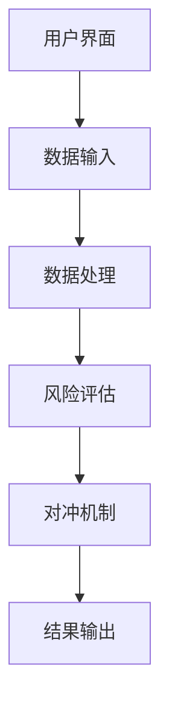
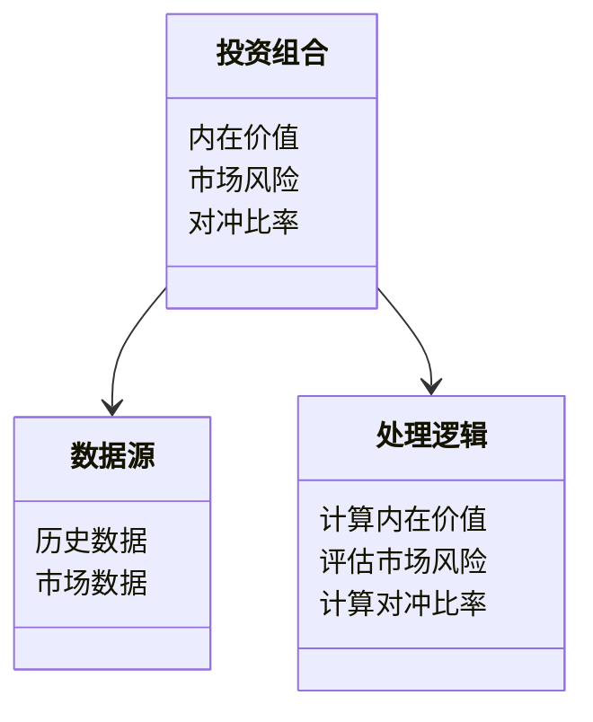
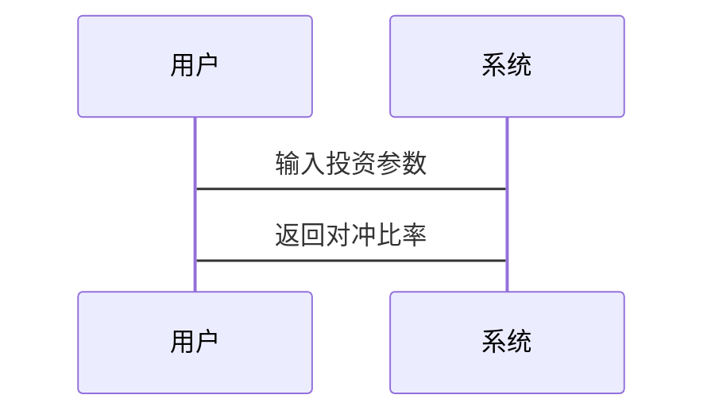

                 


# 第一部分: 特殊情况投资策略概述

# 第1章: 特殊情况投资的背景与定义

## 1.1 特殊情况投资的定义
### 1.1.1 特殊情况投资的核心概念
### 1.1.2 特殊情况投资的特点与边界
### 1.1.3 特殊情况投资的分类与外延

## 1.2 塞思·卡拉曼的特殊情况投资策略
### 1.2.1 塞思·卡拉曼的生平与投资理念
### 1.2.2 特殊情况投资的起源与发展
### 1.2.3 塞思·卡拉曼策略的核心要素

## 1.3 特殊情况投资的市场环境
### 1.3.1 当前市场环境对特殊情况投资的影响
### 1.3.2 特殊情况投资的周期性分析
### 1.3.3 特殊情况投资的未来趋势

# 第2章: 塞思·卡拉曼投资策略的核心概念

## 2.1 安全边际
### 2.1.1 安全边际的定义与作用
### 2.1.2 安全边际的计算方法
### 2.1.3 安全边际与投资风险的关系

## 2.2 逆向投资
### 2.2.1 逆向投资的定义与特点
### 2.2.2 逆向投资的核心逻辑
### 2.2.3 逆向投资与传统投资的区别

## 2.3 对冲机制
### 2.3.1 对冲机制的定义与作用
### 2.3.2 对冲机制的数学模型
### 2.3.3 对冲机制在特殊情况投资中的应用

# 第3章: 特殊情况投资的数学模型与算法

## 3.1 价值评估模型
### 3.1.1 价值评估模型的定义与作用
### 3.1.2 价值评估模型的数学公式
$$ V = \frac{CF}{(r - g) } $$
### 3.1.3 价值评估模型的实现步骤

## 3.2 风险评估模型
### 3.2.1 风险评估模型的定义与作用
### 3.2.2 风险评估模型的数学公式
$$ R = \sqrt{ \sum_{i=1}^{n} (w_i \cdot \sigma_i^2) } $$
### 3.2.3 风险评估模型的实现步骤

## 3.3 对冲机制的算法实现
### 3.3.1 对冲机制的算法流程
### 3.3.2 对冲机制的代码实现
```python
def calculate_hedge_ratio(risk_exposure, correlation):
    return risk_exposure * correlation
```

## 3.4 基于Mermaid的算法流程图
```mermaid
graph TD
    A[开始] -> B[计算内在价值]
    B -> C[评估市场风险]
    C -> D[计算对冲比率]
    D -> E[结束]
```

# 第4章: 系统分析与架构设计

## 4.1 特殊情况投资系统架构
### 4.1.1 系统功能模块划分
### 4.1.2 系统架构图


## 4.2 领域模型类图
### 4.2.1 领域模型类图


## 4.3 系统交互流程
### 4.3.1 系统交互序列图


# 第5章: 项目实战——特殊情况投资案例分析

## 5.1 环境配置
### 5.1.1 安装必要的库
```bash
pip install numpy pandas matplotlib
```

## 5.2 投资分析代码实现
### 5.2.1 计算内在价值
```python
import numpy as np
def calculate_intrinsic_value(cash_flows, required_return, growth_rate):
    return cash_flows / (required_return - growth_rate)
```

## 5.3 风险评估与对冲
### 5.3.1 计算风险敞口
```python
def calculate_risk_exposure(weights, variances):
    return np.sqrt(np.sum(weights * variances))
```

## 5.4 案例分析
### 5.4.1 选择一家陷入困境的制造企业进行分析
### 5.4.2 使用代码计算其内在价值和风险敞口
### 5.4.3 结合对冲机制制定投资策略

## 5.5 项目小结
### 5.5.1 项目总结
### 5.5.2 经验与教训
### 5.5.3 改进建议

# 第6章: 最佳实践与小结

## 6.1 最佳实践
### 6.1.1 安全边际的设置
### 6.1.2 逆向投资的时机选择
### 6.1.3 对冲机制的应用技巧

## 6.2 小结
### 6.2.1 全文总结
### 6.2.2 投资策略的关键点
### 6.2.3 未来趋势与展望

## 6.3 注意事项
### 6.3.1 风险提示
### 6.3.2 投资纪律的重要性
### 6.3.3 保持持续学习与更新

## 6.4 拓展阅读
### 6.4.1 推荐书籍
### 6.4.2 相关学术论文
### 6.4.3 网络资源与工具

# 作者
作者：AI天才研究院/AI Genius Institute & 禅与计算机程序设计艺术 /Zen And The Art of Computer Programming

