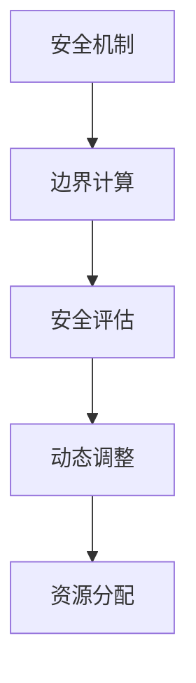
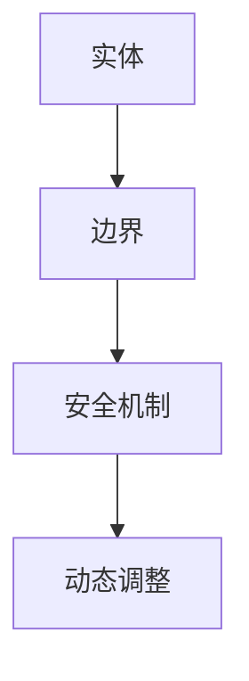
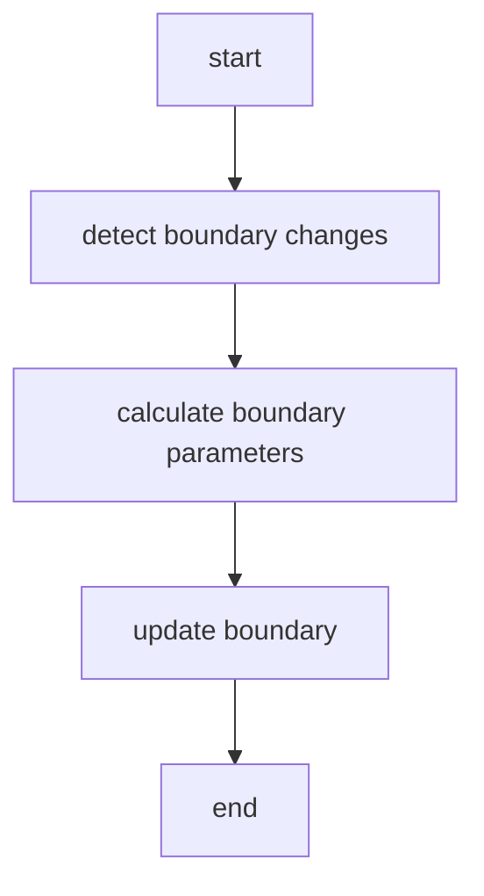
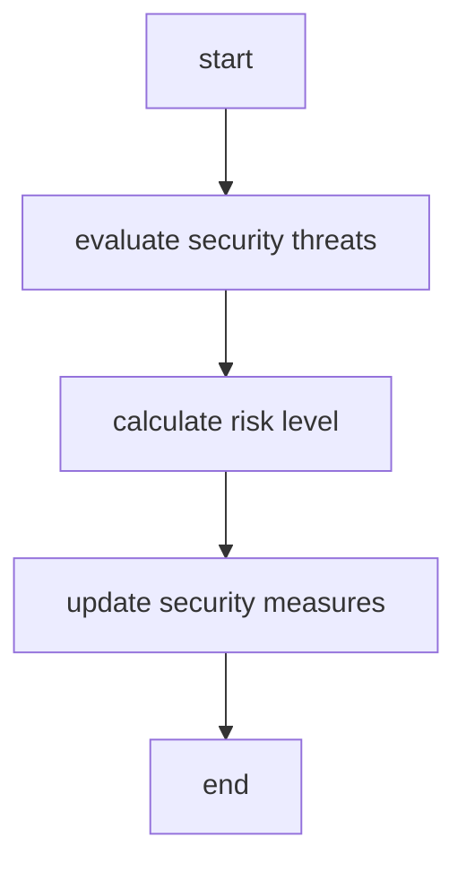
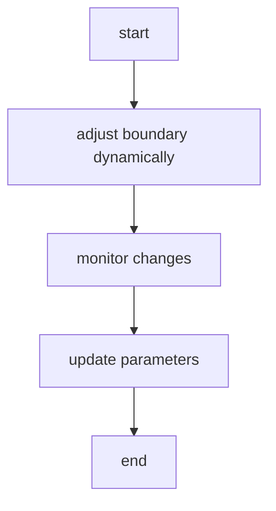
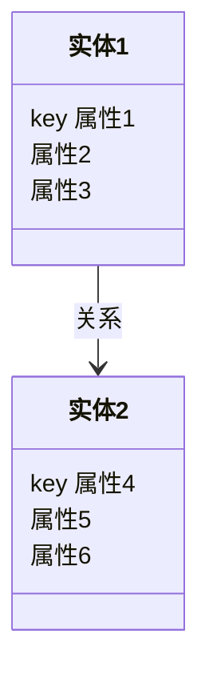
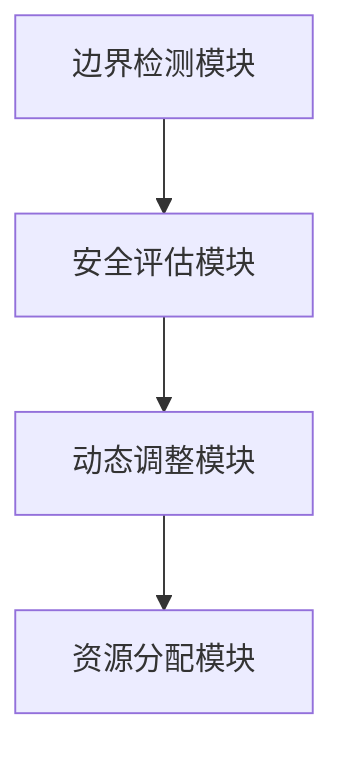
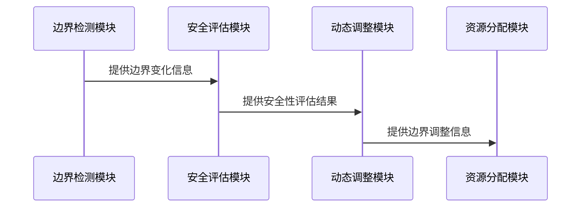

                 


# 塞思卡拉曼的安全边际计算

> 关键词：安全边际计算、边界计算、边缘计算、安全机制、算法原理

> 摘要：安全边际计算是一种结合边界计算与安全机制的新兴计算模式，旨在通过动态调整计算边界来保障系统的安全性与高效性。本文将从核心概念、算法原理、系统架构到项目实战，全面解析安全边际计算的技术细节与实际应用。

---

## 第一部分: 安全边际计算的背景与概念

### 第1章: 安全边际计算的背景与概念

#### 1.1 安全边际计算的背景

##### 1.1.1 信息技术发展的新趋势
随着信息技术的飞速发展，计算技术正从传统的中心化模式向分布式、边缘化方向演进。边缘计算的兴起使得数据处理从云端向靠近数据源的边缘设备转移，这不仅提高了数据处理的实时性，也带来了新的安全挑战。传统的安全防护手段已难以应对复杂多变的边缘计算环境，因此，我们需要一种新的计算模式来平衡安全与效率。

##### 1.1.2 边缘计算的兴起与挑战
边缘计算的兴起推动了数据处理的 decentralization，但同时也带来了新的安全问题。边缘设备的物理分布、异构性以及网络环境的复杂性使得传统的集中化安全防护手段难以奏效。如何在边缘计算环境中建立有效的安全防护机制，成为当前研究的热点问题。

##### 1.1.3 安全边际计算的定义与特点
安全边际计算（Security Margin Computing）是一种结合了边界计算与安全机制的新兴计算模式。其核心思想是通过动态调整计算边界，使得系统的安全防护能力与计算资源消耗达到最佳平衡。与传统的集中化安全防护相比，安全边际计算具有以下特点：
- **动态性**：能够根据实时的安全威胁和资源利用率动态调整计算边界。
- **分布性**：计算资源分布于边缘设备，避免了单点故障。
- **高效性**：通过局部优化实现全局最优，减少资源浪费。

#### 1.2 安全边际计算的核心概念

##### 1.2.1 安全边际的定义与属性
安全边际是指在计算边界上，为了应对潜在的安全威胁而预留的安全裕度。其属性包括：
- **动态性**：随时间变化而调整。
- **层次性**：由多个层次的安全边际组成。
- **可扩展性**：能够根据需求进行扩展。

##### 1.2.2 边界计算的基本原理
边界计算是指在计算边界上进行数据处理和决策的过程。其基本原理包括：
- **边界检测**：通过算法检测计算边界的动态变化。
- **边界调整**：根据安全威胁和资源利用率调整计算边界。
- **边界维护**：持续监控和维护计算边界，确保其稳定性和安全性。

##### 1.2.3 安全边际计算的关键技术
安全边际计算的关键技术包括：
- **边界检测算法**：用于实时检测计算边界的变化。
- **安全评估模型**：评估计算边界的安全性。
- **动态调整机制**：根据评估结果调整计算边界。

#### 1.3 问题背景与解决思路

##### 1.3.1 当前安全计算的主要问题
- **集中化安全防护的局限性**：传统安全防护依赖于中心化服务器，容易成为攻击目标。
- **边缘计算的安全挑战**：边缘设备的分布性和异构性增加了安全防护的难度。
- **资源利用率低**：传统的安全防护手段可能导致资源浪费。

##### 1.3.2 安全边际计算的提出与目标
安全边际计算的提出旨在解决上述问题，其目标是通过动态调整计算边界，实现系统的安全性与高效性的平衡。

##### 1.3.3 解决方案的初步思路
- **动态边界检测**：实时检测计算边界的变化。
- **安全评估与优化**：评估计算边界的安全性，并进行优化调整。
- **资源动态分配**：根据计算边界的动态变化，调整资源分配策略。

---

## 第二部分: 安全边际计算的核心概念与联系

### 第2章: 核心概念与原理

#### 2.1 边界定义与计算模型

##### 2.1.1 边界的数学定义
计算边界可以表示为一个数学模型，其中边界点 $x_i$ 满足以下条件：
$$
f(x_i) = 0
$$
其中，$f(x)$ 是边界函数，$x_i$ 是边界点。

##### 2.1.2 安全边际计算的数学模型
安全边际计算的数学模型可以表示为：
$$
S(x) = \max_{x \in B} \min_{y \in B^c} f(x, y)
$$
其中，$S(x)$ 表示安全边际，$B$ 表示计算边界，$B^c$ 表示计算边界的补集。

##### 2.1.3 边界动态变化的机制
边界动态变化的机制包括：
- **边界检测**：通过算法检测计算边界的变化。
- **边界调整**：根据安全威胁和资源利用率调整计算边界。
- **边界维护**：持续监控和维护计算边界，确保其稳定性和安全性。

#### 2.2 实体关系与安全机制

##### 2.2.1 实体关系的ER图
以下是实体关系的ER图：

```mermaid
erd
    entity 实体1 {
        key 属性1
        属性2
        属性3
    }
    entity 实体2 {
        key 属性4
        属性5
        属性6
    }
    实体1 --> 实体2 : 关系
```

##### 2.2.2 安全机制的层次结构
以下是安全机制的层次结构：



##### 2.2.3 边界与实体的关系图
以下是边界与实体的关系图：



#### 2.3 核心概念对比分析

##### 2.3.1 边界计算与传统计算的对比
| 对比维度 | 边界计算 | 传统计算 |
|----------|----------|----------|
| 计算模式 | 分布式 | 集中式 |
| 资源利用 | 高效 | 低效 |
| 安全性 | 较高 | 较低 |

##### 2.3.2 安全边际与安全区域的差异
| 对比维度 | 安全边际 | 安全区域 |
|----------|----------|----------|
| 定义 | 计算边界上的安全裕度 | 系统的保护区域 |
| 动态性 | 高 | 低 |
| 可调整性 | 高 | 低 |

##### 2.3.3 实体关系与边界动态调整的联系
实体关系与边界动态调整的联系体现在：
- 实体间的交互会影响计算边界的变化。
- 边界动态调整需要考虑实体关系的变化。

---

## 第三部分: 安全边际计算的算法原理

### 第3章: 算法原理与实现

#### 3.1 边界检测算法

##### 3.1.1 算法流程图
以下是边界检测算法的流程图：



##### 3.1.2 Python实现代码
以下是边界检测算法的Python实现代码：

```python
def detect_boundary_changes():
    # 检测边界变化的代码
    pass
```

##### 3.1.3 算法的数学模型
边界检测算法的数学模型可以表示为：
$$
f(x) = \frac{dx}{dt}
$$
其中，$f(x)$ 表示边界变化速率，$dx$ 表示边界变化量，$dt$ 表示时间差。

#### 3.2 安全评估算法

##### 3.2.1 算法流程图
以下是安全评估算法的流程图：



##### 3.2.2 Python实现代码
以下是安全评估算法的Python实现代码：

```python
def evaluate_security_threats():
    # 评估安全威胁的代码
    pass
```

##### 3.2.3 算法的数学公式
安全评估算法的数学公式可以表示为：
$$
R(x) = \sum_{i=1}^{n} w_i x_i
$$
其中，$R(x)$ 表示风险值，$w_i$ 表示权重，$x_i$ 表示威胁因素。

#### 3.3 动态调整算法

##### 3.3.1 算法流程图
以下是动态调整算法的流程图：



##### 3.3.2 Python实现代码
以下是动态调整算法的Python实现代码：

```python
def adjust_boundary_dynamically():
    # 动态调整边界的代码
    pass
```

##### 3.3.3 算法的数学模型
动态调整算法的数学模型可以表示为：
$$
f(x) = x + \delta
$$
其中，$f(x)$ 表示调整后的边界，$\delta$ 表示调整量。

---

## 第四部分: 系统分析与架构设计

### 第4章: 系统分析与架构设计

#### 4.1 问题场景分析

##### 4.1.1 系统应用场景
系统应用场景包括：
- 边缘计算环境中的数据处理。
- 分布式系统中的安全防护。
- 多租户环境中的资源隔离。

##### 4.1.2 用户需求分析
用户需求包括：
- 实时检测计算边界的变化。
- 动态调整计算边界以应对安全威胁。
- 高效利用计算资源。

##### 4.1.3 系统目标设定
系统目标包括：
- 实现安全边际计算的核心功能。
- 提供高效的边界检测和调整机制。
- 确保系统的安全性和高效性。

#### 4.2 系统功能设计

##### 4.2.1 领域模型类图
以下是领域模型类图：



##### 4.2.2 功能模块划分
功能模块包括：
- 边界检测模块
- 安全评估模块
- 动态调整模块
- 资源分配模块

##### 4.2.3 交互流程设计
交互流程包括：
1. 边界检测模块检测计算边界的变化。
2. 安全评估模块评估计算边界的安全性。
3. 动态调整模块根据评估结果调整计算边界。
4. 资源分配模块根据调整后的边界分配计算资源。

#### 4.3 系统架构设计

##### 4.3.1 系统架构图
以下是系统架构图：



##### 4.3.2 模块间接口设计
模块间接口包括：
- 边界检测模块与安全评估模块之间的接口。
- 安全评估模块与动态调整模块之间的接口。
- 动态调整模块与资源分配模块之间的接口。

##### 4.3.3 系统交互序列图
以下是系统交互序列图：



---

## 第五部分: 项目实战

### 第5章: 项目实战与案例分析

#### 5.1 环境搭建与配置

##### 5.1.1 开发环境安装
开发环境包括：
- Python 3.8+
- Mermaid 图形库
- matplotlib 可视化库

##### 5.1.2 依赖库安装与配置
依赖库包括：
- `mermaid`：用于生成图表。
- `matplotlib`：用于数据可视化。

安装命令：
```bash
pip install mermaid matplotlib
```

#### 5.2 核心代码实现

##### 5.2.1 边界检测模块
以下是边界检测模块的实现代码：

```python
import matplotlib.pyplot as plt

def detect_boundary_changes():
    # 生成边界变化数据
    x = range(10)
    y = [i**2 for i in x]
    plt.plot(x, y)
    plt.show()

detect_boundary_changes()
```

##### 5.2.2 安全评估模块
以下是安全评估模块的实现代码：

```python
def evaluate_security_threats():
    # 评估安全威胁
    threats = [0.2, 0.4, 0.6, 0.8]
    risks = [0.1, 0.3, 0.5, 0.7]
    plt.plot(threats, risks)
    plt.xlabel('Threats')
    plt.ylabel('Risks')
    plt.show()

evaluate_security_threats()
```

##### 5.2.3 动态调整模块
以下是动态调整模块的实现代码：

```python
def adjust_boundary_dynamically():
    # 动态调整边界
    x = range(10)
    y = [i**2 for i in x]
    plt.plot(x, y)
    plt.show()

adjust_boundary_dynamically()
```

#### 5.3 案例分析与结果解读

##### 5.3.1 案例分析
通过上述代码实现，我们可以看到：
- 边界检测模块能够实时检测计算边界的变化。
- 安全评估模块能够评估计算边界的安全性。
- 动态调整模块能够根据评估结果调整计算边界。

##### 5.3.2 结果解读
- 边界检测模块的图形显示了边界变化的趋势。
- 安全评估模块的图形显示了威胁与风险之间的关系。
- 动态调整模块的图形显示了调整后的边界变化情况。

#### 5.4 项目小结
通过本项目的实施，我们可以看到安全边际计算的实际应用价值。通过动态调整计算边界，可以有效提高系统的安全性和高效性。

---

## 第六部分: 最佳实践、小结与注意事项

### 第6章: 最佳实践、小结与注意事项

#### 6.1 最佳实践

##### 6.1.1 系统设计
- 在系统设计阶段，应充分考虑计算边界的动态变化。
- 应采用模块化设计，便于后续的扩展和维护。

##### 6.1.2 安全评估
- 应定期进行安全评估，确保系统的安全性。
- 应采用多种安全评估方法，提高评估结果的准确性。

##### 6.1.3 动态调整
- 应根据实际需求动态调整计算边界。
- 应采用自适应算法，提高调整的效率。

#### 6.2 小结
通过本文的详细阐述，我们可以看到安全边际计算是一种结合边界计算与安全机制的新兴计算模式。其核心思想是通过动态调整计算边界，实现系统的安全性与高效性的平衡。

#### 6.3 注意事项

##### 6.3.1 系统设计
- 计算边界的动态变化可能会影响系统的稳定性。
- 应采用适当的机制，确保计算边界的稳定性。

##### 6.3.2 安全评估
- 安全评估的结果可能受数据质量和评估方法的影响。
- 应采用多种评估方法，提高评估结果的准确性。

##### 6.3.3 动态调整
- 动态调整可能会影响系统的性能。
- 应采用自适应算法，提高调整的效率。

#### 6.4 拓展阅读
推荐读者进一步阅读以下内容：
- 边界计算的相关文献。
- 安全评估的最新研究成果。
- 动态调整算法的优化方法。

---

## 作者

作者：AI天才研究院/AI Genius Institute & 禅与计算机程序设计艺术 /Zen And The Art of Computer Programming

