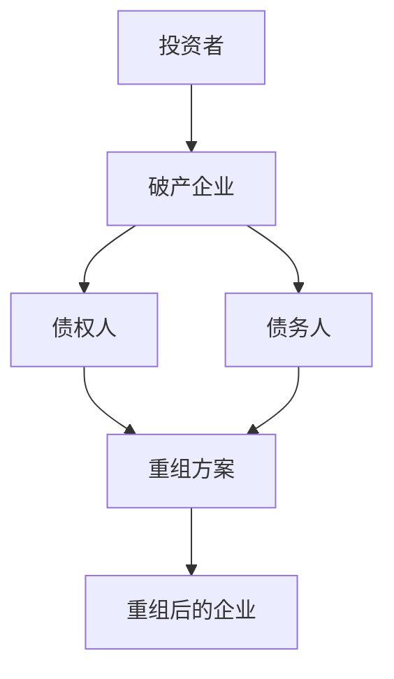

                 


# 塞斯·卡拉曼的破产重组投资策略

> 关键词：破产重组、投资策略、塞斯·卡拉曼、企业价值评估、风险管理

> 摘要：本文深入探讨了塞斯·卡拉曼的破产重组投资策略，分析其核心概念、算法原理、系统架构及实际应用。通过详细阐述破产重组的背景、流程、数学模型和项目实战，帮助读者理解如何在企业破产中发现投资机会并制定有效的投资策略。

---

## 第1章 破产重组与投资策略背景

### 1.1 破产重组的背景与重要性

#### 1.1.1 企业破产的定义与特征
企业的破产通常发生在企业无法偿还债务或持续经营的情况下。破产的特征包括财务状况恶化、现金流断裂、资产不足以清偿债务等。破产重组是通过调整资产和负债结构，恢复企业盈利能力的过程。

#### 1.1.2 破产重组的定义与目标
破产重组是指在企业面临破产时，通过法律程序调整债务结构、资产分配和经营方式，以实现企业重生和债权人利益最大化的过程。其目标是恢复企业的偿债能力，优化资产配置，避免企业清算。

#### 1.1.3 破产重组在投资中的重要性
破产重组为投资者提供了在困境中寻找机会的可能。通过分析企业的财务状况和重组方案，投资者可以识别潜在的价值点，制定投资策略，实现收益最大化。

### 1.2 塞斯·卡拉曼的投资策略简介

#### 1.2.1 塞斯·卡拉曼的生平与投资理念
塞斯·卡拉曼是一位知名的投资专家，以其独特的破产重组投资策略闻名。他强调通过深入分析企业的财务状况和市场环境，识别潜在的重组机会，并制定相应的投资计划。

#### 1.2.2 破产重组投资的核心思想
卡拉曼的核心思想是通过破产重组实现企业价值最大化。他主张在企业困境中寻找低估资产，并通过合理的重组方案实现资产增值。

#### 1.2.3 破产重组投资的适用场景与限制
破产重组投资适用于企业因财务困境导致股价低估的情况。然而，其限制包括较高的投资风险和复杂的法律程序。

### 1.3 破产重组投资的基本概念与框架

#### 1.3.1 破产重组的法律框架
破产重组需遵循相关法律法规，包括《破产法》和《公司法》等。了解法律框架是制定投资策略的基础。

#### 1.3.2 投资者在破产重组中的角色
投资者通常作为债权人或股东参与破产重组，通过提供资金或调整债务结构，推动企业恢复经营。

#### 1.3.3 破产重组的流程与关键点
破产重组的流程包括申请、评估、制定重组方案、实施和监督。关键点在于合理分配资产和债务，确保企业可持续发展。

---

## 第2章 破产重组的核心概念解析

### 2.1 破产重组的核心要素

#### 2.1.1 破产企业的财务状况分析
通过分析企业的资产负债表、利润表和现金流量表，识别财务问题和重组机会。

#### 2.1.2 破产重组中的债权人与债务人关系
债权人和债务人在重组过程中需协商一致，确保债务清偿和资产分配的公平性。

#### 2.1.3 破产重组中的资产与负债调整
通过调整资产结构和债务规模，优化企业的财务状况，提高企业价值。

### 2.2 破产重组与投资策略的关系

#### 2.2.1 破产重组对投资者的价值
破产重组为投资者提供了低价买入资产或股权的机会，可能带来超额收益。

#### 2.2.2 投资策略在破产重组中的应用
投资者通过制定详细的投资计划，积极参与重组过程，实现资产增值。

#### 2.2.3 破产重组中的风险与收益平衡
破产重组投资风险较高，需在风险可控的前提下追求收益最大化。

### 2.3 破产重组的核心概念对比

#### 2.3.1 不同类型破产重组的对比
包括自愿重组、强制重组和司法重组，每种类型的特点和适用场景不同。

#### 2.3.2 破产重组与企业清算的对比
破产重组旨在恢复企业经营，而企业清算则是终止经营，清偿债务。

#### 2.3.3 破产重组与债务重组的对比
破产重组涉及资产和负债的全面调整，而债务重组主要调整债务结构。

### 2.4 破产重组的ER实体关系图



---

## 第3章 破产重组投资的算法与数学模型

### 3.1 破产重组投资的算法概述

#### 3.1.1 破产重组投资的基本算法
通过分析企业的财务数据和市场环境，制定投资策略。算法包括数据收集、分析和决策制定。

#### 3.1.2 破产重组投资的数学模型
模型包括企业价值评估、债务清偿顺序和收益预测等。

### 3.2 破产重组投资的数学公式

#### 3.2.1 破产重组中的资产评估公式
$$ V = \sum_{i=1}^{n} v_i $$

#### 3.2.2 破产重组中的债务清偿顺序公式
$$ C_i = \frac{D_i}{\sum_{j=1}^{m} D_j} \times T $$

#### 3.2.3 破产重组中的收益预测公式
$$ R = \sum_{t=1}^{T} r_t $$

### 3.3 破产重组投资的Python代码实现

```python
def calculate_assets(value_list):
    total_assets = sum(value_list)
    return total_assets

def calculate_liabilities(debt_list):
    total_liabilities = sum(debt_list)
    return total_liabilities

def calculate_net_value(assets, liabilities):
    net_value = assets - liabilities
    return net_value

assets = [100, 200, 300]
liabilities = [50, 150, 200]

total_assets = calculate_assets(assets)
total_liabilities = calculate_liabilities(liabilities)
net_value = calculate_net_value(total_assets, total_liabilities)

print(f"Total Assets: {total_assets}")
print(f"Total Liabilities: {total_liabilities}")
print(f"Net Value: {net_value}")
```

---

## 第4章 破产重组投资的系统架构设计

### 4.1 系统功能设计

#### 4.1.1 数据收集模块
收集企业的财务数据、市场信息和法律文件。

#### 4.1.2 数据分析模块
对数据进行处理、建模和评估，制定投资策略。

#### 4.1.3 决策支持模块
提供决策支持，协助投资者制定投资计划。

### 4.2 系统架构设计


### 4.3 系统交互设计


---

## 第5章 研究结论与最佳实践

### 5.1 研究结论
通过分析塞斯·卡拉曼的破产重组投资策略，总结其在企业困境中的应用价值和投资机会。

### 5.2 投资策略的最佳实践

#### 5.2.1 小结
破产重组投资需结合企业的财务状况和市场环境，制定合理的投资计划。

#### 5.2.2 注意事项
投资者需注意法律风险和市场变化，避免盲目投资。

#### 5.2.3 拓展阅读
建议阅读相关书籍和案例分析，深入理解破产重组投资的复杂性。

---

## 作者信息

作者：AI天才研究院/AI Genius Institute & 禅与计算机程序设计艺术 /Zen And The Art of Computer Programming

