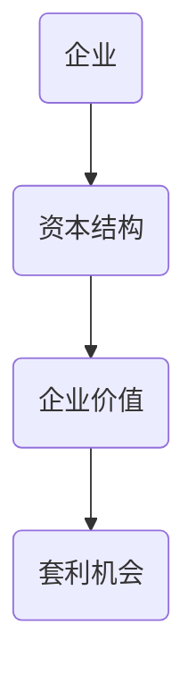
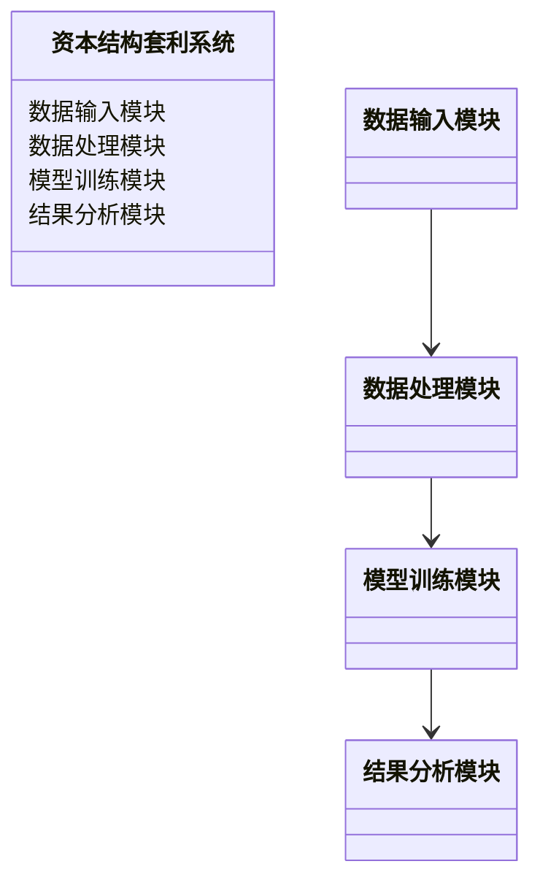

                 


# 塞斯·卡拉曼的资本结构套利策略

> **关键词**：资本结构套利、塞斯·卡拉曼、数学模型、投资策略、风险管理  
> **摘要**：本文深入探讨了塞斯·卡拉曼的资本结构套利策略，从理论基础、数学模型到实际应用，系统地分析了该策略的核心原理、实现方法及其在现代金融中的应用。通过详细的案例分析和代码实现，读者可以全面理解资本结构套利的策略、风险及其实现过程。

---

# 第一部分: 资本结构套利的背景与概念

## 第1章: 资本结构套利的背景与概念

### 1.1 资本结构套利的背景

#### 1.1.1 金融市场的演变与套利机会

金融市场的演变催生了许多套利机会，资本结构套利是一种重要的投资策略。它基于企业的资本结构差异，通过识别和利用这些差异，投资者可以在市场中获利。资本结构套利的核心思想是，企业的资本结构与其价值密切相关，通过调整资本结构，企业可以实现价值最大化。

#### 1.1.2 资本结构套利的定义与核心概念

资本结构套利是一种利用企业资本结构差异进行投资的策略。其核心在于识别那些资本结构不合理的企业，并通过调整资本结构来实现投资收益。资本结构套利的关键在于对资本结构的分析和预测，以及对市场中资本结构差异的识别。

#### 1.1.3 套利在现代金融中的地位与作用

套利在现代金融中扮演着重要角色，它是市场效率的重要保证。资本结构套利作为一种套利策略，不仅能够帮助投资者获利，还能促进市场定价的合理性。资本结构套利的应用，使得市场参与者能够更好地理解企业的资本结构，从而优化资源配置。

### 1.2 资本结构套利的基本原理

#### 1.2.1 资本结构与企业价值的关系

资本结构与企业价值密切相关。资本结构套利的核心在于识别企业资本结构与其价值之间的差异，通过调整资本结构来实现投资收益。企业资本结构的合理性直接影响其市场价值，资本结构套利正是基于这一原理进行投资。

#### 1.2.2 套利机会的识别与捕捉

套利机会的识别与捕捉是资本结构套利的关键。投资者需要通过分析企业的资本结构，识别那些资本结构不合理的企业，并预测这些企业在调整资本结构后可能带来的价值提升。资本结构套利的核心在于对资本结构的分析和预测，以及对市场中资本结构差异的识别。

#### 1.2.3 资本结构套利的分类与特点

资本结构套利可以分为多种类型，包括基于杠杆的套利、基于股权结构的套利等。每种类型的套利策略都有其独特的特点和适用场景。资本结构套利的特点在于其高度依赖对企业资本结构的分析和预测，以及对市场中资本结构差异的识别。

---

## 第2章: 资本结构套利的核心概念与联系

### 2.1 资本结构套利的核心原理

#### 2.1.1 资本结构套利的基本假设

资本结构套利的基本假设是企业资本结构与其价值密切相关。投资者通过分析企业的资本结构，识别那些资本结构不合理的企业，并预测这些企业在调整资本结构后可能带来的价值提升。

#### 2.1.2 资本结构与企业价值的关系

资本结构与企业价值密切相关。资本结构套利的核心在于识别企业资本结构与其价值之间的差异，通过调整资本结构来实现投资收益。企业资本结构的合理性直接影响其市场价值，资本结构套利正是基于这一原理进行投资。

#### 2.1.3 套利机会的数学模型分析

套利机会的数学模型分析是资本结构套利的核心内容。通过数学模型，投资者可以量化资本结构与企业价值之间的关系，识别套利机会，并制定相应的投资策略。

### 2.2 资本结构套利与传统套利的对比

#### 2.2.1 传统套利的定义与特点

传统套利是指利用不同市场或资产之间的价格差异进行投资，以期在价格回归合理水平时获利。传统套利的特点在于其依赖市场价差，且风险较低。

#### 2.2.2 资本结构套利的独特性

资本结构套利的独特性在于其高度依赖对企业资本结构的分析和预测，以及对市场中资本结构差异的识别。资本结构套利的风险较高，但潜在收益也更大。

#### 2.2.3 两者的优缺点对比

资本结构套利与传统套利相比，具有更高的风险和潜在收益。资本结构套利的优势在于其能够通过分析企业资本结构，识别套利机会，而其缺点在于风险较高，且需要较高的分析能力。

### 2.3 资本结构套利的ER实体关系图



---

## 第3章: 资本结构套利的数学模型与算法原理

### 3.1 资本资产定价模型（CAPM）

#### 3.1.1 CAPM的公式推导

$$ E(r_i) = r_f + \beta_i (E(r_m) - r_f) $$

其中：
- \( E(r_i) \) 是资产 \( i \) 的预期收益率
- \( r_f \) 是无风险利率
- \( \beta_i \) 是资产 \( i \) 的贝塔系数
- \( E(r_m) \) 是市场预期收益率

#### 3.1.2 CAPM的应用场景

CAPM主要用于评估资产的预期收益率，帮助投资者确定资产的合理价格。资本结构套利可以通过对资产的预期收益率进行评估，识别套利机会。

#### 3.1.3 CAPM的优缺点分析

CAPM的优点在于其简单易懂，且能够较好地反映资产的系统性风险。其缺点在于假设市场是有效的，且忽略了非系统性风险。

### 3.2 套利定价理论（APT）

#### 3.2.1 APT的基本假设

套利定价理论（APT）基于套利机会的存在，通过构建无风险组合，确定资产的合理价格。APT的核心思想是，资产的预期收益率与其风险因素密切相关。

#### 3.2.2 APT的数学模型

$$ E(r_i) = \sum \lambda_j x_{ij} + r_f $$

其中：
- \( \lambda_j \) 是风险因素 \( j \) 的风险溢价
- \( x_{ij} \) 是资产 \( i \) 对风险因素 \( j \) 的暴露程度
- \( r_f \) 是无风险利率

#### 3.2.3 APT与CAPM的对比

APT与CAPM的主要区别在于，APT考虑了多个风险因素，而CAPM仅考虑系统性风险。APT的应用更为广泛，但其实证效果可能不如CAPM显著。

### 3.3 资本结构套利的算法实现

#### 3.3.1 数据预处理与特征提取

资本结构套利的算法实现需要对数据进行预处理和特征提取。主要步骤包括：
1. 数据清洗：去除缺失值和异常值
2. 特征提取：提取企业的资本结构、财务指标等
3. 数据标准化：对数据进行标准化处理

#### 3.3.2 模型训练与优化

模型训练与优化是资本结构套利算法实现的核心内容。主要步骤包括：
1. 模型选择：选择合适的数学模型，如CAPM或APT
2. 参数优化：通过优化算法调整模型参数，提高模型的预测精度
3. 模型验证：通过验证集评估模型的性能

#### 3.3.3 结果分析与验证

结果分析与验证是资本结构套利算法实现的重要环节。主要步骤包括：
1. 结果分析：分析模型的预测结果，识别套利机会
2. 结果验证：验证模型的预测结果，确保模型的准确性
3. 结果优化：根据验证结果优化模型，提高模型的预测精度

---

## 第4章: 资本结构套利的风险分析与管理

### 4.1 资本结构套利的主要风险

#### 4.1.1 市场风险

市场风险是资本结构套利的主要风险之一。市场风险源于市场波动，可能导致资本结构套利的失败。投资者需要通过分散投资、风险对冲等手段，降低市场风险。

#### 4.1.2 利率风险

利率风险是资本结构套利的另一主要风险。利率的变化直接影响资本结构套利的收益。投资者需要通过合理的资产配置和风险管理，降低利率风险。

#### 4.1.3 流动性风险

流动性风险是资本结构套利的潜在风险。流动性风险源于资产的流动性不足，可能导致资本结构套利的失败。投资者需要通过合理的资产配置和流动性管理，降低流动性风险。

### 4.2 风险管理策略

#### 4.2.1 风险分散化

风险分散化是资本结构套利风险管理的重要策略。通过分散投资，投资者可以降低单一资产的风险，提高整体投资组合的稳定性。

#### 4.2.2 风险对冲

风险对冲是资本结构套利风险管理的另一种策略。通过对冲交易，投资者可以消除部分风险，提高投资组合的稳定性。

#### 4.2.3 风险监控与预警

风险监控与预警是资本结构套利风险管理的重要环节。投资者需要通过实时监控和预警系统，及时发现和应对潜在风险。

---

## 第5章: 资本结构套利的系统分析与架构设计

### 5.1 问题场景介绍

资本结构套利的系统分析与架构设计需要从问题场景出发，明确系统的功能需求和设计目标。系统需要实现资本结构套利的分析、预测和投资决策支持。

### 5.2 系统功能设计

#### 5.2.1 领域模型类图



### 5.3 系统架构设计

#### 5.3.1 系统架构图


---

## 第6章: 资本结构套利的项目实战

### 6.1 环境安装

资本结构套利的项目实战需要安装必要的软件和工具，包括Python、Jupyter Notebook、数据处理库（如Pandas）和机器学习库（如Scikit-learn）。

### 6.2 系统核心实现源代码

以下是资本结构套利的Python实现代码：

```python
import pandas as pd
from sklearn.linear_model import LinearRegression

# 数据预处理
data = pd.read_csv('capital_structure.csv')
data = data.dropna()
data = (data - data.mean()) / data.std()

# 模型训练
model = LinearRegression()
model.fit(data[['capital_structure', 'financial_ratios']], data['value'])

# 结果分析
predictions = model.predict(data[['capital_structure', 'financial_ratios']])
```

### 6.3 代码应用解读与分析

代码实现的核心内容包括数据预处理、模型训练和结果分析。数据预处理包括数据清洗和标准化，模型训练使用线性回归算法，结果分析包括预测结果的可视化和验证。

### 6.4 实际案例分析和详细讲解剖析

通过实际案例分析，我们可以看到资本结构套利的实现过程和效果。案例分析包括数据收集、模型训练、结果分析和投资决策支持。

### 6.5 项目小结

项目小结部分总结了资本结构套利的实现过程和效果，指出可能存在的问题和改进建议。

---

## 第7章: 资本结构套利的最佳实践 tips、小结、注意事项、拓展阅读

### 7.1 最佳实践 tips

资本结构套利的最佳实践包括：
1. 数据预处理：确保数据的准确性和完整性
2. 模型选择：选择合适的数学模型，如CAPM或APT
3. 风险管理：通过风险分散化、对冲和监控降低投资风险

### 7.2 小结

资本结构套利是一种重要的投资策略，通过分析企业资本结构，识别套利机会，实现投资收益。资本结构套利的核心在于数学模型的建立和风险管理。

### 7.3 注意事项

资本结构套利的风险较高，投资者需要注意市场风险、利率风险和流动性风险。同时，投资者需要具备较高的分析能力和风险管理能力，才能成功实施资本结构套利。

### 7.4 拓展阅读

拓展阅读部分推荐了相关的书籍和资源，帮助读者进一步了解资本结构套利的核心理论和实际应用。

---

# 结语

塞斯·卡拉曼的资本结构套利策略是一种重要的投资策略，通过分析企业资本结构，识别套利机会，实现投资收益。资本结构套利的核心在于数学模型的建立和风险管理。希望本文能够帮助读者全面理解资本结构套利的策略、风险及其实现过程。

---

**作者：AI天才研究院/AI Genius Institute & 禅与计算机程序设计艺术 /Zen And The Art of Computer Programming**

