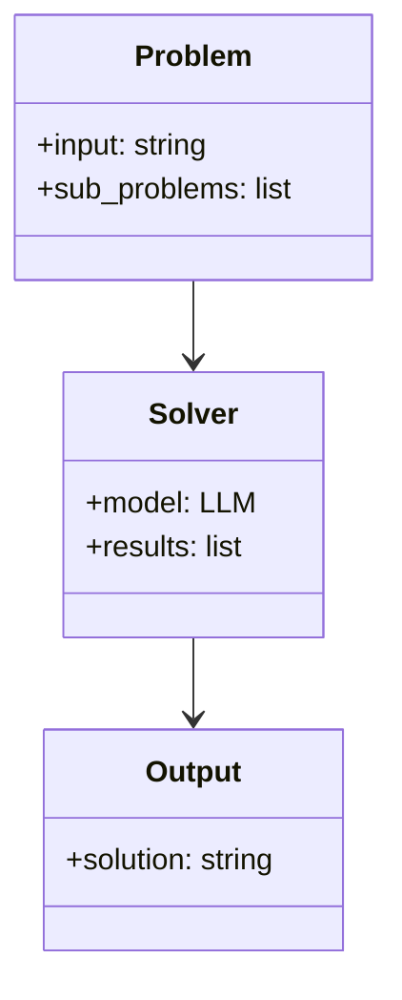
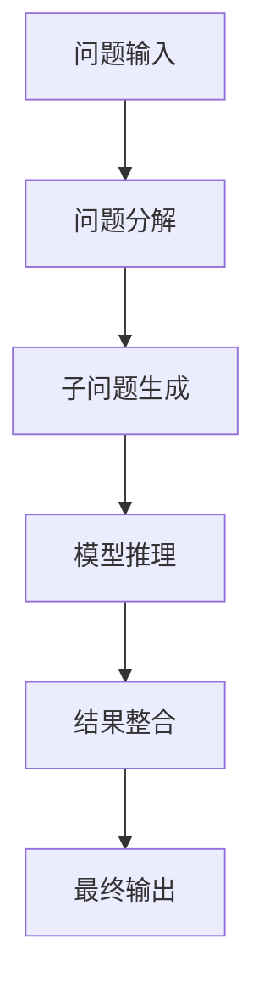
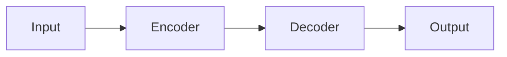
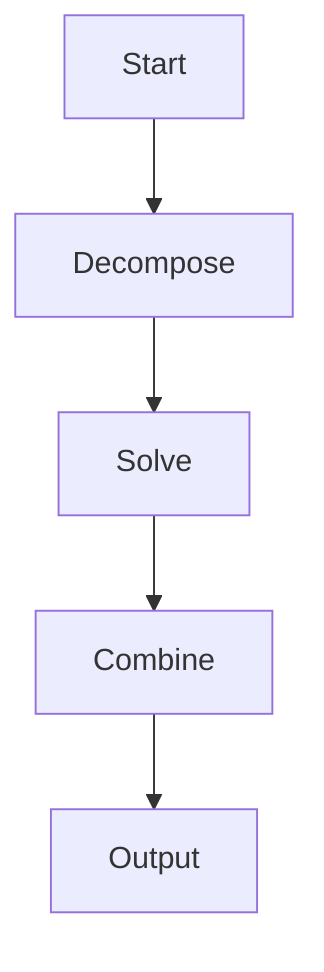
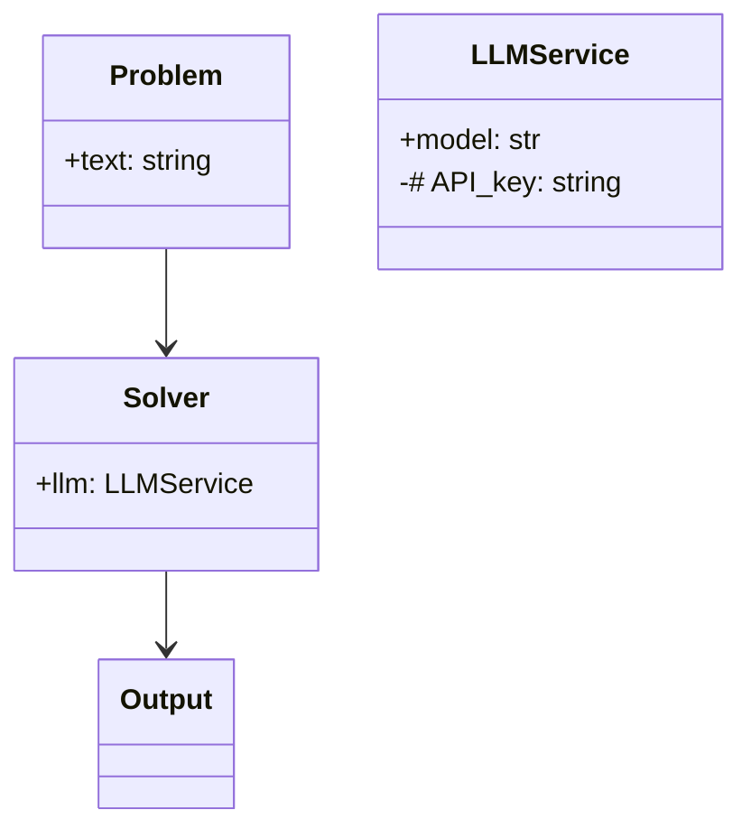

                 


# 复杂问题解决AI Agent：利用LLM进行多步骤推理

**关键词**：AI Agent，LLM，多步骤推理，自然语言处理，系统架构，项目实战

**摘要**：本文探讨如何利用大语言模型（LLM）构建复杂问题解决的AI Agent，通过多步骤推理实现智能问题解决。文章从LLM基础知识、问题建模、算法实现、系统架构到项目实战，全面解析AI Agent的设计与实现过程，提供丰富的案例和代码示例，帮助读者掌握相关技术。

---

## 第1章：引言

### 1.1 AI Agent的基本概念

#### 1.1.1 AI Agent的定义与类型
AI Agent（人工智能代理）是一种智能实体，能够感知环境、自主决策并执行任务。根据功能和智能水平，AI Agent可分为简单反射型、基于模型的反应型、目标驱动型和实用驱动型。

#### 1.1.2 LLM在AI Agent中的作用
LLM（大语言模型）通过理解和生成自然语言，为AI Agent提供强大的语言处理能力，使其能够执行复杂的问题解决、对话生成等任务。

#### 1.1.3 复杂问题解决的必要性
复杂问题通常涉及多个步骤和领域知识，需要AI Agent具备分解问题、推理和协调的能力，以应对现实中的多样化挑战。

---

### 1.2 本书的目标与结构
本书旨在讲解如何利用LLM构建复杂问题解决的AI Agent，涵盖基础概念、算法实现、系统设计和项目实战。通过理论与实践结合，帮助读者掌握相关技术。

---

## 第2章：LLM基础知识

### 2.1 大语言模型的基本原理

#### 2.1.1 什么是大语言模型
LLM是基于深度学习的自然语言处理模型，通过大量数据训练，能够理解和生成人类语言。

#### 2.1.2 LLM的核心工作原理
- **编码器**：将输入文本转换为向量表示。
- **解码器**：根据编码器输出生成目标文本。

#### 2.1.3 LLM与传统算法的区别
- 数据驱动 vs 规则驱动
- 强大的上下文理解能力
- 自适应生成能力

### 2.2 主流LLM模型介绍

#### 2.2.1 GPT系列模型
GPT（Generative Pre-trained Transformer）系列模型以生成能力强著称，适用于文本生成和对话任务。

#### 2.2.2 BERT及其变体
BERT（Bidirectional Encoder Representations from Transformers）擅长理解上下文，适用于问答系统和文本摘要。

#### 2.2.3 其他知名LLM模型
- **PaLM**：专为问题解决设计，支持多步骤推理。
- **Megatron-LM**：开源模型，支持大规模训练。

### 2.3 LLM的应用场景

#### 2.3.1 自然语言处理任务
- 文本生成
- 问答系统
- 情感分析

#### 2.3.2 多步骤推理的应用
- 问题解决
- 决策支持
- 知识推理

#### 2.3.3 企业级应用
- 客户服务
- 供应链优化
- 风险评估

---

## 第3章：问题分解与建模

### 3.1 问题分解的背景与方法

#### 3.1.1 复杂问题的定义与分解
将复杂问题分解为子问题，每个子问题独立解决，最终整合结果。

#### 3.1.2 系统工程方法
- 结构化分析
- 功能分解
- 模块化设计

### 3.2 建模的核心概念

#### 3.2.1 系统架构设计
- **输入模块**：接收问题输入
- **推理模块**：执行逻辑推理
- **输出模块**：生成解决方案

#### 3.2.2 数学建模
- **符号表示**：问题中的实体用符号表示
- **关系建模**：用关系图展示实体间关系

### 3.3 建模的实现

#### 3.3.1 系统架构类图


#### 3.3.2 数据流与处理流程


---

## 第4章：多步骤推理的算法与实现

### 4.1 算法原理

#### 4.1.1 序列到序列模型


#### 4.1.2 注意力机制
```latex
$$ \text{Attention}(Q, K, V) = \text{softmax}\left(\frac{QK^T}{\sqrt{d_k}}\right)V $$
```

#### 4.1.3 推理算法
- **贪心搜索**：逐步选择概率最高的词。
- **贝叶斯推理**：基于概率模型进行推理。

### 4.2 算法实现

#### 4.2.1 Python代码实现
```python
def multi_step_reasoning(input_text):
    # 分解问题
    sub_problems = decompose(input_text)
    # 解决子问题
    results = [solve(sub) for sub in sub_problems]
    # 整合结果
    return combine(results)
```

#### 4.2.2 算法流程图


---

## 第5章：系统架构与设计

### 5.1 问题场景分析

#### 5.1.1 问题描述
构建一个AI Agent，能够解决用户提出的复杂问题。

#### 5.1.2 功能需求
- 接收问题输入
- 分解问题
- 调用LLM进行推理
- 输出解决方案

### 5.2 系统功能设计

#### 5.2.1 领域模型类图


#### 5.2.2 系统架构设计
```mermaid
graph LR
    Client --> API Gateway
    API Gateway --> Load Balancer
    Load Balancer --> LLMService
    LLMService --> Result
    Result --> Client
```

---

## 第6章：项目实战

### 6.1 环境安装与配置

#### 6.1.1 安装Python和依赖
```bash
pip install transformers
pip install torch
```

#### 6.1.2 安装LLM模型
```bash
pip install google-palm
```

### 6.2 核心功能实现

#### 6.2.1 问题分解模块
```python
def decompose(text):
    # 实现问题分解逻辑
    return sub_problems
```

#### 6.2.2 推理模块
```python
def solve(sub_problem):
    # 调用LLM进行推理
    return result
```

### 6.3 代码实现与解读

#### 6.3.1 完整代码示例
```python
from google.generativeai import PaLMModel, generate_content

def decompose(text):
    # 示例分解逻辑
    return [text]

def solve(sub_problem):
    model = PaLMModel('geminal')
    response = generate_content(sub_problem).text
    return response

def main():
    input_text = "如何优化公司供应链？"
    sub_problems = decompose(input_text)
    results = [solve(sub) for sub in sub_problems]
    print("解决方案：", results)

if __name__ == "__main__":
    main()
```

### 6.4 案例分析与总结

#### 6.4.1 案例分析
用户输入：“如何优化公司供应链？” 分解为多个子问题，每个子问题通过LLM解决。

#### 6.4.2 总结与优化
- 优化问题分解算法
- 提升模型的准确性
- 增加多模态支持

---

## 第7章：高级主题与扩展

### 7.1 模型的可解释性

#### 7.1.1 可解释性的重要性
- 透明性
- 可靠性
- 可调试性

#### 7.1.2 提升可解释性的方法
- 解释生成
- 可视化分析
- 增量推理

### 7.2 模型的鲁棒性

#### 7.2.1 鲁棒性的定义
- 抗干扰能力
- 多样性处理能力

#### 7.2.2 提升鲁棒性的方法
- 数据增强
- 模型集成
- 程序验证

### 7.3 模型调优与优化

#### 7.3.1 超参数优化
- 学习率
- 隐藏层大小
- 注意力头数

#### 7.3.2 模型调优技巧
- 网格搜索
- 随机搜索
- 贝叶斯优化

### 7.4 模型扩展

#### 7.4.1 结合知识库
- 外部知识整合
- 实时数据处理

#### 7.4.2 多模态支持
- 图像处理
- 音频处理

---

## 第8章：案例分析与总结

### 8.1 案例分析

#### 8.1.1 成功案例
- 供应链优化
- 风险评估

#### 8.1.2 失败案例
- 数据不足
- 模型过拟合

### 8.2 总结与经验教训

#### 8.2.1 核心经验
- 明确问题定义
- 合适的模型选择
- 充足的数据支持

#### 8.2.2 展望未来
- 更强的推理能力
- 更高的可解释性
- 更多的跨领域应用

---

## 作者：AI天才研究院/AI Genius Institute & 禅与计算机程序设计艺术 /Zen And The Art of Computer Programming

---

**本文由AI天才研究院倾心打造，转载请注明出处。**

