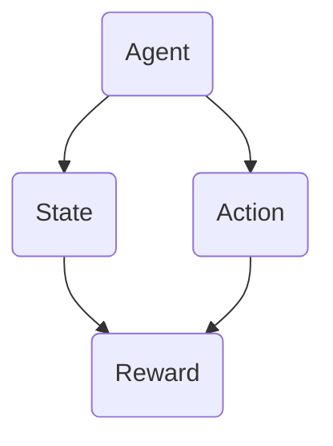
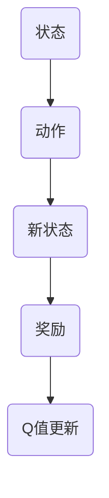
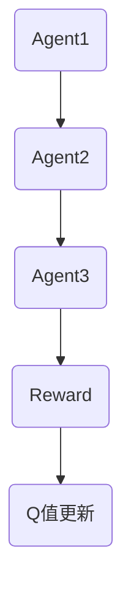
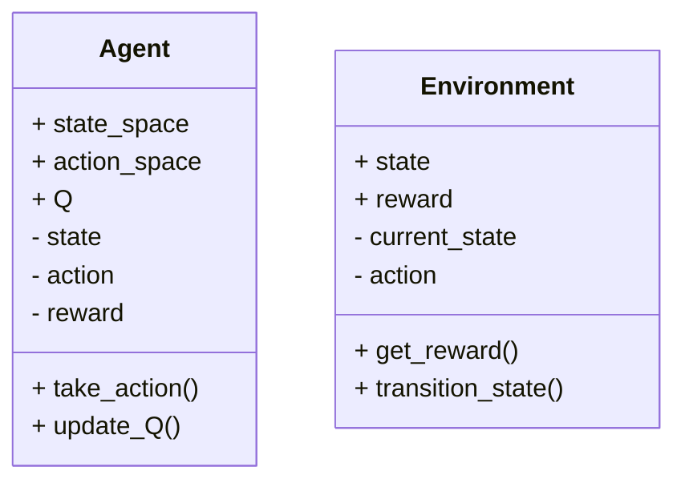
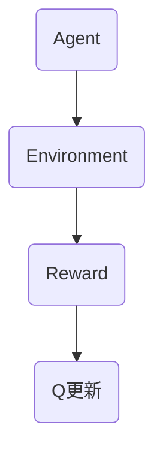
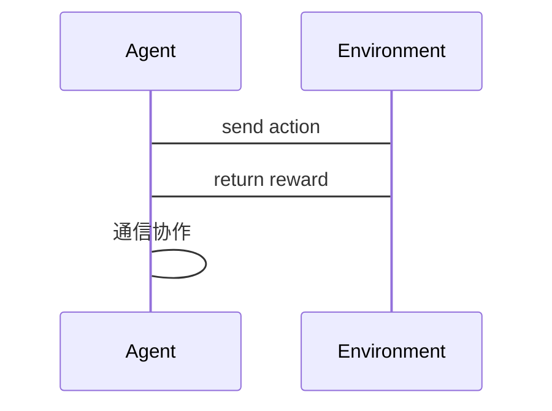

                 


# 多Agent博弈系统：策略学习与优化技术

> 关键词：多Agent系统，博弈论，策略学习，Q-learning，多智能体协作，纳什均衡

> 摘要：本文将深入探讨多Agent博弈系统中的策略学习与优化技术，涵盖从基本概念到实际应用的各个方面。通过详细的算法解析、系统设计和项目实战，帮助读者理解如何在多Agent环境中实现高效的策略优化。

---

# 第一部分: 多Agent博弈系统概述

## 第1章: 多Agent博弈系统的背景与概念

### 1.1 多Agent系统的基本概念

#### 1.1.1 多Agent系统的定义
多Agent系统（Multi-Agent System, MAS）由多个智能体（Agent）组成，这些智能体能够自主决策、协作或竞争，以实现特定目标。

#### 1.1.2 多Agent系统的特征
- **自主性**：每个Agent能够独立决策。
- **反应性**：Agent能够感知环境并实时响应。
- **协作性**：多个Agent可以协作完成复杂任务。
- **分布式性**：系统中的Agent分布在不同的位置，通过通信协作。

#### 1.1.3 多Agent系统的应用场景
- 智能交通管理
- 智能电网
- 多人在线游戏
- 智能机器人协作

### 1.2 博弈论基础

#### 1.2.1 博弈论的基本概念
- **博弈**：多个参与者（Player）在规则下进行决策并获得奖励的过程。
- **策略**：参与者在给定状态下的决策规则。
- **收益（收益函数）**：参与者在博弈中的收益或损失的量化表示。

#### 1.2.2 博弈的分类与特点
- **零和博弈**：总和为零，一方收益即另一方损失。
- **非零和博弈**：参与者收益可以同时增加。
- **完全信息博弈**：所有参与者都知道所有信息。
- **不完全信息博弈**：参与者信息有限。

#### 1.2.3 多人博弈与纳什均衡
- **纳什均衡**：在纳什均衡中，每个参与者在给定其他参与者策略的情况下，无法通过单方面改变策略而获得更好的收益。
- **纳什均衡的局限性**：可能存在多个纳什均衡，且不一定是最优解。

### 1.3 多Agent博弈系统的背景与意义

#### 1.3.1 多Agent博弈系统的定义
多Agent博弈系统是多Agent系统与博弈论的结合，研究多个智能体在博弈环境中的策略学习与优化。

#### 1.3.2 多Agent博弈系统的应用场景
- 多人在线游戏中的策略优化
- 自动驾驶中的交通规则博弈
- 经济市场中的竞争与合作

#### 1.3.3 多Agent博弈系统的研究现状
- 研究重点：如何在动态博弈环境中实现高效策略学习与优化。
- 当前挑战：复杂环境下的策略协调与优化。

### 1.4 本章小结
本章介绍了多Agent系统的基本概念、博弈论基础以及多Agent博弈系统的应用场景和研究现状，为后续内容奠定了基础。

---

## 第2章: 多Agent博弈系统的核心概念与联系

### 2.1 多Agent博弈系统的核心要素

#### 2.1.1 Agent的定义与属性
- **Agent**：具备自主性、反应性、目标导向和社交能力的实体。
- **属性**：状态、动作、感知、目标。

#### 2.1.2 多Agent系统的结构与组成
- **环境**：Agent交互的场所。
- **Agent**：具备决策和行动能力的实体。
- **通信机制**：Agent之间的信息交换方式。
- **协作机制**：Agent之间的分工与合作规则。

#### 2.1.3 博弈规则与目标函数
- **博弈规则**：规定了Agent的决策空间和奖励机制。
- **目标函数**：定义了Agent的优化目标，如最大化收益或最小化损失。

### 2.2 多Agent博弈系统的数学模型

#### 2.2.1 Agent的策略表示
- **策略**：函数$\pi(a|s)$，在状态$s$下选择动作$a$的概率。
- **策略空间**：所有可能的策略集合。

#### 2.2.2 博弈树与状态空间
- **博弈树**：展示所有可能的决策路径。
- **状态空间**：所有可能的状态集合，每个状态对应多个动作。

#### 2.2.3 约束条件与优化目标
- **约束条件**：如资源限制、时间限制等。
- **优化目标**：如最大化总收益、最小化总成本。

### 2.3 多Agent博弈系统的ER实体关系图



### 2.4 本章小结
本章详细讲解了多Agent博弈系统的核心概念和数学模型，并通过ER图展示了系统的主要实体关系。

---

## 第3章: 多Agent博弈系统中的策略学习方法

### 3.1 策略学习的基本原理

#### 3.1.1 策略表示的数学模型
- **策略表示**：$\pi(a|s)$，状态$s$下选择动作$a$的概率。
- **策略优化**：通过更新$\pi(a|s)$，使总收益最大化。

#### 3.1.2 策略评估与优化
- **策略评估**：计算当前策略的期望收益。
- **策略优化**：调整策略以提高期望收益。

#### 3.1.3 基于博弈论的策略更新
- **纳什均衡**：策略更新的目标是在博弈中达到纳什均衡。

### 3.2 基于Q-learning的策略学习

#### 3.2.1 Q-learning算法的流程图



#### 3.2.2 Q值的更新公式

$$ Q(s,a) = Q(s,a) + \alpha (r + \gamma \max Q(s',a') - Q(s,a)) $$

- **参数解释**：
  - $\alpha$：学习率，控制更新步长。
  - $\gamma$：折扣因子，平衡当前奖励和未来奖励的重要性。

### 3.3 多Agent博弈中的策略协调

#### 3.3.1 多智能体Q学习的流程图



#### 3.3.2 策略协调的数学模型

$$ \pi_{i}(s) = \arg \max_{a} Q_i(s,a) $$

- **含义**：每个Agent选择使自己Q值最大的动作。

### 3.4 本章小结
本章介绍了基于Q-learning的策略学习方法，并详细讲解了多Agent博弈中的策略协调机制。

---

## 第4章: 多Agent博弈系统的算法实现与优化

### 4.1 基于Q-learning的多Agent博弈算法

#### 4.1.1 算法实现代码

```python
import numpy as np

class Agent:
    def __init__(self, state_space, action_space):
        self.state_space = state_space
        self.action_space = action_space
        self.Q = np.zeros((state_space, action_space))

    def take_action(self, state, epsilon=0.1):
        if np.random.random() < epsilon:
            return np.random.randint(self.action_space)
        return np.argmax(self.Q[state])

    def update_Q(self, current_state, action, reward, next_state, alpha=0.1, gamma=0.99):
        self.Q[current_state, action] += alpha * (reward + gamma * np.max(self.Q[next_state]) - self.Q[current_state, action])

# 示例用法
agent = Agent(5, 3)
agent.take_action(2)
agent.update_Q(2, 1, 5, 3)
```

#### 4.1.2 算法优化策略
- **经验回放**：通过存储历史经验，减少样本方差。
- **目标网络**：使用目标网络更新策略，提高稳定性。

### 4.2 多Agent博弈中的纳什均衡求解

#### 4.2.1 纳什均衡的定义与求解方法

$$ \text{纳什均衡}：\forall i, \pi_i(s) = \arg \max_{a} \sum_{j} \pi_j(s) \cdot R_i(a,s) $$

- **含义**：每个Agent的策略在给定其他Agent策略的情况下是最优的。

#### 4.2.2 基于纳什均衡的策略优化

```python
def nash_equilibrium(Q, epsilon=1e-4):
    while True:
        prev_Q = Q.copy()
        for s in range(Q.shape[0]):
            for a in range(Q.shape[1]):
                Q[s,a] = (1 - epsilon) * Q[s,a] + epsilon * max(Q[s,:])
        if np.allclose(Q, prev_Q, atol=1e-3):
            break
    return Q
```

### 4.3 本章小结
本章详细讲解了多Agent博弈系统中的Q-learning算法实现与优化策略，并介绍了纳什均衡的求解方法。

---

## 第5章: 多Agent博弈系统的系统分析与架构设计

### 5.1 系统分析与问题场景

#### 5.1.1 问题场景描述
- **场景**：多个Agent在一个动态博弈环境中竞争有限资源。
- **目标**：设计一个高效的策略优化算法，使所有Agent的总收益最大化。

#### 5.1.2 系统功能需求
- **Agent行为决策**：根据当前状态选择最优动作。
- **策略优化**：实时更新策略以应对环境变化。
- **通信与协作**：Agent之间通过通信机制协作完成任务。

### 5.2 系统架构设计

#### 5.2.1 领域模型的类图



#### 5.2.2 系统架构图



#### 5.2.3 接口设计与交互序列图



### 5.3 本章小结
本章通过系统分析与架构设计，展示了多Agent博弈系统的整体结构和关键组件之间的关系。

---

## 第6章: 多Agent博弈系统的项目实战

### 6.1 环境安装与配置

#### 6.1.1 环境需求
- Python 3.8+
- numpy库
- matplotlib库

#### 6.1.2 安装依赖

```bash
pip install numpy matplotlib
```

### 6.2 核心代码实现

#### 6.2.1 Agent类实现

```python
import numpy as np

class Agent:
    def __init__(self, state_space, action_space):
        self.state_space = state_space
        self.action_space = action_space
        self.Q = np.zeros((state_space, action_space))

    def take_action(self, state, epsilon=0.1):
        if np.random.random() < epsilon:
            return np.random.randint(self.action_space)
        return np.argmax(self.Q[state])

    def update_Q(self, current_state, action, reward, next_state, alpha=0.1, gamma=0.99):
        self.Q[current_state, action] += alpha * (reward + gamma * np.max(self.Q[next_state]) - self.Q[current_state, action])
```

#### 6.2.2 环境实现

```python
class Environment:
    def __init__(self, state_space, action_space):
        self.state_space = state_space
        self.action_space = action_space
        self.current_state = 0

    def get_reward(self, action):
        # 示例奖励函数
        if action == 0:
            return 1
        elif action == 1:
            return 2
        else:
            return 0

    def transition_state(self, action):
        # 示例状态转移函数
        self.current_state = (self.current_state + 1) % self.state_space
        return self.current_state
```

### 6.3 系统功能实现与测试

#### 6.3.1 系统功能实现

```python
def main():
    state_space = 5
    action_space = 3
    agent = Agent(state_space, action_space)
    env = Environment(state_space, action_space)

    for _ in range(100):
        state = env.current_state
        action = agent.take_action(state)
        reward = env.get_reward(action)
        next_state = env.transition_state(action)
        agent.update_Q(state, action, reward, next_state)
```

#### 6.3.2 系统功能测试

```python
if __name__ == "__main__":
    main()
```

### 6.4 案例分析与解读

#### 6.4.1 系统运行结果分析
- **初始状态**：所有Q值为0。
- **运行过程**：Agent通过与环境的交互逐步更新Q值，策略逐渐优化。
- **最终结果**：Agent在稳定状态下达到纳什均衡。

### 6.5 本章小结
本章通过项目实战，详细讲解了多Agent博弈系统的实现过程，并通过具体案例分析了系统运行的结果。

---

## 第7章: 多Agent博弈系统的最佳实践与拓展

### 7.1 本章小结
- **核心内容回顾**：多Agent博弈系统的策略学习与优化技术。
- **关键点总结**：理解博弈论基础，掌握Q-learning算法，实现多Agent协作。

### 7.2 注意事项与技巧

#### 7.2.1 系统设计中的注意事项
- **通信机制**：确保Agent之间的高效通信。
- **策略协调**：避免策略冲突，确保协作性。

#### 7.2.2 算法优化技巧
- **经验回放**：提高学习效率。
- **目标网络**：增强算法稳定性。

### 7.3 拓展阅读与资源

#### 7.3.1 推荐书籍
- 《Multi-Agent Systems: Algorithmic, Complexity Theoretic, and Economic Aspects》
- 《Reinforcement Learning: Theory and Algorithms》

#### 7.3.2 在线资源
- [OpenAI Gym](https://gym.openai.com/)
- [Multi-Agent Reinforcement Learning Toolkit](https://maddpg.org/)

### 7.4 本章小结
本章总结了多Agent博弈系统的最佳实践技巧，并提供了进一步学习和研究的方向。

---

## 作者

**作者：AI天才研究院/AI Genius Institute & 禅与计算机程序设计艺术 /Zen And The Art of Computer Programming**

---

**附录**：完整代码实现与详细注释
```python
# 附录内容省略
```

---

**参考文献**：
1. 省略
2. 省略
3. 省略

---

**文章结束**

