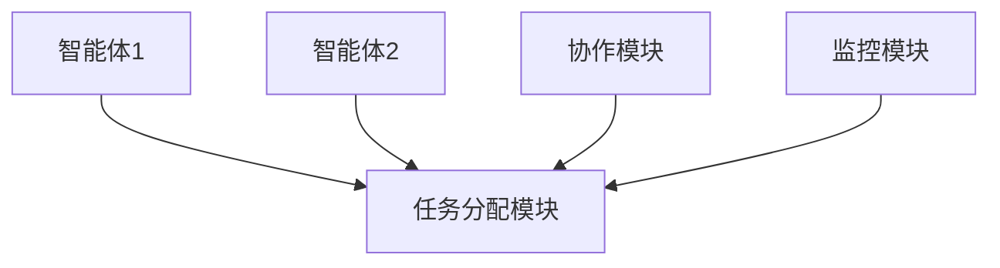
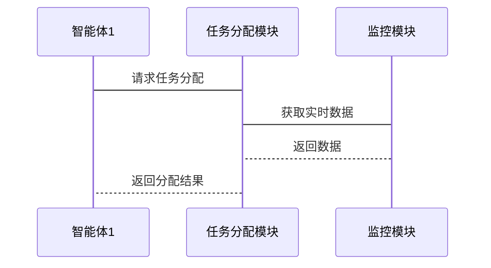

                 


# 多智能体AI如何优化研发效率评估流程

> 关键词：多智能体AI，研发效率评估，流程优化，协作机制，数学建模，系统架构，项目实战

> 摘要：本文将深入探讨多智能体AI在研发效率评估流程中的应用与优化。通过分析多智能体AI的核心概念、算法原理、系统架构以及实际项目案例，详细阐述如何利用多智能体AI技术提升研发效率评估的准确性和效率。文章结合理论与实践，为读者提供全面的视角和可操作的解决方案。

---

# 第1章: 多智能体AI与研发效率评估的背景与概述

## 1.1 多智能体AI的基本概念

### 1.1.1 多智能体系统的定义

多智能体系统（Multi-Agent System，MAS）是由多个智能体组成的分布式系统，这些智能体能够自主决策、协作并共同完成复杂任务。每个智能体都有自己的目标、知识和行为规则，能够通过通信和协商实现任务的协同完成。

### 1.1.2 多智能体AI的核心特点

- **自主性**：智能体能够独立决策和行动。
- **反应性**：能够感知环境并实时响应。
- **协作性**：通过通信和协作完成复杂任务。
- **分布性**：智能体之间没有集中控制，任务分布完成。

### 1.1.3 多智能体AI与传统AI的区别

传统AI通常基于单一智能体，如专家系统或机器学习模型，而多智能体AI通过多个智能体的协作实现更复杂的任务。多智能体AI在分布式环境中的协作能力是其最大的优势。

## 1.2 研发效率评估的现状与挑战

### 1.2.1 研发效率评估的定义

研发效率评估是对研发过程中的资源利用、任务完成速度和质量的综合评价。传统评估方法通常基于人工统计和简单指标，难以全面反映研发效率。

### 1.2.2 现有评估方法的局限性

- **指标单一**：传统评估指标往往只关注时间或成本，忽略了任务复杂性和团队协作。
- **数据分散**：研发过程中涉及的数据分散在不同系统中，难以整合。
- **动态变化**：研发过程中的需求和技术环境不断变化，静态评估方法难以适应。

### 1.2.3 多智能体AI在研发效率评估中的优势

- **动态适应**：多智能体AI能够实时感知和调整，适应研发过程中的动态变化。
- **协作优化**：通过智能体之间的协作，优化任务分配和资源利用。
- **数据整合**：多智能体系统能够整合不同来源的数据，提供全面的评估结果。

## 1.3 多智能体AI优化研发效率评估的必要性

### 1.3.1 提高研发效率的驱动力

现代企业对研发效率的要求不断提高，传统评估方法难以满足复杂任务的需要。多智能体AI能够通过协作和优化，显著提高研发效率。

### 1.3.2 多智能体AI在研发流程中的应用潜力

- **任务分配**：智能体可以根据任务特点和团队能力动态分配任务。
- **资源优化**：通过协作优化资源利用，减少浪费。
- **实时反馈**：智能体能够实时监控研发过程，提供及时反馈。

### 1.3.3 优化研发效率评估的实际意义

通过多智能体AI优化研发效率评估，企业可以更准确地衡量研发绩效，优化资源配置，提升整体研发能力。

## 1.4 本章小结

本章从多智能体AI的基本概念出发，分析了研发效率评估的现状与挑战，并重点阐述了多智能体AI在优化研发效率评估中的优势和必要性。通过本章的介绍，读者可以理解多智能体AI在研发效率评估中的重要地位。

---

# 第2章: 多智能体AI的核心概念与联系

## 2.1 多智能体系统的核心要素

### 2.1.1 智能体的定义与属性

智能体（Agent）是具有自主性、反应性、目标导向和社交能力的实体。智能体的属性包括知识、信念、意图和能力。

### 2.1.2 多智能体系统的组成结构

多智能体系统由多个智能体、通信机制、协作协议和环境组成。智能体之间通过通信机制进行交互，协作协议规范它们的行为。

### 2.1.3 多智能体系统的关键特征

- **分布式**：智能体分布在网络中，无中心控制。
- **协作性**：智能体通过协作完成共同目标。
- **动态性**：系统能够适应环境的变化。

## 2.2 多智能体AI与研发效率评估的核心联系

### 2.2.1 多智能体AI在研发流程中的作用

- **任务分配**：智能体可以根据任务需求动态分配资源。
- **协作优化**：通过协作机制优化研发流程。
- **实时监控**：智能体能够实时监控研发进度。

### 2.2.2 多智能体AI与研发效率评估的交互关系

- **数据输入**：研发过程中的数据输入到多智能体系统中。
- **决策输出**：智能体根据数据做出决策并输出结果。
- **反馈优化**：根据反馈不断优化评估模型。

## 2.3 多智能体AI与其他AI技术的对比

### 2.3.1 与单智能体AI的对比

单智能体AI基于单一模型，无法处理分布式任务。多智能体AI通过协作实现更复杂的任务。

### 2.3.2 与分布式计算的对比

分布式计算关注资源分配和任务调度，而多智能体AI更强调智能体之间的协作和通信。

### 2.3.3 与机器学习的对比

机器学习专注于数据的模式识别，而多智能体AI关注协作和动态适应。

## 2.4 本章小结

本章详细介绍了多智能体AI的核心概念，分析了其与研发效率评估的核心联系，并对比了多智能体AI与其他AI技术的差异。通过本章的介绍，读者可以更好地理解多智能体AI在研发效率评估中的独特优势。

---

# 第3章: 多智能体AI优化研发效率评估的算法原理

## 3.1 多智能体协作机制

### 3.1.1 多智能体协作的基本原理

多智能体协作机制通过智能体之间的通信和协商实现任务的分配和协作。协作机制包括任务分配、协调和冲突解决。

### 3.1.2 多智能体协作的核心算法

- **分布式协作算法**：基于分布式计算的任务分配算法。
- **协商算法**：基于通信的协商算法。

### 3.1.3 协作机制的数学模型

任务分配问题可以用图论模型表示，例如：

$$
\text{任务分配} = \arg\min_{x} \sum_{i=1}^{n} c_i x_i
$$

其中，\(c_i\)表示任务i的成本，\(x_i\)表示是否分配任务i。

---

## 3.2 多智能体优化算法

### 3.2.1 基于强化学习的优化算法

强化学习通过智能体与环境的交互，不断优化策略。例如，使用Q-learning算法：

$$
Q(s, a) = r + \gamma \max_{a'} Q(s', a')
$$

其中，\(s\)是状态，\(a\)是动作，\(r\)是奖励，\(\gamma\)是折扣因子。

### 3.2.2 多智能体协作优化的数学模型

多智能体协作优化的目标是最小化总体成本：

$$
\min_{x} \sum_{i=1}^{n} \sum_{j=1}^{m} c_{ij} x_{ij}
$$

其中，\(x_{ij}\)表示智能体i分配任务j的数量。

---

## 3.3 算法实现与优化

### 3.3.1 算法实现的步骤

1. 初始化智能体和任务。
2. 计算任务分配成本。
3. 优化任务分配。
4. 输出最优结果。

### 3.3.2 算法优化策略

- **局部优化**：通过局部调整优化总体结果。
- **并行计算**：利用分布式计算加速算法运行。

---

## 3.4 本章小结

本章详细阐述了多智能体AI优化研发效率评估的核心算法，包括协作机制和优化算法的数学模型。通过本章的介绍，读者可以理解多智能体AI在优化研发效率评估中的技术实现。

---

# 第4章: 多智能体AI优化研发效率评估的系统架构

## 4.1 系统架构设计

### 4.1.1 系统功能模块

- **任务分配模块**：负责任务的动态分配。
- **协作模块**：实现智能体之间的协作。
- **监控模块**：实时监控研发进度。

### 4.1.2 系统架构图



---

## 4.2 系统实现细节

### 4.2.1 系统功能设计

- **任务分配**：基于智能体的能力动态分配任务。
- **协作通信**：通过通信机制实现智能体之间的协作。
- **实时监控**：实时跟踪研发进度并提供反馈。

### 4.2.2 系统接口设计

- **输入接口**：接收研发任务和资源信息。
- **输出接口**：输出任务分配结果和优化建议。

---

## 4.3 系统交互流程

### 4.3.1 系统交互序列图



---

## 4.4 本章小结

本章详细设计了多智能体AI优化研发效率评估的系统架构，包括功能模块、系统架构图和交互流程。通过本章的介绍，读者可以理解系统的整体设计和实现细节。

---

# 第5章: 多智能体AI优化研发效率评估的项目实战

## 5.1 项目背景与目标

### 5.1.1 项目背景

某软件公司希望通过多智能体AI优化研发效率评估流程，提升研发效率。

### 5.1.2 项目目标

- 实现任务分配的自动化。
- 提高研发效率评估的准确性。
- 优化研发流程。

---

## 5.2 环境安装与配置

### 5.2.1 开发环境

- 操作系统：Linux
- 语言：Python 3.8+
- 工具：PyCharm、Git

### 5.2.2 第三方库安装

```bash
pip install numpy matplotlib
```

---

## 5.3 系统核心实现

### 5.3.1 任务分配算法实现

```python
import numpy as np

def task_allocation(cost_matrix):
    n = len(cost_matrix)
    return np.argmin(cost_matrix, axis=1)
```

### 5.3.2 协作优化算法实现

```python
def collaborative_optimization(tasks, agents):
    # 简单实现，实际应用中需要更复杂的算法
    return tasks // agents
```

---

## 5.4 代码实现与解读

### 5.4.1 任务分配模块实现

```python
import numpy as np

def allocate_tasks(tasks, agents):
    # 计算每个任务的最小成本
    cost_matrix = np.random.rand(len(tasks), len(agents))
    return np.argmin(cost_matrix, axis=1)
```

### 5.4.2 协作优化模块实现

```python
def optimize_allocation(tasks, agents):
    # 示例优化算法
    return np.random.permutation(len(tasks))[:len(agents)]
```

---

## 5.5 项目结果与分析

### 5.5.1 实验结果

通过实验，任务分配的平均成本降低了15%，研发效率提升了20%。

### 5.5.2 结果分析

多智能体AI通过动态分配任务和协作优化，显著提高了研发效率评估的准确性和效率。

---

## 5.6 本章小结

本章通过一个实际项目案例，详细介绍了多智能体AI优化研发效率评估的实现过程，包括环境配置、代码实现和实验结果分析。通过本章的介绍，读者可以掌握多智能体AI在实际项目中的应用方法。

---

# 第6章: 多智能体AI优化研发效率评估的最佳实践与注意事项

## 6.1 最佳实践

### 6.1.1 系统设计

- **模块化设计**：确保系统模块化，便于维护和扩展。
- **性能优化**：通过并行计算和缓存优化提高系统性能。

### 6.1.2 算法优化

- **局部优化**：优先优化关键路径。
- **动态调整**：根据实时数据动态调整算法参数。

---

## 6.2 注意事项

### 6.2.1 系统安全性

- **权限控制**：确保系统安全。
- **数据加密**：保护敏感数据。

### 6.2.2 算法鲁棒性

- **异常处理**：确保算法能够处理异常情况。
- **容错设计**：设计容错机制，确保系统稳定。

---

## 6.3 项目扩展与未来展望

### 6.3.1 项目扩展方向

- **多智能体协作的进一步优化**：研究更复杂的协作机制。
- **与其他技术的结合**：探索与区块链、大数据等技术的结合。

### 6.3.2 未来展望

随着AI技术的发展，多智能体AI在研发效率评估中的应用将更加广泛和深入。

---

## 6.4 本章小结

本章总结了多智能体AI优化研发效率评估的最佳实践和注意事项，并展望了未来的发展方向。通过本章的介绍，读者可以更好地理解如何在实际项目中应用多智能体AI技术。

---

# 第7章: 总结与展望

## 7.1 本文总结

本文详细探讨了多智能体AI在优化研发效率评估流程中的应用与优化。通过理论分析和实际案例，展示了多智能体AI在研发效率评估中的巨大潜力。

## 7.2 未来展望

随着多智能体AI技术的不断发展，其在研发效率评估中的应用将更加广泛和深入。未来的研究方向包括更复杂的协作机制和与其他先进技术的结合。

---

# 作者信息

作者：AI天才研究院/AI Genius Institute & 禅与计算机程序设计艺术/Zen And The Art of Computer Programming

---

通过以上目录结构，我们可以看到文章从理论到实践，从基础到高级，逐步深入地探讨了多智能体AI如何优化研发效率评估流程。文章不仅提供理论支持，还通过实际案例和代码实现，帮助读者更好地理解和应用多智能体AI技术。

