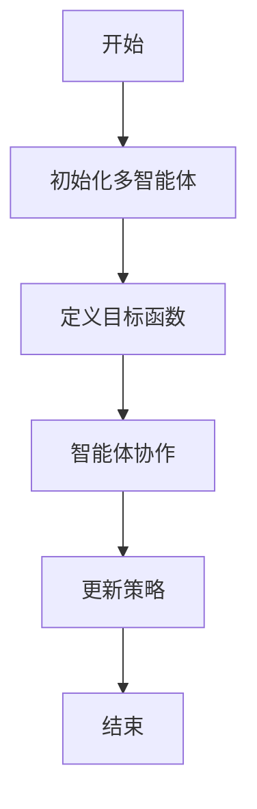

                 

# 多智能体AI如何优化社交媒体影响力分析

## 关键词：多智能体AI，社交媒体影响力分析，分布式计算，影响力传播模型，用户行为分析

## 摘要：  
随着社交媒体的快速发展，用户影响力分析成为企业和社会机构的重要任务。本文通过多智能体AI的技术手段，探索如何优化社交媒体影响力分析的过程。从多智能体AI的核心原理到实际应用，结合影响力传播模型和用户行为分析，详细阐述如何利用多智能体AI提升社交媒体影响力分析的效率和准确性。文章还通过实际案例分析，展示了多智能体AI在社交媒体影响力分析中的具体应用和优势。

---

# 第1章 多智能体AI与社交媒体影响力分析概述

## 1.1 多智能体AI的定义与特点

### 1.1.1 多智能体AI的定义  
多智能体AI是指由多个具有自主决策能力的智能体组成的系统，这些智能体能够通过协作完成复杂任务。与传统单智能体AI不同，多智能体AI强调分布式计算和协作，能够更好地应对复杂环境下的问题。

### 1.1.2 多智能体AI的核心特点  
- **分布式计算**：多个智能体协同工作，任务分解到各个智能体完成。  
- **自主性**：每个智能体都有一定的自主决策能力。  
- **协作性**：智能体之间通过通信和协作完成共同目标。  
- **动态适应性**：能够根据环境变化实时调整策略。  

### 1.1.3 多智能体AI与传统AI的区别  
传统AI通常基于中心化计算，依赖单个智能体完成任务，而多智能体AI强调分布式协作，适用于复杂场景下的问题。

---

## 1.2 社交媒体影响力分析的定义与重要性

### 1.2.1 社交媒体影响力分析的定义  
社交媒体影响力分析是指通过数据挖掘和人工智能技术，评估用户在社交媒体上的影响力，包括用户的关注度、传播力和影响力。

### 1.2.2 社交媒体影响力分析的重要性  
- **企业品牌管理**：帮助企业识别关键意见领袖（KOL），提升品牌形象。  
- **精准营销**：通过影响力分析，实现精准营销策略。  
- **舆情监控**：及时发现并应对负面舆情。  

### 1.2.3 社交媒体影响力分析的挑战与机遇  
- **挑战**：数据量大、用户行为复杂、算法实时性要求高等。  
- **机遇**：通过多智能体AI技术，提升分析效率和准确性。  

---

## 1.3 多智能体AI在社交媒体影响力分析中的应用前景

### 1.3.1 多智能体AI的核心优势  
- **分布式计算能力**：能够高效处理海量数据。  
- **协作能力**：多个智能体协同工作，提升分析效率。  
- **动态适应性**：能够实时应对社交媒体环境的变化。  

### 1.3.2 多智能体AI在社交媒体影响力分析中的潜在应用  
- **用户行为分析**：通过多智能体协作，分析用户的互动行为。  
- **影响力传播模型**：利用多智能体AI模拟影响力传播过程。  
- **精准推荐**：基于影响力分析结果，实现精准内容推荐。  

### 1.3.3 多智能体AI与社交媒体影响力分析的结合  
多智能体AI能够通过分布式协作和实时计算，优化社交媒体影响力分析的效率和准确性。

---

## 1.4 本章小结  
本章介绍了多智能体AI的核心概念和社交媒体影响力分析的重要性，阐述了多智能体AI在社交媒体影响力分析中的应用前景。

---

# 第2章 多智能体AI的核心概念与联系

## 2.1 多智能体AI的核心概念

### 2.1.1 多智能体系统的定义  
多智能体系统是由多个智能体组成的分布式系统，这些智能体通过协作完成特定任务。

### 2.1.2 多智能体系统的组成要素  
- **智能体**：具有自主决策能力的个体。  
- **通信机制**：智能体之间的通信方式。  
- **协作协议**：智能体之间的协作规则。  
- **环境**：智能体所处的外部环境。  

### 2.1.3 多智能体系统的交互机制  
- **同步交互**：智能体之间同步完成任务。  
- **异步交互**：智能体之间异步完成任务。  
- **混合交互**：结合同步和异步的交互方式。  

---

## 2.2 多智能体AI与社交媒体影响力分析的联系

### 2.2.1 多智能体AI在社交媒体数据处理中的应用  
- **分布式计算**：通过多智能体AI处理海量数据。  
- **实时分析**：通过智能体协作实现实时数据处理。  

### 2.2.2 多智能体AI在影响力传播中的作用  
- **影响力传播模型**：利用多智能体AI模拟影响力传播过程。  
- **用户行为分析**：通过多智能体协作分析用户的互动行为。  

### 2.2.3 多智能体AI在用户行为分析中的应用  
- **用户画像构建**：通过多智能体协作构建用户画像。  
- **用户行为预测**：基于多智能体AI预测用户的未来行为。  

---

## 2.3 多智能体AI的核心原理

### 2.3.1 分布式计算与协作  
多智能体AI通过分布式计算，将任务分解到多个智能体完成，提升计算效率。

### 2.3.2 自主决策与学习  
智能体通过自主学习和决策，适应复杂环境的变化。

### 2.3.3 动态环境适应  
多智能体AI能够实时调整策略，适应动态变化的社交媒体环境。

---

## 2.4 本章小结  
本章详细阐述了多智能体AI的核心概念和其在社交媒体影响力分析中的应用，分析了多智能体AI的核心原理。

---

# 第3章 多智能体AI的算法原理

## 3.1 多智能体AI的核心算法

### 3.1.1 分布式计算算法  
- **任务分解**：将复杂任务分解为多个子任务。  
- **分布式优化**：通过分布式计算优化任务执行。  

### 3.1.2 协作学习算法  
- **分布式学习**：智能体通过协作学习提升整体性能。  
- **知识共享**：智能体之间共享知识，提升协作效率。  

### 3.1.3 动态环境适应算法  
- **实时反馈**：智能体通过实时反馈调整策略。  
- **自适应优化**：通过自适应算法优化任务执行。  

---

## 3.2 多智能体AI的数学模型

### 3.2.1 多智能体系统的基本模型  
$$ y_i = f(x_i, \theta) $$  
其中，$y_i$ 是智能体i的输出，$x_i$ 是输入，$\theta$ 是模型参数。

### 3.2.2 多智能体协作的数学表达  
$$ \theta_{new} = \theta_{old} + \sum_{i=1}^{n} \Delta \theta_i $$  
其中，$\Delta \theta_i$ 是智能体i的参数更新量。

### 3.2.3 多智能体决策的优化模型  
$$ \max_{\theta} \sum_{i=1}^{n} f_i(\theta) $$  
其中，$f_i(\theta)$ 是智能体i的优化目标函数。

---

## 3.3 算法流程图（使用 Mermaid）

---

## 3.4 本章小结  
本章详细介绍了多智能体AI的核心算法和数学模型，通过流程图展示了算法的整体流程。

---

## 4.1 本章小结  
本章从多智能体AI的核心概念到其在社交媒体影响力分析中的应用，详细阐述了多智能体AI的算法原理和数学模型。

---

通过以上章节，我们可以看到，多智能体AI在社交媒体影响力分析中的应用前景广阔，能够通过分布式计算和协作，提升影响力分析的效率和准确性。接下来的章节将从系统架构和项目实战的角度，进一步深入探讨多智能体AI在社交媒体影响力分析中的具体应用。

---

**作者：AI天才研究院/AI Genius Institute & 禅与计算机程序设计艺术 /Zen And The Art of Computer Programming**

