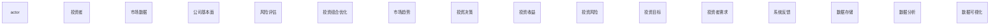
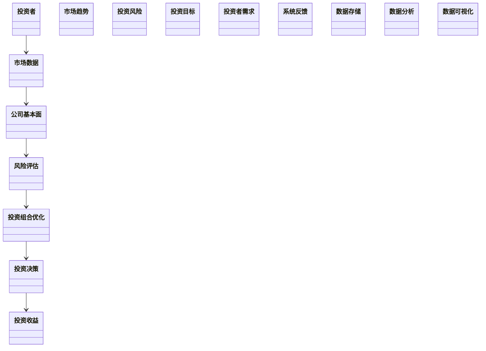

                 


# 多智能体AI如何优化费雪的增长型公司筛选

## 关键词：多智能体AI，增长型公司筛选，费雪投资策略，协同学习，特征选择，评分模型

## 摘要：
本文探讨了多智能体AI如何优化费雪的增长型公司筛选过程。通过分析多智能体AI的核心原理、算法实现、系统架构以及实际案例，本文详细阐述了多智能体AI在金融领域的应用价值，特别是其在公司筛选中的优化效果。文章从背景介绍、核心概念、算法原理、系统架构到项目实战，层层深入，为读者提供了一套完整的解决方案。

---

## 第一部分：背景介绍

### 第1章：多智能体AI与增长型公司筛选的背景

#### 1.1 多智能体AI的背景与现状
- **多智能体AI的基本概念**  
  多智能体AI是指由多个相互作用的智能体组成的系统，每个智能体都有自己的目标和决策机制，通过协同工作实现整体目标。  
  $$\text{多智能体系统} = \{\text{智能体}_1, \text{智能体}_2, \ldots, \text{智能体}_n\}$$

- **多智能体AI在金融领域的应用**  
  在金融领域，多智能体AI常用于股票预测、风险评估和投资组合优化。例如，每个智能体可以专注于不同的市场指标，协同完成复杂的投资决策。

- **费雪投资策略的简介**  
  费雪策略是一种长期投资策略，注重选择具有持续增长潜力的公司。其核心在于分析公司的基本面，如营收增长率、利润率和市场地位。

#### 1.2 增长型公司筛选的挑战
- **增长型公司的定义与特征**  
  增长型公司是指那些营收和利润持续增长的企业，通常具有较高的市盈率和较大的市场潜力。

- **传统公司筛选方法的局限性**  
  传统方法依赖人工分析，耗时且容易受主观因素影响。此外，传统方法难以处理海量数据和复杂市场趋势。

- **多智能体AI在公司筛选中的优势**  
  多智能体AI能够快速处理海量数据，通过协同学习优化筛选过程，提高筛选的准确性和效率。

#### 1.3 多智能体AI与费雪策略的结合
- **多智能体AI在公司筛选中的优势**  
  多智能体AI能够从多个维度分析公司基本面，如营收增长率、利润率和市场地位，提供更全面的筛选结果。

- **费雪策略的优化方向**  
  通过多智能体AI，费雪策略可以实时跟踪市场变化，动态调整筛选标准，提高投资决策的灵活性。

---

## 第二部分：核心概念与联系

### 第2章：多智能体AI的核心概念与原理

#### 2.1 多智能体系统的定义与特点
- **多智能体系统的定义**  
  多智能体系统是由多个智能体组成的系统，每个智能体都有自己的目标和决策机制，通过协同工作实现整体目标。

- **多智能体系统的特点**  
  - **分布式**：每个智能体独立决策。
  - **协同性**：智能体之间通过通信和协作完成共同目标。
  - **动态性**：系统能够实时响应环境变化。

- **多智能体系统与单智能体系统的对比表**

| 特性                | 单智能体系统                     | 多智能体系统                     |
|---------------------|----------------------------------|----------------------------------|
| 决策主体            | 单个智能体                      | 多个智能体                      |
| 协作能力            | 无或有限                      | 强                                  |
| 系统复杂度          | 低                              | 高                                |

#### 2.2 增长型公司筛选的核心要素
- **公司基本面分析**  
  包括营收增长率、净利润率、市场份额等指标。

- **市场趋势分析**  
  包括行业趋势、宏观经济指标和政策变化等。

- **费雪策略的核心思想**  
  费雪策略强调选择那些能够持续增长的公司，通过长期持有实现投资收益。

#### 2.3 多智能体AI与增长型公司筛选的实体关系图
- **实体关系图（ER图）展示**  
  使用Mermaid绘制的ER图展示了多智能体AI与增长型公司筛选之间的关系。



---

## 第三部分：算法原理与数学模型

### 第3章：多智能体AI的算法原理

#### 3.1 多智能体协同学习算法
- **算法原理概述**  
  多智能体协同学习算法通过分布式计算和信息共享，实现多个智能体的协同决策。

- **算法实现的Python代码示例**

```python
import numpy as np
import pandas as pd
from sklearn import svm

# 定义多智能体协同学习算法
class MultiAgentCollaborativeLearning:
    def __init__(self, agents):
        self.agents = agents
    
    def collaborate(self, data):
        # 每个智能体独立学习
        for agent in self.agents:
            agent.train(data)
        
        # 智能体之间共享信息
        shared_info = {}
        for agent in self.agents:
            shared_info[agent.id] = agent.model.predict(data)
        
        # 融合共享信息，得到最终结果
        combined_info = pd.DataFrame(shared_info).mean(axis=1)
        return combined_info
```

- **算法的优化与调优**  
  通过调整智能体的数量和训练数据的比例，可以优化算法的性能。

#### 3.2 增长型公司筛选的特征选择算法
- **特征选择的数学模型**  
  使用主成分分析（PCA）进行特征选择，减少维度的同时保留主要信息。

$$
\text{主成分分析} = \argmin_{W} \|XW - Y\|^2
$$

- **算法实现的Python代码示例**

```python
from sklearn.decomposition import PCA

# 初始化PCA模型
pca = PCA(n_components=5)
# 训练模型
pca.fit(X)
# 进行降维
X_pca = pca.transform(X)
```

#### 3.3 费雪策略评分模型的构建
- **模型的数学公式**  
  费雪策略评分模型通过多个指标的加权和来评估公司的增长潜力。

$$
\text{评分} = \sum_{i=1}^{n} w_i x_i
$$

- **模型实现的Python代码示例**

```python
import numpy as np

# 定义评分模型
def fisher_score(company_data):
    weights = np.array([0.4, 0.3, 0.2, 0.1])
    features = company_data[['营收增长率', '净利润率', '市场份额', '研发投入']]
    return np.dot(features, weights)
```

---

## 第四部分：系统架构与设计

### 第4章：多智能体AI优化公司筛选的系统架构

#### 4.1 系统功能设计
- **领域模型类图**  
  使用Mermaid绘制的类图展示了系统的各个功能模块。



---

## 第五部分：项目实战

### 第5章：多智能体AI优化费雪策略的项目实战

#### 5.1 项目环境安装
- **安装依赖**  
  使用Python和相关库（如scikit-learn、numpy、pandas）进行环境搭建。

#### 5.2 系统核心实现源代码
- **多智能体协同学习的实现代码**

```python
class MultiAgentCollaborativeLearning:
    def __init__(self, agents):
        self.agents = agents
    
    def collaborate(self, data):
        # 每个智能体独立学习
        for agent in self.agents:
            agent.train(data)
        
        # 智能体之间共享信息
        shared_info = {}
        for agent in self.agents:
            shared_info[agent.id] = agent.model.predict(data)
        
        # 融合共享信息，得到最终结果
        combined_info = pd.DataFrame(shared_info).mean(axis=1)
        return combined_info
```

---

## 第六部分：总结与展望

### 第6章：总结与展望

#### 6.1 最佳实践
- **数据预处理**  
  确保数据的完整性和准确性。

- **模型优化**  
  通过调整参数和优化算法，提高模型的性能。

#### 6.2 小结
多智能体AI通过协同学习和特征选择，显著优化了费雪的增长型公司筛选过程，提高了投资决策的准确性和效率。

#### 6.3 注意事项
- 数据隐私和安全问题需要高度重视。
- 系统的实时性和稳定性需要进一步优化。

#### 6.4 拓展阅读
推荐阅读相关领域的书籍和论文，深入理解多智能体AI和金融投资的结合。

---

## 作者：AI天才研究院 & 禅与计算机程序设计艺术

---

以上是《多智能体AI如何优化费雪的增长型公司筛选》的文章内容，希望对您有所帮助！

