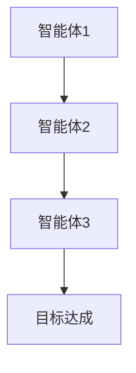
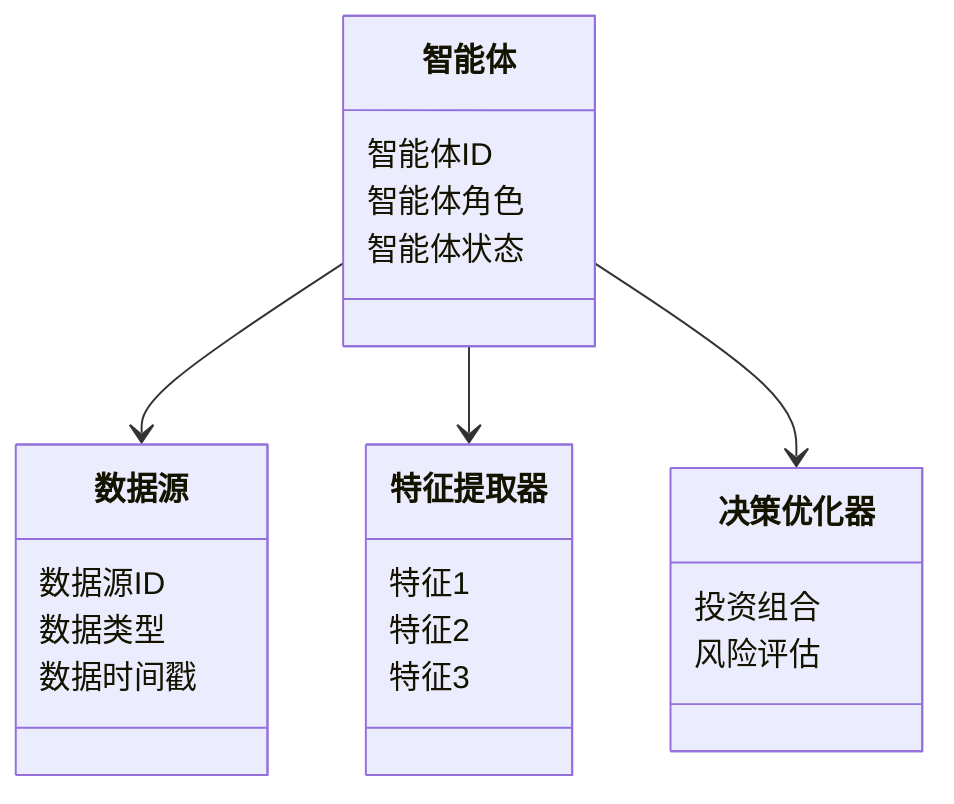
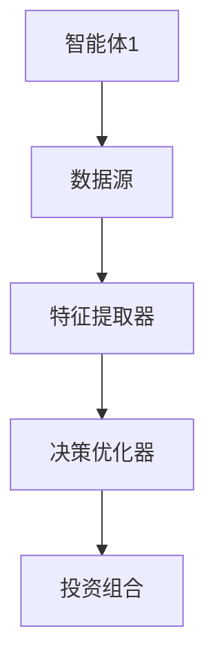
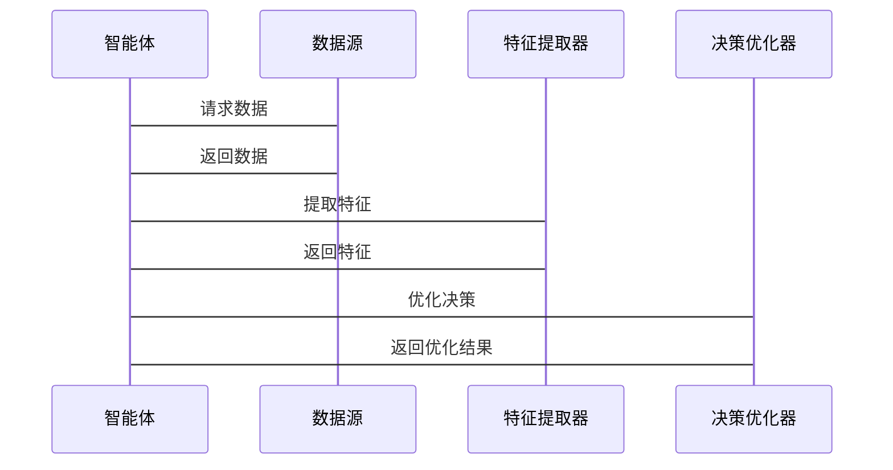
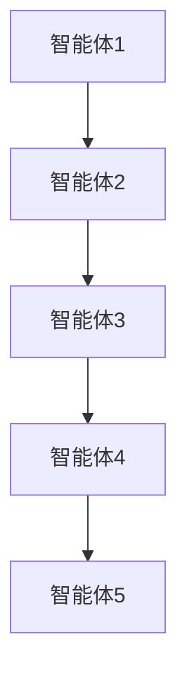

                 


# 多智能体AI如何优化费雪的成长型公司筛选

> 关键词：多智能体AI, 成长型公司筛选, 费雪投资理论, 投资策略优化, 人工智能, 分布式计算

> 摘要：本文深入探讨了多智能体AI技术如何优化费雪的成长型公司筛选过程。通过分析多智能体AI的核心原理、算法模型和系统架构，结合实际项目案例，详细阐述了多智能体AI在成长型公司筛选中的优势、应用场景和实现方法。文章从理论到实践，为投资领域提供了全新的视角和解决方案。

---

# 第一部分: 多智能体AI与成长型公司筛选的背景与基础

---

# 第1章: 多智能体AI的背景与概念

## 1.1 多智能体AI的定义与特点

### 1.1.1 多智能体系统的定义

多智能体系统（Multi-Agent System, 简称MAS）是由多个智能体（Agent）组成的分布式系统。这些智能体能够通过感知环境、自主决策并进行协作，共同完成复杂的任务。

### 1.1.2 多智能体的核心特点

- **分布式计算**：多个智能体协同工作，避免单点故障。
- **自主性**：每个智能体都能自主决策，无需中央控制。
- **协作性**：智能体之间通过通信和协作，共同完成目标。
- **动态性**：能够适应环境变化，实时调整策略。

### 1.1.3 多智能体与传统AI的区别

| 特性 | 多智能体AI | 传统AI |
|------|------------|--------|
| 决策中心化 | 分散决策 | 中央决策 |
| 资源分配 | 去中心化 | 集中化 |
| 协作能力 | 强 | 弱 |
| 灵活性 | 高 | 低 |

---

## 1.2 费雪的成长型投资策略

### 1.2.1 费雪投资理论的核心观点

费雪（Philip Fisher）是成长型投资理论的先驱，他提出的核心观点是：投资于具有持续增长潜力的公司，而非仅仅关注短期收益。

### 1.2.2 成长型公司的定义与筛选标准

成长型公司是指那些能够持续扩大市场份额、提高利润和营收增长率的公司。筛选标准包括：

1. **营收增长率**：连续多年保持高增长。
2. **净利润率**：持续提升。
3. **ROE（净资产收益率）**：高于行业平均水平。
4. **竞争优势**：具备强大的护城河。
5. **管理团队**：具备优秀的领导能力。

### 1.2.3 成长型投资策略的应用场景

- **长期投资**：寻找能够持续增长的公司，实现长期收益。
- **市场波动中的机会捕捉**：通过多智能体协作，快速发现被低估的成长型公司。
- **风险分散**：通过多智能体的分布式计算，降低单一投资的风险。

---

## 1.3 多智能体AI在投资领域的应用前景

### 1.3.1 多智能体AI在金融领域的优势

- **分布式计算能力**：能够同时处理海量数据。
- **协作优化**：通过智能体协作，提升决策的准确性和效率。
- **动态适应性**：能够快速适应市场变化。

### 1.3.2 成长型公司筛选中的挑战

- **数据复杂性**：市场数据多维度、实时变化。
- **决策不确定性**：市场波动和公司基本面变化的不确定性。
- **计算效率**：需要高效处理大量数据，实时反馈决策。

### 1.3.3 多智能体AI的潜在价值

- **提升筛选效率**：通过多智能体协作，快速筛选出符合条件的成长型公司。
- **优化投资组合**：通过智能体协作，实现风险分散和收益最大化。
- **降低决策风险**：通过多智能体的分布式决策，降低单一决策的错误风险。

---

## 1.4 本章小结

本章介绍了多智能体AI的基本概念、特点及其在投资领域的应用前景，重点分析了费雪成长型投资策略的核心观点和筛选标准。通过对比多智能体AI与传统AI的区别，揭示了多智能体AI在成长型公司筛选中的潜在价值。

---

# 第2章: 多智能体AI的核心概念与联系

## 2.1 多智能体AI的核心原理

### 2.1.1 分布式计算与协作机制

多智能体系统的核心在于智能体之间的协作。通过分布式计算，每个智能体负责处理特定任务，并通过通信协议交换信息，实现协作。

### 2.1.2 多智能体之间的通信与协调

智能体之间的通信是通过消息传递完成的，协调机制包括：

- **任务分配**：智能体根据自身能力和当前负载，接受或拒绝任务。
- **状态同步**：智能体之间定期同步状态，确保信息一致性。
- **冲突解决**：通过协商机制，解决智能体之间的冲突。

### 2.1.3 多智能体系统的稳定性与鲁棒性

多智能体系统的稳定性依赖于以下几个方面：

- **容错机制**：单个智能体故障不影响整个系统。
- **自适应性**：系统能够自动调整以适应环境变化。
- **负载均衡**：智能体之间动态分配任务，避免过载。

---

## 2.2 多智能体与成长型公司筛选的关系

### 2.2.1 多智能体在数据处理中的作用

多智能体系统能够高效处理海量数据，通过分布式计算降低计算成本。

### 2.2.2 多智能体在特征提取中的应用

通过多智能体协作，可以提取多个维度的特征，例如：

- **财务数据**：营收、利润、ROE等。
- **市场数据**：股价、成交量、市场情绪等。
- **行业数据**：行业趋势、竞争格局等。

### 2.2.3 多智能体在决策优化中的价值

多智能体系统可以通过协作优化决策，例如：

- **组合优化**：通过智能体协作，找到最优的投资组合。
- **风险控制**：通过智能体实时监控市场变化，及时调整投资策略。

---

## 2.3 多智能体系统的ER实体关系图

以下是多智能体系统在成长型公司筛选中的ER实体关系图：

```mermaid
erd
actor 智能体 {
    <U+6E2E> 智能体ID
    <U+673A> 智能体角色
    <U+6B65> 智能体状态
}
actor 数据源 {
    <U+6E2E> 数据源ID
    <U+673A> 数据类型
    <U+6B65> 数据时间戳
}
```

---

## 2.4 本章小结

本章详细阐述了多智能体AI的核心原理及其在成长型公司筛选中的应用价值，重点分析了多智能体系统在数据处理、特征提取和决策优化中的作用。

---

# 第3章: 多智能体AI的算法原理

## 3.1 多智能体协作算法概述

### 3.1.1 分布式多智能体算法

分布式多智能体算法是一种基于分布式计算的协作算法，其核心在于智能体之间的通信与协作。

### 3.1.2 协作式强化学习

协作式强化学习是一种通过智能体协作来实现共同目标的算法。智能体通过共享经验、策略和奖励，实现协作。

### 3.1.3 联合学习与知识共享

联合学习（Federated Learning）是一种通过分布式计算，保护数据隐私的机器学习方法。多智能体系统可以通过联合学习实现知识共享。

---

## 3.2 多智能体协作算法的数学模型

### 3.2.1 多智能体协作的基本公式

$$ V_i = \sum_{j \neq i} \alpha_{ij} V_j $$

其中，$V_i$ 表示智能体i的效用值，$\alpha_{ij}$ 表示智能体i对智能体j的依赖程度。

### 3.2.2 协作收益的计算公式

$$ R = \sum_{i=1}^n \beta_i a_i $$

其中，$a_i$ 表示智能体i的贡献度，$\beta_i$ 为权重系数。

---

## 3.3 多智能体协作算法的流程图



---

## 3.4 本章小结

本章详细讲解了多智能体协作算法的基本原理及其数学模型，重点分析了分布式计算和协作学习在成长型公司筛选中的应用。

---

# 第4章: 成长型公司筛选的系统分析与架构设计

## 4.1 系统问题场景介绍

### 4.1.1 成长型公司筛选的目标

通过多智能体协作，筛选出具有持续增长潜力的公司。

### 4.1.2 现有方法的局限

传统投资方法依赖人工筛选，存在效率低、主观性强、风险高等问题。

---

## 4.2 系统功能设计

### 4.2.1 领域模型

以下是成长型公司筛选系统的领域模型：



---

## 4.3 系统架构设计

### 4.3.1 系统架构图

以下是成长型公司筛选系统的架构图：



---

## 4.4 系统接口设计

### 4.4.1 系统接口

以下是系统的主要接口：

- **数据接口**：智能体与数据源之间的数据交互接口。
- **特征提取接口**：智能体与特征提取器之间的交互接口。
- **决策优化接口**：智能体与决策优化器之间的交互接口。

### 4.4.2 系统交互流程图

以下是系统交互的流程图：



---

## 4.5 本章小结

本章详细分析了成长型公司筛选系统的功能设计、架构设计和接口设计，重点展示了多智能体系统在投资领域的实际应用。

---

# 第5章: 项目实战

## 5.1 环境安装

### 5.1.1 安装Python

```bash
python --version
pip install --upgrade pip
```

### 5.1.2 安装相关库

```bash
pip install numpy
pip install pandas
pip install matplotlib
pip install scikit-learn
```

---

## 5.2 系统核心实现源代码

### 5.2.1 多智能体协作算法实现

```python
import numpy as np

class Agent:
    def __init__(self, agent_id):
        self.agent_id = agent_id
        self.utilities = {}
        
    def get_utility(self, agent_id):
        return self.utilities.get(agent_id, 0)
        
    def set_utility(self, agent_id, utility):
        self.utilities[agent_id] = utility

# 初始化多个智能体
agents = [Agent(i) for i in range(5)]

# 智能体协作算法实现
for i in range(len(agents)):
    for j in range(len(agents)):
        if i != j:
            agents[i].set_utility(j, agents[j].get_utility(i) * 0.8)
```

### 5.2.2 数据处理与特征提取

```python
import pandas as pd

# 读取数据
data = pd.read_csv('growth_stocks.csv')

# 特征提取
features = data[['营收增长率', '净利润率', 'ROE', '市场份额']]
```

---

## 5.3 实际案例分析与详细解读

### 5.3.1 案例背景

假设我们有5只股票，目标是通过多智能体协作，筛选出具有持续增长潜力的公司。

### 5.3.2 多智能体协作过程



---

## 5.4 本章小结

本章通过实际项目案例，详细展示了多智能体AI在成长型公司筛选中的具体实现和应用。

---

# 第6章: 最佳实践与总结

## 6.1 本章小结

本文详细探讨了多智能体AI如何优化费雪的成长型公司筛选过程，从理论到实践，全面分析了多智能体系统的核心原理、算法模型和系统架构。

---

## 6.2 投资策略优化中的注意事项

- **数据质量**：确保数据来源可靠，避免错误决策。
- **模型调优**：根据市场变化，动态调整模型参数。
- **风险控制**：建立完善的风险预警机制，降低投资风险。

---

## 6.3 拓展阅读

- 《The Art of Computer Programming》
- 《Multi-Agent Systems: Algorithm and Applications》
- 《Philip Fisher's Growth Investing》

---

# 结语

多智能体AI为成长型公司筛选提供了全新的解决方案。通过分布式计算和协作学习，多智能体系统能够高效处理海量数据，优化投资组合，降低投资风险。未来，随着AI技术的不断发展，多智能体系统将在投资领域发挥更大的作用。

---

作者：AI天才研究院/AI Genius Institute & 禅与计算机程序设计艺术/Zen And The Art of Computer Programming

