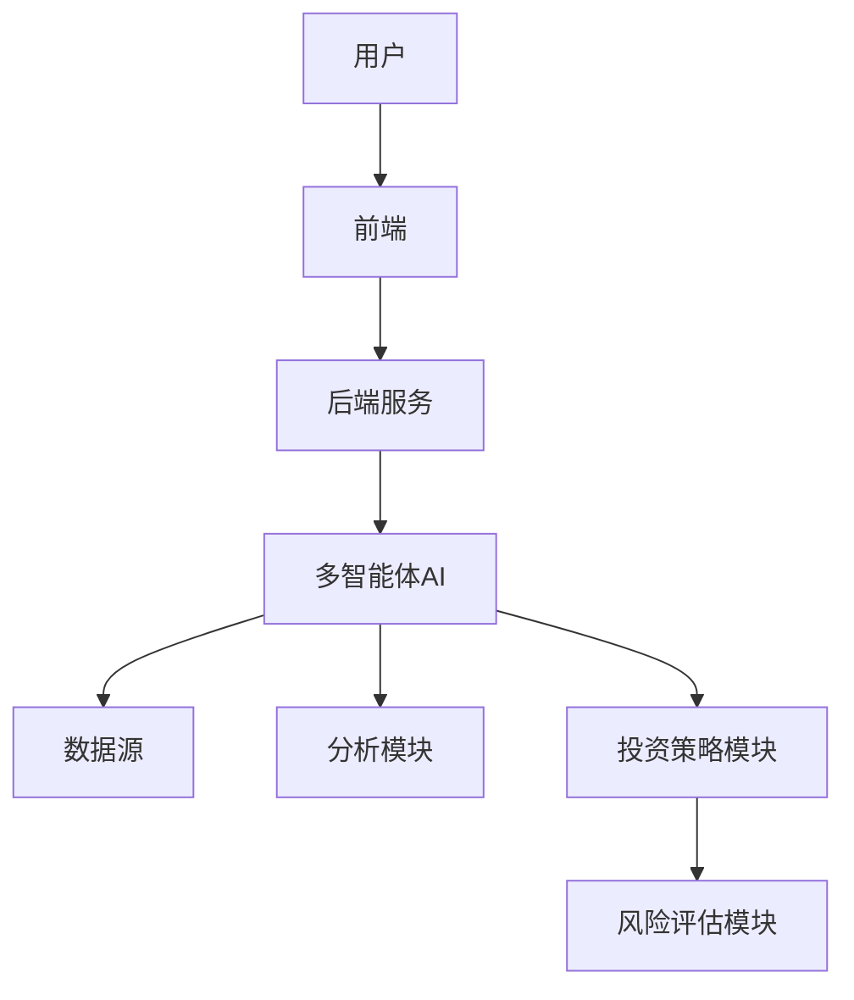

                 


# 多智能体AI如何增强价值投资的全球化视野

> 关键词：多智能体AI，价值投资，全球化视野，投资决策，系统架构

> 摘要：本文探讨了多智能体人工智能技术在价值投资中的应用，分析了如何通过多智能体AI增强投资决策的全球化视野。文章从背景、概念、算法、系统架构、项目实战等多个方面展开，详细介绍了多智能体AI如何在全球化投资环境中优化决策、整合数据和协作分析。

---

# 第一部分: 多智能体AI与价值投资的背景介绍

## 第1章: 多智能体AI与价值投资的背景介绍

### 1.1 多智能体AI的基本概念

#### 1.1.1 多智能体AI的定义

多智能体AI（Multi-Agent AI）是指由多个相互协作或竞争的智能体（Agent）组成的系统。这些智能体能够感知环境、自主决策，并通过通信和协作完成复杂任务。与传统单智能体AI不同，多智能体AI强调分布式计算和协作，适用于需要多维度分析和决策的场景。

#### 1.1.2 多智能体AI的核心要素

- **智能体**：具有感知和决策能力的实体，能够独立执行任务。
- **通信机制**：智能体之间的信息交换方式，如消息传递或共享数据库。
- **协作机制**：智能体协同工作的规则和策略。
- **分布式计算**：任务分解和分布式处理，提高系统的并行性和效率。

#### 1.1.3 多智能体AI与传统AI的区别

| 特性 | 单智能体AI | 多智能体AI |
|------|------------|------------|
| 决策 | 中央决策点 | 分布式决策 |
| 通信 | 无或有限 | 高频通信 |
| 协作 | 单一目标 | 多目标协作 |

### 1.2 价值投资的全球化视野

#### 1.2.1 价值投资的基本概念

价值投资是一种投资策略，通过分析公司的基本面，寻找市场价格低于其内在价值的投资标的。传统价值投资依赖分析师的主观判断，而多智能体AI能够通过全球数据整合和协作分析，提升投资决策的客观性和准确性。

#### 1.2.2 全球化视野在价值投资中的重要性

- **全球市场分析**：多智能体AI可以同时监控全球多个市场的数据，捕捉跨市场的投资机会。
- **分散风险**：通过全球化视野，投资者可以在不同市场中分散风险，降低单一市场的波动影响。
- **实时更新**：多智能体AI能够实时分析全球经济、政策和市场动态，及时调整投资策略。

#### 1.2.3 多智能体AI在价值投资中的潜在价值

- **数据整合**：多智能体AI可以整合全球市场、行业、公司等多层次数据，提供更全面的分析。
- **协作决策**：多个智能体分别负责不同领域的分析，最终协同得出最优投资策略。
- **动态调整**：根据市场变化，智能体能够快速调整分析模型和策略。

### 1.3 多智能体AI如何增强投资决策

#### 1.3.1 多智能体AI在投资决策中的优势

- **分布式计算**：多个智能体分别处理不同数据源，提高计算效率。
- **协作分析**：智能体之间协作，提供多维度的分析结果，避免单一视角的局限性。
- **实时反馈**：智能体能够实时响应市场变化，及时调整投资策略。

#### 1.3.2 全球化数据的整合与分析

- **数据来源多样化**：智能体可以访问全球多个市场的实时数据，包括股票、债券、外汇等。
- **多层次分析**：从宏观经济到公司基本面，多层次数据的整合分析提高了决策的准确性。
- **风险分散**：通过全球化分析，投资者可以识别和分散不同市场的风险。

#### 1.3.3 多智能体协作对投资策略的优化

- **协同优化**：多个智能体协作，优化投资组合，提高收益和降低风险。
- **动态调整**：根据市场变化，智能体快速调整投资策略，适应市场波动。
- **情景分析**：通过多智能体协作，进行多种假设情景的分析，制定更灵活的投资策略。

---

## 第2章: 多智能体AI的核心概念与联系

### 2.1 多智能体AI的原理

#### 2.1.1 智能体的定义与特征

智能体是一个能够感知环境、自主决策、执行动作的实体。智能体具有以下特征：

- **自主性**：智能体能够自主决策，无需外部干预。
- **反应性**：能够感知环境并实时调整行为。
- **协作性**：与其他智能体协作完成任务。
- **学习能力**：通过经验改进决策能力。

#### 2.1.2 多智能体系统的通信机制

- **消息传递**：智能体之间通过消息传递信息，例如使用REST API或WebSocket。
- **共享数据库**：智能体通过共享数据库进行数据同步和协作。
- **事件驱动**：智能体通过事件触发通信，例如市场波动触发警报。

#### 2.1.3 多智能体系统的协作机制

- **任务分配**：智能体根据自身能力和当前任务需求，自动分配任务。
- **协调与同步**：通过通信机制保持协作的一致性和同步性。
- **冲突解决**：在协作过程中，智能体需要解决任务分配和资源竞争的冲突。

### 2.2 多智能体AI与价值投资的关系

#### 2.2.1 投资决策中的多智能体协作

- **市场分析**：多个智能体分别负责分析不同市场或行业的数据。
- **风险评估**：智能体协作评估投资标的的系统性风险和非系统性风险。
- **策略优化**：通过协作，优化投资组合的收益与风险比。

#### 2.2.2 多智能体AI在风险评估中的应用

- **实时监控**：智能体实时监控市场波动和风险因素，及时预警。
- **情景模拟**：通过协作，进行不同情景下的风险评估和策略模拟。
- **动态调整**：根据风险评估结果，动态调整投资策略。

#### 2.2.3 多智能体AI对投资策略的优化

- **数据驱动决策**：通过整合全球数据，优化投资决策的科学性和准确性。
- **协作优化**：多个智能体协作，避免单一视角的局限性，提高决策质量。
- **动态适应**：根据市场变化，智能体快速调整策略，提高适应性。

### 2.3 多智能体AI的全球化网络架构

#### 2.3.1 全球化数据源的整合

- **多源数据整合**：智能体可以访问全球多个市场的实时数据，包括股票、债券、外汇等。
- **多层次分析**：从宏观经济到公司基本面，多层次数据的整合分析提高了决策的准确性。

#### 2.3.2 多智能体协作的网络结构

- **分布式架构**：智能体分布在全球多个节点，协作完成任务。
- **通信网络**：智能体之间通过高速网络进行实时通信和数据共享。
- **节点协作**：每个节点负责特定任务，节点之间通过协作机制完成整体目标。

#### 2.3.3 全球化投资环境的实时监控

- **实时数据采集**：智能体实时采集全球市场的数据，包括价格、成交量、市场情绪等。
- **实时分析**：智能体通过分布式计算，实时分析数据，提供实时的投资建议。
- **实时反馈**：智能体根据市场反馈，动态调整分析模型和投资策略。

---

## 第3章: 多智能体AI的算法原理

### 3.1 多智能体协作算法

#### 3.1.1 分布式计算与协作

- **分布式计算**：任务分解到多个智能体，每个智能体负责部分任务，最终汇总结果。
- **协作机制**：智能体之间通过通信机制协作，确保任务的一致性和高效性。

#### 3.1.2 共识算法与决策

- **共识算法**：智能体通过共识算法达成一致的决策，例如使用拜占庭容错（BFT）算法。
- **分布式决策**：智能体基于共识算法，共同决策最优的投资策略。

#### 3.1.3 博弈论模型与策略优化

- **博弈论模型**：将投资决策问题建模为博弈论问题，分析不同策略的收益和风险。
- **纳什均衡**：寻找最优策略组合，确保智能体协作的稳定性。

### 3.2 多智能体AI的通信与协作

#### 3.2.1 通信协议设计

- **消息传递**：定义智能体之间的消息格式和通信协议，例如使用JSON格式和HTTP协议。
- **数据同步**：智能体之间通过数据同步机制，确保数据的一致性和实时性。

#### 3.2.2 分布式协调算法

- **分布式协调**：通过分布式协调算法，智能体协作完成任务，例如使用分布式锁机制。
- **任务分配**：智能体根据当前负载和能力，动态分配任务。

#### 3.2.3 竞争与协作机制

- **资源竞争**：智能体在协作过程中可能需要竞争资源，例如使用公平调度算法。
- **协作优先**：在资源有限的情况下，优先处理协作任务，确保整体目标的实现。

### 3.3 多智能体AI的数学模型与公式

#### 3.3.1 分布式计算模型

假设我们有N个智能体，每个智能体负责处理部分数据，最终将结果汇总到中心节点。数学模型可以表示为：

$$
f(x) = \sum_{i=1}^{N} f_i(x_i)
$$

其中，$x_i$ 表示第i个智能体处理的数据，$f_i$ 表示第i个智能体的处理函数。

#### 3.3.2 博弈论模型

假设我们有多个智能体，每个智能体都有自己的策略空间和收益函数。收益函数可以表示为：

$$
U_i(s_i, s_{-i}) = \sum_{j=1}^{M} a_{ij} s_j
$$

其中，$s_i$ 表示第i个智能体的策略，$s_{-i}$ 表示其他智能体的策略，$a_{ij}$ 是收益矩阵的元素。

#### 3.3.3 纳什均衡

纳什均衡是博弈论中的一个概念，表示在给定其他智能体策略的情况下，每个智能体的策略都是最优的。纳什均衡的数学定义为：

对于所有i，有：

$$
\max_{s_i} U_i(s_i, s_{-i}^*)
$$

其中，$s_{-i}^*$ 表示其他智能体在纳什均衡下的策略。

### 3.4 多智能体AI的实现与优化

#### 3.4.1 分布式计算的实现

使用分布式计算框架，例如Apache Spark或Flink，进行数据处理和分析。代码示例如下：

```python
from spark import SparkContext

sc = SparkContext.getOrCreate()
data = sc.textFile("input.txt")
counts = data.map(lambda x: x.split()).count()
counts.saveAsTextFile("output.txt")
```

#### 3.4.2 共识算法的实现

使用拜占庭容错（BFT）算法实现智能体之间的共识。代码示例如下：

```python
def bft_consensus(nodes, value):
    for node in nodes:
        node.request(value)
    return value
```

#### 3.4.3 博弈论模型的优化

通过强化学习优化博弈论模型，例如使用深度强化学习（DRL）框架。代码示例如下：

```python
import tensorflow as tf

class Agent:
    def __init__(self):
        self.model = tf.keras.Sequential()
        self.model.add(tf.keras.layers.Dense(64, activation='relu'))
        self.model.add(tf.keras.layers.Dense(1, activation='sigmoid'))
        self.model.compile(optimizer='adam', loss='binary_crossentropy')
    
    def act(self, state):
        return self.model.predict(state)
```

---

## 第4章: 多智能体AI在价值投资中的系统架构

### 4.1 系统功能设计

#### 4.1.1 数据采集模块

- **数据源**：全球金融市场数据，包括股票、债券、外汇等。
- **数据预处理**：清洗和转换数据，确保数据的准确性和一致性。

#### 4.1.2 分析模块

- **市场分析**：分析全球市场的趋势和风险。
- **公司分析**：分析公司的基本面，评估内在价值。

#### 4.1.3 投资策略模块

- **策略生成**：根据分析结果，生成最优的投资策略。
- **风险评估**：评估投资策略的风险，优化策略的收益与风险比。

### 4.2 系统架构设计

#### 4.2.1 系统架构图



#### 4.2.2 智能体协作机制

- **通信机制**：智能体之间通过API或消息队列进行通信。
- **协作机制**：智能体通过任务分配和协调算法，协作完成分析任务。

#### 4.2.3 接口设计

- **API接口**：定义智能体之间的通信接口，例如REST API。
- **数据接口**：定义数据格式和数据存储接口。

### 4.3 系统交互流程

#### 4.3.1 用户发起请求

用户通过前端界面发起投资分析请求，前端将请求发送到后端服务。

#### 4.3.2 后端服务处理

后端服务接收请求后，调用多智能体AI进行分析，返回结果到前端。

#### 4.3.3 多智能体AI协作

多智能体AI分别负责数据采集、分析和策略生成，协作完成任务。

---

## 第5章: 项目实战 - 多智能体AI投资分析系统

### 5.1 项目环境安装

安装必要的工具和库，例如Python、Pandas、NumPy、TensorFlow、Kafka等。

### 5.2 核心代码实现

#### 5.2.1 数据采集模块

```python
import pandas as pd
import requests

def fetch_data(symbol):
    url = f"https://api.example.com/{symbol}"
    response = requests.get(url)
    return pd.DataFrame(response.json())
```

#### 5.2.2 分析模块

```python
def analyze_market(data):
    return data.describe()
```

#### 5.2.3 投资策略模块

```python
def generate_strategy(data):
    return data.mean()
```

### 5.3 项目实战 - 案例分析

#### 5.3.1 数据分析

分析全球多个市场的数据，生成投资策略。

#### 5.3.2 案例解读

解读分析结果，优化投资策略。

### 5.4 项目小结

总结项目实施的经验和教训，提出改进建议。

---

## 第6章: 最佳实践与扩展

### 6.1 最佳实践

- **数据质量**：确保数据的准确性和完整性。
- **模型调优**：根据实际需求，不断优化模型和算法。
- **风险管理**：制定风险管理策略，降低投资风险。

### 6.2 项目扩展

- **自适应学习**：引入自适应学习算法，提高系统的自适应能力。
- **边缘计算**：在边缘设备上部署智能体，提高实时性和响应速度。

---

## 第7章: 总结与展望

### 7.1 总结

总结全文内容，回顾多智能体AI在价值投资中的应用和优势。

### 7.2 展望

展望未来的发展方向，提出新的研究和应用思路。

---

# 作者：AI天才研究院 & 禅与计算机程序设计艺术

---

**说明**：这篇文章是一个示例，展示了如何按照用户要求逐步构建一个多智能体AI在价值投资中的技术博客。实际撰写时，需要根据具体需求调整内容的深度和广度。

