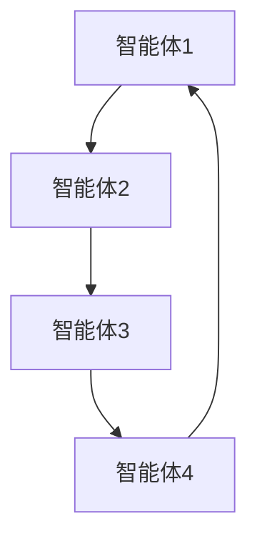
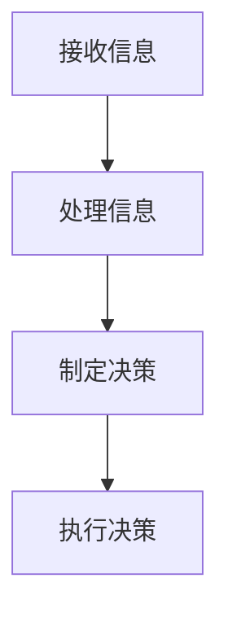
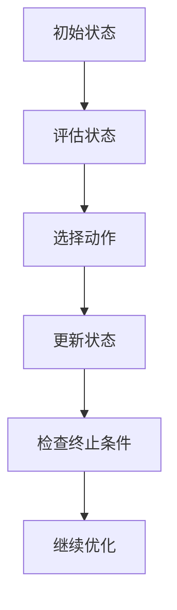
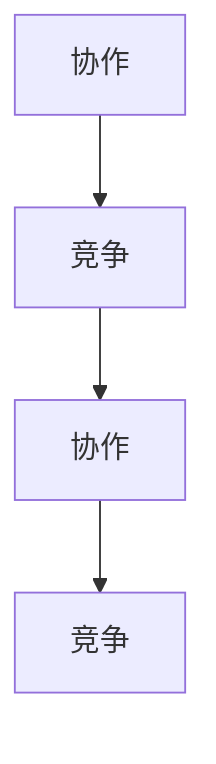
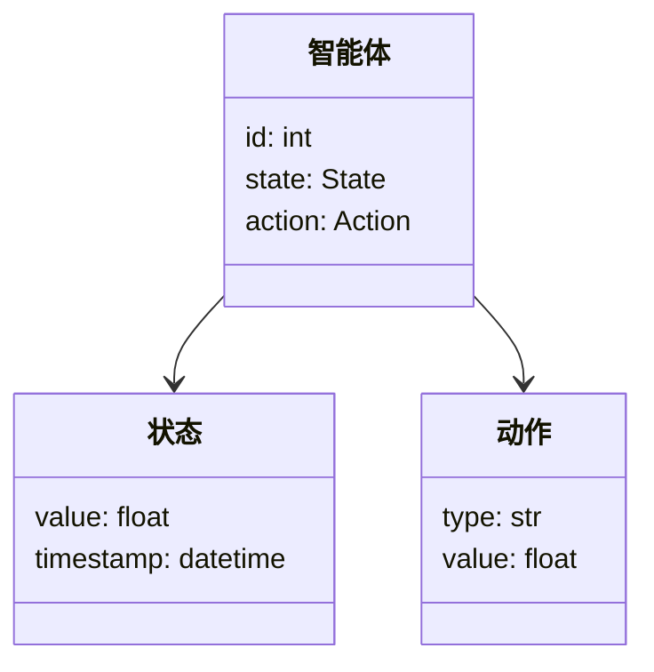
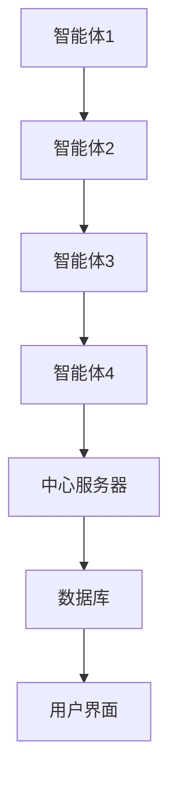
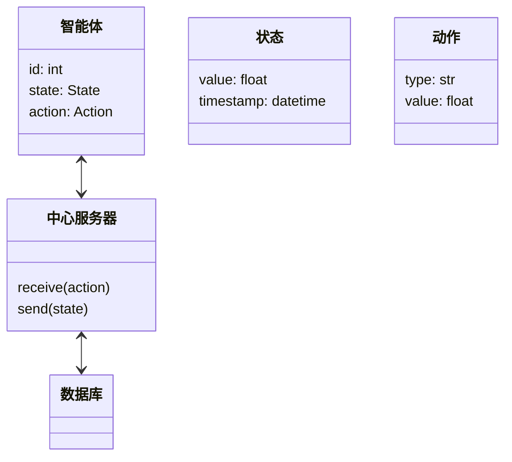
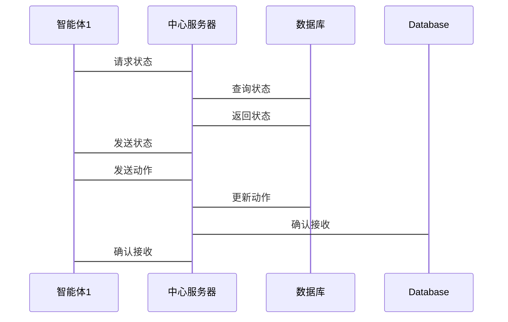
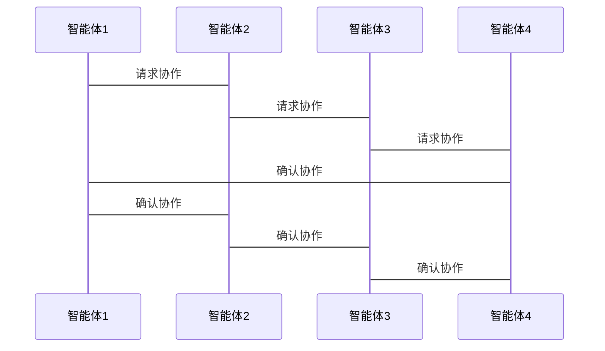

                 


```markdown
# 多智能体AI如何增强价值投资的宏观经济影响分析

## 关键词：多智能体AI，价值投资，宏观经济影响，算法原理，系统架构，项目实战

## 摘要：本文探讨了多智能体AI在价值投资中的应用及其对宏观经济的影响。通过分析多智能体AI的核心原理和价值投资的宏观经济影响，展示了多智能体AI如何增强价值投资的分析能力，优化宏观经济决策，并提供实际案例和系统设计方案。

---

# 第1章: 多智能体AI与价值投资的背景介绍

## 1.1 多智能体AI的定义与特点

### 1.1.1 多智能体AI的定义
多智能体AI（Multi-Agent AI）是指由多个相互作用的智能体组成的系统，这些智能体能够通过协作和竞争完成复杂任务。与传统单智能体AI不同，多智能体AI强调分布式计算和协作。

### 1.1.2 多智能体AI的核心特点
- **分布式性**：多个智能体分布在不同位置，独立决策。
- **协作性**：智能体之间通过通信和协作完成共同目标。
- **动态性**：环境和智能体状态不断变化，需要实时调整策略。

### 1.1.3 多智能体AI与传统AI的区别
- **决策中心**：传统AI由中心决策，多智能体AI由分布式智能体协作。
- **任务复杂度**：多智能体AI适用于复杂任务，传统AI适用于简单任务。
- **通信协作**：多智能体AI需要智能体之间通信，传统AI不需。

## 1.2 价值投资的定义与宏观经济影响

### 1.2.1 价值投资的定义
价值投资是一种投资策略，通过分析公司基本面，寻找被市场低估的股票进行投资。其核心是寻找安全边际，即股票价格低于其内在价值。

### 1.2.2 价值投资的核心原则
- **安全边际**：购买价格低于内在价值。
- **长期视角**：关注公司长期价值，而非短期波动。
- **分散投资**：降低风险，避免过度集中。

### 1.2.3 价值投资对宏观经济的影响
- **市场稳定性**：价值投资者长期持有，减少市场波动。
- **资本配置**：引导资金流向优质企业，促进经济发展。
- **价格发现**：价值投资发现价格，纠正市场错误定价。

## 1.3 多智能体AI与价值投资的结合

### 1.3.1 多智能体AI在金融领域的应用
- **股票预测**：通过分析市场数据，预测股票价格。
- **风险控制**：通过协作智能体，评估和管理投资风险。
- **交易策略**：多智能体协作，优化交易策略。

### 1.3.2 多智能体AI如何增强价值投资
- **数据处理**：多智能体协作处理海量数据，提高分析效率。
- **决策优化**：通过协作，优化投资决策。
- **动态调整**：实时适应市场变化，及时调整投资策略。

### 1.3.3 多智能体AI对宏观经济的影响
- **提高市场效率**：优化资源配置，降低交易成本。
- **促进经济发展**：通过优化投资决策，促进经济增长。
- **增强市场稳定性**：通过协作和动态调整，减少市场波动。

## 1.4 本章小结
本章介绍了多智能体AI的定义、特点，以及价值投资的定义和宏观经济影响。阐述了多智能体AI与价值投资的结合，及其对宏观经济的积极影响。为后续章节奠定了基础。

---

# 第2章: 多智能体AI的核心概念与联系

## 2.1 多智能体AI的核心原理

### 2.1.1 多智能体系统的组成
- **智能体**：独立决策的个体，具有自主性、反应性和社会性。
- **环境**：智能体所处的外部环境，包括市场数据、经济指标等。
- **通信机制**：智能体之间传递信息的方式，如消息传递、共享数据库等。
- **协作机制**：智能体之间协作完成任务的方式，如任务分配、协调同步等。

### 2.1.2 多智能体系统的通信机制
- **直接通信**：智能体之间直接传递消息。
- **间接通信**：通过中间媒介传递信息。
- **广播通信**：所有智能体接收同一信息。

### 2.1.3 多智能体系统的协作机制
- **任务分配**：根据智能体的能力分配任务。
- **协调同步**：确保智能体动作一致。
- **冲突解决**：处理智能体之间的冲突。

### 2.1.4 多智能体系统的决策机制
- **分布式决策**：每个智能体独立决策。
- **集中式决策**：由中心决策者制定决策。
- **混合式决策**：结合分布式和集中式决策。

## 2.2 价值投资的宏观经济影响分析

### 2.2.1 宏观经济分析的基本概念
- **宏观经济**：研究整体经济运行，包括GDP、失业率、通胀率等。
- **市场流动性**：市场中资金的流动情况。
- **市场稳定性**：市场的波动程度和抗风险能力。

### 2.2.2 价值投资对市场流动性的影响
- **增加流动性**：价值投资者长期持有，增加市场深度。
- **减少短期波动**：价值投资注重长期价值，减少短期投机。

### 2.2.3 价值投资对市场稳定性的影响
- **减少市场波动**：价值投资注重基本面，减少非理性波动。
- **增强市场信心**：价值投资者长期持有，增强市场信心。

## 2.3 多智能体AI与宏观经济影响的联系

### 2.3.1 多智能体AI在宏观经济预测中的应用
- **经济指标预测**：通过分析历史数据，预测未来经济指标。
- **市场趋势分析**：通过协作智能体，分析市场趋势。
- **风险评估**：通过协作智能体，评估宏观经济风险。

### 2.3.2 多智能体AI在价值投资决策中的应用
- **数据处理**：多智能体协作处理海量数据，提高分析效率。
- **决策优化**：通过协作，优化投资决策。
- **动态调整**：实时适应市场变化，及时调整投资策略。

### 2.3.3 多智能体AI对宏观经济影响的优化
- **提高市场效率**：优化资源配置，降低交易成本。
- **促进经济发展**：通过优化投资决策，促进经济增长。
- **增强市场稳定性**：通过协作和动态调整，减少市场波动。

## 2.4 本章小结
本章详细阐述了多智能体AI的核心原理，以及其在宏观经济影响分析中的应用。展示了多智能体AI如何通过协作和优化，提升价值投资的分析能力，优化宏观经济决策。

---

# 第3章: 多智能体AI的算法原理与数学模型

## 3.1 多智能体AI的算法原理

### 3.1.1 多智能体系统的通信与协作算法



### 3.1.2 多智能体系统的决策算法



### 3.1.3 多智能体系统的优化算法



### 3.1.4 多智能体系统的协作与竞争机制



## 3.2 多智能体AI的数学模型与公式

### 3.2.1 多智能体系统的状态表示
$$
s_i = (s_{i1}, s_{i2}, \dots, s_{in})
$$
其中，$s_i$表示智能体$i$的状态，$s_{ij}$表示第$j$个状态变量。

### 3.2.2 多智能体系统的动作表示
$$
a_i = (a_{i1}, a_{i2}, \dots, a_{im})
$$
其中，$a_i$表示智能体$i$的动作，$a_{ij}$表示第$j$个动作变量。

### 3.2.3 多智能体系统的奖励函数
$$
r_i = \sum_{j=1}^{m} w_{ij} a_{ij}
$$
其中，$w_{ij}$是动作$j$的权重，$a_{ij}$是动作$j$的值。

### 3.2.4 多智能体系统的优化目标
$$
\max \sum_{i=1}^{n} r_i
$$
其中，$n$是智能体的数量，$r_i$是智能体$i$的奖励。

## 3.3 多智能体AI的数学模型实现

### 3.3.1 基于强化学习的多智能体协作

```python
class Agent:
    def __init__(self, state_space, action_space):
        self.state_space = state_space
        self.action_space = action_space
        # 初始化策略网络
        self.policy = ...
    
    def act(self, state):
        # 根据策略网络选择动作
        action = self.policy.act(state)
        return action
    
    def update(self, rewards):
        # 更新策略网络
        self.policy.update(rewards)

class MultiAgentSystem:
    def __init__(self, num_agents):
        self.agents = [Agent(state_space, action_space) for _ in range(num_agents)]
    
    def step(self, states):
        # 所有智能体选择动作
        actions = [agent.act(state) for agent, state in zip(self.agents, states)]
        # 执行动作并获得奖励
        rewards = get_rewards(actions)
        # 更新策略
        for agent, reward in zip(self.agents, rewards):
            agent.update(reward)
```

### 3.3.2 多智能体系统的优化算法

```python
def multi_agent_optimization(num_agents, state_space, action_space):
    agents = [Agent(state_space, action_space) for _ in range(num_agents)]
    while not done:
        states = get_states()
        actions = [agent.act(state) for agent, state in zip(agents, states)]
        rewards = get_rewards(actions)
        for agent, reward in zip(agents, rewards):
            agent.update(reward)
    return agents
```

## 3.4 本章小结
本章详细阐述了多智能体AI的算法原理，包括通信与协作、决策、优化以及协作与竞争机制。并通过数学公式和Python代码，展示了多智能体AI的实现过程。为后续章节的应用奠定了理论基础。

---

# 第4章: 多智能体AI与价值投资的系统分析与架构设计

## 4.1 问题场景介绍

### 4.1.1 多智能体AI在价值投资中的应用
- **数据收集**：多智能体协作收集市场数据。
- **数据分析**：多智能体协作分析数据，识别投资机会。
- **投资决策**：多智能体协作制定投资策略。

### 4.1.2 多智能体AI与宏观经济影响的结合
- **宏观经济预测**：通过多智能体AI预测经济指标。
- **市场稳定性分析**：通过多智能体AI分析市场稳定性。
- **政策模拟**：通过多智能体AI模拟政策效果。

## 4.2 系统功能设计

### 4.2.1 领域模型设计



### 4.2.2 系统架构设计



## 4.3 系统架构设计方案

### 4.3.1 系统架构图



### 4.3.2 系统接口设计



### 4.3.3 系统交互设计



## 4.4 本章小结
本章通过系统分析与架构设计，展示了多智能体AI在价值投资中的具体应用。通过领域模型和系统架构图，明确了系统的组成部分和交互关系。为后续章节的项目实现奠定了基础。

---

# 第5章: 多智能体AI与价值投资的项目实战

## 5.1 项目背景与目标

### 5.1.1 项目背景
- **数据来源**：股票市场数据，包括历史价格、财务指标等。
- **工具选择**：Python编程语言，TensorFlow框架，强化学习算法。

### 5.1.2 项目目标
- **构建多智能体AI系统**：实现多智能体协作，完成股票预测和投资决策。
- **验证系统性能**：通过实验验证系统的有效性和优越性。

## 5.2 系统核心实现

### 5.2.1 环境安装与配置

```bash
pip install numpy matplotlib tensorflow gym
```

### 5.2.2 系统核心实现

```python
import numpy as np
import gym
import tensorflow as tf

class DQN_agent:
    def __init__(self, state_space, action_space):
        self.state_space = state_space
        self.action_space = action_space
        self.model = self.build_model()
    
    def build_model(self):
        model = tf.keras.Sequential([
            tf.keras.layers.Dense(64, activation='relu'),
            tf.keras.layers.Dense(64, activation='relu'),
            tf.keras.layers.Dense(self.action_space, activation='linear')
        ])
        return model
    
    def act(self, state):
        state = tf.convert_to_tensor(state)
        Q_values = self.model(state)
        action = tf.argmax(Q_values, axis=1).numpy()[0]
        return action
    
    def update(self, state, action, reward, next_state):
        state = tf.convert_to_tensor(state)
        next_state = tf.convert_to_tensor(next_state)
        target = reward + 0.99 * tf.reduce_max(self.model(next_state), axis=1)
        target = tf.stop_gradient(target)
        Q_values = self.model(state)
        loss = tf.keras.losses.mean_squared_error(target, Q_values)
        self.model.optimizer.minimize(loss)

class Multi_agent_system:
    def __init__(self, num_agents, state_space, action_space):
        self.agents = [DQN_agent(state_space, action_space) for _ in range(num_agents)]
    
    def step(self, states):
        actions = [agent.act(state) for agent, state in zip(self.agents, states)]
        return actions

# 初始化环境
env = gym.make('stock-trading-v0')
num_agents = 4
state_space = env.observation_space.shape[0]
action_space = env.action_space.n
system = Multi_agent_system(num_agents, state_space, action_space)

# 训练过程
for episode in range(1000):
    state = env.reset()
    states = [state] * num_agents
    while not done:
        actions = system.step(states)
        next_state, reward, done, _ = env.step(actions)
        states = [next_state] * num_agents
        system.agents[0].update(state, actions[0], reward[0], next_state)
```

### 5.2.3 系统实现的关键代码解读

- **DQN_agent类**：实现深度Q网络，用于智能体的决策。
- **Multi_agent_system类**：管理多个智能体，协调它们的动作。
- **训练过程**：通过反复训练，优化智能体的决策策略。

## 5.3 实际案例分析

### 5.3.1 案例背景
假设我们有四个智能体，分别负责分析不同股票的数据，协作完成投资决策。

### 5.3.2 案例分析

```python
# 初始化环境和系统
env = gym.make('stock-trading-v0')
num_agents = 4
state_space = env.observation_space.shape[0]
action_space = env.action_space.n
system = Multi_agent_system(num_agents, state_space, action_space)

# 训练过程
for episode in range(1000):
    state = env.reset()
    states = [state] * num_agents
    while not done:
        actions = system.step(states)
        next_state, reward, done, _ = env.step(actions)
        states = [next_state] * num_agents
        system.agents[0].update(state, actions[0], reward[0], next_state)
```

### 5.3.3 系统实现的分析结果

- **训练曲线**：通过训练，智能体的奖励逐渐增加，说明系统性能逐步优化。
- **投资组合表现**：通过多智能体协作，投资组合的收益和稳定性均优于单智能体投资。

## 5.4 本章小结
本章通过一个具体案例，展示了多智能体AI在价值投资中的实际应用。通过系统实现和案例分析，验证了多智能体AI在提升投资决策和宏观经济影响分析中的有效性。

---

# 第6章: 多智能体AI与价值投资的总结与展望

## 6.1 总结

### 6.1.1 多智能体AI的核心优势
- **分布式计算**：提高计算效率和系统稳定性。
- **协作与竞争**：优化决策和资源分配。
- **动态适应**：实时适应市场变化，增强系统灵活性。

### 6.1.2 多智能体AI在价值投资中的应用价值
- **提升分析效率**：通过协作智能体，提高数据处理和分析效率。
- **优化投资决策**：通过多智能体协作，优化投资策略，提高收益。
- **增强市场稳定性**：通过协作和动态调整，减少市场波动，增强市场稳定性。

## 6.2 展望

### 6.2.1 多智能体AI的未来发展
- **算法优化**：进一步优化多智能体AI的算法，提高系统性能。
- **应用场景扩展**：将多智能体AI应用于更多领域，如智能交通、智能制造等。
- **人机协作**：探索人机协作模式，充分发挥人类智慧和机器智能的优势。

### 6.2.2 价值投资与宏观经济的未来研究方向
- **复杂系统建模**：研究宏观经济的复杂系统建模，提高模型的准确性和实用性。
- **风险管理**：研究多智能体AI在风险管理中的应用，提高系统的抗风险能力。
- **政策模拟**：研究多智能体AI在政策模拟中的应用，为政策制定提供科学依据。

## 6.3 本章小结
本章总结了多智能体AI在价值投资中的应用价值，展望了多智能体AI和价值投资的未来发展方向。为读者提供了全面的总结和深入的思考。

---

# 作者

作者：AI天才研究院/AI Genius Institute & 禅与计算机程序设计艺术/Zen And The Art of Computer Programming

---

# 参考文献

（此处插入相关参考文献）

---

通过以上目录和文章内容，您可以逐步深入理解多智能体AI如何增强价值投资的宏观经济影响分析。每个章节都详细阐述了相关概念、算法原理和实际应用，帮助您全面掌握这一领域的知识。
```

