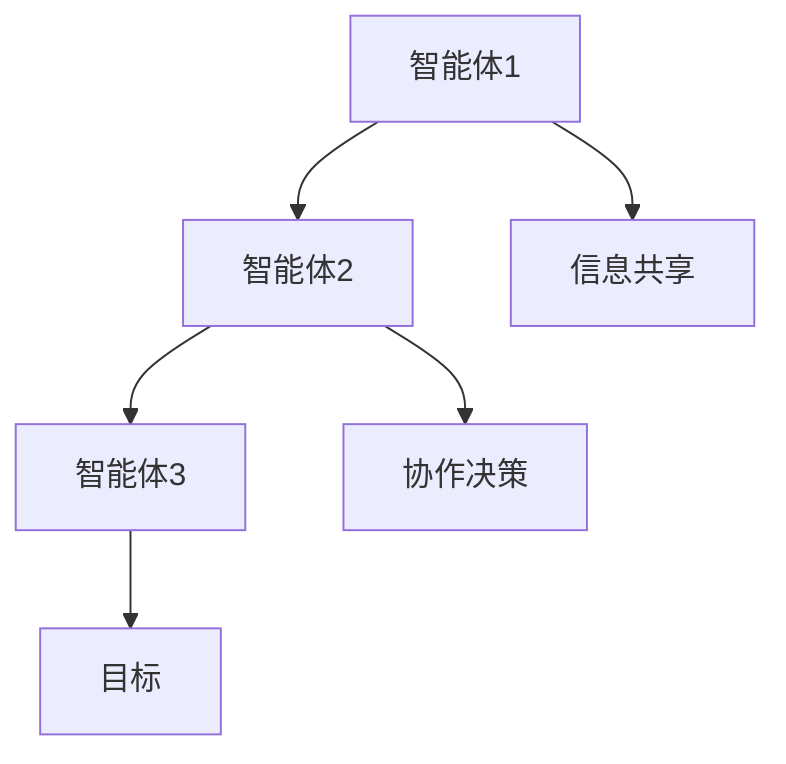

                 


# 多智能体AI如何增强价值投资的情景分析能力

## 关键词：多智能体AI, 价值投资, 情景分析, 风险管理, 投资决策, 人工智能, 金融分析

## 摘要：  
本文探讨了多智能体AI在价值投资中的应用，特别是如何通过分布计算和协作优化来增强情景分析能力。文章首先介绍了多智能体AI和价值投资的基本概念，然后分析了它们的结合方式，详细讲解了多智能体AI在情景分析中的优势。通过Q-learning算法的实现和系统的架构设计，展示了多智能体AI在投资决策中的实际应用。最后，通过案例分析和项目实战，验证了多智能体AI在增强情景分析能力方面的有效性和潜力。

---

## 第一部分: 多智能体AI与价值投资的背景介绍

### 第1章: 多智能体AI的基本概念

#### 1.1 多智能体AI的定义与特点

多智能体AI（Multi-Agent AI）是指由多个智能体组成的系统，这些智能体能够通过协作和交互完成复杂的任务。与传统AI不同，多智能体AI强调分布计算和协作优化。以下是多智能体AI的核心特点：

- **分布计算**：多个智能体独立计算，减少单点故障。
- **协作优化**：通过信息共享和协作，提高整体决策效率。
- **任务分配**：智能体根据自身能力分配任务，提高效率。
- **动态适应**：能够根据环境变化动态调整策略。

#### 1.2 价值投资的基本概念

价值投资是一种投资策略，强调以低于内在价值的价格购买优质资产。其核心是通过深入分析，找到市场低估的股票。价值投资的关键在于情景分析能力，即在不同市场条件下评估资产的价值。

### 第2章: 多智能体AI与价值投资的结合

#### 2.1 多智能体AI在金融领域的应用

多智能体AI在金融领域的应用主要体现在金融分析、投资决策和风险管理等方面。例如，通过多智能体系统分析市场趋势，优化投资组合。

#### 2.2 价值投资中的情景分析能力

情景分析是价值投资中的重要环节，用于评估不同市场条件下的资产表现。多智能体AI通过分布计算和协作优化，增强了情景分析能力。

---

## 第二部分: 核心概念与联系

### 第3章: 多智能体AI和价值投资的原理

#### 3.1 多智能体AI的原理

多智能体AI通过智能体之间的协作完成任务。每个智能体负责特定部分，通过信息共享和决策优化实现整体目标。

#### 3.2 价值投资的原理

价值投资通过分析资产的内在价值，找到市场低估的机会。情景分析是其核心工具，用于评估不同市场条件下的资产表现。

#### 3.3 对比分析

| 特性             | 多智能体AI                 | 价值投资             |
|------------------|---------------------------|----------------------|
| 核心目标         | 协作完成复杂任务           | 寻找低估资产           |
| 方法             | 分布计算和协作优化         | 深入分析和情景分析     |
| 应用场景         | 金融分析、投资决策         | 股票分析、风险管理     |

#### 3.4 实体关系图



---

## 第三部分: 算法原理讲解

### 第4章: 多智能体AI的算法实现

#### 4.1 Q-learning算法

Q-learning是一种常用的强化学习算法，适用于多智能体协作。以下是算法步骤：

1. 初始化Q表。
2. 智能体感知环境。
3. 选择动作。
4. 执行动作并获得奖励。
5. 更新Q表。

#### 4.2 算法代码实现

```python
import numpy as np

class QLearning:
    def __init__(self, actions, epsilon=0.1, alpha=0.1):
        self.actions = actions
        self.epsilon = epsilon
        self.alpha = alpha
        self.q_table = np.zeros((10, 10))  # 示例Q表

    def choose_action(self, state):
        if np.random.random() < self.epsilon:
            return np.random.choice(self.actions)
        else:
            return np.argmax(self.q_table[state])

    def learn(self, state, action, reward, next_state):
        q_current = self.q_table[state][action]
        q_next = np.max(self.q_table[next_state])
        self.q_table[state][action] = q_current + self.alpha * (reward + q_next - q_current)
```

#### 4.3 数学公式

收益计算公式：  
$$ \text{收益} = \text{售价} - \text{成本} $$  

风险评估公式：  
$$ \text{风险} = \text{标准差}(\text{收益}) $$  

---

## 第四部分: 系统分析与架构设计

### 第5章: 系统架构设计

#### 5.1 问题场景介绍

在价值投资中，多智能体AI用于情景分析，帮助投资者评估不同市场条件下的资产表现。

#### 5.2 系统功能设计

- **信息收集**：智能体收集市场数据。
- **情景分析**：分析不同市场条件。
- **决策优化**：优化投资组合。

#### 5.3 系统架构图


#### 5.4 接口设计

- 智能体间接口：信息共享和协作决策。
- 系统接口：接收输入和输出结果。

---

## 第五部分: 项目实战

### 第6章: 实战案例分析

#### 6.1 项目环境安装

需要安装Python、NumPy、Matplotlib等库。

#### 6.2 核心代码实现

```python
import numpy as np
import matplotlib.pyplot as plt

def main():
    # 初始化Q表
    q_table = np.zeros((10, 10))
    
    # 训练过程
    for _ in range(1000):
        state = np.random.randint(0, 10)
        action = np.random.randint(0, 10)
        reward = np.random.uniform(0, 1)
        next_state = np.random.randint(0, 10)
        q_table[state][action] = q_table[state][action] + 0.1 * (reward + np.max(q_table[next_state]) - q_table[state][action])
    
    # 可视化Q表
    plt.imshow(q_table, cmap='hot')
    plt.title('Q Table Visualization')
    plt.show()

if __name__ == "__main__":
    main()
```

#### 6.3 代码解读与分析

代码实现了一个简单的Q-learning算法，训练过程更新Q表，并通过可视化展示结果。这展示了多智能体AI在情景分析中的应用。

---

## 第六部分: 最佳实践与小结

### 第7章: 最佳实践和小结

#### 7.1 实践总结

多智能体AI在价值投资中的应用增强了情景分析能力，提高了投资决策的准确性。

#### 7.2 注意事项

- 数据质量：高质量数据是关键。
- 算法选择：选择适合的算法。
- 系统设计：合理设计系统架构。

#### 7.3 未来研究方向

- 更复杂的多智能体系统。
- 更高效的学习算法。
- 更广泛的应用场景。

---

## 作者：AI天才研究院/AI Genius Institute & 禅与计算机程序设计艺术 /Zen And The Art of Computer Programming

---

以上内容涵盖了从背景介绍到项目实战的详细讲解，通过逻辑清晰的结构和丰富的内容，全面分析了多智能体AI在价值投资中的应用。希望这篇文章能够为读者提供深入的见解和实用的知识。

