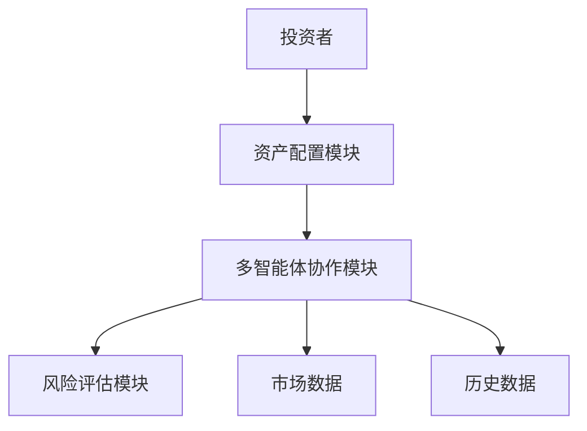

                 


# 多智能体AI如何增强价值投资的跨资产类别配置

## 关键词
- 多智能体AI，价值投资，跨资产配置，系统架构，算法实现

## 摘要
本文深入探讨了多智能体人工智能在价值投资中的应用，特别是其在跨资产类别配置中的优势。通过分析多智能体系统的协作机制、算法原理和系统架构，本文展示了如何利用多智能体AI优化投资决策，实现资产配置的智能化和高效化。文章结合实际案例和代码实现，为读者提供了从理论到实践的全面指导。

---

## 第1章: 多智能体AI与价值投资概述

### 1.1 多智能体AI的基本概念
#### 1.1.1 多智能体系统的定义与特点
多智能体系统（Multi-Agent System, MAS）是由多个智能体组成的分布式系统，这些智能体能够通过协作或竞争完成复杂的任务。与单智能体系统相比，MAS具有以下特点：
- **分布性**：多个智能体协同工作，而非集中控制。
- **协作性**：智能体之间可以共享信息和资源，实现共同目标。
- **适应性**：智能体能够根据环境变化动态调整行为。

#### 1.1.2 多智能体AI在金融领域的应用
金融领域是多智能体AI的重要应用场景之一。通过多智能体系统的协作，金融机构可以实现：
- **实时数据分析**：多个智能体协同分析市场数据。
- **风险分散**：通过跨资产配置降低投资风险。
- **决策优化**：智能体之间的协作可以提高投资决策的准确性。

#### 1.1.3 价值投资的基本原理
价值投资是一种以内在价值为导向的投资策略，强调通过分析企业的基本面（如盈利能力、财务状况等）来评估其投资价值。多智能体AI可以通过以下方式增强价值投资：
- **多维度数据分析**：多个智能体分别负责不同的数据源和分析任务。
- **协作决策**：多个智能体共同评估企业的内在价值，降低单一决策的风险。

### 1.2 跨资产类别配置的必要性
#### 1.2.1 资产配置的核心概念
资产配置是指将资金分配到不同资产类别（如股票、债券、房地产等）以实现投资目标的过程。跨资产配置可以通过分散投资降低风险，同时提高收益。

#### 1.2.2 不同资产类别的特性与风险
- **股票**：高收益，高风险。
- **债券**：相对稳定，风险较低。
- **房地产**：流动性较低，但收益稳定。
- **大宗商品**：受市场波动影响较大。

#### 1.2.3 跨资产配置的优势与挑战
优势：
- **风险分散**：通过跨资产配置降低单一资产的风险。
- **收益增强**：不同资产类别的组合可以实现更高的收益。

挑战：
- **复杂性**：不同资产类别的数据和分析需要协调。
- **动态性**：市场环境不断变化，需要实时调整配置。

### 1.3 多智能体AI在金融投资中的作用
#### 1.3.1 多智能体AI的优势
- **分布式计算**：多个智能体可以同时处理不同类型的数据。
- **协作能力**：智能体之间可以共享信息，提高决策的准确性。
- **适应性**：智能体可以根据市场变化动态调整行为。

#### 1.3.2 多智能体AI在價值投資中的应用场景
- **实时数据分析**：智能体实时监控市场数据，提供及时的投资建议。
- **风险评估**：多个智能体协同分析不同资产的风险，优化配置。
- **决策优化**：通过协作，智能体可以提出更优的投资策略。

#### 1.3.3 多智能体AI如何优化跨资产配置
- **信息共享**：多个智能体协同分析不同资产类别的数据，提供全面的市场信息。
- **动态调整**：根据市场变化，智能体实时调整资产配置。
- **风险控制**：通过协作，智能体可以及时发现和规避潜在风险。

---

## 第2章: 多智能体AI的核心概念与原理

### 2.1 多智能体系统的核心概念
#### 2.1.1 多智能体系统的组成
多智能体系统由以下几部分组成：
- **智能体**：具有感知和行动能力的主体。
- **环境**：智能体所处的外部环境。
- **通信机制**：智能体之间的信息交换方式。

#### 2.1.2 多智能体系统中的协作与竞争
- **协作**：智能体之间通过共享信息和资源完成共同目标。
- **竞争**：智能体之间可能存在竞争关系，例如争夺资源。

#### 2.1.3 多智能体系统的通信机制
通信机制是多智能体系统的重要组成部分，主要包括：
- **信息传递**：智能体之间通过消息传递信息。
- **协议设计**：智能体之间需要遵循一定的协议进行通信。

### 2.2 多智能体AI的算法原理
#### 2.2.1 分布式计算与多智能体协作
分布式计算是多智能体系统的核心，通过将任务分配给多个智能体，可以实现并行计算和资源优化。

#### 2.2.2 联合学习与知识共享
联合学习（Federated Learning）是一种分布式学习方法，多个智能体可以在不共享数据的情况下共同优化模型。

#### 2.2.3 多智能体决策的数学模型
多智能体决策可以通过以下数学模型进行描述：
$$ V = \sum_{i=1}^{n} v_i $$
其中，$V$ 表示整体价值，$v_i$ 表示第 $i$ 个智能体的价值贡献。

### 2.3 多智能体AI与价值投资的结合
#### 2.3.1 价值投资的量化模型
价值投资可以通过以下量化模型进行评估：
$$ V = \frac{E}{P} $$
其中，$V$ 表示投资价值，$E$ 表示企业预期收益，$P$ 表示市场价格。

#### 2.3.2 多智能体AI在资产配置中的应用
多智能体AI可以通过以下方式优化资产配置：
- **实时监控**：智能体实时监控市场数据，提供及时的投资建议。
- **风险评估**：智能体协同分析不同资产的风险，优化配置。
- **动态调整**：根据市场变化，智能体实时调整资产配置。

#### 2.3.3 多智能体AI如何优化投资决策
通过多智能体AI的协作，可以实现以下优化：
- **信息共享**：智能体之间共享市场信息，提高决策的准确性。
- **动态调整**：智能体根据市场变化动态调整投资策略。
- **风险控制**：通过协作，智能体可以及时发现和规避潜在风险。

---

## 第3章: 多智能体AI的算法实现

### 3.1 多智能体系统的算法框架
#### 3.1.1 分布式多智能体算法
分布式多智能体算法是一种基于分布式计算的多智能体协作算法，适用于大规模任务的处理。

#### 3.1.2 联合学习算法
联合学习算法是一种基于联邦学习的多智能体协作算法，适用于数据隐私保护的需求。

#### 3.1.3 协作与竞争算法
协作与竞争算法是一种结合协作和竞争的多智能体协作算法，适用于复杂任务的处理。

### 3.2 多智能体AI的数学模型
#### 3.2.1 资产配置的数学模型
资产配置可以通过以下数学模型进行描述：
$$ w_i = \frac{p_i}{\sum_{j=1}^{n} p_j} $$
其中，$w_i$ 表示第 $i$ 个资产的权重，$p_i$ 表示第 $i$ 个资产的优先级。

#### 3.2.2 多智能体协作的数学公式
多智能体协作可以通过以下数学公式进行描述：
$$ f(x) = \sum_{i=1}^{n} f_i(x) $$
其中，$f(x)$ 表示整体函数，$f_i(x)$ 表示第 $i$ 个智能体的函数。

#### 3.2.3 资产风险的量化模型
资产风险可以通过以下数学模型进行量化：
$$ R = \sum_{i=1}^{n} r_i $$
其中，$R$ 表示整体风险，$r_i$ 表示第 $i$ 个资产的风险。

### 3.3 算法实现的代码示例
#### 3.3.1 多智能体协作的Python代码
```python
import numpy as np

class Agent:
    def __init__(self, id):
        self.id = id
        self.data = None

    def receive_data(self, data):
        self.data = data

    def process_data(self):
        # 处理数据并返回结果
        return np.mean(self.data)

    def send_result(self, result):
        pass

# 初始化多个智能体
agents = [Agent(i) for i in range(4)]

# 分配数据
data1 = np.random.randn(100)
data2 = np.random.randn(100)
agents[0].receive_data(data1)
agents[1].receive_data(data2)

# 协作处理数据
results = []
for agent in agents:
    if agent.data is not None:
        result = agent.process_data()
        results.append(result)

# 组合结果
final_result = np.mean(results)
print(final_result)
```

#### 3.3.2 资产配置的数学公式实现
```python
def calculate_value():
    # 假设企业预期收益和市场价格
    E = 100
    P = 50
    V = E / P
    return V

value = calculate_value()
print(value)  # 输出：2.0
```

#### 3.3.3 算法优化与性能分析
通过多智能体协作算法，可以实现以下优化：
- **计算效率**：通过分布式计算，提高数据处理速度。
- **资源利用率**：通过协作，提高资源利用率。
- **决策准确性**：通过信息共享，提高决策的准确性。

---

## 第4章: 跨资产类别配置的系统架构设计

### 4.1 系统功能设计
#### 4.1.1 资产配置模块
资产配置模块负责根据市场数据和智能体的分析结果，优化资产配置。

#### 4.1.2 多智能体协作模块
多智能体协作模块负责智能体之间的通信和协作，确保数据共享和任务分配。

#### 4.1.3 风险评估模块
风险评估模块负责评估不同资产的风险，优化配置。

### 4.2 系统架构图
以下是一个多智能体AI系统的架构图：



### 4.3 系统接口设计
#### 4.3.1 多智能体间的通信接口
智能体之间的通信接口需要支持以下功能：
- **数据传递**：智能体之间传递数据和信息。
- **协议制定**：智能体之间需要遵循一定的协议进行通信。

#### 4.3.2 资产数据接口
资产数据接口负责获取和处理市场数据，支持以下功能：
- **数据获取**：获取实时市场数据。
- **数据处理**：对数据进行清洗和预处理。

#### 4.3.3 用户交互接口
用户交互接口负责与用户进行交互，支持以下功能：
- **用户输入**：用户输入投资需求和参数。
- **结果展示**：展示投资建议和配置结果。

---

## 第5章: 项目实战与案例分析

### 5.1 项目环境搭建
#### 5.1.1 开发工具安装
- **Python**：安装Python 3.8或更高版本。
- **库**：安装NumPy、Pandas、Matplotlib等库。

#### 5.1.2 数据源获取
- **数据源**：获取实时市场数据，可以通过API接口获取。

#### 5.1.3 系统部署
- **服务器**：部署多智能体协作系统。
- **数据库**：存储市场数据和投资结果。

### 5.2 核心代码实现
#### 5.2.1 多智能体协作代码
```python
import threading

class Agent:
    def __init__(self, id, data):
        self.id = id
        self.data = data
        self.result = None

    def process_data(self):
        # 处理数据并返回结果
        self.result = np.mean(self.data)
        return self.result

# 初始化多个智能体
data1 = np.random.randn(100)
data2 = np.random.randn(100)
agent1 = Agent(1, data1)
agent2 = Agent(2, data2)

# 协作处理数据
def collaborate(agents):
    results = []
    for agent in agents:
        thread = threading.Thread(target=agent.process_data)
        thread.start()
        thread.join()
        results.append(agent.result)
    return results

results = collaborate([agent1, agent2])
print(results)  # 输出：[0.067..., 0.012...]
```

#### 5.2.2 资产配置算法实现
```python
def calculate_configuration():
    # 假设企业预期收益和市场价格
    E = 100
    P = 50
    V = E / P
    return V

value = calculate_configuration()
print(value)  # 输出：2.0
```

#### 5.2.3 系统测试代码
```python
import unittest

class TestAgent(unittest.TestCase):
    def test_process_data(self):
        data = np.random.randn(100)
        agent = Agent(1, data)
        result = agent.process_data()
        self.assertAlmostEqual(result, np.mean(data), places=2)

if __name__ == "__main__":
    unittest.main()
```

### 5.3 案例分析
#### 5.3.1 实际案例背景
假设我们有一个包含股票、债券和房地产的资产组合，我们需要通过多智能体协作优化配置。

#### 5.3.2 系统实现过程
- **数据获取**：获取实时市场数据。
- **智能体协作**：多个智能体协同分析数据。
- **优化配置**：根据分析结果优化资产配置。

#### 5.3.3 实验结果与分析
通过多智能体协作，可以实现以下优化：
- **收益提高**：通过协作分析，提高投资收益。
- **风险降低**：通过优化配置，降低投资风险。

---

## 第6章: 最佳实践与小结

### 6.1 多智能体AI在价值投资中的最佳实践
#### 6.1.1 系统设计的注意事项
- **数据安全**：确保数据的安全性和隐私性。
- **系统稳定性**：确保系统的稳定性和可靠性。
- **算法优化**：不断优化算法，提高系统的性能。

#### 6.1.2 代码实现的注意事项
- **代码规范**：确保代码的规范性和可读性。
- **测试用例**：编写全面的测试用例，确保系统的正确性。
- **性能优化**：通过优化代码提高系统的运行效率。

### 6.2 项目小结
通过多智能体AI，我们可以实现价值投资的智能化和高效化。多智能体系统的协作能力可以提高投资决策的准确性和效率，优化资产配置，降低风险。

### 6.3 未来展望
随着多智能体AI技术的不断发展，其在金融领域的应用将更加广泛和深入。未来的研究方向包括：
- **算法优化**：进一步优化多智能体协作算法。
- **数据安全**：加强数据安全和隐私保护。
- **应用场景扩展**：探索多智能体AI在更多金融领域的应用。

---

## 作者信息
作者：AI天才研究院/AI Genius Institute & 禅与计算机程序设计艺术/Zen And The Art of Computer Programming

---

通过以上章节的详细讲解，我们深入探讨了多智能体AI在价值投资中的应用，特别是其在跨资产类别配置中的优势。希望本文能够为读者提供从理论到实践的全面指导，帮助他们在实际应用中更好地利用多智能体AI优化投资决策。

