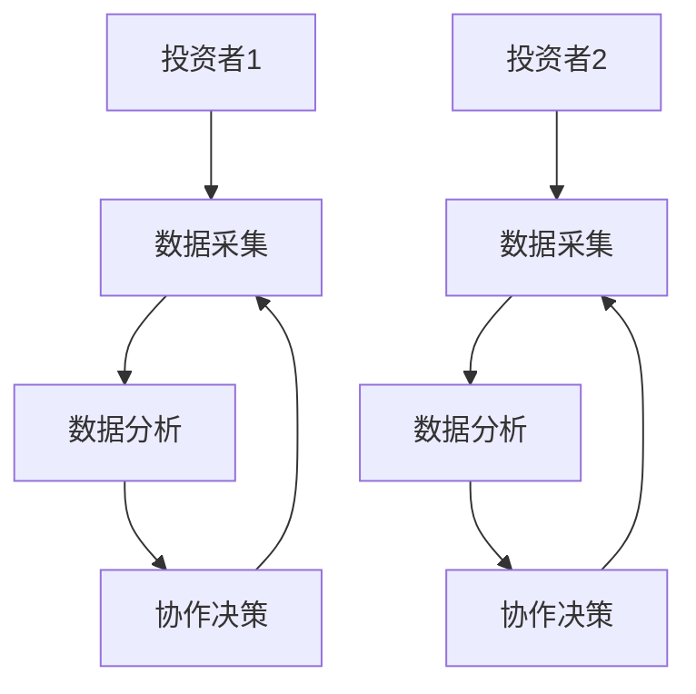

                 


# 多智能体AI如何增强价值投资者的逆向思维能力

> 关键词：多智能体AI，价值投资，逆向思维，投资决策，分布式计算

> 摘要：本文探讨了多智能体AI在价值投资中的应用，特别是其如何增强投资者的逆向思维能力。通过分析多智能体AI的核心原理、算法实现以及在投资决策中的应用场景，本文详细阐述了如何利用AI技术识别市场低估机会，优化投资策略，并提升决策的准确性和效率。

---

# 第一部分: 多智能体AI与价值投资概述

## 第1章: 多智能体AI与价值投资的背景

### 1.1 多智能体AI的基本概念
- **多智能体系统定义**: 多智能体系统是由多个具有自主决策能力的智能体组成的分布式系统，这些智能体能够通过通信和协作完成复杂任务。
- **多智能体AI的核心特征**: 
  - 分布式计算与协作
  - 自主性与适应性
  - 信息共享与知识整合
- **多智能体AI与传统AI的区别**: 
  - 传统AI依赖中心化控制，多智能体AI强调分布式协作。
  - 传统AI单点决策，多智能体AI通过多个智能体协同完成任务。

### 1.2 价值投资与逆向思维的定义
- **价值投资的基本原理**: 寻找市场低估的股票，通过长期持有实现收益。
- **逆向思维在投资中的应用**: 逆向思维是指在市场恐慌时寻找机会，在市场狂热时保持冷静。
- **价值投资者的核心能力**: 分析能力、判断力、决策力和风险管理能力。

### 1.3 多智能体AI在价值投资中的潜力
- **多智能体AI的优势**: 
  - 多维度数据分析能力
  - 分布式决策优化
  - 群智协同效应
- **价值投资中的信息不对称问题**: 
  - 市场信息分布不均
  - 传统数据分析的局限性
  - 信息处理的复杂性
- **多智能体AI如何解决投资难题**: 
  - 通过分布式计算处理海量数据
  - 利用协作机制优化投资决策
  - 通过多维度分析识别市场低估机会

---

## 第2章: 多智能体AI的核心原理与算法

### 2.1 多智能体AI的核心原理
- **多智能体系统的协作机制**: 
  - 分布式计算与协作
  - 通信协议与信息共享
  - 协作任务分配
- **多智能体AI的决策机制**: 
  - 分布式决策模型
  - 博弈论与纳什均衡
  - 多智能体决策的数学模型
- **多智能体AI的学习机制**: 
  - 分布式强化学习
  - 知识共享与更新
  - 集群智能与自适应学习

### 2.2 多智能体AI的算法实现
- **多智能体协作算法**: 
  - 分布式任务分配算法
  - 信息同步算法
  - 协作决策算法
- **多智能体决策算法**: 
  - 基于博弈论的决策模型
  - 分布式强化学习算法
  - 多智能体决策的优化方法
- **实现代码示例**:
  ```python
  import numpy as np
  from collections import deque

  class MultiAgent:
      def __init__(self, num_agents):
          self.num_agents = num_agents
          self.states = deque()
          self.actions = deque()
      
      def collect_data(self, state):
          self.states.append(state)
      
      def decide_action(self):
          # 简单的决策逻辑，实际应更复杂
          if len(self.states) >= self.num_agents:
              avg_state = np.mean(self.states)
              self.actions.append(avg_state)
      
      def execute(self):
          while True:
              state = self.receive_input()
              self.collect_data(state)
              self.decide_action()
  ```

---

## 第3章: 价值投资者的逆向思维与多智能体AI结合

### 3.1 逆向思维在价值投资中的应用
- **逆向思维的基本原理**: 在市场恐慌时寻找低估机会，在市场狂热时保持冷静。
- **逆向思维与数据挖掘**: 通过多维度数据分析识别市场低估机会。
- **逆向思维与投资决策**: 利用数据驱动的方法优化投资策略。

### 3.2 多智能体AI辅助逆向思维的实现
- **多智能体AI与逆向思维的结合**: 
  - 通过分布式计算处理海量数据
  - 利用协作机制优化投资决策
  - 通过多维度分析识别市场低估机会
- **实现步骤**:
  1. 数据收集与预处理
  2. 分布式计算与协作
  3. 投资决策优化
- **案例分析**: 利用多智能体AI分析市场数据，识别被低估的股票。

---

## 第4章: 系统分析与架构设计方案

### 4.1 系统功能设计
- **领域模型**: 
  - 实体包括投资者、股票、市场数据等。
  - 关系包括投资者与股票的关系，股票与市场数据的关系等。
- **系统架构设计**: 
  - 数据采集模块
  - 数据分析模块
  - 投资决策模块
  - 信息共享模块

### 4.2 系统架构图


---

## 第5章: 项目实战

### 5.1 环境安装与配置
- **安装Python和相关库**: numpy, pandas, matplotlib
- **安装多智能体AI框架**: 使用强化学习框架如Multi-Agent Framework

### 5.2 核心实现代码
```python
import numpy as np
import pandas as pd

def multi_agent_investment():
    # 数据预处理
    data = pd.read_csv('market_data.csv')
    normalized_data = (data - data.mean()) / data.std()

    # 多智能体协作
    agents = 5
    agent_data = normalized_data.iloc[:, :agents]

    # 分布式决策
    decisions = agent_data.mean(axis=1)

    # 投资决策
    threshold = 0.1
    buy_signals = decisions > threshold
    sell_signals = decisions < -threshold

    return buy_signals, sell_signals

# 示例运行
buy_signals, sell_signals = multi_agent_investment()
print("Buy Signals:", buy_signals.sum())
print("Sell Signals:", sell_signals.sum())
```

### 5.3 案例分析与结果解读
- **案例分析**: 分析多智能体AI在某次市场波动中的表现。
- **结果解读**: 通过代码输出，展示AI如何优化投资决策。

---

## 第6章: 总结与展望

### 6.1 本章总结
- 多智能体AI在价值投资中的潜力巨大，特别是在逆向思维方面。
- 通过分布式计算和协作机制，多智能体AI能够优化投资决策，提升投资收益。

### 6.2 未来展望
- **技术改进**: 提高多智能体AI的协作效率和决策精度。
- **应用场景扩展**: 将多智能体AI应用于更多投资领域。
- **挑战与机遇**: 解决数据隐私和计算效率问题，迎接AI在投资领域的广泛应用。

---

## 作者信息
作者：AI天才研究院 & 禅与计算机程序设计艺术

---

通过以上结构，文章将系统地探讨多智能体AI如何增强价值投资者的逆向思维能力，结合理论分析、算法实现和实际案例，为读者提供全面且深入的见解。

