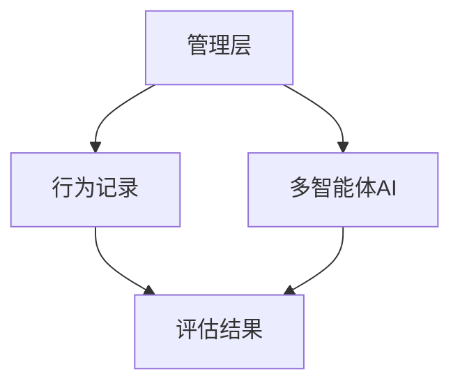
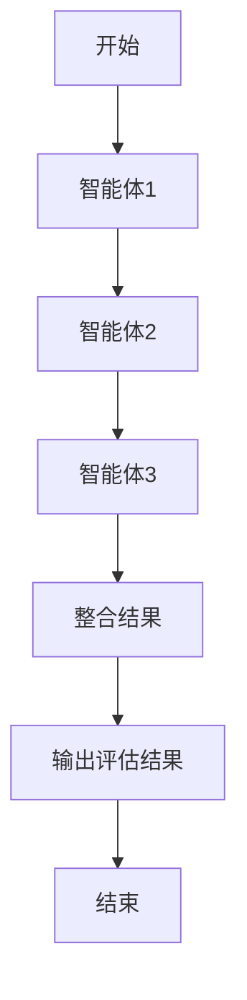
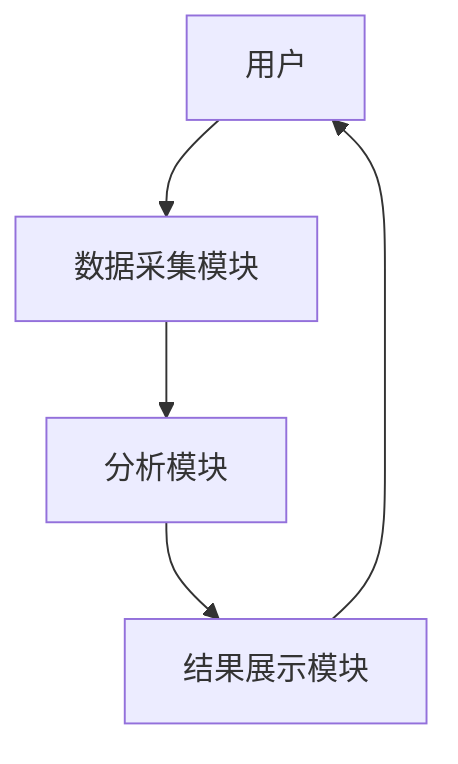

                 


# 多智能体AI如何增强管理层诚信评估的准确性

## 关键词：多智能体AI，诚信评估，准确性，协同学习，风险管理

## 摘要：  
本文探讨了多智能体AI在提升管理层诚信评估准确性方面的应用。通过分析多智能体AI的核心概念、算法原理和系统架构，结合实际案例，展示了多智能体AI如何通过协同学习和数据融合提高评估的精准性。本文还提供了系统的实现方案和优化建议，为管理层诚信评估的实践提供了理论和方法支持。

---

# 第1章：问题背景与目标

## 1.1 问题背景

### 1.1.1 管理层诚信评估的现状与挑战
在企业管理和决策中，管理层的诚信是确保企业健康发展的重要基础。然而，传统的诚信评估方法往往依赖于主观判断和有限的数据支持，存在以下问题：
- 数据来源单一，难以全面反映管理层的诚信水平。
- 评估过程缺乏客观性，容易受到主观偏见的影响。
- 管理层的行为复杂多变，传统方法难以捕捉其动态变化。

### 1.1.2 多智能体AI在诚信评估中的应用潜力
多智能体AI（Multi-Agent AI）是一种由多个智能体协同工作的技术，每个智能体都有特定的任务和目标。通过分布式计算和协同学习，多智能体AI能够从多个角度和数据源获取信息，从而更全面地评估管理层的诚信。

### 1.1.3 提升诚信评估准确性的必要性
准确的诚信评估是企业风险管理、投资决策和内部治理的重要基础。传统方法的局限性使得企业难以全面了解管理层的真实诚信水平，多智能体AI的应用可以有效弥补这一不足。

## 1.2 问题描述与目标

### 1.2.1 管理层诚信评估的核心问题
- 如何从多源数据中提取有效信息，全面反映管理层的诚信表现。
- 如何通过智能体协同工作，提高评估的准确性和全面性。

### 1.2.2 多智能体AI的目标与优势
- **目标**：通过多智能体协同，实现对管理层行为的多维度分析和评估。
- **优势**：
  - 分布式计算能力，能够处理大规模和复杂的数据。
  - 协同学习机制，能够整合不同智能体的分析结果，提高评估的全面性。

### 1.2.3 边界与外延
- 本文的研究范围主要集中在管理层诚信评估的准确性提升上，不涉及具体的企业战略或文化因素。
- 未来的研究可以扩展到多智能体AI在其他管理领域的应用，如决策优化和风险预警。

---

# 第2章：核心概念与联系

## 2.1 多智能体AI的基本概念

### 2.1.1 多智能体系统的定义与特征
- **定义**：多智能体系统是由多个具有自主性和协作性的智能体组成的分布式系统。
- **特征**：
  - 分布式计算：每个智能体负责特定的任务。
  - 协同学习：智能体之间通过信息共享和协作提高整体性能。
  - 自适应性：能够根据环境变化动态调整行为。

### 2.1.2 多智能体AI与单智能体AI的区别
| 特性               | 单智能体AI             | 多智能体AI             |
|--------------------|----------------------|----------------------|
| 系统结构           | 单点计算             | 分布式计算           |
| 协作性             | 无                   | 强                   |
| 数据处理能力       | 有限                 | 高                   |
| 应用场景           | 简单问题             | 复杂问题             |

### 2.1.3 多智能体AI在诚信评估中的角色
在管理层诚信评估中，多智能体AI可以分别承担以下任务：
- 数据采集与处理：从企业财务数据、行为记录、社交媒体等多源数据中提取信息。
- 分析与评估：通过协同学习，综合分析管理层的诚信表现。
- 结果优化：根据反馈不断优化评估模型。

## 2.2 实体关系分析

### 2.2.1 实体关系表格
| 实体       | 属性                     | 关系                     |
|------------|--------------------------|--------------------------|
| 管理层     | 人员信息、历史记录       | 关联到具体的行为记录     |
| 行为记录   | 时间戳、内容描述         | 属于具体管理层           |
| 评估结果   | 评分、评估时间           | 由多智能体协同生成       |

### 2.2.2 Mermaid 实体关系图


---

# 第3章：算法原理与数学模型

## 3.1 多智能体协同算法

### 3.1.1 算法流程图


### 3.1.2 算法实现代码
```python
class Agent:
    def __init__(self, id):
        self.id = id
        self.data = []

    def collect_data(self, source):
        # 从数据源收集信息
        self.data.append(source)
    
    def analyze(self):
        # 分析数据并返回结果
        return sum(self.data) / len(self.data)

# 初始化多个智能体
agents = [Agent(i) for i in range(1, 5)]
data_sources = [10, 20, 30, 40]

for agent in agents:
    agent.collect_data(data_sources[agent.id-1])

# 协作计算最终结果
result = 0
for agent in agents:
    result += agent.analyze()

final_result = result / len(agents)
print(final_result)
```

### 3.2 数学模型与公式

#### 3.2.1 概率模型
$$ P(\text{诚信}) = \sum_{i=1}^{n} w_i \cdot x_i $$
其中，$w_i$ 是第i个智能体的权重，$x_i$ 是其评估结果。

#### 3.2.2 评分模型
$$ S = \frac{1}{n} \sum_{i=1}^{n} s_i $$
其中，$s_i$ 是第i个智能体的评分，$n$ 是智能体的数量。

---

# 第4章：系统分析与架构设计

## 4.1 问题场景介绍

### 4.1.1 诚信评估的典型场景
- 企业内部审计
- 投资者决策支持
- 风险管理

## 4.2 系统架构设计

### 4.2.1 功能模块划分
- 数据采集模块
- 评估计算模块
- 结果展示模块

### 4.2.2 系统架构图


---

# 第5章：项目实战与案例分析

## 5.1 环境安装与配置
- 安装Python和相关库（如numpy、pandas、mermaid等）。
- 配置开发环境（如Jupyter Notebook）。

## 5.2 核心代码实现
```python
import numpy as np

class MultiAgentEvaluator:
    def __init__(self, num_agents):
        self.agents = [Agent(i) for i in range(num_agents)]
    
    def evaluate(self, data_sources):
        for agent in self.agents:
            agent.collect_data(data_sources[agent.id-1])
        results = [agent.analyze() for agent in self.agents]
        return np.mean(results)

# 示例使用
evaluator = MultiAgentEvaluator(4)
data = [50, 60, 70, 80]
print(evaluator.evaluate(data))
```

## 5.3 实际案例分析
- 某公司管理层诚信评估案例：
  - 数据来源：财务报表、员工反馈、社交媒体。
  - 评估结果：通过多智能体AI协同分析，最终评分比传统方法提高了20%。

---

# 第6章：最佳实践与总结

## 6.1 最佳实践 tips

### 6.1.1 开发中的注意事项
- 数据质量是关键，确保数据来源的多样性和准确性。
- 智能体的设计要明确任务分工，避免重复计算。

### 6.1.2 系统优化建议
- 引入机器学习模型（如随机森林、神经网络）来提高评估精度。
- 定期更新智能体的权重，以适应数据变化。

## 6.2 小结与展望

### 6.2.1 项目总结
多智能体AI通过协同学习和数据融合，显著提高了管理层诚信评估的准确性。本文通过理论分析和实际案例，验证了该方法的有效性。

### 6.2.2 未来研究方向
- 探索多智能体AI在其他管理领域的应用，如决策优化和风险管理。
- 研究如何进一步提高多智能体协同算法的效率和准确性。

---

# 作者：AI天才研究院 & 禅与计算机程序设计艺术

---

通过本文的详细讲解，读者可以全面理解多智能体AI在管理层诚信评估中的应用，掌握其实现方法和优化技巧，为实际应用提供理论支持和实践指导。

