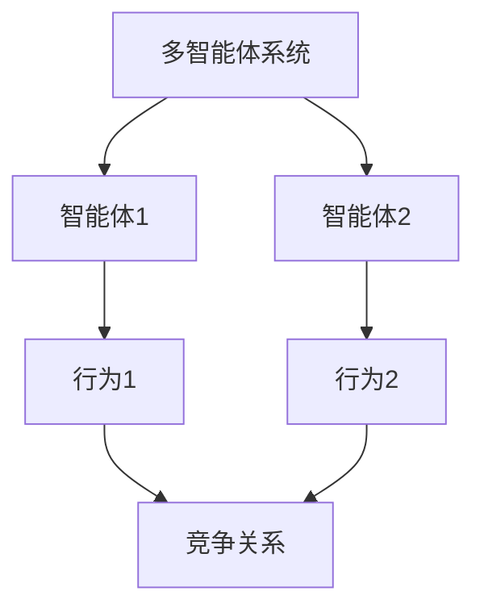
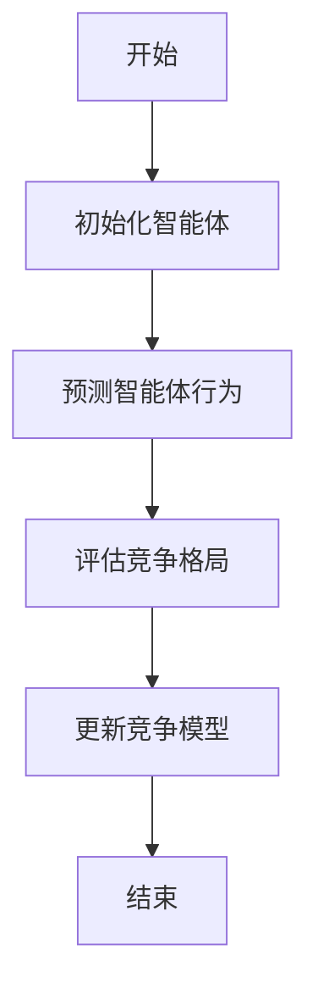
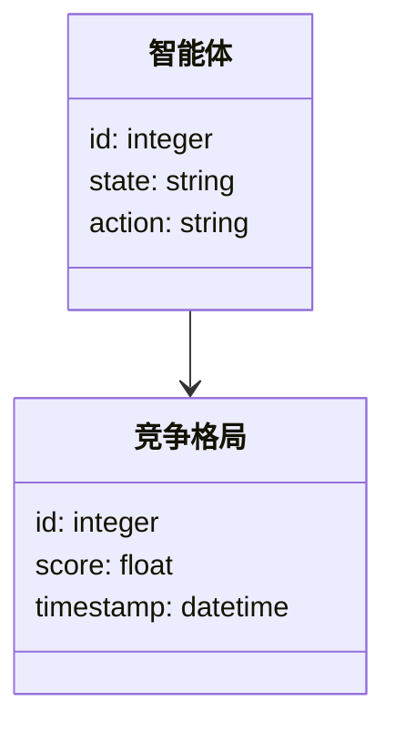
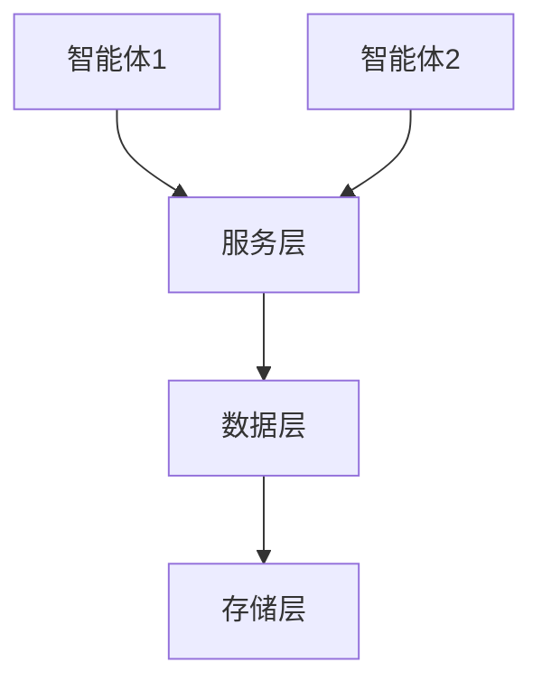
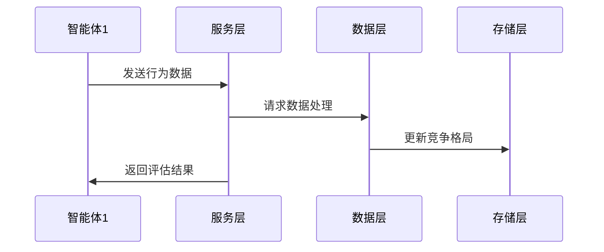

                 


# 多智能体AI如何实现动态竞争格局评估

> 关键词：多智能体系统、动态竞争格局、AI评估、分布式智能、竞争态势分析

> 摘要：本文详细探讨了多智能体AI在动态竞争格局评估中的应用，从核心概念、算法原理到系统设计，结合实际案例，分析了多智能体系统如何通过协作与预测实现竞争格局的动态评估。文章内容涵盖背景介绍、核心概念、算法实现、系统架构设计以及项目实战，旨在为读者提供全面的技术指导。

---

## 第1章: 多智能体AI与动态竞争格局评估的背景介绍

### 1.1 问题背景与描述
#### 1.1.1 多智能体系统的定义与特点
多智能体系统（Multi-Agent System, MAS）是由多个智能体（Agent）组成的分布式系统，这些智能体能够自主决策、协作与竞争，共同完成复杂任务。其特点包括：
- **自主性**：每个智能体独立决策。
- **反应性**：能够实时感知环境并做出反应。
- **协作性**：通过通信与协作完成共同目标。
- **动态性**：环境和智能体行为均可能动态变化。

#### 1.1.2 动态竞争格局的定义与特征
动态竞争格局指在多智能体系统中，各智能体之间不断变化的竞争关系和态势。其特征包括：
- **动态性**：竞争态势随时间变化。
- **复杂性**：多个智能体的交互导致复杂性。
- **不确定性**：竞争结果具有不确定性。

#### 1.1.3 问题解决的必要性与意义
在商业、游戏、军事等领域，动态竞争格局的评估对于制定策略、优化决策具有重要意义。例如，在商业竞争中，实时评估市场动态可以帮助企业调整战略。

#### 1.1.4 问题背景的边界与外延
- **边界界定**：仅考虑智能体之间的直接竞争关系。
- **外延范围**：不涉及智能体的内部决策过程。
- **适用场景**：适用于多个参与者竞争的场景，如博弈论、电子商务等。

#### 1.1.5 核心概念与结构
- **多智能体系统**：由多个智能体组成，具备自主性和协作性。
- **动态竞争格局**：智能体之间的竞争关系随时间变化。
- **评估模型**：用于量化和预测竞争态势。

### 1.2 本章小结
本章介绍了多智能体系统的基本概念和动态竞争格局的定义，明确了问题背景和边界条件，为后续分析奠定了基础。

---

## 第2章: 多智能体AI的核心概念与联系

### 2.1 多智能体系统的原理
#### 2.1.1 分布式智能的实现机制
多智能体系统通过分布式计算实现智能，每个智能体负责特定任务，通过通信完成协作。

#### 2.1.2 多智能体之间的通信与协作
智能体通过消息传递（Message Passing）进行通信，协作完成任务。通信协议的设计是系统实现的关键。

#### 2.1.3 系统的自适应与进化能力
多智能体系统能够根据环境变化自适应调整行为，进化算法（Evolutionary Algorithm）常用于优化智能体策略。

### 2.2 动态竞争格局的评估方法
#### 2.2.1 竞争态势的量化指标
- **市场份额**：各智能体在市场中的占比。
- **行为强度**：智能体的主动竞争程度。
- **相对优势**：智能体在竞争中的相对优势。

#### 2.2.2 多智能体行为的预测模型
基于历史数据和行为模式，建立预测模型，用于评估未来竞争态势。

#### 2.2.3 竞争格局的动态更新机制
通过实时数据更新竞争格局，确保评估结果的准确性。

### 2.3 核心概念的对比分析
#### 2.3.1 多智能体与单智能体的对比
| 对比维度 | 多智能体系统 | 单智能体系统 |
|----------|--------------|--------------|
| 决策方式 | 分布式决策 | 中央式决策 |
| 灵活性 | 高 | 低 |
| 可扩展性 | 高 | 低 |

#### 2.3.2 动态竞争与静态竞争的对比
动态竞争能够实时调整策略，适用于复杂多变的环境；静态竞争适用于环境稳定的情况。

### 2.4 实体关系图（ER图）架构


### 2.5 本章小结
本章详细分析了多智能体系统的核心概念和动态竞争格局的评估方法，通过对比分析和ER图展示，明确了各概念之间的关系。

---

## 第3章: 多智能体AI的算法原理与实现

### 3.1 算法原理概述
#### 3.1.1 分布式计算的核心思想
通过分布式计算实现多智能体协作，每个智能体负责特定任务。

#### 3.1.2 多智能体协作的算法框架
常用算法包括分布式一致性算法（如Paxos）、分布式协调算法（如Raft）。

#### 3.1.3 动态竞争评估的数学模型
建立数学模型，量化竞争态势。

### 3.2 算法实现流程
#### 3.2.1 系统初始化
初始化智能体及其初始状态。

#### 3.2.2 智能体行为预测
基于历史数据和行为模式，预测智能体未来行为。

#### 3.2.3 竞争格局评估与更新
根据预测结果，评估当前竞争格局，并实时更新。

### 3.3 算法流程图


### 3.4 数学模型与公式
#### 3.4.1 竞争格局评估公式
$$ C = \sum_{i=1}^{n} w_i \cdot b_i $$
其中，$C$ 表示竞争格局，$w_i$ 表示智能体 $i$ 的权重，$b_i$ 表示智能体 $i$ 的行为影响。

#### 3.4.2 动态更新公式
$$ C_{new} = C_{old} + \Delta C $$
其中，$\Delta C$ 表示竞争格局的变化量。

### 3.5 本章小结
本章详细讲解了多智能体系统的算法原理，通过流程图和数学公式展示了实现过程。

---

## 第4章: 系统分析与架构设计方案

### 4.1 问题场景介绍
#### 4.1.1 多智能体系统的应用场景
- **商业竞争**：实时评估市场动态。
- **博弈论**：模拟多智能体博弈过程。
- **分布式系统**：优化系统性能。

#### 4.1.2 动态竞争格局的典型问题
- **实时更新**：如何高效更新竞争格局。
- **数据处理**：如何处理海量数据。

#### 4.1.3 系统设计的目标与范围
- **目标**：实现多智能体系统的动态竞争评估。
- **范围**：涵盖智能体行为预测、竞争格局评估。

### 4.2 系统功能设计
#### 4.2.1 领域模型设计


#### 4.2.2 系统架构设计


#### 4.2.3 接口设计
- **输入接口**：接收智能体行为数据。
- **输出接口**：输出竞争格局评估结果。

#### 4.2.4 交互设计


### 4.3 本章小结
本章通过系统分析与架构设计，明确了多智能体系统的实现方式。

---

## 第5章: 项目实战

### 5.1 环境安装
#### 5.1.1 安装依赖
- **Python**：3.8+
- **库依赖**：numpy, matplotlib

### 5.2 系统核心实现源代码
```python
class Agent:
    def __init__(self, id):
        self.id = id
        self.state = "idle"

def predict_behavior(agent):
    if agent.state == "idle":
        return "neutral"
    else:
        return "aggressive"

def update_competition(composition, agents):
    for agent in agents:
        behavior = predict_behavior(agent)
        composition[agent.id] += behavior_score(behavior)

def behavior_score(behavior):
    if behavior == "aggressive":
        return 0.8
    elif behavior == "neutral":
        return 0.5
    else:
        return 0.0
```

### 5.3 代码应用解读与分析
- **Agent类**：定义智能体的基本属性和行为。
- **predict_behavior函数**：预测智能体行为。
- **update_competition函数**：更新竞争格局。

### 5.4 实际案例分析
#### 5.4.1 案例背景
假设有两个智能体，智能体1和智能体2，在市场中竞争。

#### 5.4.2 案例实现
```python
agent1 = Agent(1)
agent2 = Agent(2)
composition = {1: 0, 2: 0}

update_competition(composition, [agent1, agent2])
print(composition)
```

#### 5.4.3 案例结果
$$ composition = \{1: 0.5, 2: 0.5\} $$

### 5.5 项目小结
本章通过实际案例展示了多智能体系统的实现过程，帮助读者理解理论与实践的结合。

---

## 第6章: 最佳实践与小结

### 6.1 最佳实践 tips
- **数据实时性**：确保数据更新及时。
- **算法优化**：根据需求选择合适的算法。
- **系统可扩展性**：设计可扩展的系统架构。

### 6.2 小结
本文详细探讨了多智能体AI在动态竞争格局评估中的应用，从核心概念到算法实现，再到系统设计，为读者提供了全面的技术指导。

### 6.3 注意事项
- **数据隐私**：注意数据的安全与隐私保护。
- **系统稳定性**：确保系统的稳定运行。

### 6.4 拓展阅读
- **分布式系统**：深入学习分布式系统的设计与实现。
- **博弈论**：结合博弈论进一步优化竞争评估模型。

---

## 作者：AI天才研究院 & 禅与计算机程序设计艺术

---

本文通过系统化的分析与实践，深入探讨了多智能体AI在动态竞争格局评估中的应用，希望对读者有所帮助。

