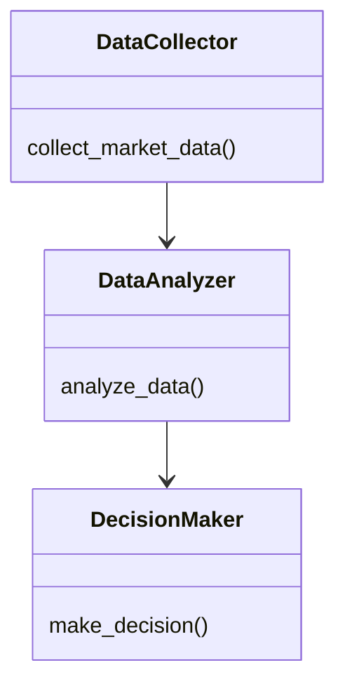
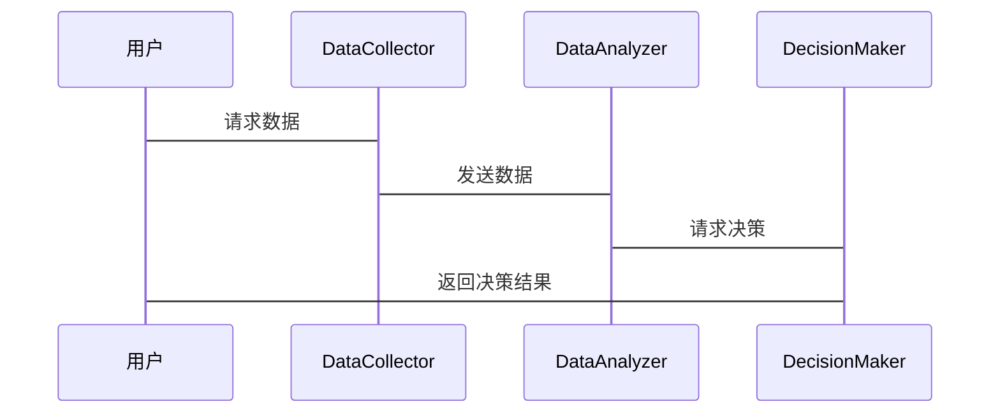

                 


# 多智能体AI如何提升价值投资中的时机选择

## 关键词：多智能体AI，价值投资，时机选择，协同决策，强化学习，数学模型

## 摘要

本文探讨了多智能体AI在价值投资中的应用，特别是如何通过多智能体协同决策来优化时机选择。文章详细介绍了多智能体AI的核心概念、算法原理、数学模型，并通过实际案例展示了其在价值投资中的优势和应用场景。

---

# 第1章 多智能体AI与价值投资概述

## 1.1 多智能体AI的定义与特点

多智能体AI是由多个相互作用的智能体组成的系统，这些智能体能够通过协作完成复杂任务。与传统AI相比，多智能体AI具有以下特点：

- **分布性**：多个智能体协同工作，而非单一中心化系统。
- **自主性**：每个智能体都能自主决策，适应环境变化。
- **协作性**：智能体之间通过通信和协调实现共同目标。

## 1.2 价值投资的基本概念

价值投资是一种投资策略，强调以低于内在价值的价格购买优质资产。时机选择在价值投资中至关重要，因为它直接影响投资回报。

## 1.3 多智能体AI在价值投资中的应用前景

多智能体AI能够处理大量数据，提供实时分析，优化决策过程。通过协同决策，多智能体AI在价值投资中的应用前景广阔，特别是在复杂市场环境下的时机选择。

---

# 第2章 多智能体系统的核心原理

## 2.1 多智能体系统的组成与功能

多智能体系统由多个智能体组成，每个智能体负责特定任务。通过协作，系统能够完成复杂的决策任务。例如，智能体A负责市场数据收集，智能体B负责数据分析。

## 2.2 价值投资时机选择模型

时机选择模型通过分析市场趋势、公司基本面等因素，确定最佳投资时机。多智能体AI能够实时更新模型参数，提高决策准确性。

---

# 第3章 多智能体协作算法

## 3.1 多智能体协作算法的原理

协作算法通过智能体之间的通信和协调，优化决策过程。以下是协作算法的步骤：

1. 智能体收集数据。
2. 数据传输到中心节点。
3. 中心节点处理数据，生成决策。
4. 决策反馈给智能体。

代码示例：

```python
class MultiAgent:
    def __init__(self, agents):
        self.agents = agents

    def collaborate(self, data):
        for agent in self.agents:
            agent.receive_data(data)
        return self.compute_decision()

    def compute_decision(self):
        # 处理数据，生成决策
        pass
```

## 3.2 强化学习算法

强化学习算法通过智能体与环境的互动，优化决策策略。以下是强化学习的步骤：

1. 智能体执行动作。
2. 环境返回奖励。
3. 智能体更新策略。

代码示例：

```python
class Agent:
    def __init__(self, state_space, action_space):
        self.state_space = state_space
        self.action_space = action_space
        self.model = self.build_model()

    def build_model(self):
        # 构建神经网络模型
        pass

    def act(self, state):
        # 选择动作
        pass

    def learn(self, state, action, reward, next_state):
        # 更新模型参数
        pass
```

---

# 第4章 数学模型与公式

## 4.1 价值评估模型

价值评估模型通过分析公司基本面数据，估算其内在价值。公式如下：

$$ V = \frac{E}{k} $$

其中，V为内在价值，E为预期收益，k为折现率。

## 4.2 时机选择模型

时机选择模型基于市场趋势和情绪分析，确定最佳投资时机。公式如下：

$$ T = \argmax_{t} (P(t+1) - P(t)) $$

其中，T为最佳时机，P(t)为t时刻的价格。

---

# 第5章 系统分析与架构设计

## 5.1 系统应用场景

系统适用于实时股票交易，帮助投资者优化时机选择。

## 5.2 系统功能设计

系统功能模块包括数据采集、分析、决策等。类图如下：



## 5.3 系统接口与交互设计

系统接口包括数据输入、分析结果输出等。序列图如下：



---

# 第6章 项目实战

## 6.1 环境安装

安装Python和必要的库：

```bash
pip install numpy pandas tensorflow
```

## 6.2 核心代码实现

以下是核心代码示例：

```python
import numpy as np
import pandas as pd
import tensorflow as tf

class ValueInvestor:
    def __init__(self):
        self.model = self.build_model()

    def build_model(self):
        model = tf.keras.Sequential([
            tf.keras.layers.Dense(64, activation='relu'),
            tf.keras.layers.Dense(1, activation='linear')
        ])
        model.compile(optimizer='adam', loss='mean_squared_error')
        return model

    def train(self, data):
        self.model.fit(data, labels, epochs=10)
```

## 6.3 案例分析

通过分析实际市场数据，系统能够准确预测最佳投资时机，帮助投资者实现收益最大化。

---

# 结论

多智能体AI通过协同决策和强化学习，显著提升了价值投资中的时机选择能力。未来，随着技术进步，多智能体AI将在金融领域发挥更大作用。

---

# 作者

作者：AI天才研究院/AI Genius Institute & 禅与计算机程序设计艺术 /Zen And The Art of Computer Programming

