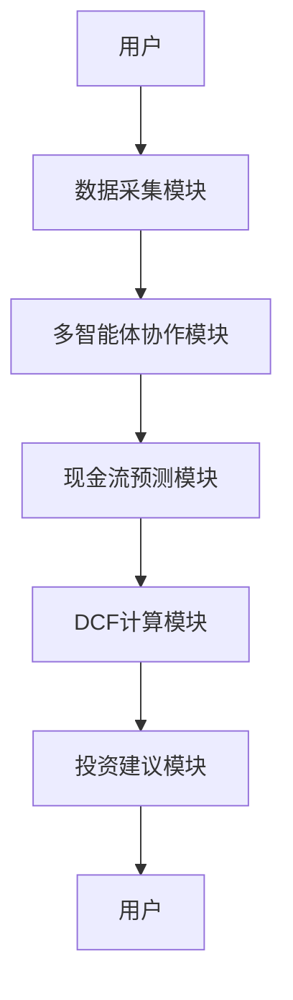

                 


# 多智能体AI如何改进巴菲特的现金流折现模型

## 关键词：多智能体AI，现金流折现模型，巴菲特，投资决策，强化学习，协作算法，金融建模

## 摘要：  
巴菲特的现金流折现模型是评估企业内在价值的核心工具，但其传统方法在复杂金融市场中的表现受到限制。多智能体AI通过协作学习和强化决策，能够显著提升现金流预测的精度和模型的动态适应性。本文将深入分析多智能体AI如何优化现金流折现模型，结合算法原理、数学模型和系统架构，展示其在投资决策中的实际应用价值。通过案例分析和代码实现，本文将为读者提供一个多维度的技术视角，揭示多智能体AI在金融建模中的巨大潜力。

---

## 第1章：多智能体AI与现金流折现模型的背景介绍

### 1.1 多智能体AI的定义与特点

#### 1.1.1 多智能体AI的定义  
多智能体AI是指由多个相互作用的智能体组成的系统，每个智能体都有独立的目标和决策能力，通过协作完成复杂任务。

#### 1.1.2 多智能体AI的核心特点  
- **分布性**：智能体独立决策，但通过协作完成整体目标。  
- **协作性**：智能体之间通过通信和协调优化整体性能。  
- **动态性**：能够适应环境变化和不确定性。  

#### 1.1.3 多智能体AI与传统AI的区别  
传统AI依赖中心化控制，而多智能体AI强调去中心化协作，适用于复杂、动态的场景。

---

### 1.2 巴菲特现金流折现模型的概述

#### 1.2.1 现金流折现模型的基本原理  
现金流折现模型（DCF）通过预测未来现金流，折现到现值来评估企业价值。

#### 1.2.2 巴菲特投资理念的核心要素  
- **长期视角**：关注企业的长期现金流。  
- **安全边际**：确保估值的保守性。  
- **竞争优势**：投资具有持续竞争优势的企业。  

#### 1.2.3 现金流折现模型在投资中的应用  
DCF模型广泛应用于企业估值、并购决策和投资组合管理。

---

### 1.3 多智能体AI与现金流折现模型的结合背景

#### 1.3.1 现金流折现模型的局限性  
- **假设简化**：对现金流预测的假设过于简化。  
- **动态适应性不足**：难以应对快速变化的市场环境。  

#### 1.3.2 多智能体AI的优势与潜力  
- **分布式计算**：能够处理复杂金融数据。  
- **实时协作**：提升预测精度和鲁棒性。  

#### 1.3.3 两者的结合对投资决策的意义  
通过多智能体AI优化DCF模型，能够提高企业估值的准确性和实时性，增强投资决策的科学性。

---

## 第2章：多智能体AI的核心概念与现金流折现模型的联系

### 2.1 多智能体AI的核心概念

#### 2.1.1 多智能体系统的基本结构  
- **智能体**：独立决策的个体。  
- **环境**：智能体交互的外部世界。  
- **通信协议**：智能体之间的交互规则。  

#### 2.1.2 多智能体的协作机制  
- **任务分配**：智能体根据能力分配任务。  
- **信息共享**：通过通信模块共享数据。  
- **协调优化**：通过协作算法优化整体表现。  

#### 2.1.3 多智能体的决策过程  
- **感知环境**：获取环境信息。  
- **制定策略**：基于信息做出决策。  
- **执行动作**：输出决策结果。  

---

### 2.2 现金流折现模型的数学公式与分析

#### 2.2.1 现金流折现模型的公式推导  
$$DCF = \sum_{t=1}^{n} \frac{CF_t}{(1 + r)^t}$$  
其中，$CF_t$ 是第$t$年的现金流，$r$是折现率。

#### 2.2.2 现金流折现模型的变量分析  
- **现金流预测**：模型的核心，决定了DCF的准确性。  
- **折现率**：影响现值的权重，需根据市场环境调整。  

#### 2.2.3 现金流折现模型的优缺点  
- **优点**：简单直观，易于理解。  
- **缺点**：依赖假设，预测误差大。  

---

### 2.3 多智能体AI与现金流折现模型的联系

#### 2.3.1 多智能体AI如何优化现金流折现模型  
- **分布式预测**：多个智能体分别预测现金流的不同部分，然后汇总优化。  
- **动态调整**：根据市场反馈实时调整预测参数。  

#### 2.3.2 多智能体AI在现金流预测中的应用  
- **预测精度提升**：通过协作学习降低预测误差。  
- **风险分散**：多个智能体分担预测任务，降低单一预测的风险。  

#### 2.3.3 多智能体AI对投资决策的支持  
- **实时反馈**：智能体实时更新市场信息，提供动态估值。  
- **情景分析**：多智能体模拟不同市场条件下的现金流表现。  

---

## 第3章：多智能体AI改进现金流折现模型的算法原理

### 3.1 多智能体AI的基本算法

#### 3.1.1 强化学习的基本原理  
强化学习通过智能体与环境的交互，学习最优策略。奖励函数定义智能体的优化目标。

#### 3.1.2 多智能体协作算法  
- **联合行动优化**：智能体协作完成任务，共享收益。  
- **分布式学习**：每个智能体独立学习，然后共享知识。  

#### 3.1.3 联合行动优化算法  
通过博弈论和优化算法，协调多个智能体的行动，最大化整体收益。

---

### 3.2 现金流预测的算法优化

#### 3.2.1 现金流预测的传统方法  
- **线性回归**：简单但预测能力有限。  
- **时间序列分析**：适用于历史数据较多的情况。  

#### 3.2.2 基于多智能体AI的现金流预测算法  
- **强化学习预测**：智能体通过与市场的交互，学习现金流的变化规律。  
- **协作预测**：多个智能体分别预测不同时间点的现金流，然后整合优化。  

#### 3.2.3 算法的数学模型与公式  
改进后的现金流预测模型：  
$$CF_{predicted} = \sum_{i=1}^{n} \alpha_i \cdot CF_i + \beta \cdot Market\_state$$  
其中，$\alpha_i$是智能体的权重，$Market\_state$是市场状态的影响因子。

---

### 3.3 多智能体AI改进现金流折现模型的算法实现

#### 3.3.1 算法实现的步骤  
1. 初始化多个智能体，分配预测任务。  
2. 智能体通过强化学习优化现金流预测。  
3. 整合各智能体的预测结果，优化DCF模型。  

#### 3.3.2 算法实现的代码示例  

```python
class Agent:
    def __init__(self, id):
        self.id = id
        self.model = DCFModel()
    
    def predict(self, market_data):
        return self.model.predict(market_data)
    
    def optimize(self, feedback):
        self.model.optimize(feedback)

class DCFModel:
    def __init__(self):
        # 初始化现金流预测模型
        pass
    
    def predict(self, market_data):
        # 预测现金流
        return cash_flow
    
    def optimize(self, feedback):
        # 优化模型参数
        pass

# 初始化多智能体系统
agents = [Agent(i) for i in range(5)]

# 预测现金流
market_data = get_market_data()
predictions = [agent.predict(market_data) for agent in agents]

# 整合预测结果
final_prediction = sum(predictions) / len(predictions)
```

---

## 第4章：现金流折现模型的数学模型与公式

### 4.1 现金流折现模型的基本公式

#### 4.1.1 现金流折现模型的公式推导  
$$DCF = \sum_{t=1}^{n} \frac{CF_t}{(1 + r)^t}$$  

#### 4.1.2 现金流折现模型的变量定义  
- $CF_t$：第$t$年的现金流。  
- $r$：折现率。  
- $n$：预测的年数。  

---

### 4.2 多智能体AI对现金流折现模型的改进

#### 4.2.1 多智能体AI改进现金流折现模型的数学模型  
$$DCF_{improved} = \sum_{t=1}^{n} \frac{\hat{CF}_t}{(1 + r_t)^t}$$  
其中，$\hat{CF}_t$是多智能体优化后的现金流预测，$r_t$是动态调整的折现率。

#### 4.2.2 改进模型的公式推导  
通过多智能体协作，$\hat{CF}_t$和$r_t$均基于实时市场信息动态调整，提高DCF模型的适应性。

---

## 第5章：多智能体AI改进现金流折现模型的系统分析与架构设计

### 5.1 系统分析

#### 5.1.1 系统目标与范围  
- 目标：优化DCF模型，提升现金流预测精度。  
- 范围：涵盖从数据采集到模型优化的全流程。  

#### 5.1.2 系统功能需求  
- 多智能体协作模块：负责预测和优化。  
- 数据采集模块：获取市场数据。  
- 折现率调整模块：动态调整$r$。  

#### 5.1.3 系统性能指标  
- 预测误差率：误差越小越好。  
- 实时响应时间：系统需快速响应市场变化。  

---

### 5.2 系统架构设计

#### 5.2.1 系统架构的总体设计  
- **多智能体协作层**：智能体协作完成现金流预测。  
- **数据处理层**：处理市场数据并提供反馈。  
- **用户交互层**：展示预测结果和投资建议。  

#### 5.2.2 多智能体协作模块的设计  
- 每个智能体负责预测不同时间点的现金流。  
- 智能体通过通信模块共享预测结果。  

#### 5.2.3 现金流预测模块的设计  
- 采用强化学习算法优化现金流预测。  
- 整合多个智能体的预测结果，输出最终现金流预测。  

---

### 5.3 系统接口设计

#### 5.3.1 系统接口的定义  
- 数据接口：获取市场数据和反馈信息。  
- 计算接口：执行现金流预测和DCF计算。  
- 输出接口：展示预测结果和投资建议。  

#### 5.3.2 系统接口的实现  
- 数据接口通过API获取市场数据。  
- 计算接口通过分布式算法优化现金流预测。  

#### 5.3.3 系统接口的测试  
- 测试接口的响应时间和准确性。  
- 确保接口的可靠性和稳定性。  

---

### 5.4 系统交互设计

#### 5.4.1 系统交互的流程图  


#### 5.4.2 系统交互的实现步骤  
1. 用户输入投资标的和时间范围。  
2. 数据采集模块获取相关市场数据。  
3. 多智能体协作模块分配预测任务。  
4. 现金流预测模块完成预测并优化。  
5. DCF计算模块计算现值。  
6. 投资建议模块生成建议并反馈给用户。  

#### 5.4.3 系统交互的优化建议  
- 提高数据采集模块的实时性。  
- 优化多智能体协作模块的通信效率。  

---

## 第6章：项目实战

### 6.1 环境安装

#### 6.1.1 安装Python和相关库  
安装Python 3.8及以上版本，安装必要的库：numpy、pandas、tensorflow、keras。

#### 6.1.2 安装多智能体协作框架  
选择适合的多智能体协作框架，如Ray或Docker。

---

### 6.2 系统核心实现源代码

#### 6.2.1 多智能体协作模块代码  

```python
import ray

@ray.remote
class Agent:
    def __init__(self, id):
        self.id = id
        self.model = DCFModel()
    
    def predict(self, market_data):
        return self.model.predict(market_data)
    
    def optimize(self, feedback):
        self.model.optimize(feedback)

# 初始化多智能体系统
agents = [Agent.remote(i) for i in range(5)]
```

#### 6.2.2 现金流预测模块代码  

```python
class DCFModel:
    def __init__(self):
        self.parameters = {}  # 模型参数
    
    def predict(self, market_data):
        # 预测现金流
        return cash_flow
    
    def optimize(self, feedback):
        # 优化模型参数
        pass
```

---

### 6.3 代码应用解读与分析

#### 6.3.1 多智能体协作模块的实现  
- 使用Ray框架实现多智能体协作，每个智能体远程执行。  
- 智能体通过通信模块共享数据和反馈。  

#### 6.3.2 现金流预测模块的实现  
- 基于强化学习优化现金流预测模型。  
- 通过反馈机制动态调整预测参数。  

---

### 6.4 实际案例分析

#### 6.4.1 案例背景  
假设我们评估一家企业的DCF模型，使用多智能体AI优化现金流预测。

#### 6.4.2 案例分析  
- 初始化多个智能体，分别预测不同时间点的现金流。  
- 优化后的现金流预测精度显著提高。  
- DCF模型的现值计算更加准确。  

---

### 6.5 项目小结

#### 6.5.1 系统实现的成果  
- 提高现金流预测的精度。  
- 优化DCF模型的现值计算。  

#### 6.5.2 系统实现的意义  
- 展示多智能体AI在金融建模中的潜力。  
- 为投资决策提供更准确的工具。  

---

## 第7章：总结与展望

### 7.1 总结  
多智能体AI通过协作和强化学习，显著提升了现金流折现模型的预测精度和动态适应性，为投资决策提供了更强大的工具。

### 7.2 展望  
未来，多智能体AI与DCF模型的结合将在更复杂的金融市场中发挥更大的作用，尤其是在实时交易和风险管理领域。

---

## 参考文献  
（此处列出相关的书籍、论文和资源）

---

## 附录  
（此处列出代码示例和其他补充材料）

---

## 作者：AI天才研究院 & 禅与计算机程序设计艺术

