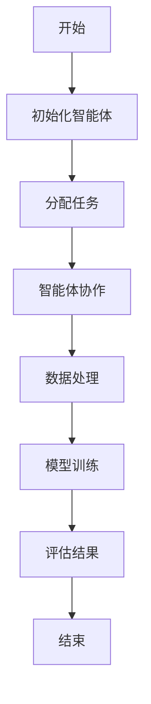

                 


# 多智能体AI如何改进巴菲特的经济护城河评估方法

> 关键词：多智能体AI、经济护城河、巴菲特、投资评估、人工智能

> 摘要：本文探讨了多智能体AI如何改进巴菲特的经济护城河评估方法，分析了传统评估方法的局限性，并详细阐述了多智能体AI在模拟市场环境、分析竞争优势和动态评估护城河变化中的应用。通过具体算法和系统设计，展示了多智能体AI在投资决策中的优势和实际应用案例，为投资者提供了新的视角和工具。

---

## 第一章：经济护城河与多智能体AI概述

### 1.1 经济护城河的定义与重要性

#### 1.1.1 经济护城河的定义
经济护城河是企业相对于竞争对手的持久竞争优势，确保企业在市场中保持领先地位。常见形式包括成本优势、品牌忠诚度、专利技术等。

#### 1.1.2 经济护城河的核心要素
- 成本优势：企业以更低的成本提供产品或服务。
- 品牌忠诚度：强大的品牌影响力吸引消费者。
- 技术壁垒：专利、专有技术等阻止竞争对手进入。
- 网络效应：用户越多，平台价值越大。

#### 1.1.3 经济护城河在投资中的作用
巴菲特认为，拥有坚固经济护城河的公司具有长期竞争优势，能为投资者带来稳定收益。

### 1.2 多智能体AI的基本概念

#### 1.2.1 多智能体系统的定义
多智能体系统由多个相互作用的智能体组成，每个智能体都有自己的目标和决策机制。

#### 1.2.2 多智能体系统的特点
- 分布式计算：任务分解到多个智能体。
- 协作性：智能体之间协同工作。
- 自主性：每个智能体独立决策。

#### 1.2.3 多智能体AI与传统AI的区别
多智能体AI通过多个智能体协同工作，能够处理复杂任务，而传统AI依赖单个模型。

### 1.3 多智能体AI在经济分析中的应用

#### 1.3.1 多智能体AI的优势
- 动态适应性：实时分析市场变化。
- 全局优化：多个智能体协作实现最优决策。
- 并行处理：提高分析效率。

#### 1.3.2 多智能体AI在经济护城河评估中的潜力
- 模拟市场环境：分析竞争格局。
- 分析竞争优势：识别企业护城河。
- 动态评估：实时监控护城河变化。

#### 1.3.3 多智能体AI的未来发展趋势
随着AI技术进步，多智能体系统将更加智能化和协作化，应用范围也将进一步扩大。

---

## 第二章：传统经济护城河评估方法的局限性

### 2.1 巴菲特的经济护城河评估方法

#### 2.1.1 巴菲特的投资哲学
巴菲特注重投资具有坚固经济护城河的企业，以确保长期稳定的收益。

#### 2.1.2 巴菲特对经济护城河的定义
企业必须具备持久的竞争优势，能够在长期内抵御竞争对手。

#### 2.1.3 巴菲特评估护城河的步骤
1. 分析企业的竞争优势。
2. 评估竞争环境的强度。
3. 判断护城河的持久性。

### 2.2 传统经济护城河评估方法

#### 2.2.1 五力模型（波特）
五力模型包括潜在进入者、替代品威胁、供应商议价能力、买家议价能力和现有竞争者之间的竞争。

#### 2.2.2 价值链分析
分析企业内部价值链的效率，找出成本优势和价值提升点。

#### 2.2.3 竞争优势分析
分析企业的资源和能力，判断其是否具备独特竞争优势。

### 2.3 传统评估方法的局限性

#### 2.3.1 动态变化的市场环境
传统方法难以捕捉快速变化的市场动态。

#### 2.3.2 数据的复杂性
复杂的数据难以通过人工分析全面掌握。

#### 2.3.3 人为判断的局限性
依赖主观判断，可能导致偏差和误判。

---

## 第三章：多智能体AI在经济护城河评估中的应用

### 3.1 多智能体AI的应用场景

#### 3.1.1 模拟市场环境
通过多智能体模拟市场中的企业、消费者等行为，分析竞争格局。

#### 3.1.2 分析竞争优势
识别企业护城河的具体表现，并预测其变化趋势。

#### 3.1.3 动态评估
实时监控市场变化，动态调整评估结果。

### 3.2 多智能体AI的优势

#### 3.2.1 高度动态适应性
多智能体系统能够实时响应市场变化，提供及时反馈。

#### 3.2.2 全局优化能力
通过智能体协作，实现整体最优决策。

#### 3.2.3 高度细致的分析能力
多个智能体协同工作，能够覆盖更多维度的数据分析。

### 3.3 多智能体AI的具体应用

#### 3.3.1 案例分析
以某科技公司为例，利用多智能体AI评估其经济护城河。

#### 3.3.2 算法实现
详细讲解多智能体AI的算法，如分布式计算、协作学习等。

#### 3.3.3 实际效果
展示多智能体AI在评估中的优势，如准确性提高、动态适应性增强。

---

## 第四章：多智能体AI的算法原理与数学模型

### 4.1 多智能体AI的算法原理

#### 4.1.1 分布式计算
任务分解到多个智能体，每个智能体处理部分数据。

#### 4.1.2 协作学习
智能体之间共享信息，共同学习和优化模型。

#### 4.1.3 强化学习
通过奖励机制，优化智能体的决策策略。

### 4.2 数学模型与公式

#### 4.2.1 博弈论模型
使用纳什均衡分析竞争者的策略选择。

#### 4.2.2 动态模型
通过微分方程描述市场变化趋势。

#### 4.2.3 聚类分析
识别市场中的主要竞争群体。

### 4.3 算法流程图



---

## 第五章：系统分析与架构设计

### 5.1 系统功能设计

#### 5.1.1 数据采集模块
负责收集市场数据，如企业财务数据、行业报告等。

#### 5.1.2 智能体协作模块
实现多个智能体之间的信息共享和协同决策。

#### 5.1.3 评估模块
根据分析结果，生成经济护城河评估报告。

### 5.2 系统架构设计


### 5.3 系统接口设计

#### 5.3.1 数据接口
定义数据格式和接口规范，确保数据流畅传输。

#### 5.3.2 用户接口
设计友好的用户界面，方便用户交互和结果查看。

---

## 第六章：项目实战

### 6.1 环境安装

#### 6.1.1 安装Python
```bash
python --version
pip install --upgrade pip
```

#### 6.1.2 安装相关库
```bash
pip install numpy pandas scikit-learn
```

### 6.2 核心代码实现

#### 6.2.1 数据处理
```python
import pandas as pd
data = pd.read_csv('market_data.csv')
```

#### 6.2.2 智能体协作
```python
from sklearn.cluster import KMeans
clusters = KMeans(n_clusters=3).fit(data)
```

#### 6.2.3 模型训练
```python
from keras.models import Sequential
model = Sequential()
model.add(Dense(64, activation='relu'))
model.compile(optimizer='adam', loss='binary_crossentropy')
model.fit(data, labels, epochs=10)
```

### 6.3 案例分析

#### 6.3.1 选择案例
以科技公司为例，分析其护城河。

#### 6.3.2 分析过程
通过多智能体AI模拟市场环境，评估公司的竞争优势。

#### 6.3.3 结果解读
展示评估结果，并解释其对投资决策的指导意义。

---

## 第七章：总结与展望

### 7.1 本章小结
多智能体AI在经济护城河评估中具有显著优势，能够提高评估的准确性和动态适应性。

### 7.2 未来展望
未来，多智能体AI将更加智能化，应用范围也将进一步扩大，为投资者提供更多价值。

### 7.3 最佳实践 tips
- 数据质量是关键，确保数据的准确性和完整性。
- 模型的可解释性需重视，便于投资者理解和决策。
- 定期更新模型，适应市场变化。

---

## 结语

通过多智能体AI，巴菲特的经济护城河评估方法得到了显著改进，为投资者提供了更强大的工具和视角。未来，随着技术的进一步发展，多智能体AI将在投资领域发挥更大的作用。

---

作者：AI天才研究院 & 禅与计算机程序设计艺术

