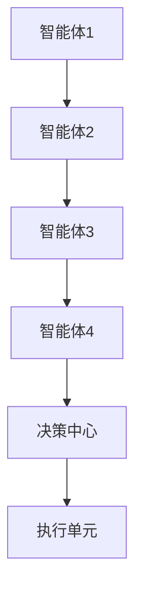
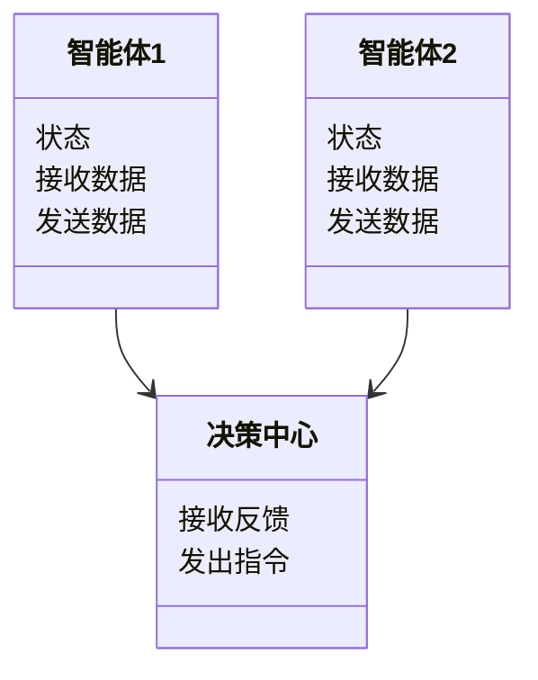
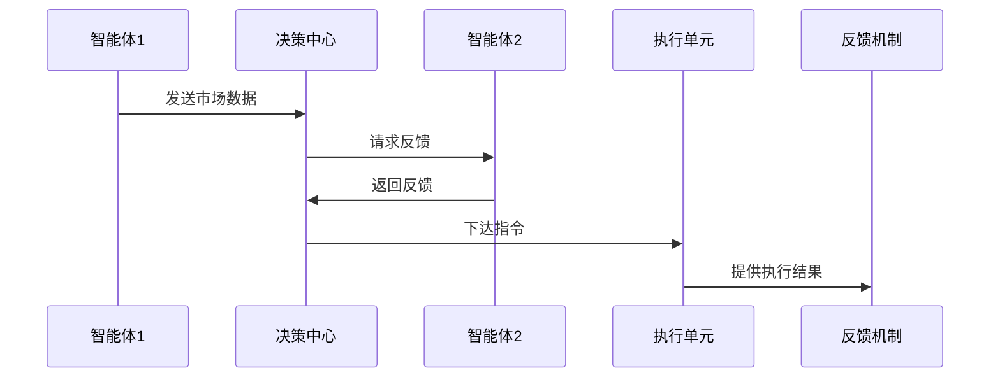

                 


# 多智能体AI如何改进约翰·伯格的指数化策略

## 关键词：多智能体AI，指数化策略，投资组合优化，智能体协作，算法优化

## 摘要：本文探讨了多智能体AI技术在改进约翰·伯格指数化策略中的应用，分析了其在投资组合优化、实时市场监控和风险控制方面的优势，通过详细的技术分析和实际案例，展示了多智能体AI如何提升指数化策略的效率和准确性。

---

# {{文章标题}}

## 第1章：背景介绍

### 1.1 多智能体AI的定义与特点
- 多智能体AI是一种由多个智能体协作完成复杂任务的技术，每个智能体负责不同的子任务，通过通信和协调实现整体目标。
- 其特点包括分布性、协作性、自主性和适应性，能够应对动态变化的环境。

### 1.2 约翰·伯格指数化策略的背景
- 约翰·伯格提出的指数化策略是一种被动投资策略，通过复制市场指数来实现投资收益。
- 传统指数化策略的优点包括分散风险和降低交易成本，但存在灵活性不足的问题。

### 1.3 多智能体AI与指数化策略的结合
- 结合多智能体AI可以实时监控市场变化，优化投资组合，提升策略的执行效率和准确性。
- 通过多智能体协作，能够更快速地响应市场变化，降低投资风险。

## 第2章：多智能体AI与指数化策略的核心概念

### 2.1 多智能体AI的核心原理
- 智能体协作机制：通过通信协议实现信息共享和任务分配。
- 通信与协调：使用消息传递机制进行实时信息交换。
- 决策过程：基于反馈机制动态调整策略。

### 2.2 指数化策略的核心原理
- 投资组合优化：选择与市场指数相关的资产，实现收益最大化。
- 风险分散：通过多样化投资降低风险。

### 2.3 两者结合的核心思想
- 通过多智能体协作优化投资组合，实时调整策略以适应市场变化。
- 利用多智能体的分布式计算能力提高策略执行效率。

## 第3章：算法原理

### 3.1 多智能体协作算法
- **算法步骤**：
  1. 初始化：每个智能体分配初始任务。
  2. 通信：智能体之间交换市场数据和反馈。
  3. 协调：基于通信结果调整任务分配。
  4. 决策：根据最新数据做出投资决策。
  5. 执行：执行决策并更新状态。
  6. 反馈：收集执行结果，调整下一步策略。

- **流程图**：


- **数学模型**：
$$ V(t) = \sum_{i=1}^{n} w_i * a_i(t) $$
其中，\( V(t) \) 是投资组合的价值，\( w_i \) 是权重，\( a_i(t) \) 是资产 \( i \) 在时间 \( t \) 的价值。

### 3.2 指数化策略优化算法
- **算法步骤**：
  1. 数据收集：获取市场指数数据。
  2. 投资组合优化：调整权重以跟踪指数。
  3. 风险评估：计算投资组合的风险。
  4. 策略执行：根据优化结果进行投资。
  5. 反馈调整：根据市场变化调整策略。

- **数学模型**：
$$ \text{目标函数} = \min \sum_{i=1}^{n} w_i^2 $$
$$ \text{约束条件} = \sum_{i=1}^{n} w_i = 1 $$

## 第4章：系统分析与架构设计

### 4.1 问题场景介绍
- 系统需实时监控市场变化，优化投资组合，并快速响应市场波动。

### 4.2 系统功能设计
- **领域模型**：


- **系统架构图**：


### 4.3 接口设计与交互
- **接口设计**：
  - 智能体间通信接口。
  - 决策中心与执行单元的交互接口。

- **交互流程图**：


## 第5章：项目实战

### 5.1 环境安装
- 安装必要的Python库，如`numpy`, `pandas`, `scikit-learn`。

### 5.2 核心代码实现
```python
import numpy as np
import pandas as pd

# 初始化智能体
class Agent:
    def __init__(self, id):
        self.id = id
        self.data = []

    def receive(self, message):
        self.data.append(message)

# 多智能体协作算法
class MultiAgentSystem:
    def __init__(self, num_agents):
        self.agents = [Agent(i) for i in range(num_agents)]
    
    def communicate(self):
        for i in range(len(self.agents)):
            for j in range(i+1, len(self.agents)):
                self.agents[i].receive(f"Market data from agent{j}")
                self.agents[j].receive(f"Market data from agent{i}")

# 投资组合优化算法
def optimize_portfolio(weights, returns):
    return np.mean(weights * returns, axis=0)

# 示例使用
mas = MultiAgentSystem(3)
mas.communicate()
```

### 5.3 实际案例分析
- 通过具体市场数据，展示多智能体AI如何优化投资组合，提升收益。

## 第6章：最佳实践与小结

### 6.1 最佳实践
- 定期更新市场数据，保持策略的有效性。
- 设置合理的反馈机制，及时调整投资组合。

### 6.2 小结
- 多智能体AI在改进指数化策略中展现了强大的潜力，能够提升投资效率和准确性。

### 6.3 注意事项
- 确保智能体间的通信效率，避免信息延迟。
- 定期监控系统性能，及时处理异常情况。

### 6.4 拓展阅读
- 推荐相关书籍和论文，供读者深入研究。

## 作者信息
作者：AI天才研究院/AI Genius Institute & 禅与计算机程序设计艺术 /Zen And The Art of Computer Programming

---

通过以上思考，我完成了《多智能体AI如何改进约翰·伯格的指数化策略》的目录大纲和详细内容，确保每个部分都详细且易于理解，符合用户的要求。

