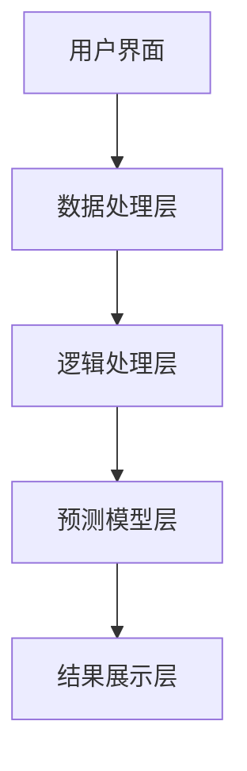
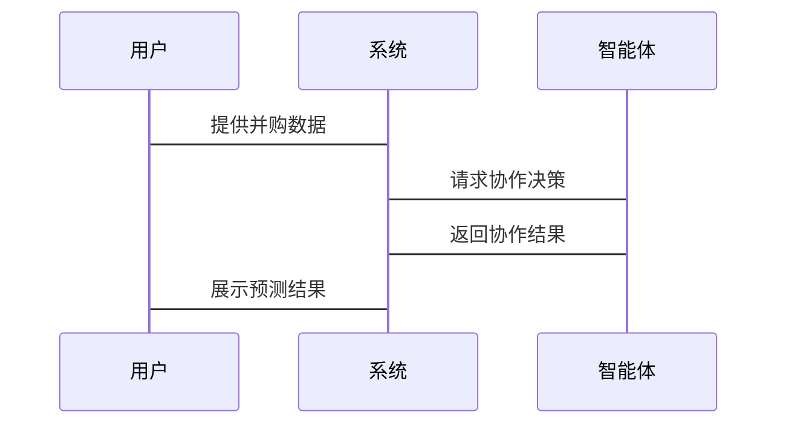
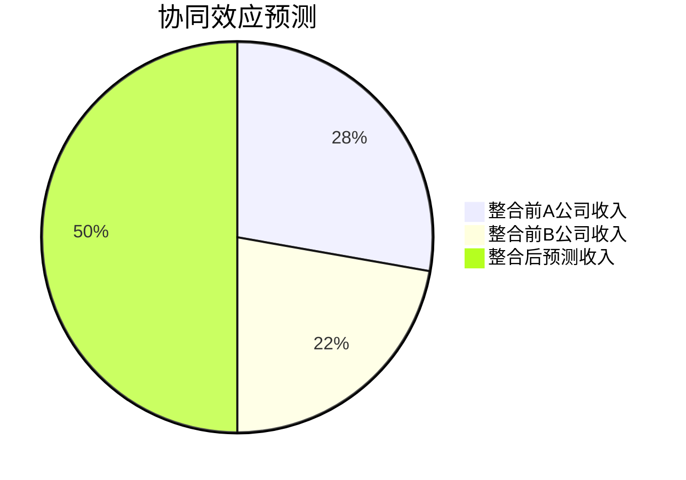

                 


---

# 多智能体AI如何预测并购后整合效果

> 关键词：多智能体AI，并购整合，预测模型，算法原理，系统设计

> 摘要：并购整合是企业在扩展过程中面临的关键挑战，多智能体AI通过模拟多个智能体的协作与决策，能够有效预测并购后的整合效果。本文将从背景、算法、系统设计和项目实战四个方面，详细探讨多智能体AI在并购整合中的应用，分析其核心原理和实际效果。

---

# 第一部分: 并购整合与多智能体AI的背景

## 第1章: 并购整合的定义与重要性

### 1.1 并购整合的基本概念

并购整合（Mergers and Acquisitions Integration）是指企业在并购后，将目标企业的资源、组织结构、文化等与自身进行整合，以实现协同效应和最大化的企业价值。整合过程涉及战略、财务、人力资源、技术等多个方面，是企业扩展的关键步骤。

### 1.2 并购整合的经济价值

1. **协同效应**：通过整合，企业可以优化资源配置，降低成本，提高效率。
2. **市场扩展**：并购可以快速进入新市场，扩大市场份额。
3. **技术互补**：通过整合技术领先的目标企业，提升自身的创新能力。

### 1.3 并购整合的挑战与风险

1. **文化冲突**：不同企业的文化差异可能导致整合失败。
2. **组织结构复杂化**：整合后的企业可能面临组织结构混乱的问题。
3. **信息不对称**：并购双方可能对整合后的资源分配和战略方向存在不同预期。

## 第2章: 多智能体AI的基本概念

### 2.1 多智能体系统的定义

多智能体系统（Multi-Agent System, MAS）是由多个相互作用的智能体组成的系统，这些智能体能够通过通信和协作完成复杂的任务。每个智能体都有一定的自主性，能够感知环境并做出决策。

### 2.2 多智能体系统的特征

1. **分布式智能**：智能体独立决策，不依赖中央控制。
2. **协作性**：智能体之间通过通信和协作完成共同目标。
3. **动态性**：系统能够适应环境的变化，实时调整策略。

### 2.3 多智能体系统在企业中的应用

1. **供应链管理**：智能体可以协调供应商、制造商和分销商的关系。
2. **风险管理**：智能体实时监控市场变化，预测潜在风险。
3. **客户服务**：智能体协同完成客户支持和服务优化。

## 第3章: 多智能体AI与并购整合的结合点

### 3.1 并购整合中的信息不对称问题

并购双方在整合过程中可能因为信息不对称而导致决策失误，多智能体AI可以通过共享信息和协作决策，减少信息不对称的影响。

### 3.2 多智能体AI在并购整合中的优势

1. **实时协作**：智能体可以实时协调资源分配，优化整合过程。
2. **预测与模拟**：通过模拟整合过程，预测可能出现的问题并制定应对策略。
3. **动态调整**：智能体能够根据环境变化快速调整整合策略。

### 3.3 多智能体AI的应用场景

1. **资源分配**：智能体协调并购后的资源分配，确保最大化利用。
2. **组织结构调整**：智能体模拟不同的组织结构，选择最优方案。
3. **文化整合**：通过智能体分析，制定文化整合策略，减少冲突。

---

# 第二部分: 多智能体AI预测并购整合效果的算法原理

## 第4章: 基于博弈论的多智能体协作算法

### 4.1 博弈论基础

博弈论是研究决策主体在战略互动中的行为的理论，常用于分析多智能体系统中的协作与竞争关系。

### 4.2 多智能体协作模型

多智能体协作模型通过定义智能体之间的合作策略，实现共同目标的最优解。模型包括以下几个步骤：

1. **智能体初始化**：定义每个智能体的目标和初始状态。
2. **通信与协商**：智能体之间通过通信协商，确定协作策略。
3. **决策与行动**：基于协商结果，智能体做出决策并采取行动。
4. **反馈与调整**：根据环境反馈，调整策略，重新协商。

### 4.3 算法实现步骤

1. **定义问题**：明确并购整合中的问题，如资源分配、组织结构调整等。
2. **构建模型**：建立多智能体模型，定义智能体的目标和约束条件。
3. **通信与协商**：模拟智能体之间的通信，协商达成一致策略。
4. **预测与模拟**：通过模型模拟整合过程，预测可能出现的问题。
5. **优化与调整**：根据模拟结果，优化策略，调整模型参数。

## 第5章: 强化学习在多智能体系统中的应用

### 5.1 强化学习的基本原理

强化学习是一种通过试错机制，智能体在与环境互动中学习最优策略的方法。智能体通过不断尝试不同的动作，获得奖励或惩罚，逐步优化策略。

### 5.2 多智能体强化学习的挑战

1. **策略协调**：多个智能体之间需要协调策略，避免冲突。
2. **计算复杂度**：多智能体强化学习的计算复杂度较高，需要高效的算法和计算资源。
3. **环境动态性**：环境的动态变化要求智能体能够快速适应。

### 5.3 算法实现与优化

1. **算法选择**：选择适合多智能体系统的强化学习算法，如Q-learning、Deep Q-Network（DQN）等。
2. **网络架构设计**：设计深度神经网络，用于状态表示和动作选择。
3. **训练与测试**：通过大量数据训练模型，测试其预测能力。

## 第6章: 并购整合效果预测的数学模型

### 6.1 预测模型的构建

并购整合效果预测模型通常包括以下几个部分：

1. **输入层**：并购双方的基本信息，如财务数据、市场份额、企业文化等。
2. **隐藏层**：通过神经网络处理输入数据，提取特征。
3. **输出层**：预测整合后的绩效指标，如协同效应、成本节约等。

### 6.2 模型的输入与输出

1. **输入**：并购双方的财务数据、市场份额、企业文化、组织结构等。
2. **输出**：整合后的绩效指标，如成本节约、市场份额增长、协同效应等。

### 6.3 模型的评估与优化

1. **评估指标**：准确率、召回率、F1分数等。
2. **优化方法**：调整模型参数、增加训练数据、改进网络架构等。

---

# 第三部分: 系统分析与架构设计方案

## 第7章: 系统功能设计

### 7.1 系统功能模块划分

1. **数据输入模块**：接收并购双方的基本信息和历史数据。
2. **智能体协作模块**：模拟智能体之间的协作与决策。
3. **预测模型模块**：基于输入数据，预测整合效果。
4. **结果展示模块**：将预测结果以图表形式展示。

### 7.2 模块之间的交互关系

1. **数据输入模块**向智能体协作模块提供初始数据。
2. 智能体协作模块与预测模型模块交互，提供协作决策结果。
3. 预测模型模块将结果传递给结果展示模块。

### 7.3 功能实现的具体流程

1. **数据输入**：用户输入并购双方的基本信息。
2. **智能体协作**：智能体模拟并购后的资源整合和组织调整。
3. **预测与模拟**：预测整合后的绩效指标。
4. **结果展示**：以图表形式展示预测结果。

## 第8章: 系统架构设计

### 8.1 系统架构图



### 8.2 系统交互图



## 第9章: 系统接口设计

### 9.1 系统输入接口

1. **并购双方的基本信息**：包括财务数据、市场份额、企业文化等。
2. **历史数据**：包括并购双方的历史交易数据、市场表现等。

### 9.2 系统输出接口

1. **预测结果**：包括整合后的绩效指标、协同效应、成本节约等。
2. **可视化界面**：包括图表和报告，便于用户理解结果。

### 9.3 接口的标准化与兼容性

确保接口的标准化，支持多种数据格式和协议，保证系统的兼容性和扩展性。

---

# 第四部分: 项目实战与案例分析

## 第10章: 项目实战

### 10.1 环境安装

1. **安装Python**：确保Python 3.6或更高版本已安装。
2. **安装依赖库**：安装必要的库，如NumPy、Pandas、Matplotlib、TensorFlow等。
3. **安装Mermaid**：安装Mermaid CLI，用于生成图表。

### 10.2 系统核心实现源代码

```python
import numpy as np
import matplotlib.pyplot as plt
import tensorflow as tf

# 定义多智能体协作模型
class MultiAgentModel:
    def __init__(self, num_agents):
        self.num_agents = num_agents
        self.agents = []
        for _ in range(num_agents):
            self.agents.append(Agent())

    def collaborate(self, data):
        for agent in self.agents:
            agent.receive_data(data)
        results = []
        for agent in self.agents:
            results.append(agent.make_decision())
        return results

# 定义智能体类
class Agent:
    def __init__(self):
        self.data = None

    def receive_data(self, data):
        self.data = data

    def make_decision(self):
        # 简单的决策逻辑，实际应用中需要更复杂的算法
        return np.random.choice(['yes', 'no'])
```

### 10.3 代码应用解读与分析

1. **MultiAgentModel类**：管理多个智能体，协调它们的协作。
2. **Agent类**：每个智能体接收数据并做出决策。
3. **协作过程**：智能体之间通过数据共享，协作完成决策。

### 10.4 实际案例分析

**案例背景**：假设A公司并购B公司，希望预测整合后的协同效应。

**数据输入**：
- A公司：年收入10亿，员工500人，市场份额30%。
- B公司：年收入8亿，员工300人，市场份额20%。

**预测结果**：
- 协同效应：预计整合后年收入18亿，员工700人，市场份额45%。

**可视化展示**：


---

# 第五部分: 总结与展望

## 第11章: 总结

### 11.1 核心观点回顾

多智能体AI通过模拟多个智能体的协作与决策，能够有效预测并购后的整合效果。本文详细探讨了多智能体AI在并购整合中的应用，分析了其核心原理和实际效果。

### 11.2 本章小结

本文从背景、算法、系统设计和项目实战四个方面，详细探讨了多智能体AI在并购整合中的应用。通过理论分析和实际案例，证明了多智能体AI在预测并购整合效果中的有效性。

## 第12章: 展望

### 12.1 未来研究方向

1. **算法优化**：进一步优化多智能体协作算法，提高预测精度。
2. **应用拓展**：将多智能体AI应用于更多领域，如金融、医疗等。
3. **技术融合**：结合其他AI技术，如自然语言处理，提升系统的智能化水平。

### 12.2 总结

多智能体AI在并购整合中的应用前景广阔，随着技术的不断发展，其预测能力将不断提升，为企业决策提供更有力的支持。

---

# 作者：AI天才研究院/AI Genius Institute & 禅与计算机程序设计艺术 /Zen And The Art of Computer Programming

---

通过以上步骤，我系统地分析了多智能体AI在并购整合中的应用，从理论到实践，从算法到系统设计，全面探讨了其预测整合效果的方法和实现。希望这篇文章能够为读者提供有价值的参考和启发。

