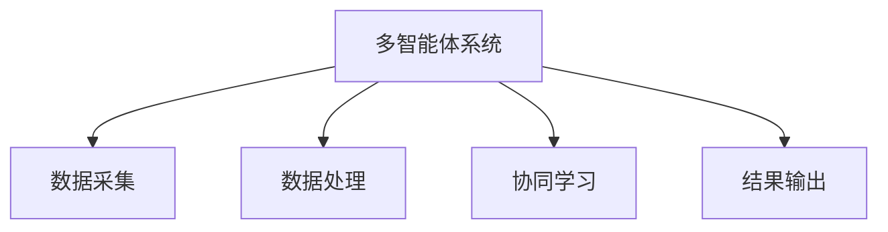

                 


# 多智能体AI系统在价值投资中的实时新闻分析应用

> 关键词：多智能体AI系统，价值投资，实时新闻分析，自然语言处理，协同学习，金融数据分析

> 摘要：本文探讨了多智能体AI系统在价值投资中的实时新闻分析应用。通过分析新闻数据，多智能体系统能够快速捕捉市场情绪变化，辅助投资者做出更明智的决策。本文从系统架构、算法原理、项目实战等多个方面详细阐述了多智能体AI系统在金融领域的应用，提供了丰富的理论和实践指导。

---

## 第一部分：多智能体AI系统与价值投资概述

### 第1章：多智能体AI系统概述

#### 1.1 多智能体系统的基本概念
- **多智能体系统（Multi-Agent System, MAS）**是由多个智能体组成的系统，每个智能体能够独立感知环境并做出决策。
- **智能体的特征**：
  - **自主性**：能够自主决策。
  - **反应性**：能够实时感知环境并做出反应。
  - **社会性**：能够与其他智能体协同工作。
  - **学习能力**：能够通过经验改进自身性能。

#### 1.2 多智能体系统在金融领域的应用
- **金融市场的复杂性**：多智能体系统能够处理海量数据和复杂关系。
- **典型应用场景**：
  - **实时数据分析**：快速处理新闻、社交媒体等信息。
  - **协同决策**：多个智能体协同完成复杂任务。
  - **风险管理**：实时监控市场风险。

#### 1.3 价值投资中的多智能体系统优势
- **信息处理能力**：多智能体系统能够快速分析大量新闻数据。
- **协同学习**：通过协同学习，智能体能够共同优化投资策略。
- **实时反馈**：系统能够实时调整投资策略。

---

### 第2章：价值投资与实时新闻分析

#### 2.1 价值投资的基本原理
- **核心理念**：寻找被市场低估的投资标的，长期持有。
- **关键要素**：
  - **基本面分析**：公司财务状况、行业地位等。
  - **市场情绪**：投资者情绪对股价的影响。
  - **长期价值**：关注公司长期盈利能力。

#### 2.2 实时新闻分析在价值投资中的作用
- **新闻信息的影响**：实时新闻能够影响市场情绪和股价走势。
- **实时分析的优势**：
  - **快速响应**：及时捕捉市场变化。
  - **精准判断**：通过分析新闻内容，判断公司前景。
  - **辅助决策**：为投资决策提供数据支持。

---

## 第二部分：多智能体AI系统的实现与应用

### 第3章：多智能体系统在实时新闻分析中的应用

#### 3.1 多智能体系统在新闻数据处理中的优势
- **分布式数据处理**：多个智能体协同处理大规模数据。
- **多维度信息融合**：整合文本、情感、市场数据等多源信息。
- **实时响应能力**：快速处理新闻数据并生成反馈。

#### 3.2 多智能体系统在新闻情感分析中的应用
- **情感分析的基本原理**：通过自然语言处理技术，分析新闻文本的情感倾向。
- **多智能体协同进行情感分析的优势**：
  - **任务分配**：每个智能体负责特定的情感分析任务。
  - **信息共享**：智能体之间共享分析结果，提升整体准确性。
  - **协同学习**：通过协同学习，智能体能够共同优化情感分析模型。

---

### 第4章：多智能体系统的算法实现

#### 4.1 多智能体系统的协同机制
- **任务分配机制**：智能体根据自身能力和任务需求分配任务。
- **信息共享机制**：智能体之间共享数据和分析结果。
- **协作学习机制**：通过协作学习，智能体共同优化模型参数。

#### 4.2 多智能体系统中的信息融合算法
- **分布式计算的协同算法**：通过分布式计算实现多智能体协同。
- **强化学习的协同算法**：通过强化学习优化智能体的协同策略。
- **图神经网络的协同算法**：利用图神经网络实现智能体之间的信息融合。

---

### 第5章：多智能体系统的数学模型与公式

#### 5.1 多智能体系统的协同学习模型
$$ y_i = \sum_{j=1}^n w_{ij}x_j $$
其中，$y_i$ 表示第i个智能体的输出，$x_j$ 表示输入特征，$w_{ij}$ 表示权重。

#### 5.2 多智能体系统的情感分析模型
$$ \text{score}(x) = \sum_{i=1}^m \alpha_i f_i(x) $$
其中，$\alpha_i$ 表示第i个模型的权重，$f_i(x)$ 表示第i个模型的输出。

---

## 第三部分：系统架构与项目实战

### 第6章：系统架构设计

#### 6.1 系统功能设计
- **数据采集模块**：实时采集新闻数据。
- **数据处理模块**：清洗、转换和预处理数据。
- **分析模块**：进行情感分析和协同学习。
- **反馈模块**：输出分析结果并提供投资建议。

#### 6.2 系统架构图


---

### 第7章：项目实战

#### 7.1 环境安装
- 安装Python和相关库（如TensorFlow、Keras、NLTK）。
- 配置分布式计算环境（如Docker、Kubernetes）。

#### 7.2 核心代码实现
```python
def multi_agent_analysis():
    agents = [Agent1(), Agent2(), Agent3()]
    tasks = [task1, task2, task3]
    for agent in agents:
        assigned_tasks = assign_tasks(agent, tasks)
        agent.process_tasks(assigned_tasks)
    return combined_results()
```

#### 7.3 实际案例分析
- 案例：分析某公司重大新闻事件。
- 步骤：数据采集、情感分析、协同学习、结果输出。
- 结果：生成投资建议并实时反馈。

---

## 结论

多智能体AI系统在价值投资中的实时新闻分析应用，通过协同学习和分布式计算，能够快速处理和分析大量新闻数据，为投资者提供精准的决策支持。未来，随着AI技术的不断发展，多智能体系统将在金融领域发挥更大的作用。

---

作者：AI天才研究院/AI Genius Institute & 禅与计算机程序设计艺术 /Zen And The Art of Computer Programming

