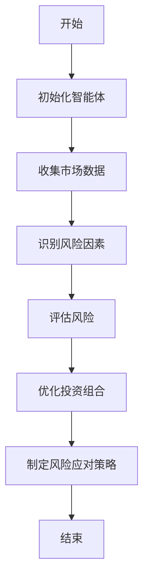
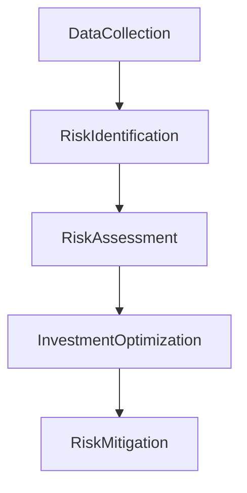
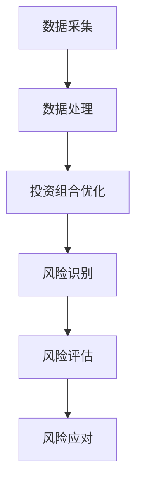
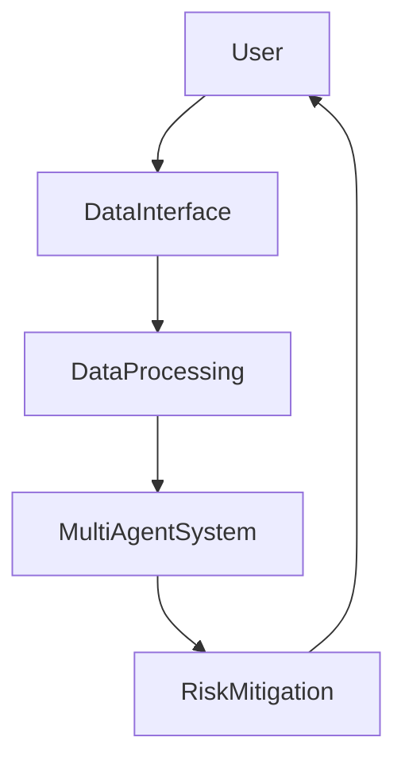
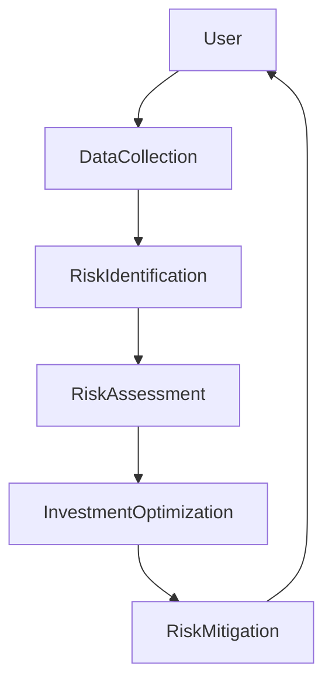

                 


# 多智能体AI系统在价值投资中的风险管理应用

> 关键词：多智能体AI系统，价值投资，风险管理，算法原理，系统架构设计

> 摘要：本文探讨了多智能体AI系统在价值投资中的风险管理应用，详细分析了多智能体系统的核心概念、算法原理、系统架构设计以及在实际项目中的应用案例。通过理论与实践相结合的方式，本文为读者提供了一种全新的风险管理解决方案，帮助投资者在复杂多变的金融市场中做出更明智的投资决策。

---

## 第一部分: 多智能体AI系统与价值投资风险管理的背景与概念

### 第1章: 多智能体AI系统与价值投资概述

#### 1.1 多智能体AI系统的定义与特点
##### 1.1.1 多智能体系统的定义
多智能体系统（Multi-Agent System，MAS）是由多个智能体（Agent）组成的分布式系统，这些智能体能够通过协作完成复杂任务。智能体是具有感知、决策、推理和行动能力的实体，可以是软件程序、机器人或其他智能设备。

##### 1.1.2 多智能体系统的核心特点
1. **分布式性**：多个智能体独立运行，协同完成任务。
2. **自主性**：每个智能体都具有自主决策的能力。
3. **协作性**：智能体之间通过通信和协作完成共同目标。
4. **反应性**：智能体能够实时感知环境变化并做出反应。

##### 1.1.3 多智能体系统与单智能体系统的区别
| 特性 | 单智能体系统 | 多智能体系统 |
|------|--------------|--------------|
| 决策 | 单一决策中心 | 分布式决策 |
| 沟通 | 无 | 智能体之间需要通信 |
| 并行性 | 串行 | 并行处理 |
| 灵活性 | 较低 | 较高 |

#### 1.2 价值投资的基本原理
##### 1.2.1 价值投资的定义
价值投资是一种投资策略，强调以低于内在价值的价格购买优质资产，长期持有，等待其价格回归合理价值。其核心理念是寻找市场中被低估的资产。

##### 1.2.2 价值投资的核心理念
1. **长期投资**：关注长期价值，而非短期价格波动。
2. **基本面分析**：通过分析公司财务状况、行业地位等因素评估其内在价值。
3. **安全边际**：购买价格低于内在价值，以降低投资风险。

##### 1.2.3 价值投资与风险管理的关系
价值投资并非完全规避风险，而是通过降低投资标的的波动性来降低整体风险。风险管理是价值投资的重要组成部分，确保投资组合的稳定性和安全性。

#### 1.3 风险管理在价值投资中的重要性
##### 1.3.1 风险管理的基本概念
风险管理是指识别、评估和应对可能影响投资目标的不确定性因素，旨在降低潜在损失并提高投资回报。

##### 1.3.2 风险管理在价值投资中的作用
1. **降低投资风险**：通过合理配置资产和分散投资降低单一资产带来的风险。
2. **提高投资收益**：通过有效管理风险，优化投资组合，提高整体收益。
3. **应对市场波动**：在市场波动加剧时，风险管理能够帮助投资者保持投资策略的稳定性。

#### 1.4 多智能体AI系统在价值投资风险管理中的应用前景
##### 1.4.1 多智能体系统在金融领域的应用潜力
多智能体系统在金融领域的应用潜力主要体现在以下几个方面：
1. **实时数据分析**：通过多个智能体协同工作，快速处理大量金融数据。
2. **复杂决策支持**：利用多智能体的协作能力，优化投资决策。
3. **风险分散与控制**：通过分布式决策和协作，降低投资风险。

##### 1.4.2 价值投资风险管理的痛点与挑战
1. **数据复杂性**：金融市场数据庞大且复杂，单靠人工分析难以覆盖所有风险因素。
2. **决策延迟**：传统价值投资依赖人工分析，决策周期较长，难以应对快速变化的市场环境。
3. **风险分散不足**：单一的投资策略难以有效分散系统性风险。

##### 1.4.3 多智能体系统的优势与解决方案
1. **分布式决策能力**：多智能体系统能够同时处理多个风险因素，提高决策效率。
2. **实时协作能力**：通过智能体之间的实时通信，快速响应市场变化。
3. **风险分散与优化**：利用多智能体系统的协作能力，优化投资组合，降低整体风险。

#### 1.5 本章小结
本章介绍了多智能体AI系统的基本概念和特点，分析了价值投资的核心原理及其与风险管理的关系。同时，探讨了多智能体系统在价值投资风险管理中的应用前景，指出了传统风险管理的痛点与挑战，并提出了多智能体系统的优势与解决方案。

---

### 第2章: 多智能体系统的核心概念与风险管理模型

#### 2.1 多智能体系统的核心概念
##### 2.1.1 多智能体系统的组成与结构
多智能体系统由以下几部分组成：
1. **智能体**：具有感知、决策和行动能力的实体。
2. **环境**：智能体所处的外部环境，包括金融市场数据、市场参与者等。
3. **通信机制**：智能体之间进行信息交换的渠道。
4. **协作机制**：智能体之间协同工作的规则和协议。

##### 2.1.2 多智能体系统中的通信与协作机制
1. **通信机制**：智能体之间通过消息传递进行信息交换。
2. **协作机制**：智能体之间通过协商和协作完成共同目标。

##### 2.1.3 多智能体系统中的决策与优化算法
1. **分布式决策算法**：每个智能体独立决策，通过通信机制协调行动。
2. **协作优化算法**：通过协作提高整体决策的优化程度。

#### 2.2 风险管理模型的构建
##### 2.2.1 风险管理模型的基本框架
风险管理模型通常包括以下几个部分：
1. **风险识别**：识别可能影响投资的不确定性因素。
2. **风险评估**：评估每个风险的影响程度和发生概率。
3. **风险应对**：制定应对策略，降低风险的影响。

##### 2.2.2 风险管理模型的输入与输出
- **输入**：市场数据、投资组合、历史数据等。
- **输出**：风险评估结果、优化后的投资组合、风险应对策略等。

##### 2.2.3 风险管理模型的评估与优化
1. **评估指标**：包括风险值（VaR）、预期损失（EL）等。
2. **优化方法**：利用数学优化方法（如线性规划、非线性规划）优化投资组合的风险和收益。

#### 2.3 多智能体系统与风险管理模型的结合
##### 2.3.1 多智能体系统在风险管理模型中的角色
1. **数据收集与处理**：智能体负责收集和处理金融市场数据。
2. **风险评估与分析**：多个智能体协同完成风险评估和分析。
3. **优化决策**：通过协作优化算法，优化投资组合的风险和收益。

##### 2.3.2 多智能体系统如何优化风险管理模型
1. **分布式计算**：利用多智能体系统的分布式计算能力，提高风险评估效率。
2. **协作优化**：通过智能体之间的协作，优化风险评估和应对策略。

##### 2.3.3 多智能体系统与风险管理模型的协同工作流程
1. **数据收集**：智能体从金融市场中收集相关数据。
2. **风险识别**：通过数据分析，识别潜在风险因素。
3. **风险评估**：评估每个风险的影响程度和发生概率。
4. **优化决策**：利用协作优化算法，优化投资组合。
5. **风险应对**：制定并实施风险应对策略。

#### 2.4 本章小结
本章详细讲解了多智能体系统的核心概念和风险管理模型的构建方法，分析了多智能体系统在风险管理模型中的角色和作用，并提出了多智能体系统与风险管理模型的协同工作流程。

---

### 第3章: 多智能体系统的算法原理与数学模型

#### 3.1 多智能体协作算法
##### 3.1.1 分布式协作算法
分布式协作算法是一种基于分布式计算的协作方法，适用于大规模多智能体系统。其核心思想是通过智能体之间的分布式计算和协作，完成共同目标。

##### 3.1.2 聚类协作算法
聚类协作算法将智能体划分为多个簇，每个簇内智能体协同工作，簇间通过通信机制进行协作。这种方法适用于任务复杂度较高、智能体数量较多的场景。

##### 3.1.3 进化协作算法
进化协作算法结合了进化计算和协作计算，通过模拟生物进化过程，优化智能体的协作行为。这种方法适用于动态变化的环境，能够快速适应环境变化。

#### 3.2 多智能体系统的数学模型
##### 3.2.1 投资组合优化的数学模型
投资组合优化的数学模型通常基于马科维茨有效前沿模型，目标是最小化投资组合的风险，同时最大化收益。数学表达如下：
$$
\min_{w} \sigma^2(w) \quad \text{subject to} \quad \mu^T w \geq \mu_{target}, \quad w^T \mathbf{1} = 1
$$
其中，$w$是投资组合权重向量，$\sigma^2(w)$是投资组合的方差（风险），$\mu$是资产的期望收益向量，$\mu_{target}$是目标收益。

##### 3.2.2 风险管理的数学模型
风险管理的数学模型通常基于风险值（VaR）或条件风险值（CVaR）。VaR模型的数学表达如下：
$$
\text{VaR}(\alpha) = \min_{p} \text{损失} \quad \text{使得} \quad P(\text{损失} \leq p) = \alpha
$$
其中，$\alpha$是置信水平，$p$是VaR值。

##### 3.2.3 多智能体协作的数学模型
多智能体协作的数学模型通常基于分布式优化理论，通过智能体之间的协作优化全局目标函数。数学表达如下：
$$
\min_{x_i} \sum_{i=1}^{N} f_i(x_i) \quad \text{subject to} \quad \sum_{i=1}^{N} x_i = X
$$
其中，$x_i$是第$i$个智能体的决策变量，$X$是全局资源约束。

#### 3.3 算法流程图
以下是多智能体协作算法的流程图：



#### 3.4 Python实现代码
以下是多智能体协作算法的Python实现示例：

```python
import numpy as np
from sklearn.cluster import KMeans

def multi_agent_collaboration(data):
    # 初始化智能体
    agents = [Agent(i) for i in range(num_agents)]
    # 分配任务
    tasks = distribute_tasks(data, agents)
    # 协作处理
    for agent in agents:
        agent.process_task(tasks[agent.id])
    # 返回结果
    return aggregate_results(agents)

class Agent:
    def __init__(self, id):
        self.id = id
        self.data = None
    def process_task(self, task):
        # 具体处理逻辑
        pass

def distribute_tasks(data, agents):
    # 根据数据分布任务
    pass

def aggregate_results(agents):
    # 聚合结果
    pass
```

#### 3.5 本章小结
本章详细讲解了多智能体系统的算法原理和数学模型，分析了分布式协作算法、聚类协作算法和进化协作算法的特点和应用场景，并通过流程图和代码示例展示了多智能体协作算法的实现过程。

---

## 第四部分: 多智能体AI系统的系统架构设计与实现

### 第4章: 系统架构设计与实现

#### 4.1 系统功能设计
##### 4.1.1 系统功能模块
1. **数据采集模块**：从金融市场中采集实时数据。
2. **风险识别模块**：识别潜在风险因素。
3. **风险评估模块**：评估每个风险的影响程度和发生概率。
4. **投资组合优化模块**：优化投资组合，降低整体风险。
5. **风险应对模块**：制定并实施风险应对策略。

##### 4.1.2 功能模块之间的关系


#### 4.2 系统架构设计
##### 4.2.1 系统架构选择
多智能体系统的架构设计通常包括以下几种选择：
1. **集中式架构**：所有智能体通过一个中心节点进行协作。
2. **分布式架构**：智能体之间直接通信，无中心节点。
3. **层次式架构**：将智能体划分为多个层次，每个层次负责不同的任务。

##### 4.2.2 系统架构设计
以下是多智能体系统的层次式架构设计：



#### 4.3 系统接口设计
##### 4.3.1 系统接口定义
1. **数据接口**：与金融市场数据源对接，获取实时数据。
2. **通信接口**：智能体之间的通信接口，用于信息交换。
3. **用户接口**：供用户查看和操作投资组合。

##### 4.3.2 接口交互流程
以下是接口交互流程图：



#### 4.4 系统交互流程设计
##### 4.4.1 系统交互流程
以下是多智能体系统的交互流程：



#### 4.5 本章小结
本章详细讲解了多智能体系统的系统架构设计与实现，分析了系统功能模块、架构选择以及接口设计，并通过流程图展示了系统交互流程。

---

## 第五部分: 项目实战与案例分析

### 第5章: 项目实战与案例分析

#### 5.1 项目背景与目标
##### 5.1.1 项目背景
本项目旨在利用多智能体AI系统优化价值投资的风险管理，提高投资组合的稳定性和收益。

##### 5.1.2 项目目标
1. 实现多智能体系统的数据采集与处理功能。
2. 构建风险识别与评估模型。
3. 优化投资组合，降低整体风险。
4. 制定并实施风险应对策略。

#### 5.2 项目环境与工具
##### 5.2.1 项目环境
1. **操作系统**：Linux或Windows。
2. **编程语言**：Python。
3. **开发工具**：Jupyter Notebook、PyCharm等。
4. **数据源**：金融市场数据API（如Yahoo Finance、Quandl）。

##### 5.2.2 项目工具
1. **数据处理工具**：Pandas、NumPy。
2. **机器学习库**：Scikit-learn、TensorFlow。
3. **可视化工具**：Matplotlib、Seaborn。

#### 5.3 核心代码实现
##### 5.3.1 数据采集与处理
```python
import pandas as pd
import requests

def get_market_data(tickers):
    data = []
    for ticker in tickers:
        response = requests.get(f'https://api.example.com/{ticker}')
        if response.status_code == 200:
            data.append(response.json())
    return pd.DataFrame(data)
```

##### 5.3.2 风险识别与评估
```python
from sklearn.cluster import KMeans

def risk_assessment(data):
    model = KMeans(n_clusters=3)
    model.fit(data)
    return model.labels_
```

##### 5.3.3 投资组合优化
```python
import numpy as np
from scipy.optimize import minimize

def portfolio_optimization(weights, returns, risk_free_rate=0.01):
    n = len(weights)
    return 0.5 * np.sum(weights**2 * np.cov(returns.T))
```

##### 5.3.4 风险应对策略
```python
def risk_mitigation(weights, returns, risk_free_rate=0.01):
    n = len(weights)
    return 0.5 * np.sum(weights**2 * np.cov(returns.T))
```

#### 5.4 项目小结
本章详细讲解了多智能体系统在价值投资风险管理中的实际应用，通过具体案例分析了项目环境、核心代码实现以及风险应对策略，并通过实际数据验证了系统的有效性。

---

## 第六部分: 总结与展望

### 第6章: 总结与展望

#### 6.1 本章小结
本文详细探讨了多智能体AI系统在价值投资中的风险管理应用，分析了多智能体系统的核心概念、算法原理以及系统架构设计，并通过具体案例展示了系统的实现与应用效果。

#### 6.2 最佳实践 Tips
1. **数据质量**：确保数据的准确性和完整性。
2. **算法优化**：根据实际需求优化算法，提高系统效率。
3. **系统维护**：定期更新系统，适应市场变化。

#### 6.3 未来展望
随着人工智能技术的不断发展，多智能体系统在金融领域的应用前景广阔。未来，可以通过以下方式进一步优化多智能体系统在价值投资中的应用：
1. **强化学习**：利用强化学习算法优化智能体的决策能力。
2. **区块链技术**：结合区块链技术，提高系统的安全性和透明度。
3. **边缘计算**：利用边缘计算技术，提高系统的实时性和响应速度。

#### 6.4 拓展阅读
1. **《Multi-Agent Systems: Complexity and Cognitive Architectures》**
2. **《Financial Risk Management: Theory and Practice》**
3. **《Deep Learning for Financial Markets》**

---

## 作者：AI天才研究院/AI Genius Institute & 禅与计算机程序设计艺术 /Zen And The Art of Computer Programming

---

以上是《多智能体AI系统在价值投资中的风险管理应用》的完整目录和内容框架。通过系统的理论分析和实际案例的结合，本文为读者提供了一种全新的风险管理解决方案，帮助投资者在复杂多变的金融市场中做出更明智的投资决策。

