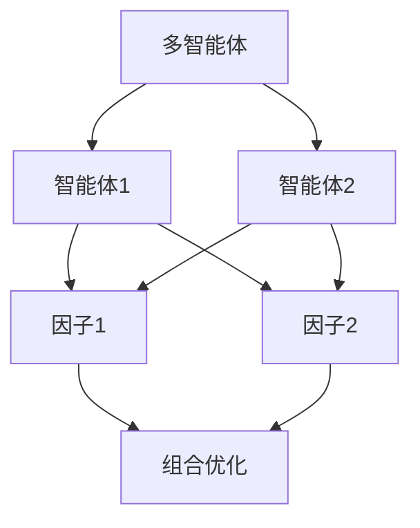
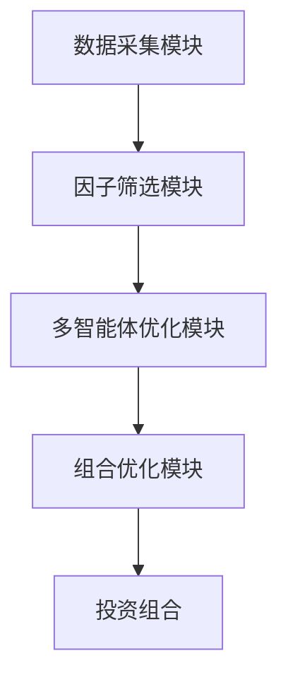
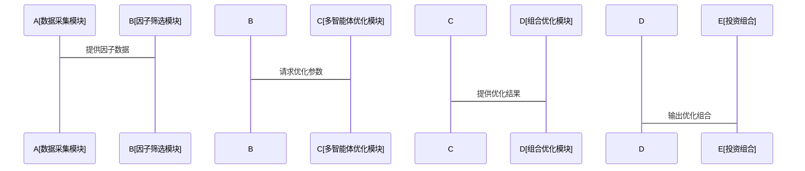

                 


---

# 多智能体优化价值投资的多因子模型自适应调整

> 关键词：多智能体优化，价值投资，多因子模型，自适应调整，投资组合优化

> 摘要：本文系统地探讨了多智能体优化技术在价值投资中的应用，重点分析了如何通过多因子模型实现投资组合的自适应调整。文章从背景介绍、核心概念、算法原理、系统架构到项目实战，全面解析了多智能体优化与多因子模型的结合方式，并通过实际案例展示了其在价值投资中的优势和效果。

---

## 第一部分：多智能体优化与价值投资的背景介绍

### 第1章：问题背景与问题描述

#### 1.1 问题背景
- 1.1.1 价值投资的定义与核心要素
  - 价值投资是一种长期投资策略，旨在通过寻找被市场低估的股票，实现超额收益。
  - 核心要素包括基本面分析、估值指标（如市盈率、市净率）和长期持有策略。
- 1.1.2 多智能体优化的定义与核心要素
  - 多智能体优化是指通过多个智能体协同工作，优化复杂问题的解决方案。
  - 核心要素包括智能体之间的通信、协作与竞争，以及全局目标的实现。
- 1.1.3 价值投资与多智能体优化的结合背景
  - 传统价值投资依赖人工分析，效率低下且难以应对复杂市场环境。
  - 多智能体优化技术能够通过分布式计算和协同决策，提升投资决策的效率和准确性。

#### 1.2 问题描述
- 1.2.1 传统价值投资的局限性
  - 依赖人工分析，主观性强，难以量化。
  - 面对复杂市场环境，缺乏灵活性和自适应性。
- 1.2.2 多智能体优化在投资决策中的应用潜力
  - 通过多智能体协同优化，实现投资组合的动态调整。
  - 解决复杂投资问题中的多目标优化难题。
- 1.2.3 多因子模型在投资组合优化中的作用
  - 多因子模型能够从多个维度（如价值、动量、成长等）评估股票的投资价值。
  - 通过多因子筛选，优化投资组合的风险收益比。

#### 1.3 问题解决思路
- 1.3.1 多智能体优化如何提升投资决策效率
  - 通过分布式计算，快速处理大量数据。
  - 利用智能体之间的协作，实现多维度的综合评估。
- 1.3.2 多因子模型如何实现投资组合的自适应调整
  - 根据市场变化动态调整因子权重。
  - 通过实时数据反馈优化投资组合。
- 1.3.3 多智能体与多因子模型的协同优化策略
  - 结合多智能体的分布式优化能力与多因子模型的多维度评估能力，实现全局最优的投资组合。

#### 1.4 边界与外延
- 1.4.1 多智能体优化的边界条件
  - 系统规模和复杂度有限。
  - 智能体之间的通信和协作需要高效的机制支持。
- 1.4.2 多因子模型的适用范围
  - 适用于多维度、多目标的投资优化问题。
  - 需要足够的历史数据支持因子的筛选和验证。
- 1.4.3 价值投资与多智能体优化的结合范围与限制
  - 适用于中长期投资策略，短期波动难以捕捉。
  - 需要考虑市场参与者的理性与非理性行为。

#### 1.5 核心概念结构与组成
- 1.5.1 多智能体优化的系统结构
  - 包括多个智能体、通信机制、协同优化算法和全局目标函数。
- 1.5.2 多因子模型的组成要素
  - 包括因子筛选、因子权重、组合优化和风险控制。
- 1.5.3 价值投资与多智能体优化的结合架构
  - 多智能体负责数据采集、分析和决策，多因子模型负责组合优化和风险控制。

---

## 第二部分：核心概念与联系

### 第2章：多智能体优化与多因子模型的核心概念

#### 2.1 多智能体优化的原理
- 2.1.1 多智能体优化的基本原理
  - 基于分布式计算和协同优化的思想，通过多个智能体的协作，实现全局优化。
- 2.1.2 多智能体优化的核心算法
  - 包括分布式优化算法（如分布式梯度下降）、多智能体协作算法（如分布式强化学习）。
- 2.1.3 多智能体优化的实现步骤
  1. 初始化多个智能体。
  2. 智能体通过通信机制共享信息。
  3. 利用协作算法优化目标函数。
  4. 输出全局最优解。

#### 2.2 多因子模型的原理
- 2.2.1 多因子模型的基本原理
  - 通过多个因子（如价值因子、动量因子、成长因子）筛选股票，构建投资组合。
- 2.2.2 多因子模型的核心算法
  - 包括因子筛选、因子权重分配和组合优化算法。
- 2.2.3 多因子模型的实现步骤
  1. 筛选相关因子。
  2. 计算各因子的权重。
  3. 优化投资组合，实现风险收益比最大化。

#### 2.3 多智能体优化与多因子模型的联系
- 2.3.1 多智能体优化如何影响多因子模型
  - 多智能体优化可以加速因子筛选和组合优化过程。
  - 多智能体优化可以实现因子权重的动态调整。
- 2.3.2 多因子模型如何辅助多智能体优化
  - 多因子模型可以提供多维度的决策支持。
  - 多因子模型可以实现投资组合的自适应调整。
- 2.3.3 两者的协同优化机制
  - 多智能体优化负责数据采集和分析，多因子模型负责组合优化和风险控制。
  - 通过协同优化，实现全局最优的投资决策。

#### 2.4 核心概念属性对比
- 2.4.1 多智能体优化与多因子模型的属性对比
| 属性 | 多智能体优化 | 多因子模型 |
|------|-------------|------------|
| 核心目标 | 全局优化 | 组合优化 |
| 输入 | 分布式数据 | 多因子数据 |
| 输出 | 全局最优解 | 优化组合 |
| 优势 | 高效协同 | 多维评估 |
- 2.4.2 多智能体优化与多因子模型的优缺点对比
| 特性 | 多智能体优化 | 多因子模型 |
|------|-------------|------------|
| 优点 | 高效协作，全局优化 | 多维评估，自适应调整 |
| 缺点 | 系统复杂，通信开销大 | 需要大量数据支持 |
- 2.4.3 多智能体优化与多因子模型的适用场景对比
| 场景 | 多智能体优化 | 多因子模型 |
|------|-------------|------------|
| 分布式计算 | 适用 | 不太适用 |
| 多目标优化 | 适用 | 适用 |
| 实时优化 | 适用 | 适用 |

#### 2.5 ER实体关系图


---

## 第三部分：算法原理与数学模型

### 第3章：算法原理

#### 3.1 多智能体优化算法
- 3.1.1 分布式梯度下降算法
  - 每个智能体计算梯度，并通过通信机制共享梯度信息。
  - 全局优化器根据梯度信息更新参数。
- 3.1.2 分布式强化学习算法
  - 智能体通过强化学习算法优化决策策略。
  - 利用多智能体协作机制实现全局优化。

#### 3.2 多因子模型构建算法
- 3.2.1 因子筛选算法
  - 基于统计学方法（如回归分析）筛选相关因子。
- 3.2.2 因子权重分配算法
  - 基于风险收益比优化因子权重。
- 3.2.3 组合优化算法
  - 基于数学规划方法优化投资组合。

#### 3.3 Python代码实现
```python
import numpy as np

# 多智能体优化算法实现
def distributed_gradient_descent(agents, learning_rate):
    for agent in agents:
        gradient = agent.compute_gradient()
        agent.update_parameters(gradient, learning_rate)

# 多因子模型构建算法实现
def factor_model(factor_data):
    factors = factor_data.columns
    weights = np.random.rand(len(factors))
    weights /= weights.sum()
    return weights
```

#### 3.4 数学模型
- 3.4.1 多智能体优化目标函数
  $$ \min_{x} \sum_{i=1}^{n} f_i(x) $$
- 3.4.2 多因子模型优化目标函数
  $$ \max_{w} \left( \sum_{i=1}^{m} w_i r_i - \lambda \sum_{i=1}^{m} w_i^2 \right) $$
  其中，$w$ 是因子权重，$r_i$ 是因子收益，$\lambda$ 是惩罚系数。

---

## 第四部分：系统分析与架构设计

### 第4章：系统架构设计

#### 4.1 问题场景介绍
- 投资组合优化问题。
- 多智能体协同优化问题。
- 多因子模型构建问题。

#### 4.2 系统功能设计
- 数据采集模块：采集股票数据、市场数据。
- 因子筛选模块：筛选相关因子。
- 多智能体优化模块：实现多智能体协同优化。
- 组合优化模块：实现投资组合优化。

#### 4.3 系统架构图


#### 4.4 系统接口设计
- 数据接口：提供数据采集和存储接口。
- 智能体接口：提供智能体通信和协作接口。
- 组合优化接口：提供组合优化和结果输出接口。

#### 4.5 系统交互流程


---

## 第五部分：项目实战

### 第5章：项目实战

#### 5.1 环境安装
- 安装Python、NumPy、Pandas、Scikit-learn等依赖库。
- 安装分布式计算框架（如Dask）。

#### 5.2 系统核心实现
- 多智能体优化算法实现。
- 多因子模型构建算法实现。
- 投资组合优化实现。

#### 5.3 代码实现与分析
```python
import numpy as np
from sklearn.linear_model import LinearRegression

# 多智能体优化算法实现
class Agent:
    def __init__(self, data):
        self.data = data
        self.model = LinearRegression()
    def compute_gradient(self):
        # 计算梯度
        pass
    def update_parameters(self, gradient, learning_rate):
        # 更新参数
        pass

# 多因子模型构建算法实现
def build_factor_model(factor_data):
    model = LinearRegression()
    model.fit(factor_data.drop(columns='target'), factor_data['target'])
    return model
```

#### 5.4 实际案例分析
- 案例背景：假设我们有10只股票，构建多因子模型。
- 数据准备：收集股票的市盈率、市净率、收益等数据。
- 因子筛选：筛选出具有高收益和低市盈率的股票。
- 投资组合优化：通过多智能体优化算法优化投资组合。

#### 5.5 项目总结
- 项目目标：实现多智能体优化与多因子模型的结合。
- 项目成果：成功构建了一个自适应调整的投资组合优化系统。
- 项目意义：为价值投资提供了一种高效、灵活的优化方法。

---

## 第六部分：最佳实践与小结

### 第6章：最佳实践

#### 6.1 小结
- 多智能体优化与多因子模型的结合为价值投资提供了新的思路。
- 通过分布式计算和协同优化，能够实现投资组合的高效优化。

#### 6.2 注意事项
- 系统设计时需要考虑智能体之间的通信开销。
- 数据质量对优化结果影响重大，需要确保数据的准确性和完整性。
- 投资决策需要结合市场实际情况，避免过度依赖模型。

#### 6.3 拓展阅读
- 推荐阅读相关领域的经典文献和最新研究。
- 关注多智能体优化和多因子模型的最新研究进展。

---

## 附录

### 附录A：数据来源
- 数据来源包括股票历史数据、市场数据等。

### 附录B：工具推荐
- 推荐使用Python、Pandas、NumPy等工具。

### 附录C：参考文献
- [1] 现代投资组合理论.
- [2] 分布式计算与多智能体优化.

---

## 作者

作者：AI天才研究院/AI Genius Institute & 禅与计算机程序设计艺术/Zen And The Art of Computer Programming

